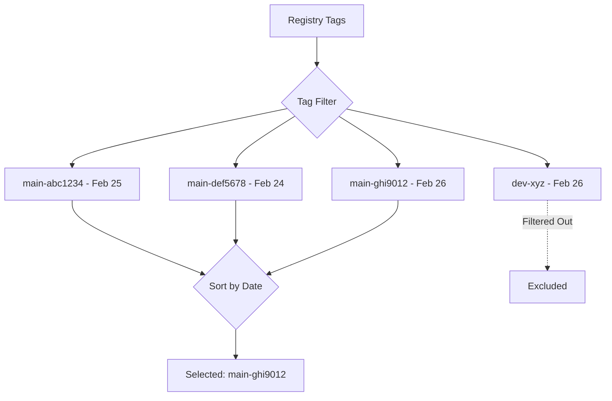

# How to Use Latest Strategy for Image Updates

Author: [nawazdhandala](https://github.com/nawazdhandala)

Tags: ArgoCD, GitOps, Kubernetes, Image Updater, Container Images

Description: Learn how to use the latest update strategy in ArgoCD Image Updater to automatically deploy the most recently pushed container image based on build timestamps and tag filtering.

---

The latest strategy in ArgoCD Image Updater selects the most recently built container image from a registry. Unlike the semver strategy that compares version numbers, the latest strategy looks at when images were pushed to the registry and picks the newest one. This is particularly useful for CI/CD workflows where images are tagged with commit hashes, build numbers, or branch names rather than semantic versions.

## How the Latest Strategy Works

The latest strategy works by:

1. Listing all tags in the container registry for the specified image
2. Filtering tags based on your allow/ignore patterns
3. Sorting remaining tags by their creation timestamp (when they were pushed)
4. Selecting the most recently created tag



## Basic Configuration

```yaml
apiVersion: argoproj.io/v1alpha1
kind: Application
metadata:
  name: myapp
  namespace: argocd
  annotations:
    argocd-image-updater.argoproj.io/image-list: myapp=myregistry.com/myapp
    argocd-image-updater.argoproj.io/myapp.update-strategy: latest
spec:
  project: default
  source:
    repoURL: https://github.com/my-org/k8s-manifests.git
    targetRevision: main
    path: apps/myapp
  destination:
    server: https://kubernetes.default.svc
    namespace: production
  syncPolicy:
    automated:
      prune: true
      selfHeal: true
```

Without any tag filters, Image Updater will consider every tag in the registry and pick the most recently pushed one. This is rarely what you want. Always add tag filters.

## Tag Filtering

Tag filtering is essential with the latest strategy. Without it, you might deploy a debug build or an image from a feature branch.

### Filter by Branch Name

The most common pattern is tagging images with the branch name and commit hash:

```yaml
annotations:
  argocd-image-updater.argoproj.io/image-list: myapp=myregistry.com/myapp
  argocd-image-updater.argoproj.io/myapp.update-strategy: latest
  # Only consider tags from the main branch
  argocd-image-updater.argoproj.io/myapp.allow-tags: "regexp:^main-[a-f0-9]{7}$"
```

This matches tags like `main-abc1234`, `main-def5678` and ignores tags like `dev-abc1234`, `feature-xyz-abc1234`.

### Filter by Build Number

If your CI uses incrementing build numbers:

```yaml
annotations:
  argocd-image-updater.argoproj.io/myapp.update-strategy: latest
  # Match tags like build-1234
  argocd-image-updater.argoproj.io/myapp.allow-tags: "regexp:^build-[0-9]+$"
```

### Exclude Specific Tags

```yaml
annotations:
  argocd-image-updater.argoproj.io/myapp.update-strategy: latest
  # Ignore these specific tags
  argocd-image-updater.argoproj.io/myapp.ignore-tags: "latest, dev, staging, nightly"
```

### Combine Allow and Ignore

```yaml
annotations:
  argocd-image-updater.argoproj.io/myapp.update-strategy: latest
  # Allow tags from main branch
  argocd-image-updater.argoproj.io/myapp.allow-tags: "regexp:^main-"
  # But ignore any debug builds
  argocd-image-updater.argoproj.io/myapp.ignore-tags: "regexp:-debug$"
```

## Common CI Tag Patterns

### GitHub Actions

```yaml
# In your GitHub Actions workflow
- name: Build and push
  run: |
    # Tag format: main-abc1234
    TAG="${GITHUB_REF_NAME}-${GITHUB_SHA::7}"
    docker build -t myregistry.com/myapp:$TAG .
    docker push myregistry.com/myapp:$TAG
```

Image Updater annotation:

```yaml
argocd-image-updater.argoproj.io/myapp.allow-tags: "regexp:^main-[a-f0-9]{7}$"
```

### GitLab CI

```yaml
# In your .gitlab-ci.yml
build:
  script:
    # Tag format: main-abc1234-1234
    - TAG="${CI_COMMIT_REF_NAME}-${CI_COMMIT_SHORT_SHA}-${CI_PIPELINE_IID}"
    - docker build -t myregistry.com/myapp:$TAG .
    - docker push myregistry.com/myapp:$TAG
```

Image Updater annotation:

```yaml
argocd-image-updater.argoproj.io/myapp.allow-tags: "regexp:^main-[a-f0-9]+-[0-9]+$"
```

### Date-Based Tags

```bash
# Tag format: 2026-02-26-abc1234
TAG="$(date +%Y-%m-%d)-${GIT_SHA::7}"
```

Image Updater annotation:

```yaml
argocd-image-updater.argoproj.io/myapp.allow-tags: "regexp:^[0-9]{4}-[0-9]{2}-[0-9]{2}-[a-f0-9]{7}$"
```

## Platform Filtering

When pushing multi-platform images, filter by platform:

```yaml
annotations:
  argocd-image-updater.argoproj.io/myapp.update-strategy: latest
  argocd-image-updater.argoproj.io/myapp.platforms: "linux/amd64"
```

## Per-Environment Configuration

### Development - Deploy Every Main Branch Build

```yaml
# dev-app.yaml
annotations:
  argocd-image-updater.argoproj.io/image-list: myapp=myregistry.com/myapp
  argocd-image-updater.argoproj.io/myapp.update-strategy: latest
  argocd-image-updater.argoproj.io/myapp.allow-tags: "regexp:^main-[a-f0-9]{7}$"
```

### Staging - Deploy Only Tagged Releases

```yaml
# staging-app.yaml
annotations:
  argocd-image-updater.argoproj.io/image-list: myapp=myregistry.com/myapp
  argocd-image-updater.argoproj.io/myapp.update-strategy: latest
  argocd-image-updater.argoproj.io/myapp.allow-tags: "regexp:^release-[0-9]+-[a-f0-9]{7}$"
```

### Production - Use Semver Instead

For production, consider switching to the semver strategy for better version control. The latest strategy is best suited for development and staging environments.

## Write-Back Configuration

### Kustomize

```yaml
annotations:
  argocd-image-updater.argoproj.io/write-back-method: git
  argocd-image-updater.argoproj.io/write-back-target: kustomization
  argocd-image-updater.argoproj.io/git-branch: main
```

### Helm Values

```yaml
annotations:
  argocd-image-updater.argoproj.io/write-back-method: git
  argocd-image-updater.argoproj.io/write-back-target: "helmvalues:values.yaml"
  argocd-image-updater.argoproj.io/myapp.helm.image-name: image.repository
  argocd-image-updater.argoproj.io/myapp.helm.image-tag: image.tag
```

## Latest vs Semver: When to Use Which

| Factor | Latest | Semver |
|--------|--------|--------|
| Tag format | Any (commit hash, build ID) | Must be semantic version |
| Selection criteria | Push timestamp | Version number comparison |
| Best for | Dev/staging, CI-tagged images | Production, versioned releases |
| Rollback control | Less precise | More precise |
| Pre-release handling | Filter with regex | Built-in pre-release logic |

## Troubleshooting

**Wrong image selected** - The latest strategy uses the image creation timestamp, not the tag name. If timestamps are unexpected:

```bash
# Check image creation dates
kubectl logs -n argocd deployment/argocd-image-updater --tail=200 | grep "considering"
```

**No updates detected** - Verify your tag filter matches actual tags:

```bash
# List tags in the registry
crane ls myregistry.com/myapp

# Check Image Updater logs for filtered tags
kubectl logs -n argocd deployment/argocd-image-updater --tail=100 | grep "tag"
```

**Old image being selected** - This usually means the timestamp on the old image is newer than expected. This can happen when images are rebuilt or when a registry mirror copies images asynchronously.

**Too many updates** - If Image Updater is updating too frequently, increase the check interval:

```yaml
spec:
  containers:
    - args:
        - run
        - --interval=5m  # Default is 2m
```

For monitoring your image update operations, configure [ArgoCD notifications](https://oneuptime.com/blog/post/2026-01-25-notifications-argocd/view) to track when new images are deployed.

The latest strategy is ideal for CI/CD workflows where images are continuously built and deployed to development and staging environments. For production, pair it with strict tag filters or switch to the semver strategy for more control.
