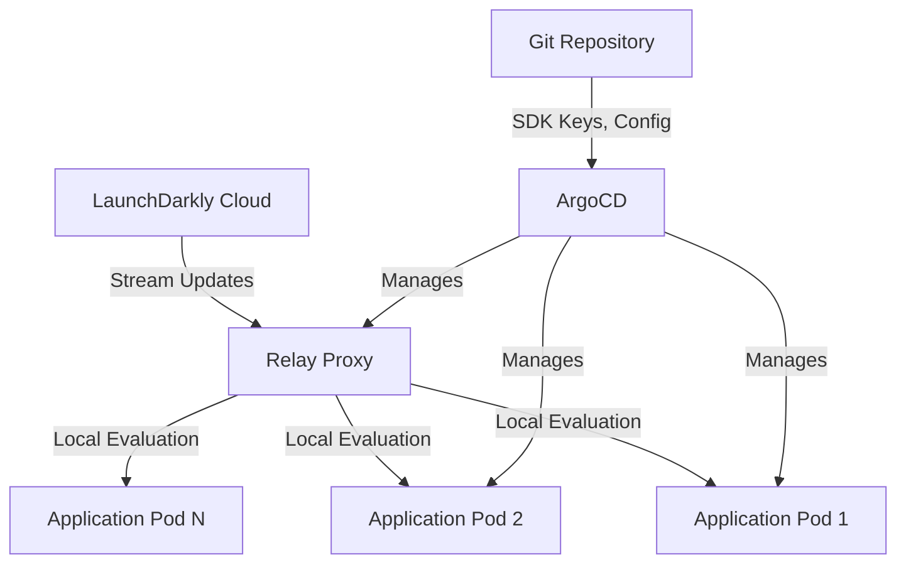

# How to Integrate LaunchDarkly Config with ArgoCD

Author: [nawazdhandala](https://github.com/nawazdhandala)

Tags: ArgoCD, GitOps, Kubernetes, LaunchDarkly, Feature Flags

Description: Learn how to integrate LaunchDarkly feature flag configuration with ArgoCD workflows including SDK key management, relay proxy deployment, and flag-aware deployments.

---

LaunchDarkly is the leading hosted feature flag platform. While LaunchDarkly manages flag evaluation in the cloud, you still need to handle the Kubernetes side - SDK keys, relay proxies, application configuration, and coordinating deployments with flag changes. ArgoCD manages all of this infrastructure, creating a bridge between your GitOps workflow and LaunchDarkly.

This guide covers integrating LaunchDarkly with your ArgoCD-managed Kubernetes infrastructure.

## Architecture Overview

LaunchDarkly integration in Kubernetes typically looks like this:



The Relay Proxy is the key component. It sits in your cluster, maintains a connection to LaunchDarkly's servers, and serves flag evaluations locally. This reduces latency, provides redundancy, and keeps your application pods from each needing their own LaunchDarkly connection.

## Deploying the LaunchDarkly Relay Proxy

Deploy the relay proxy as an ArgoCD Application:

```yaml
# ld-relay-app.yaml
apiVersion: argoproj.io/v1alpha1
kind: Application
metadata:
  name: ld-relay
  namespace: argocd
spec:
  project: platform
  source:
    repoURL: https://github.com/myorg/k8s-platform.git
    path: launchdarkly/relay
    targetRevision: main
  destination:
    server: https://kubernetes.default.svc
    namespace: launchdarkly
  syncPolicy:
    automated:
      selfHeal: true
    syncOptions:
      - CreateNamespace=true
```

The relay proxy deployment:

```yaml
# launchdarkly/relay/deployment.yaml
apiVersion: apps/v1
kind: Deployment
metadata:
  name: ld-relay
  namespace: launchdarkly
spec:
  replicas: 3
  selector:
    matchLabels:
      app: ld-relay
  template:
    metadata:
      labels:
        app: ld-relay
    spec:
      containers:
        - name: ld-relay
          image: launchdarkly/ld-relay:8
          ports:
            - containerPort: 8030
              name: http
            - containerPort: 8031
              name: metrics
          env:
            - name: USE_ENVIRONMENT_VARIABLES
              value: "true"
            # SDK key from secret
            - name: LD_ENV_production
              valueFrom:
                secretKeyRef:
                  name: ld-relay-keys
                  key: production-sdk-key
            - name: LD_ENV_staging
              valueFrom:
                secretKeyRef:
                  name: ld-relay-keys
                  key: staging-sdk-key
            # Enable Prometheus metrics
            - name: PROMETHEUS_ENABLED
              value: "true"
            - name: PROMETHEUS_PORT
              value: "8031"
            # Connection settings
            - name: MAX_CLIENT_CONNECTIONS
              value: "500"
            - name: HEARTBEAT_INTERVAL
              value: "15s"
            # Redis for persistent storage
            - name: USE_REDIS
              value: "true"
            - name: REDIS_URL
              value: "redis://redis.launchdarkly.svc.cluster.local:6379"
          resources:
            requests:
              cpu: 200m
              memory: 256Mi
            limits:
              cpu: "1"
              memory: 512Mi
          readinessProbe:
            httpGet:
              path: /status
              port: 8030
            initialDelaySeconds: 5
            periodSeconds: 10
          livenessProbe:
            httpGet:
              path: /status
              port: 8030
            initialDelaySeconds: 15
            periodSeconds: 30
---
apiVersion: v1
kind: Service
metadata:
  name: ld-relay
  namespace: launchdarkly
spec:
  selector:
    app: ld-relay
  ports:
    - name: http
      port: 8030
      targetPort: 8030
    - name: metrics
      port: 8031
      targetPort: 8031
```

## Managing SDK Keys Securely

LaunchDarkly SDK keys are secrets. Use External Secrets Operator or Sealed Secrets to store them in Git safely:

```yaml
# launchdarkly/relay/external-secret.yaml
apiVersion: external-secrets.io/v1beta1
kind: ExternalSecret
metadata:
  name: ld-relay-keys
  namespace: launchdarkly
spec:
  refreshInterval: 24h
  secretStoreRef:
    name: vault-backend
    kind: ClusterSecretStore
  target:
    name: ld-relay-keys
  data:
    - secretKey: production-sdk-key
      remoteRef:
        key: launchdarkly/production/sdk-key
    - secretKey: staging-sdk-key
      remoteRef:
        key: launchdarkly/staging/sdk-key
```

For application pods that connect directly to LaunchDarkly (without the relay), manage their SDK keys similarly:

```yaml
# launchdarkly/app-secrets/external-secret.yaml
apiVersion: external-secrets.io/v1beta1
kind: ExternalSecret
metadata:
  name: ld-client-keys
  namespace: production
spec:
  refreshInterval: 24h
  secretStoreRef:
    name: vault-backend
    kind: ClusterSecretStore
  target:
    name: ld-client-keys
  data:
    - secretKey: client-side-id
      remoteRef:
        key: launchdarkly/production/client-side-id
    - secretKey: sdk-key
      remoteRef:
        key: launchdarkly/production/sdk-key
```

## Application Configuration for LaunchDarkly

Configure your applications to use the relay proxy instead of connecting directly to LaunchDarkly:

```yaml
# apps/web-app/deployment.yaml
apiVersion: apps/v1
kind: Deployment
metadata:
  name: web-app
  namespace: production
spec:
  template:
    spec:
      containers:
        - name: web-app
          image: ghcr.io/myorg/web-app:v3.0.0
          env:
            # Point SDK to relay proxy instead of LaunchDarkly directly
            - name: LD_BASE_URI
              value: "http://ld-relay.launchdarkly.svc.cluster.local:8030"
            - name: LD_STREAM_URI
              value: "http://ld-relay.launchdarkly.svc.cluster.local:8030"
            - name: LD_EVENTS_URI
              value: "http://ld-relay.launchdarkly.svc.cluster.local:8030"
            - name: LD_SDK_KEY
              valueFrom:
                secretKeyRef:
                  name: ld-client-keys
                  key: sdk-key
            # Flag defaults in case relay is unreachable
            - name: LD_OFFLINE_MODE
              value: "false"
            - name: LD_INITIAL_RECONNECT_DELAY
              value: "1000"
```

## Flag-Aware Deployment Strategy

Coordinate deployments with feature flag changes. Deploy code behind a disabled flag first, then enable the flag separately:

```yaml
# apps/web-app/deployment.yaml
apiVersion: apps/v1
kind: Deployment
metadata:
  name: web-app
  namespace: production
  annotations:
    # Document which flags are involved in this deployment
    launchdarkly.com/flags: "new-checkout-flow,express-payments"
    launchdarkly.com/deployment-strategy: "flag-first"
spec:
  template:
    spec:
      containers:
        - name: web-app
          image: ghcr.io/myorg/web-app:v4.0.0  # Contains new checkout code behind flag
```

Add a post-sync hook that validates the relay proxy is healthy before considering the deployment complete:

```yaml
# apps/web-app/hooks/validate-ld-relay.yaml
apiVersion: batch/v1
kind: Job
metadata:
  name: validate-ld-relay
  annotations:
    argocd.argoproj.io/hook: PostSync
    argocd.argoproj.io/hook-delete-policy: HookSucceeded
spec:
  template:
    spec:
      containers:
        - name: check
          image: curlimages/curl:latest
          command:
            - /bin/sh
            - -c
            - |
              # Verify relay proxy is healthy
              STATUS=$(curl -s -o /dev/null -w "%{http_code}" \
                http://ld-relay.launchdarkly.svc.cluster.local:8030/status)

              if [ "$STATUS" != "200" ]; then
                echo "ERROR: LaunchDarkly Relay Proxy is not healthy (HTTP $STATUS)"
                exit 1
              fi

              echo "LaunchDarkly Relay Proxy is healthy."

              # Verify the application can evaluate flags
              APP_STATUS=$(curl -s -o /dev/null -w "%{http_code}" \
                http://web-app.production.svc.cluster.local:8080/healthz)

              if [ "$APP_STATUS" != "200" ]; then
                echo "ERROR: Application health check failed (HTTP $APP_STATUS)"
                exit 1
              fi

              echo "Application is healthy with LaunchDarkly integration."
      restartPolicy: Never
  backoffLimit: 3
```

## Redis Cache for Relay Proxy

Deploy Redis alongside the relay proxy for persistent flag storage:

```yaml
# launchdarkly/relay/redis.yaml
apiVersion: apps/v1
kind: Deployment
metadata:
  name: redis
  namespace: launchdarkly
spec:
  replicas: 1
  selector:
    matchLabels:
      app: redis
  template:
    metadata:
      labels:
        app: redis
    spec:
      containers:
        - name: redis
          image: redis:7-alpine
          ports:
            - containerPort: 6379
          resources:
            requests:
              cpu: 100m
              memory: 128Mi
          volumeMounts:
            - name: data
              mountPath: /data
      volumes:
        - name: data
          persistentVolumeClaim:
            claimName: redis-data
---
apiVersion: v1
kind: PersistentVolumeClaim
metadata:
  name: redis-data
  namespace: launchdarkly
spec:
  accessModes:
    - ReadWriteOnce
  storageClassName: gp3
  resources:
    requests:
      storage: 5Gi
---
apiVersion: v1
kind: Service
metadata:
  name: redis
  namespace: launchdarkly
spec:
  selector:
    app: redis
  ports:
    - port: 6379
```

## Monitoring the Integration

Track relay proxy health and flag evaluation metrics:

```yaml
# launchdarkly/monitoring/servicemonitor.yaml
apiVersion: monitoring.coreos.com/v1
kind: ServiceMonitor
metadata:
  name: ld-relay
  namespace: monitoring
spec:
  selector:
    matchLabels:
      app: ld-relay
  namespaceSelector:
    matchNames:
      - launchdarkly
  endpoints:
    - port: metrics
      interval: 15s
      path: /metrics
```

```yaml
# launchdarkly/monitoring/alerts.yaml
apiVersion: monitoring.coreos.com/v1
kind: PrometheusRule
metadata:
  name: ld-relay-alerts
  namespace: monitoring
spec:
  groups:
    - name: launchdarkly
      rules:
        - alert: LDRelayDown
          expr: up{job="ld-relay"} == 0
          for: 2m
          labels:
            severity: critical
          annotations:
            summary: "LaunchDarkly Relay Proxy is down"

        - alert: LDRelayHighLatency
          expr: |
            histogram_quantile(0.99,
              rate(ld_relay_request_duration_seconds_bucket[5m])
            ) > 0.5
          for: 5m
          labels:
            severity: warning
          annotations:
            summary: "LaunchDarkly Relay Proxy P99 latency above 500ms"

        - alert: LDRelayConnectionLost
          expr: ld_relay_stream_connections == 0
          for: 1m
          labels:
            severity: critical
          annotations:
            summary: "LaunchDarkly Relay has lost connection to LaunchDarkly servers"
```

## Summary

Integrating LaunchDarkly with ArgoCD gives you GitOps management of all the Kubernetes infrastructure around your feature flags - the relay proxy, SDK keys, application configuration, and monitoring. While LaunchDarkly manages flag definitions and evaluations in the cloud, ArgoCD ensures your cluster-side infrastructure is reliable, secure, and version-controlled. The relay proxy deployed through ArgoCD provides low-latency flag evaluation and resilience even if the connection to LaunchDarkly's servers is temporarily interrupted.
