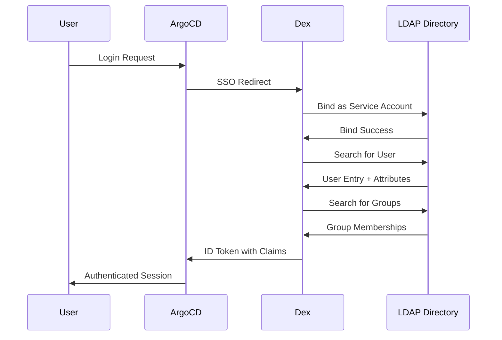

# How to Integrate ArgoCD with LDAP

Author: [nawazdhandala](https://github.com/nawazdhandala)

Tags: ArgoCD, GitOps, Kubernetes, LDAP, Authentication

Description: Learn how to integrate ArgoCD with LDAP directories like OpenLDAP and FreeIPA for centralized authentication, including Dex configuration, group-based RBAC, and troubleshooting tips.

---

LDAP (Lightweight Directory Access Protocol) remains one of the most common authentication backends in enterprise environments. Whether you are running OpenLDAP, FreeIPA, 389 Directory Server, or another LDAP-compatible directory, ArgoCD can authenticate users and map groups through its Dex identity broker. This setup lets your teams use existing directory credentials to access ArgoCD without maintaining separate accounts.

This guide covers configuring ArgoCD with generic LDAP directories - focusing on OpenLDAP and FreeIPA since they are the most common non-AD implementations.

## Architecture



## OpenLDAP Configuration

For OpenLDAP directories, the schema differs from Active Directory. Here is a complete Dex configuration:

```yaml
apiVersion: v1
kind: ConfigMap
metadata:
  name: argocd-cm
  namespace: argocd
data:
  url: https://argocd.example.com

  dex.config: |
    connectors:
    - type: ldap
      name: OpenLDAP
      id: openldap
      config:
        # LDAP server address
        host: ldap.example.com:636

        # TLS configuration
        insecureNoSSL: false
        insecureSkipVerify: false
        rootCAData: <base64-encoded-ca-cert>

        # Service account bind credentials
        bindDN: cn=argocd,ou=service-accounts,dc=example,dc=com
        bindPW: $dex.ldap.bindPW

        # User search
        userSearch:
          baseDN: ou=people,dc=example,dc=com
          # OpenLDAP uses inetOrgPerson
          filter: "(objectClass=inetOrgPerson)"
          # uid is the standard login attribute in OpenLDAP
          username: uid
          idAttr: uid
          emailAttr: mail
          nameAttr: cn

        # Group search
        groupSearch:
          baseDN: ou=groups,dc=example,dc=com
          # groupOfNames or posixGroup depending on your schema
          filter: "(objectClass=groupOfNames)"
          userMatchers:
          - userAttr: DN
            groupAttr: member
          nameAttr: cn
```

### POSIX Groups

If your LDAP uses `posixGroup` objects (common in Linux environments), the group search configuration changes:

```yaml
groupSearch:
  baseDN: ou=groups,dc=example,dc=com
  filter: "(objectClass=posixGroup)"
  userMatchers:
  # posixGroup uses memberUid (just the uid, not full DN)
  - userAttr: uid
    groupAttr: memberUid
  nameAttr: cn
```

This is a common source of confusion. `groupOfNames` stores full DNs in the `member` attribute, while `posixGroup` stores just the `uid` in `memberUid`. Using the wrong combination will result in groups not being resolved.

## FreeIPA Configuration

FreeIPA has its own LDAP schema that is closer to AD than standard OpenLDAP:

```yaml
apiVersion: v1
kind: ConfigMap
metadata:
  name: argocd-cm
  namespace: argocd
data:
  url: https://argocd.example.com

  dex.config: |
    connectors:
    - type: ldap
      name: FreeIPA
      id: freeipa
      config:
        host: ipa.example.com:636
        insecureNoSSL: false
        insecureSkipVerify: false
        rootCAData: <base64-encoded-ipa-ca-cert>

        # FreeIPA service account
        bindDN: uid=argocd-svc,cn=users,cn=accounts,dc=example,dc=com
        bindPW: $dex.ldap.bindPW

        # FreeIPA user search
        userSearch:
          baseDN: cn=users,cn=accounts,dc=example,dc=com
          filter: "(&(objectClass=person)(!(nsAccountLock=TRUE)))"
          username: uid
          idAttr: uid
          emailAttr: mail
          nameAttr: cn

        # FreeIPA group search
        groupSearch:
          baseDN: cn=groups,cn=accounts,dc=example,dc=com
          filter: "(objectClass=groupOfNames)"
          userMatchers:
          - userAttr: DN
            groupAttr: member
          nameAttr: cn
```

Note the FreeIPA-specific details:
- Base DNs use `cn=users,cn=accounts` and `cn=groups,cn=accounts` prefixes
- Disabled accounts are filtered with `nsAccountLock=TRUE`
- Groups use `groupOfNames` with full DN member references

## Storing Bind Credentials Securely

Add the bind password to the ArgoCD secret:

```bash
# Using kubectl patch
kubectl patch secret argocd-secret -n argocd \
  --type merge \
  -p '{"stringData": {"dex.ldap.bindPW": "your-service-account-password"}}'
```

For production environments, use External Secrets Operator or Sealed Secrets to manage this credential:

```yaml
# ExternalSecret pulling from Vault
apiVersion: external-secrets.io/v1beta1
kind: ExternalSecret
metadata:
  name: argocd-ldap-credentials
  namespace: argocd
spec:
  refreshInterval: 1h
  secretStoreRef:
    name: vault-backend
    kind: ClusterSecretStore
  target:
    name: argocd-secret
    creationPolicy: Merge
  data:
  - secretKey: dex.ldap.bindPW
    remoteRef:
      key: secret/argocd/ldap
      property: bindPassword
```

## RBAC Configuration with LDAP Groups

Map your LDAP groups to ArgoCD roles:

```yaml
apiVersion: v1
kind: ConfigMap
metadata:
  name: argocd-rbac-cm
  namespace: argocd
data:
  policy.default: role:readonly

  # Include groups claim from Dex
  scopes: '[groups, email]'

  policy.csv: |
    # Define roles
    p, role:admin, applications, *, */*, allow
    p, role:admin, clusters, *, *, allow
    p, role:admin, repositories, *, *, allow
    p, role:admin, projects, *, *, allow

    p, role:deployer, applications, get, */*, allow
    p, role:deployer, applications, list, */*, allow
    p, role:deployer, applications, sync, */*, allow
    p, role:deployer, applications, action/*, */*, allow
    p, role:deployer, logs, get, */*, allow

    p, role:viewer, applications, get, */*, allow
    p, role:viewer, applications, list, */*, allow

    # Map LDAP groups to roles
    g, platform-admins, role:admin
    g, release-engineers, role:deployer
    g, developers, role:viewer
```

## Testing the Configuration

After applying the configuration, restart Dex and test:

```bash
# Restart Dex to pick up changes
kubectl rollout restart deployment argocd-dex-server -n argocd

# Watch Dex logs for startup errors
kubectl logs -f deployment/argocd-dex-server -n argocd

# Test login via CLI
argocd login argocd.example.com --sso
```

Test LDAP connectivity directly to isolate issues:

```bash
# Test bind
ldapsearch -H ldaps://ldap.example.com:636 \
  -D "cn=argocd,ou=service-accounts,dc=example,dc=com" \
  -W \
  -b "ou=people,dc=example,dc=com" \
  "(uid=testuser)" uid mail cn

# Test group search
ldapsearch -H ldaps://ldap.example.com:636 \
  -D "cn=argocd,ou=service-accounts,dc=example,dc=com" \
  -W \
  -b "ou=groups,dc=example,dc=com" \
  "(objectClass=groupOfNames)" cn member
```

## Troubleshooting

### Cannot connect to LDAP server

Check network connectivity and TLS:

```bash
# Test TLS connection
openssl s_client -connect ldap.example.com:636 -showcerts

# If using StartTLS on port 389 instead of LDAPS on 636
# Set in Dex config:
# startTLS: true
# And change the port:
# host: ldap.example.com:389
```

### Users authenticate but no groups are found

Enable debug logging on the Dex server:

```yaml
apiVersion: v1
kind: ConfigMap
metadata:
  name: argocd-cmd-params-cm
  namespace: argocd
data:
  dexserver.log.level: debug
```

Then check the logs for group search queries and responses. The most common issue is a mismatch between `userAttr` and `groupAttr` in the userMatchers configuration.

### LDAP connection times out

If your LDAP server is behind a firewall or in a different network segment:

```yaml
# Increase connection timeout in Dex config
config:
  host: ldap.example.com:636
  # Add connection timeout (not directly in Dex config,
  # but ensure network policies allow the connection)
```

Ensure Kubernetes network policies allow the ArgoCD Dex pod to reach the LDAP server on port 636.

## StartTLS vs LDAPS

There are two ways to encrypt LDAP connections:

- **LDAPS** (port 636): TLS wraps the entire connection from the start
- **StartTLS** (port 389): Starts as plain LDAP, then upgrades to TLS

For StartTLS, adjust the Dex config:

```yaml
config:
  host: ldap.example.com:389
  insecureNoSSL: false
  startTLS: true
  rootCAData: <base64-encoded-ca-cert>
```

LDAPS on port 636 is generally preferred because the entire connection is encrypted from the beginning, reducing the risk of downgrade attacks.

## Monitoring LDAP Authentication Health

Monitor authentication success and failure rates to detect issues early. Connect ArgoCD metrics to [OneUptime](https://oneuptime.com/blog/post/2026-02-09-argocd-monitoring-prometheus/view) to alert on authentication failures that could indicate LDAP server issues or misconfiguration.

## Conclusion

Integrating ArgoCD with LDAP directories gives organizations centralized authentication without depending on cloud identity providers. The key differences between LDAP implementations - OpenLDAP using `uid` and `inetOrgPerson`, FreeIPA using its own DN structure, and the `posixGroup` vs `groupOfNames` distinction - are the most common sources of configuration errors. Test your LDAP queries directly with `ldapsearch` before configuring Dex, and always use encrypted connections (LDAPS or StartTLS) to protect credentials in transit.
