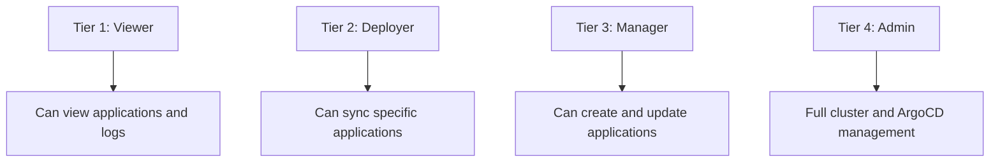

# How to Implement Least-Privilege RBAC in ArgoCD

Author: [nawazdhandala](https://github.com/nawazdhandala)

Tags: ArgoCD, GitOps, Kubernetes, RBAC, Security

Description: A comprehensive guide to implementing least-privilege access control in ArgoCD, covering role design, policy patterns, auditing practices, and progressive permission escalation.

---

Least privilege means every user and service account gets exactly the permissions they need to do their job and nothing more. In ArgoCD, this translates to creating narrow RBAC policies where developers can deploy their own applications, CI pipelines can sync specific targets, and nobody has admin access unless absolutely necessary.

Most organizations start with everyone having admin access "just to get things working" and never tighten it down. This guide shows you how to implement least-privilege RBAC from scratch or migrate an existing over-permissioned setup.

## Principles of Least Privilege in ArgoCD

Before writing policies, establish these principles:

1. **No default permissions** - Set `policy.default: ""` so unauthenticated users get nothing
2. **No shared accounts** - Every user and pipeline gets their own identity
3. **Project-scoped access** - Users only access their team's project
4. **Action-specific roles** - Separate view, deploy, and manage permissions
5. **Time-limited tokens** - CI tokens expire and must be rotated
6. **Deny by default** - Only explicitly allowed actions are permitted

## Step 1: Lock Down the Defaults

Start by removing all default access:

```yaml
apiVersion: v1
kind: ConfigMap
metadata:
  name: argocd-rbac-cm
  namespace: argocd
data:
  policy.csv: |
    # Only explicit rules apply
    g, platform-admins, role:admin

  # No default role - users must be explicitly granted access
  policy.default: ""
  scopes: '[groups]'
```

This immediately blocks all users who do not have explicit role assignments. Before applying this, make sure your platform admin group is correctly configured.

## Step 2: Disable the Built-in Admin Account

The built-in admin account with its password is a security risk. Disable it:

```yaml
apiVersion: v1
kind: ConfigMap
metadata:
  name: argocd-cm
  namespace: argocd
data:
  admin.enabled: "false"
```

From this point, all access goes through SSO or explicitly created local accounts.

## Step 3: Design Permission Tiers

Create a clear hierarchy of permission levels:



Translate these tiers into RBAC roles:

```yaml
policy.csv: |
  # Tier 1: Viewer - see applications in their project
  p, role:viewer, applications, get, */*, allow
  p, role:viewer, logs, get, */*, allow

  # Tier 2: Deployer - sync applications in their project
  # (inherits viewer capabilities through separate assignment)
  p, role:frontend-deployer, applications, sync, frontend/*, allow
  p, role:frontend-deployer, applications, action, frontend/*, allow

  p, role:backend-deployer, applications, sync, backend/*, allow
  p, role:backend-deployer, applications, action, backend/*, allow

  # Tier 3: Manager - create and update applications
  p, role:frontend-manager, applications, create, frontend/*, allow
  p, role:frontend-manager, applications, update, frontend/*, allow
  p, role:frontend-manager, applications, sync, frontend/*, allow
  p, role:frontend-manager, applications, action, frontend/*, allow
  p, role:frontend-manager, applications, override, frontend/*, allow
  p, role:frontend-manager, exec, create, frontend/*, allow

  # Tier 4: Admin - built-in admin role
  # (only for platform team)
```

## Step 4: Assign Minimum Required Roles

Map users to the lowest tier that lets them do their job:

```yaml
policy.csv: |
  # ... role definitions from above ...

  # Stakeholders and PMs only need to view
  g, product-managers, role:viewer

  # Junior developers can view everything, deploy to their project
  g, team-frontend-juniors, role:viewer
  g, team-frontend-juniors, role:frontend-deployer

  # Senior developers can manage applications in their project
  g, team-frontend-seniors, role:viewer
  g, team-frontend-seniors, role:frontend-manager

  # Tech leads can manage their project's applications
  g, team-frontend-leads, role:viewer
  g, team-frontend-leads, role:frontend-manager

  # Platform team gets admin (no one else)
  g, platform-engineering, role:admin
```

## Step 5: Restrict Dangerous Operations

Always block the most dangerous actions for non-admin roles:

```yaml
policy.csv: |
  # Even managers cannot delete production apps
  p, role:frontend-manager, applications, delete, frontend-prod/*, deny

  # Nobody except admin can modify clusters
  # (clusters resource is not in any non-admin role)

  # Nobody except admin can modify RBAC
  # (accounts resource is not in any non-admin role)

  # Nobody except admin can access exec in production
  p, role:frontend-manager, exec, create, frontend-prod/*, deny
```

## Step 6: Create Minimal CI/CD Accounts

Each CI pipeline gets its own account with the absolute minimum permissions:

```yaml
# In argocd-cm - create accounts with apiKey capability only
data:
  accounts.frontend-ci: apiKey
  accounts.backend-ci: apiKey
```

```yaml
# In argocd-rbac-cm - minimal sync permissions
policy.csv: |
  # Frontend CI can ONLY sync two specific applications
  p, role:frontend-ci, applications, get, frontend/web-app, allow
  p, role:frontend-ci, applications, sync, frontend/web-app, allow
  p, role:frontend-ci, applications, get, frontend/admin-portal, allow
  p, role:frontend-ci, applications, sync, frontend/admin-portal, allow

  g, frontend-ci, role:frontend-ci
```

Generate tokens with expiration:

```bash
argocd account generate-token --account frontend-ci --expires-in 720h
```

## Step 7: Implement Progressive Escalation

For operations that occasionally need elevated permissions, use a time-limited escalation process rather than giving permanent access:

```bash
# Create a break-glass account for emergencies
kubectl patch configmap argocd-cm -n argocd --type merge -p '{
  "data": {
    "accounts.emergency-admin": "apiKey"
  }
}'

# Only generate tokens when needed, with short expiration
argocd account generate-token --account emergency-admin --expires-in 2h
```

Document when and why emergency tokens are generated as part of your incident response process.

## Step 8: Audit and Review

Regularly audit your RBAC configuration:

```bash
#!/bin/bash
# audit-least-privilege.sh

echo "=== Users/Groups with Admin Access ==="
kubectl get configmap argocd-rbac-cm -n argocd -o jsonpath='{.data.policy\.csv}' | \
  grep "role:admin"

echo ""
echo "=== Accounts with Login Capability ==="
kubectl get configmap argocd-cm -n argocd -o jsonpath='{.data}' | \
  grep -E "accounts\.[^:]+: (login|apiKey,login)"

echo ""
echo "=== Default Policy ==="
kubectl get configmap argocd-rbac-cm -n argocd -o jsonpath='{.data.policy\.default}'

echo ""
echo "=== Wildcard Permissions (potential over-privilege) ==="
kubectl get configmap argocd-rbac-cm -n argocd -o jsonpath='{.data.policy\.csv}' | \
  grep -E "p,.+,\s*\*\s*," | grep -v "role:admin"
```

Review results quarterly. Look for:
- Groups assigned to admin that do not need it
- Wildcard permissions that should be more specific
- Accounts that are no longer in use
- Default policy that grants more than necessary

## Common Least-Privilege Patterns

### Pattern: Environment Ladder

```yaml
policy.csv: |
  # Dev: full access for all developers
  p, role:dev-full, applications, *, dev/*, allow
  g, all-developers, role:dev-full

  # Staging: deploy access for all, update for seniors only
  p, role:staging-deploy, applications, get, staging/*, allow
  p, role:staging-deploy, applications, sync, staging/*, allow
  g, all-developers, role:staging-deploy

  p, role:staging-manage, applications, update, staging/*, allow
  p, role:staging-manage, applications, create, staging/*, allow
  g, senior-developers, role:staging-manage

  # Production: view for all, sync for leads only
  p, role:prod-view, applications, get, production/*, allow
  p, role:prod-view, logs, get, production/*, allow
  g, all-developers, role:prod-view

  p, role:prod-deploy, applications, sync, production/*, allow
  g, tech-leads, role:prod-deploy
```

### Pattern: Microservice Ownership

```yaml
policy.csv: |
  # Each team owns their specific services
  p, role:auth-owner, applications, *, */auth-service, allow
  p, role:auth-owner, applications, *, */auth-worker, allow
  g, auth-team, role:auth-owner

  p, role:payment-owner, applications, *, */payment-service, allow
  p, role:payment-owner, applications, *, */payment-worker, allow
  g, payment-team, role:payment-owner

  # But nobody can delete production apps
  p, role:auth-owner, applications, delete, production/*, deny
  p, role:payment-owner, applications, delete, production/*, deny
```

### Pattern: Approval-Based Access

For sensitive operations, require manual approval by not granting permanent permissions:

```yaml
policy.csv: |
  # Standard access
  p, role:developer, applications, get, */*, allow
  p, role:developer, applications, sync, staging/*, allow

  # Production sync requires a temporary token from an admin
  # No permanent production sync permission for developers
```

When a developer needs to deploy to production, a platform admin generates a short-lived token or performs the sync on their behalf.

## Validation Checklist

Before deploying your least-privilege policy, verify:

```bash
# 1. Admin accounts are minimal
argocd admin settings rbac can role:admin delete applications '*/*' \
  --policy-file policy.csv --default-role ''
# Expected: Yes (but only platform team has this role)

# 2. Default policy grants nothing
argocd admin settings rbac can random-user get applications '*/*' \
  --policy-file policy.csv --default-role ''
# Expected: No

# 3. Developers cannot delete
argocd admin settings rbac can role:developer delete applications '*/*' \
  --policy-file policy.csv --default-role ''
# Expected: No

# 4. CI accounts have minimal access
argocd admin settings rbac can role:frontend-ci delete applications '*/*' \
  --policy-file policy.csv --default-role ''
# Expected: No

argocd admin settings rbac can role:frontend-ci update applications '*/*' \
  --policy-file policy.csv --default-role ''
# Expected: No
```

## Summary

Implementing least-privilege RBAC in ArgoCD requires starting with zero permissions and building up. Set the default policy to empty, disable the built-in admin, design clear permission tiers, assign the minimum required tier to each user and service account, explicitly deny dangerous operations, use time-limited tokens for CI/CD, and audit everything regularly. The goal is that every account in ArgoCD has exactly what it needs and nothing more.
