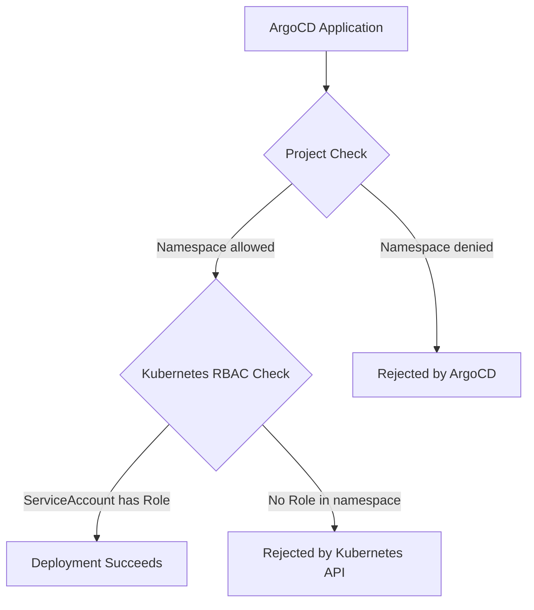

# How to Limit ArgoCD to Specific Namespaces in a Cluster

Author: [nawazdhandala](https://github.com/nawazdhandala)

Tags: ArgoCD, GitOps, Kubernetes, RBAC, Multi-Tenancy

Description: Learn how to restrict ArgoCD to manage only specific namespaces in a Kubernetes cluster, enabling safer multi-tenant deployments and least-privilege access control.

---

By default, ArgoCD has cluster-wide access and can deploy resources to any namespace. In production environments with multiple teams or sensitive workloads, this is a security risk you cannot afford. Restricting ArgoCD to specific namespaces follows the principle of least privilege and prevents accidental or malicious deployments to namespaces that should remain untouched.

This guide walks you through three approaches to namespace restriction: ArgoCD Projects, Kubernetes RBAC, and namespace-scoped installations.

## Why Limit Namespace Access

There are several practical reasons to restrict where ArgoCD can deploy:

- **Multi-tenant clusters**: Different teams own different namespaces, and no team should deploy into another team's space
- **Compliance requirements**: Regulated environments need clear boundaries between workloads
- **Blast radius reduction**: A misconfigured Application manifest should not wipe out critical system namespaces
- **Development safety**: Developers testing ArgoCD should not accidentally deploy to production namespaces

## Approach 1: ArgoCD Project Destination Restrictions

The simplest way to limit namespace access is through ArgoCD Projects. Projects define which clusters and namespaces an Application can target.

```yaml
# restricted-project.yaml
apiVersion: argoproj.io/v1alpha1
kind: AppProject
metadata:
  name: team-frontend
  namespace: argocd
spec:
  description: "Frontend team project - limited to frontend namespaces"
  # Only allow deployments to these specific namespaces
  destinations:
    - namespace: frontend-dev
      server: https://kubernetes.default.svc
    - namespace: frontend-staging
      server: https://kubernetes.default.svc
    - namespace: frontend-prod
      server: https://kubernetes.default.svc
  # Restrict which Git repos can be used
  sourceRepos:
    - 'https://github.com/myorg/frontend-*'
  # Deny cluster-scoped resources
  clusterResourceWhitelist: []
  # Only allow specific namespace-scoped resources
  namespaceResourceWhitelist:
    - group: ''
      kind: ConfigMap
    - group: ''
      kind: Secret
    - group: ''
      kind: Service
    - group: apps
      kind: Deployment
    - group: apps
      kind: StatefulSet
    - group: networking.k8s.io
      kind: Ingress
```

Apply this project:

```bash
kubectl apply -f restricted-project.yaml
```

Now any Application that references this project can only deploy to the three frontend namespaces:

```yaml
apiVersion: argoproj.io/v1alpha1
kind: Application
metadata:
  name: frontend-app
  namespace: argocd
spec:
  project: team-frontend  # References the restricted project
  source:
    repoURL: https://github.com/myorg/frontend-app
    targetRevision: main
    path: k8s/overlays/dev
  destination:
    server: https://kubernetes.default.svc
    namespace: frontend-dev  # Must be in the allowed list
```

If someone tries to set the destination to a namespace not in the project's allowed list, ArgoCD will reject the sync with a clear error message.

## Approach 2: Kubernetes RBAC for the ArgoCD Service Account

Project restrictions are enforced at the ArgoCD level, but the underlying service account still has cluster-admin permissions. For defense in depth, you should also restrict the Kubernetes RBAC permissions of the ArgoCD application controller service account.

First, create a ClusterRole with limited permissions:

```yaml
# argocd-limited-role.yaml
apiVersion: rbac.authorization.k8s.io/v1
kind: ClusterRole
metadata:
  name: argocd-limited-controller
rules:
  # ArgoCD needs to read cluster-wide resources for status
  - apiGroups: [""]
    resources: ["namespaces"]
    verbs: ["get", "list", "watch"]
  # Read-only access to CRDs (ArgoCD needs this)
  - apiGroups: ["apiextensions.k8s.io"]
    resources: ["customresourcedefinitions"]
    verbs: ["get", "list", "watch"]
```

Then create namespace-scoped RoleBindings for each allowed namespace:

```yaml
# argocd-role-frontend-dev.yaml
apiVersion: rbac.authorization.k8s.io/v1
kind: Role
metadata:
  name: argocd-namespace-manager
  namespace: frontend-dev
rules:
  - apiGroups: ["*"]
    resources: ["*"]
    verbs: ["*"]
---
apiVersion: rbac.authorization.k8s.io/v1
kind: RoleBinding
metadata:
  name: argocd-namespace-manager
  namespace: frontend-dev
subjects:
  - kind: ServiceAccount
    name: argocd-application-controller
    namespace: argocd
roleRef:
  kind: Role
  name: argocd-namespace-manager
  apiGroup: rbac.authorization.k8s.io
```

Repeat this Role and RoleBinding for each namespace ArgoCD should manage. You can automate this with a script:

```bash
#!/bin/bash
# create-argocd-namespace-rbac.sh
NAMESPACES=("frontend-dev" "frontend-staging" "frontend-prod" "backend-dev" "backend-staging" "backend-prod")

for NS in "${NAMESPACES[@]}"; do
  kubectl create role argocd-namespace-manager \
    --namespace="$NS" \
    --verb="*" \
    --resource="*.*" \
    --dry-run=client -o yaml | kubectl apply -f -

  kubectl create rolebinding argocd-namespace-manager \
    --namespace="$NS" \
    --role=argocd-namespace-manager \
    --serviceaccount=argocd:argocd-application-controller \
    --dry-run=client -o yaml | kubectl apply -f -
done
```

After applying these, remove the default cluster-admin binding:

```bash
# Remove the default cluster-admin binding
kubectl delete clusterrolebinding argocd-application-controller
```

## Approach 3: Namespace-Scoped ArgoCD Installation

For the strictest isolation, you can install ArgoCD in namespace-scoped mode. This means the entire ArgoCD instance only watches and manages resources in specific namespaces.

When installing with Helm, set the namespace scope:

```yaml
# argocd-values.yaml
configs:
  params:
    # Run in namespace-scoped mode
    application.namespaces: "frontend-dev,frontend-staging,frontend-prod"

controller:
  # Only watch specific namespaces
  env:
    - name: ARGOCD_CONTROLLER_NAMESPACES
      value: "frontend-dev,frontend-staging,frontend-prod"
  clusterRoleRules:
    enabled: false  # Disable cluster-wide roles

server:
  clusterRoleRules:
    enabled: false
```

Install with Helm:

```bash
helm install argocd argo/argo-cd \
  --namespace argocd \
  --values argocd-values.yaml
```

For the official manifests installation, use the namespace-install variant:

```bash
# This installs ArgoCD without cluster-level permissions
kubectl apply -n argocd \
  -f https://raw.githubusercontent.com/argoproj/argo-cd/stable/manifests/namespace-install.yaml
```

Then configure which namespaces to watch via the argocd-cmd-params-cm ConfigMap:

```yaml
apiVersion: v1
kind: ConfigMap
metadata:
  name: argocd-cmd-params-cm
  namespace: argocd
data:
  # Comma-separated list of namespaces to manage
  application.namespaces: "frontend-dev,frontend-staging,frontend-prod"
```

## Combining Approaches for Defense in Depth

The strongest configuration combines all three approaches:



Here is a complete example combining project restrictions with RBAC:

```yaml
# Complete namespace-restricted setup
---
# 1. Create the target namespaces with labels
apiVersion: v1
kind: Namespace
metadata:
  name: frontend-dev
  labels:
    team: frontend
    managed-by: argocd
---
# 2. Create the ArgoCD project with destination restrictions
apiVersion: argoproj.io/v1alpha1
kind: AppProject
metadata:
  name: team-frontend
  namespace: argocd
spec:
  destinations:
    - namespace: frontend-dev
      server: https://kubernetes.default.svc
  sourceRepos:
    - 'https://github.com/myorg/frontend-*'
  clusterResourceWhitelist: []
  namespaceResourceBlacklist:
    - group: ''
      kind: ResourceQuota
    - group: ''
      kind: LimitRange
---
# 3. Create RBAC in the target namespace
apiVersion: rbac.authorization.k8s.io/v1
kind: Role
metadata:
  name: argocd-manager
  namespace: frontend-dev
rules:
  - apiGroups: ["", "apps", "networking.k8s.io", "batch"]
    resources: ["*"]
    verbs: ["*"]
---
apiVersion: rbac.authorization.k8s.io/v1
kind: RoleBinding
metadata:
  name: argocd-manager
  namespace: frontend-dev
subjects:
  - kind: ServiceAccount
    name: argocd-application-controller
    namespace: argocd
roleRef:
  kind: Role
  name: argocd-manager
  apiGroup: rbac.authorization.k8s.io
```

## Verifying Namespace Restrictions

After configuration, verify that the restrictions work:

```bash
# Test that ArgoCD can deploy to allowed namespaces
argocd app create test-allowed \
  --repo https://github.com/myorg/frontend-app \
  --path k8s/dev \
  --dest-server https://kubernetes.default.svc \
  --dest-namespace frontend-dev \
  --project team-frontend

# This should succeed
argocd app sync test-allowed

# Test that ArgoCD cannot deploy to restricted namespaces
argocd app create test-denied \
  --repo https://github.com/myorg/frontend-app \
  --path k8s/dev \
  --dest-server https://kubernetes.default.svc \
  --dest-namespace kube-system \
  --project team-frontend

# This should fail with: "application destination server and target namespace
# is not permitted in project 'team-frontend'"
```

You can also check the service account permissions directly:

```bash
# Check if the argocd service account can create deployments in a namespace
kubectl auth can-i create deployments \
  --as=system:serviceaccount:argocd:argocd-application-controller \
  --namespace=frontend-dev
# Expected: yes

kubectl auth can-i create deployments \
  --as=system:serviceaccount:argocd:argocd-application-controller \
  --namespace=kube-system
# Expected: no (if RBAC is properly restricted)
```

## Common Pitfalls

**Forgetting cluster-scoped resources**: Some applications need ClusterRoles, ClusterRoleBindings, or CustomResourceDefinitions. If you block all cluster-scoped resources in the project, these will fail silently. Whitelist only what is absolutely needed.

**Namespace creation**: If your applications expect namespaces to be created by ArgoCD (using the CreateNamespace sync option), the service account needs cluster-level namespace creation permissions. Either pre-create namespaces or add a specific ClusterRole for namespace creation.

**Webhook configurations**: MutatingWebhookConfigurations and ValidatingWebhookConfigurations are cluster-scoped. If your apps install webhooks, you need to allow those resource types in the project's clusterResourceWhitelist.

Restricting ArgoCD to specific namespaces is a critical production hardening step. Start with project-level restrictions for quick wins, then layer on Kubernetes RBAC for defense in depth. For the highest isolation requirements, use the namespace-scoped installation mode. Monitoring your restrictions with tools like [OneUptime](https://oneuptime.com/blog/post/2026-02-26-argocd-monitor-component-health/view) ensures they remain effective as your cluster evolves.
