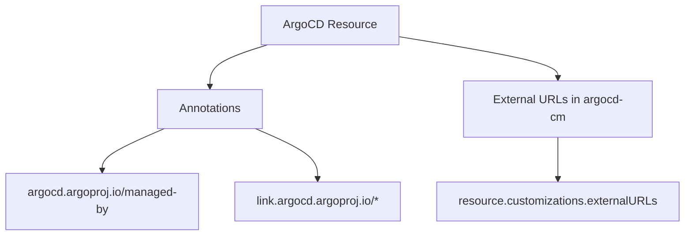

# How to Link Resources to External Management Tools

Author: [nawazdhandala](https://github.com/nawazdhandala)

Tags: ArgoCD, GitOps, Kubernetes, Annotations, External Tools

Description: Learn how to link ArgoCD-managed Kubernetes resources to external tools like Terraform, Datadog, Grafana, and Jira for seamless cross-tool navigation.

---

Modern infrastructure management involves multiple tools - ArgoCD for deployments, Terraform for infrastructure, Grafana for monitoring, Jira for issue tracking, and more. Navigating between these tools during an incident or review is tedious when you have to search each one separately. By linking ArgoCD resources to their corresponding pages in external tools, you create a connected web of tools that makes operations significantly faster.

## The Linking Mechanisms

ArgoCD provides two main mechanisms for linking resources to external tools:



### Method 1: Managed-By Annotation

The simplest approach for per-resource links:

```yaml
metadata:
  annotations:
    argocd.argoproj.io/managed-by: "https://app.terraform.io/app/myorg/workspaces/prod"
```

### Method 2: External URLs Configuration

For automatic linking based on resource type, configure external URLs in the ArgoCD ConfigMap:

```yaml
apiVersion: v1
kind: ConfigMap
metadata:
  name: argocd-cm
  namespace: argocd
data:
  # External URLs that appear on resources in the UI
  resource.customizations.externalURLs: |
    - title: Grafana Dashboard
      url: https://grafana.example.com/d/k8s-resources?var-namespace={{.Namespace}}&var-workload={{.Name}}
      condition: kind == "Deployment"
    - title: Datadog APM
      url: https://app.datadoghq.com/apm/services?query=service:{{.Name}}
      condition: kind == "Deployment" || kind == "StatefulSet"
    - title: Cloud Console
      url: https://console.cloud.google.com/kubernetes/deployment/us-central1-a/production/{{.Namespace}}/{{.Name}}
      condition: kind == "Deployment"
```

## Linking to Terraform

When Kubernetes resources are provisioned or managed by Terraform, link them to the Terraform workspace:

```yaml
# Resources managed by Terraform
apiVersion: v1
kind: Namespace
metadata:
  name: production
  annotations:
    argocd.argoproj.io/managed-by: "https://app.terraform.io/app/myorg/workspaces/k8s-namespaces"
---
apiVersion: networking.k8s.io/v1
kind: Ingress
metadata:
  name: main-ingress
  namespace: production
  annotations:
    argocd.argoproj.io/managed-by: "https://app.terraform.io/app/myorg/workspaces/k8s-networking"
```

For Crossplane-managed cloud resources:

```yaml
apiVersion: rds.aws.upbound.io/v1beta1
kind: Instance
metadata:
  name: production-db
  annotations:
    argocd.argoproj.io/managed-by: "https://console.aws.amazon.com/rds/home?region=us-east-1#database:id=production-db"
```

## Linking to Monitoring Tools

### Grafana

```yaml
apiVersion: apps/v1
kind: Deployment
metadata:
  name: api-server
  annotations:
    # Link to the service-specific Grafana dashboard
    argocd.argoproj.io/managed-by: "https://grafana.example.com/d/api-server-dashboard"
    # Or use a generic link with variables
    link.argocd.argoproj.io/grafana: "https://grafana.example.com/d/k8s?var-namespace=production&var-deployment=api-server"
```

For automated Grafana linking across all Deployments, use the external URLs config:

```yaml
apiVersion: v1
kind: ConfigMap
metadata:
  name: argocd-cm
  namespace: argocd
data:
  resource.customizations.externalURLs: |
    - title: Grafana Metrics
      url: "https://grafana.example.com/d/k8s-workloads?var-namespace={{.Namespace}}&var-workload={{.Name}}"
      condition: kind == "Deployment"
    - title: Grafana Logs
      url: "https://grafana.example.com/explore?left=%7B%22queries%22:%5B%7B%22expr%22:%22%7Bnamespace%3D%5C%22{{.Namespace}}%5C%22,container%3D%5C%22{{.Name}}%5C%22%7D%22%7D%5D%7D"
      condition: kind == "Deployment"
```

### Datadog

```yaml
apiVersion: apps/v1
kind: Deployment
metadata:
  name: payment-service
  annotations:
    argocd.argoproj.io/managed-by: "https://app.datadoghq.com/apm/services?query=service:payment-service&env:production"
```

### OneUptime

Link your resources directly to their monitoring in [OneUptime](https://oneuptime.com):

```yaml
apiVersion: apps/v1
kind: Deployment
metadata:
  name: api-server
  annotations:
    argocd.argoproj.io/managed-by: "https://oneuptime.com/dashboard/project-id/monitors"
```

## Linking to Issue Tracking

### Jira

Link resources to their Jira projects or specific issues:

```yaml
apiVersion: apps/v1
kind: Deployment
metadata:
  name: checkout-service
  annotations:
    # Link to the team's Jira board
    argocd.argoproj.io/managed-by: "https://myorg.atlassian.net/jira/software/projects/CHECKOUT/boards/15"
```

### GitHub Issues

```yaml
metadata:
  annotations:
    argocd.argoproj.io/managed-by: "https://github.com/myorg/checkout-service/issues"
```

## Linking to CI/CD Pipelines

### GitHub Actions

```yaml
apiVersion: apps/v1
kind: Deployment
metadata:
  name: api-server
  annotations:
    argocd.argoproj.io/managed-by: "https://github.com/myorg/api-server/actions/workflows/deploy.yml"
```

### GitLab CI

```yaml
metadata:
  annotations:
    argocd.argoproj.io/managed-by: "https://gitlab.com/myorg/api-server/-/pipelines"
```

### Jenkins

```yaml
metadata:
  annotations:
    argocd.argoproj.io/managed-by: "https://jenkins.example.com/job/api-server/"
```

## Linking to Cloud Console Resources

Link Kubernetes resources to their cloud provider counterparts:

### AWS Resources

```yaml
# Link a Service to its AWS Load Balancer
apiVersion: v1
kind: Service
metadata:
  name: api-server
  annotations:
    argocd.argoproj.io/managed-by: "https://us-east-1.console.aws.amazon.com/ec2/home?region=us-east-1#LoadBalancers:"
---
# Link a PVC to its EBS volume
apiVersion: v1
kind: PersistentVolumeClaim
metadata:
  name: data-volume
  annotations:
    argocd.argoproj.io/managed-by: "https://us-east-1.console.aws.amazon.com/ec2/home?region=us-east-1#Volumes:"
```

### GCP Resources

```yaml
apiVersion: v1
kind: Service
metadata:
  name: api-server
  annotations:
    argocd.argoproj.io/managed-by: "https://console.cloud.google.com/net-services/loadbalancing/list/loadBalancers?project=my-project"
```

## Building a Deep Links Configuration

For a comprehensive setup, use ArgoCD's deep links feature to create dynamic links based on resource attributes:

```yaml
apiVersion: v1
kind: ConfigMap
metadata:
  name: argocd-cm
  namespace: argocd
data:
  # Resource-level deep links
  resource.links: |
    - url: https://grafana.example.com/d/pods?var-namespace={{.Namespace}}&var-pod={{.Name}}
      title: Grafana Pod Metrics
      description: View pod metrics in Grafana
      icon: dashboard
      if: kind == "Pod"
    - url: https://app.datadoghq.com/logs?query=kube_namespace:{{.Namespace}}+kube_deployment:{{.Name}}
      title: Datadog Logs
      description: View deployment logs in Datadog
      icon: file-text
      if: kind == "Deployment"
    - url: https://console.cloud.google.com/kubernetes/deployment/{{.ClusterName}}/{{.Namespace}}/{{.Name}}/overview
      title: GKE Console
      description: View in Google Cloud Console
      icon: cloud
      if: kind == "Deployment"

  # Application-level deep links
  application.links: |
    - url: https://grafana.example.com/d/argocd-app?var-app={{.metadata.name}}
      title: Application Dashboard
    - url: https://github.com/myorg/gitops-config/tree/main/apps/{{.metadata.name}}
      title: Git Source
```

## Automating Link Addition with Kustomize

Create a Kustomize transformer that adds links to all resources:

```yaml
# kustomization.yaml
apiVersion: kustomize.config.k8s.io/v1beta1
kind: Kustomization

resources:
  - deployment.yaml
  - service.yaml

transformers:
  - managed-by-transformer.yaml
```

```yaml
# managed-by-transformer.yaml
apiVersion: builtin
kind: AnnotationsTransformer
metadata:
  name: managed-by-links
annotations:
  argocd.argoproj.io/managed-by: "https://github.com/myorg/platform-config/tree/main/services"
fieldSpecs:
  - path: metadata/annotations
    create: true
```

## Verification

Verify your links are properly configured:

```bash
# List all resources with external tool links
kubectl get all -n production -o json | \
  jq -r '.items[] |
    select(.metadata.annotations["argocd.argoproj.io/managed-by"] != null) |
    "\(.kind)/\(.metadata.name): \(.metadata.annotations["argocd.argoproj.io/managed-by"])"'
```

## Best Practices

1. **Link to actionable pages** - Link directly to the relevant dashboard or page, not just the tool's homepage
2. **Use dynamic URLs** - Leverage template variables in external URL configurations for automatic linking
3. **Keep URLs updated** - When tools change their URL structure, update the annotations
4. **Layer your links** - Use managed-by for the primary link and deep links for supplementary tool links
5. **Document conventions** - Create a team standard for which tools to link from which resource types

Linking ArgoCD resources to external tools transforms your deployment platform from an isolated tool into a connected hub. When an incident occurs, operators can navigate from a problematic deployment in ArgoCD directly to its monitoring dashboard, CI/CD pipeline, or cloud console in a single click.
