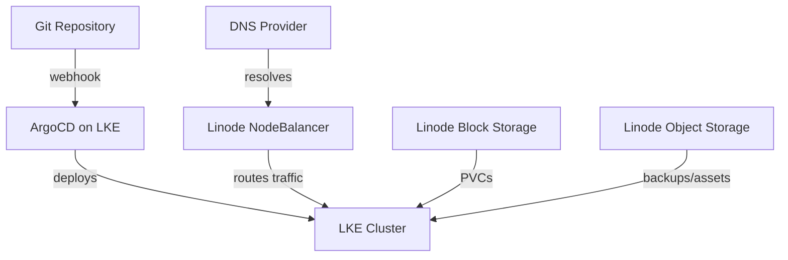

# How to Use ArgoCD with Linode Kubernetes Engine

Author: [nawazdhandala](https://github.com/nawazdhandala)

Tags: ArgoCD, GitOps, Kubernetes, Linode, Cloud

Description: Learn how to deploy and configure ArgoCD on Linode Kubernetes Engine (LKE) with NodeBalancers, storage integration, and production best practices.

---

Linode Kubernetes Engine (LKE), now part of Akamai's cloud platform, is a cost-effective managed Kubernetes service that works well for teams looking for simple, predictable pricing. Running ArgoCD on LKE gives you a full GitOps workflow without the complexity of hyperscaler platforms.

This guide covers deploying ArgoCD on LKE, exposing it with Linode NodeBalancers, configuring storage, and the Linode-specific considerations you need to keep in mind.

## Prerequisites

- A Linode account with an LKE cluster created
- At least 2 nodes with 4GB RAM each (Linode 4GB plan or higher)
- Linode CLI installed and configured
- kubectl configured to talk to your LKE cluster

## Step 1: Set Up Your LKE Cluster

If you have not already created an LKE cluster, you can do so with the Linode CLI.

```bash
# Create an LKE cluster with 3 nodes
linode-cli lke cluster-create \
  --label my-argocd-cluster \
  --region us-east \
  --k8s_version 1.29 \
  --node_pools.type g6-standard-2 \
  --node_pools.count 3

# Download the kubeconfig
linode-cli lke kubeconfig-view <CLUSTER_ID> --text | base64 -d > ~/.kube/lke-config

export KUBECONFIG=~/.kube/lke-config
kubectl get nodes
```

## Step 2: Install ArgoCD

The standard ArgoCD installation works on LKE without modifications.

```bash
# Create namespace and install ArgoCD
kubectl create namespace argocd
kubectl apply -n argocd -f https://raw.githubusercontent.com/argoproj/argo-cd/stable/manifests/install.yaml

# Wait for pods to be ready
kubectl wait --for=condition=Ready pod --all -n argocd --timeout=300s

# Get initial admin password
kubectl -n argocd get secret argocd-initial-admin-secret \
  -o jsonpath="{.data.password}" | base64 -d && echo
```

## Step 3: Expose ArgoCD with a Linode NodeBalancer

LKE uses Linode NodeBalancers as the default LoadBalancer implementation. You can expose ArgoCD by changing the service type.

```bash
# Quick approach: patch the service to LoadBalancer type
kubectl patch svc argocd-server -n argocd \
  -p '{"spec": {"type": "LoadBalancer"}}'
```

For more control over the NodeBalancer, use annotations.

```yaml
# argocd-server-nodebalancer.yaml
apiVersion: v1
kind: Service
metadata:
  name: argocd-server
  namespace: argocd
  annotations:
    # Linode NodeBalancer configuration
    service.beta.kubernetes.io/linode-loadbalancer-default-protocol: "tcp"
    service.beta.kubernetes.io/linode-loadbalancer-port-443: |
      {
        "tls-secret-name": "argocd-tls",
        "protocol": "https"
      }
    service.beta.kubernetes.io/linode-loadbalancer-check-type: "connection"
    service.beta.kubernetes.io/linode-loadbalancer-check-interval: "10"
spec:
  type: LoadBalancer
  ports:
    - name: https
      port: 443
      targetPort: 8080
      protocol: TCP
  selector:
    app.kubernetes.io/name: argocd-server
```

### Using Nginx Ingress Instead

For more flexibility, install an ingress controller behind the NodeBalancer.

```yaml
# nginx-ingress-app.yaml
apiVersion: argoproj.io/v1alpha1
kind: Application
metadata:
  name: nginx-ingress
  namespace: argocd
spec:
  project: default
  source:
    repoURL: https://kubernetes.github.io/ingress-nginx
    chart: ingress-nginx
    targetRevision: 4.x
    helm:
      values: |
        controller:
          service:
            annotations:
              service.beta.kubernetes.io/linode-loadbalancer-default-protocol: "tcp"
              service.beta.kubernetes.io/linode-loadbalancer-proxy-protocol: "v2"
            externalTrafficPolicy: Local
  destination:
    server: https://kubernetes.default.svc
    namespace: ingress-nginx
  syncPolicy:
    automated:
      prune: true
      selfHeal: true
    syncOptions:
      - CreateNamespace=true
```

Then create an ingress for ArgoCD.

```yaml
# argocd-ingress.yaml
apiVersion: networking.k8s.io/v1
kind: Ingress
metadata:
  name: argocd-server
  namespace: argocd
  annotations:
    nginx.ingress.kubernetes.io/ssl-passthrough: "true"
    nginx.ingress.kubernetes.io/backend-protocol: "HTTPS"
spec:
  ingressClassName: nginx
  rules:
    - host: argocd.example.com
      http:
        paths:
          - path: /
            pathType: Prefix
            backend:
              service:
                name: argocd-server
                port:
                  number: 443
```

## Step 4: Configure Storage

LKE provides a CSI driver for Linode Block Storage. It is installed by default on LKE clusters.

```bash
# Verify the storage class is available
kubectl get storageclass
```

You should see `linode-block-storage` and `linode-block-storage-retain` available. For applications deployed by ArgoCD that need persistent storage:

```yaml
# Example PVC using Linode Block Storage
apiVersion: v1
kind: PersistentVolumeClaim
metadata:
  name: app-data
spec:
  accessModes:
    - ReadWriteOnce
  storageClassName: linode-block-storage-retain
  resources:
    requests:
      storage: 10Gi
```

## Step 5: TLS with cert-manager

Set up automatic TLS certificates for ArgoCD and your applications using cert-manager and Let's Encrypt.

```yaml
# cert-manager-app.yaml
apiVersion: argoproj.io/v1alpha1
kind: Application
metadata:
  name: cert-manager
  namespace: argocd
spec:
  project: default
  source:
    repoURL: https://charts.jetstack.io
    chart: cert-manager
    targetRevision: v1.14.x
    helm:
      values: |
        installCRDs: true
  destination:
    server: https://kubernetes.default.svc
    namespace: cert-manager
  syncPolicy:
    automated:
      prune: true
      selfHeal: true
    syncOptions:
      - CreateNamespace=true
```

Create a ClusterIssuer for Let's Encrypt.

```yaml
# letsencrypt-issuer.yaml
apiVersion: cert-manager.io/v1
kind: ClusterIssuer
metadata:
  name: letsencrypt-prod
spec:
  acme:
    server: https://acme-v02.api.letsencrypt.org/directory
    email: admin@example.com
    privateKeySecretRef:
      name: letsencrypt-prod
    solvers:
      - http01:
          ingress:
            class: nginx
```

## Step 6: Connect a Private Git Repository

For your application manifests stored in a private repository, configure ArgoCD to authenticate.

```yaml
# git-repo-secret.yaml
apiVersion: v1
kind: Secret
metadata:
  name: private-repo
  namespace: argocd
  labels:
    argocd.argoproj.io/secret-type: repository
stringData:
  type: git
  url: https://github.com/my-org/my-manifests
  username: git
  password: "<GITHUB_PAT>"
```

## Sample Multi-Environment Deployment

Here is a typical setup for deploying an application across staging and production on LKE.

```yaml
# staging-app.yaml
apiVersion: argoproj.io/v1alpha1
kind: Application
metadata:
  name: my-app-staging
  namespace: argocd
spec:
  project: default
  source:
    repoURL: https://github.com/my-org/my-app
    targetRevision: develop
    path: k8s/overlays/staging
  destination:
    server: https://kubernetes.default.svc
    namespace: staging
  syncPolicy:
    automated:
      prune: true
      selfHeal: true
    syncOptions:
      - CreateNamespace=true
---
# production-app.yaml
apiVersion: argoproj.io/v1alpha1
kind: Application
metadata:
  name: my-app-production
  namespace: argocd
spec:
  project: default
  source:
    repoURL: https://github.com/my-org/my-app
    targetRevision: main
    path: k8s/overlays/production
  destination:
    server: https://kubernetes.default.svc
    namespace: production
  syncPolicy:
    automated:
      prune: true
      selfHeal: false
```

## Architecture on Linode



## Linode-Specific Considerations

### NodeBalancer Limits

Each LKE cluster can have multiple NodeBalancers, but each one has a cost. For cost efficiency, use a single ingress controller (one NodeBalancer) and route all traffic through ingress rules rather than creating multiple LoadBalancer services.

### Object Storage for Backups

Linode Object Storage (S3-compatible) works well for ArgoCD application backups and disaster recovery.

```bash
# Configure s3cmd for Linode Object Storage
s3cmd --configure
# Use us-east-1.linodeobjects.com as the endpoint
```

### Node Pool Auto-Scaling

LKE supports cluster auto-scaling. If your ArgoCD-managed workloads have variable demand:

```bash
# Enable autoscaling on a node pool
linode-cli lke pool-update <CLUSTER_ID> <POOL_ID> \
  --autoscaler.enabled true \
  --autoscaler.min 2 \
  --autoscaler.max 5
```

### Firewall Configuration

Linode Cloud Firewalls can protect your LKE nodes. Make sure to allow traffic from NodeBalancers.

```bash
# Create a firewall allowing NodeBalancer and inter-node traffic
linode-cli firewalls create \
  --label lke-firewall \
  --rules.inbound_policy DROP \
  --rules.outbound_policy ACCEPT
```

## Troubleshooting on LKE

### NodeBalancer Health Checks Failing

If the NodeBalancer shows backends as unhealthy, check that the health check port matches.

```bash
# Check NodeBalancer status
linode-cli nodebalancers list
linode-cli nodebalancers configs-list <NB_ID>
```

### DNS Resolution Issues

LKE uses CoreDNS. If pods cannot resolve external names, check the CoreDNS pods.

```bash
kubectl get pods -n kube-system -l k8s-app=kube-dns
kubectl logs -n kube-system -l k8s-app=kube-dns
```

### Volume Mount Failures

Linode Block Storage volumes can only be attached to one node. If a pod gets rescheduled to a different node and the volume is still attached to the old node, it will fail.

```bash
# Check PV status
kubectl get pv
kubectl describe pv <PV_NAME>
```

## Conclusion

Linode Kubernetes Engine is a solid, cost-effective platform for running ArgoCD. The integration with NodeBalancers and Block Storage is straightforward, and the pricing is predictable. For teams that do not need the full ecosystem of AWS or Azure, LKE with ArgoCD provides everything you need for a production GitOps workflow at a lower price point. The key is to use a single ingress controller to minimize NodeBalancer costs and leverage Linode's auto-scaling for your application workloads.
