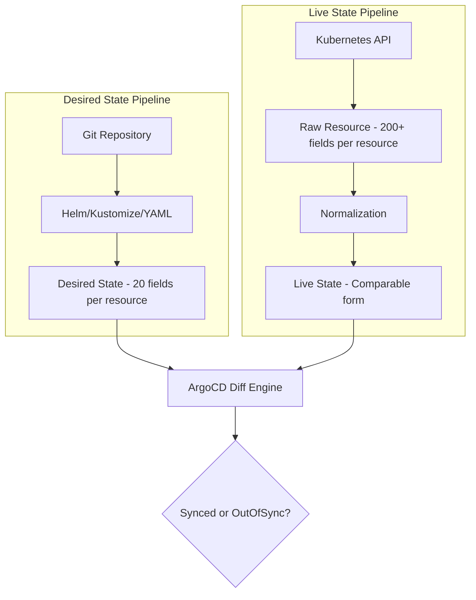

# How ArgoCD Compares Live State vs Desired State

Author: [nawazdhandala](https://github.com/nawazdhandala)

Tags: ArgoCD, GitOps, Kubernetes, State Management

Description: An in-depth look at how ArgoCD compares the live cluster state with the desired Git state, including normalization, diff algorithms, and handling edge cases.

---

The core function of ArgoCD is comparing two things: what your Git repository says should exist (desired state) and what actually exists in your Kubernetes cluster (live state). This comparison drives everything - sync status, drift detection, and self-healing. But the comparison is far from a simple text diff. ArgoCD applies sophisticated normalization, default handling, and diffing logic to produce accurate results.

This post takes you through exactly how ArgoCD performs this comparison, where it can go wrong, and how to customize it for your environment.

## The Two States

Before diving into the comparison, let us define the two states precisely.

**Desired state** is the output of ArgoCD's manifest generation pipeline. It starts with your Git repository and passes through Helm, Kustomize, or plain YAML processing. The result is a list of fully rendered Kubernetes resource definitions.

**Live state** is what the Kubernetes API reports. ArgoCD queries the cluster for each resource it manages and gets back the full resource specification, including all server-added fields, defaults, and status information.

These two representations are fundamentally different in structure and content, which is why ArgoCD cannot do a simple string comparison.



## Why a Simple Diff Does Not Work

Consider a simple Deployment manifest from Git:

```yaml
# What you wrote in Git (desired state)
apiVersion: apps/v1
kind: Deployment
metadata:
  name: my-app
  namespace: production
spec:
  replicas: 3
  selector:
    matchLabels:
      app: my-app
  template:
    metadata:
      labels:
        app: my-app
    spec:
      containers:
      - name: my-app
        image: nginx:1.25
        ports:
        - containerPort: 80
```

Now here is what the Kubernetes API returns for the same resource (simplified, but illustrative):

```yaml
# What the cluster actually has (live state - abbreviated)
apiVersion: apps/v1
kind: Deployment
metadata:
  name: my-app
  namespace: production
  uid: a1b2c3d4-e5f6-7890-abcd-ef1234567890
  resourceVersion: "12345678"
  generation: 5
  creationTimestamp: "2024-03-15T10:30:00Z"
  managedFields:
  - manager: argocd-controller
    # ... many lines of managed fields metadata
  annotations:
    deployment.kubernetes.io/revision: "3"
spec:
  replicas: 3
  revisionHistoryLimit: 10  # Kubernetes default, not in your manifest
  progressDeadlineSeconds: 600  # Another default
  strategy:
    type: RollingUpdate  # Default strategy
    rollingUpdate:
      maxSurge: 25%
      maxUnavailable: 25%
  selector:
    matchLabels:
      app: my-app
  template:
    metadata:
      labels:
        app: my-app
    spec:
      containers:
      - name: my-app
        image: nginx:1.25
        ports:
        - containerPort: 80
          protocol: TCP  # Default protocol
        resources: {}
        terminationMessagePath: /dev/termination-log  # Default
        terminationMessagePolicy: File  # Default
        imagePullPolicy: IfNotPresent  # Default for tagged images
      restartPolicy: Always  # Default
      terminationGracePeriodSeconds: 30  # Default
      dnsPolicy: ClusterFirst  # Default
      schedulerName: default-scheduler  # Default
status:
  availableReplicas: 3
  readyReplicas: 3
  replicas: 3
  updatedReplicas: 3
  # ... more status fields
```

A naive diff between these two would show dozens of "differences" that are actually just Kubernetes defaults and server-generated fields. None of these differences represent actual configuration drift.

## ArgoCD's Normalization Process

To produce meaningful comparisons, ArgoCD normalizes both sides through several steps:

### Step 1: Remove Server-Generated Fields

ArgoCD strips these fields from the live state before comparison:

- `metadata.uid`
- `metadata.resourceVersion`
- `metadata.generation`
- `metadata.creationTimestamp`
- `metadata.managedFields`
- `status` (entire section)
- `metadata.selfLink` (deprecated but still sometimes present)

### Step 2: Apply Known Defaults

ArgoCD understands Kubernetes defaults and does not flag them as differences. For example:

- `imagePullPolicy: IfNotPresent` (for tagged images)
- `imagePullPolicy: Always` (for `:latest` tag)
- `protocol: TCP` (for container ports)
- `restartPolicy: Always` (for pod specs)
- `dnsPolicy: ClusterFirst`
- `terminationGracePeriodSeconds: 30`
- `strategy.type: RollingUpdate`
- `revisionHistoryLimit: 10`

This default normalization is built into ArgoCD and covers the most common Kubernetes resource types.

### Step 3: Handle Annotation and Label Differences

If the live state has annotations or labels that were not in the desired state, ArgoCD handles this carefully. Annotations added by ArgoCD itself (like tracking annotations) are ignored. Annotations added by other controllers or admission webhooks can be configured to be ignored.

### Step 4: Structured Comparison

After normalization, ArgoCD performs a structured JSON/YAML comparison. It does not compare strings - it compares the parsed data structures. This means field ordering does not matter, and equivalent values in different formats are handled correctly.

## The Diff Output

You can view the comparison result using the CLI:

```bash
# View the diff between desired and live state
argocd app diff my-app
```

The output shows only the meaningful differences after normalization. For example:

```text
===== apps/Deployment production/my-app ======
  spec:
    template:
      spec:
        containers:
        - name: my-app
-         image: nginx:1.25
+         image: nginx:1.26
```

This tells you that the only real difference is the image tag - exactly the kind of actionable information you need.

## Customizing the Comparison

Sometimes ArgoCD's default normalization is not enough. Your environment may have controllers, operators, or webhooks that legitimately add or modify fields on resources. You can customize the comparison behavior in several ways.

### Ignore Specific JSON Pointers

Tell ArgoCD to ignore specific fields for specific resource types:

```yaml
# In argocd-cm ConfigMap
apiVersion: v1
kind: ConfigMap
metadata:
  name: argocd-cm
  namespace: argocd
data:
  resource.customizations.ignoreDifferences.apps_Deployment: |
    jsonPointers:
    - /spec/template/metadata/annotations/prometheus.io~1scrape
    - /spec/template/metadata/annotations/sidecar.istio.io~1inject
```

### Ignore Differences by Manager

If a specific controller manages certain fields, you can ignore all fields managed by that controller:

```yaml
resource.customizations.ignoreDifferences.all: |
  managedFieldsManagers:
  - kube-controller-manager
  - istio-sidecar-injector
```

### JQ Path Expressions

For more complex scenarios, ArgoCD supports JQ path expressions:

```yaml
resource.customizations.ignoreDifferences.apps_Deployment: |
  jqPathExpressions:
  - .spec.template.spec.containers[].resources
  - .spec.template.spec.initContainers[]?.resources
```

## How the Cluster Cache Works

ArgoCD does not query the Kubernetes API on every reconciliation. Instead, it maintains a cluster cache using Kubernetes informers (watch API).

When ArgoCD first connects to a cluster, it lists all the resources it manages and stores them in its cache (backed by Redis). After that, it watches for change events and updates the cache incrementally.

This means ArgoCD usually has a near-real-time view of the live state, and comparisons are fast because they use cached data.

```bash
# Check the cluster cache status
argocd cluster list

# The cache is stored in Redis
kubectl exec -it deploy/argocd-redis -n argocd -- redis-cli info keyspace
```

If you suspect the cache is stale, you can force a refresh:

```bash
# Normal refresh - check Git for updates
argocd app get my-app --refresh

# Hard refresh - invalidate all caches
argocd app get my-app --hard-refresh
```

## Edge Cases and Pitfalls

### Non-Deterministic Manifest Generation

If your Helm chart or Kustomize setup produces different output on each run (for example, generating random passwords or timestamps), ArgoCD will always show OutOfSync because the desired state keeps changing.

Solution: Make your manifest generation deterministic. Use sealed secrets or external secrets for passwords, and avoid timestamps in templates.

### Operator-Managed Resources

Some Kubernetes operators modify the resources they manage. For example, a Cert-Manager Certificate resource gets additional fields after the operator processes it. ArgoCD sees these modifications as drift.

Solution: Use ignore differences configuration, or let the operator manage the resource entirely (remove it from ArgoCD management).

### Large CRDs

Custom Resource Definitions (CRDs) with complex schemas can sometimes produce unexpected diffs. ArgoCD may not know the defaults for custom resource types.

Solution: Use resource customizations to teach ArgoCD how to handle specific CRDs.

### Force-Pushed Branches

If someone force-pushes to a branch, the commit history changes. ArgoCD tracks the commit SHA, not the branch pointer, so it handles this correctly. But the manifest cache may be invalidated, causing a brief period of regeneration.

## Comparison During Sync Preview

Before applying changes, you can preview what a sync will do:

```bash
# Dry-run sync to see what would change
argocd app sync my-app --dry-run

# Preview the diff in the UI before syncing
# Click on the app -> see the diff panel -> then decide to sync
```

This preview uses the same comparison engine, so what you see in the preview is exactly what will be applied.

## Performance Considerations

The comparison runs on every reconciliation cycle for every Application. For large deployments, this can be resource-intensive.

Factors that affect comparison performance:
- **Number of resources per Application** - more resources means more comparisons
- **Complexity of resources** - large CRDs with many fields take longer to compare
- **Number of ignored differences** - JQ expressions add processing overhead
- **Cluster cache freshness** - stale caches cause the controller to refetch from the API

Monitor the `argocd_app_reconcile_bucket` metric to track reconciliation time. If comparisons are slow, consider splitting large Applications into smaller ones or optimizing your ignore difference rules.

## The Bottom Line

ArgoCD's state comparison is the foundation of GitOps. It normalizes away server-generated noise, handles Kubernetes defaults intelligently, and gives you a clear picture of what is actually different between your Git repository and your cluster. When the default comparison does not work for your environment, the customization options let you fine-tune exactly which differences matter and which should be ignored. Understanding this comparison process helps you debug unexpected OutOfSync statuses and configure ArgoCD to work correctly with your specific Kubernetes setup.
