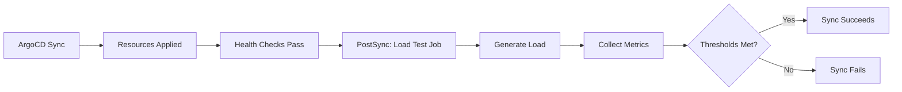

# How to Implement Load Testing After Deployment with ArgoCD

Author: [nawazdhandala](https://github.com/nawazdhandala)

Tags: ArgoCD, GitOps, Kubernetes, Load Testing, Performance

Description: Learn how to run automated load tests after ArgoCD deployments using PostSync hooks to catch performance regressions before they impact production users.

---

Performance regressions are some of the hardest bugs to catch. Your application passes all functional tests, the health checks look good, and then it falls over under real traffic because someone introduced a N+1 query or a memory leak. Running load tests after every deployment catches these issues before they reach users.

ArgoCD PostSync hooks provide the perfect trigger for automated load testing. In this guide, I will show you how to set up load tests that run automatically after every deployment and fail the sync if performance degrades.

## Why Load Test After Deployment

Functional tests answer "does it work?" Load tests answer "does it work under pressure?" The difference matters because many performance problems only surface under concurrent load:

- Connection pool exhaustion
- Memory leaks under sustained load
- CPU-intensive operations that looked fine with one request
- Database query plans that change with data volume
- Rate limiting misconfiguration

Running a quick load test after deployment gives you a performance baseline and catches regressions early.

## Architecture Overview

Here is how the load testing pipeline fits into the ArgoCD sync lifecycle:



## Basic Load Test with curl

For a lightweight load test that does not require any special tools, you can use a simple curl-based approach:

```yaml
apiVersion: batch/v1
kind: Job
metadata:
  name: load-test-basic
  annotations:
    argocd.argoproj.io/hook: PostSync
    argocd.argoproj.io/hook-delete-policy: BeforeHookCreation,HookSucceeded
spec:
  backoffLimit: 0
  activeDeadlineSeconds: 300
  template:
    spec:
      restartPolicy: Never
      containers:
        - name: load-test
          image: alpine:3.19
          command:
            - sh
            - -c
            - |
              apk add --no-cache curl bc

              URL="http://api-service.default.svc:8080/api/v1/health"
              CONCURRENT=10
              REQUESTS_PER_WORKER=50
              MAX_AVG_MS=200
              MAX_ERROR_RATE=1

              echo "Load test: $CONCURRENT concurrent workers, $REQUESTS_PER_WORKER requests each"
              echo "Target: $URL"
              echo "Thresholds: avg < ${MAX_AVG_MS}ms, error rate < ${MAX_ERROR_RATE}%"
              echo ""

              total_time=0
              total_requests=0
              errors=0

              for worker in $(seq 1 $CONCURRENT); do
                for req in $(seq 1 $REQUESTS_PER_WORKER); do
                  start=$(date +%s%N)
                  code=$(curl -s -o /dev/null -w "%{http_code}" \
                    --connect-timeout 5 --max-time 10 "$URL")
                  end=$(date +%s%N)

                  elapsed=$(( (end - start) / 1000000 ))
                  total_time=$((total_time + elapsed))
                  total_requests=$((total_requests + 1))

                  if [ "$code" != "200" ]; then
                    errors=$((errors + 1))
                  fi
                done &
              done
              wait

              avg_ms=$((total_time / total_requests))
              error_rate=$(echo "scale=2; $errors * 100 / $total_requests" | bc)

              echo "Results:"
              echo "  Total requests: $total_requests"
              echo "  Average latency: ${avg_ms}ms"
              echo "  Errors: $errors ($error_rate%)"

              # Check thresholds
              if [ "$avg_ms" -gt "$MAX_AVG_MS" ]; then
                echo "FAIL: Average latency ${avg_ms}ms exceeds ${MAX_AVG_MS}ms"
                exit 1
              fi

              echo "PASS: All thresholds met"
```

This is quick and dirty. For production use, you want a proper load testing tool.

## Load Testing with k6

k6 is purpose-built for load testing and integrates well with Kubernetes. Here is how to run k6 as a PostSync hook:

```yaml
apiVersion: v1
kind: ConfigMap
metadata:
  name: k6-load-test-script
data:
  test.js: |
    import http from 'k6/http';
    import { check, sleep } from 'k6';
    import { Rate, Trend } from 'k6/metrics';

    const errorRate = new Rate('errors');
    const apiLatency = new Trend('api_latency', true);

    export const options = {
      stages: [
        { duration: '30s', target: 20 },   // Ramp up to 20 users
        { duration: '1m', target: 20 },     // Stay at 20 users
        { duration: '30s', target: 50 },    // Ramp up to 50 users
        { duration: '1m', target: 50 },     // Stay at 50 users
        { duration: '30s', target: 0 },     // Ramp down
      ],
      thresholds: {
        http_req_duration: ['p(95)<500', 'p(99)<1000'],
        errors: ['rate<0.01'],
        http_req_failed: ['rate<0.01'],
      },
    };

    const BASE_URL = __ENV.API_URL || 'http://api-service.default.svc:8080';

    export default function () {
      // Test health endpoint
      const healthRes = http.get(`${BASE_URL}/health`);
      check(healthRes, {
        'health status 200': (r) => r.status === 200,
      });
      errorRate.add(healthRes.status !== 200);
      apiLatency.add(healthRes.timings.duration);

      // Test API endpoint
      const listRes = http.get(`${BASE_URL}/api/v1/items?limit=10`);
      check(listRes, {
        'list status 200': (r) => r.status === 200,
        'list has items': (r) => r.json().length > 0,
      });
      errorRate.add(listRes.status !== 200);

      // Test write endpoint
      const payload = JSON.stringify({
        name: `loadtest-${Date.now()}`,
        type: 'test',
      });
      const createRes = http.post(`${BASE_URL}/api/v1/items`, payload, {
        headers: { 'Content-Type': 'application/json' },
      });
      check(createRes, {
        'create status 201': (r) => r.status === 201,
      });
      errorRate.add(createRes.status !== 201);

      sleep(0.5);
    }
---
apiVersion: batch/v1
kind: Job
metadata:
  name: load-test-k6
  annotations:
    argocd.argoproj.io/hook: PostSync
    argocd.argoproj.io/hook-delete-policy: BeforeHookCreation,HookSucceeded
spec:
  backoffLimit: 0
  activeDeadlineSeconds: 600
  template:
    spec:
      restartPolicy: Never
      initContainers:
        - name: wait-for-api
          image: busybox:1.36
          command:
            - sh
            - -c
            - |
              until wget -q -O /dev/null http://api-service.default.svc:8080/health; do
                sleep 2
              done
      containers:
        - name: k6
          image: grafana/k6:0.49.0
          command:
            - k6
            - run
            - /scripts/test.js
          env:
            - name: API_URL
              value: "http://api-service.default.svc:8080"
          volumeMounts:
            - name: scripts
              mountPath: /scripts
      volumes:
        - name: scripts
          configMap:
            name: k6-load-test-script
```

k6 exits with a non-zero code when thresholds are not met, which causes the Job to fail and marks the ArgoCD sync as failed.

## Sending k6 Results to Prometheus

To track load test results over time and compare across deployments, send metrics to Prometheus:

```yaml
containers:
  - name: k6
    image: grafana/k6:0.49.0
    command:
      - k6
      - run
      - --out
      - experimental-prometheus-rw
      - /scripts/test.js
    env:
      - name: API_URL
        value: "http://api-service.default.svc:8080"
      - name: K6_PROMETHEUS_RW_SERVER_URL
        value: "http://prometheus.monitoring.svc:9090/api/v1/write"
      - name: K6_PROMETHEUS_RW_TREND_AS_NATIVE_HISTOGRAM
        value: "true"
```

This sends all k6 metrics directly to Prometheus where you can visualize them in Grafana dashboards and set up alerts for performance trends.

## Environment-Specific Load Test Profiles

Different environments need different load levels. Use Kustomize to manage this:

```yaml
# base/load-test-config.yaml
apiVersion: v1
kind: ConfigMap
metadata:
  name: load-test-config
data:
  VUS: "20"
  DURATION: "2m"
  MAX_P95_LATENCY: "500"
  MAX_ERROR_RATE: "1"
```

```yaml
# overlays/staging/load-test-patch.yaml
apiVersion: v1
kind: ConfigMap
metadata:
  name: load-test-config
data:
  VUS: "50"
  DURATION: "5m"
  MAX_P95_LATENCY: "300"
  MAX_ERROR_RATE: "0.5"
```

```yaml
# overlays/production/load-test-patch.yaml
apiVersion: v1
kind: ConfigMap
metadata:
  name: load-test-config
data:
  VUS: "100"
  DURATION: "3m"
  MAX_P95_LATENCY: "200"
  MAX_ERROR_RATE: "0.1"
```

## Running Load Tests Only on Specific Deployments

You might not want load tests on every single sync. Use ArgoCD sync waves to control when load tests run, and skip them for configuration-only changes:

```yaml
apiVersion: batch/v1
kind: Job
metadata:
  name: load-test
  annotations:
    argocd.argoproj.io/hook: PostSync
    # Run after smoke tests
    argocd.argoproj.io/sync-wave: "2"
    argocd.argoproj.io/hook-delete-policy: BeforeHookCreation,HookSucceeded
```

Alternatively, you can use a wrapper script that checks what changed before running the full load test:

```yaml
command:
  - sh
  - -c
  - |
    # Check if the deployment image actually changed
    current_image=$(kubectl get deployment api-service \
      -o jsonpath='{.spec.template.spec.containers[0].image}')

    # Compare with last tested image stored in a ConfigMap
    last_tested=$(kubectl get configmap load-test-state \
      -o jsonpath='{.data.last-tested-image}' 2>/dev/null || echo "none")

    if [ "$current_image" = "$last_tested" ]; then
      echo "Image unchanged, skipping load test"
      exit 0
    fi

    # Run the actual load test
    k6 run /scripts/test.js
    result=$?

    # Record the tested image
    if [ $result -eq 0 ]; then
      kubectl create configmap load-test-state \
        --from-literal=last-tested-image="$current_image" \
        --dry-run=client -o yaml | kubectl apply -f -
    fi

    exit $result
```

## Resource Limits for Load Test Jobs

Load test tools can consume significant resources. Always set resource limits to prevent them from impacting your application:

```yaml
containers:
  - name: k6
    image: grafana/k6:0.49.0
    resources:
      requests:
        cpu: 500m
        memory: 256Mi
      limits:
        cpu: "1"
        memory: 512Mi
```

## Monitoring Load Test Trends

Track load test metrics over time with your monitoring stack. Set up dashboards that show P95 latency, error rate, and throughput across deployments. OneUptime can help you correlate load test results with real user experience metrics, giving you a complete picture of deployment impact.

For a detailed look at using k6 specifically with ArgoCD hooks, see our dedicated guide on [k6 load tests with ArgoCD hooks](https://oneuptime.com/blog/post/2026-02-26-argocd-k6-load-tests-hooks/view).

## Best Practices

1. **Right-size your load** - The goal is catching regressions, not breaking your staging cluster. Test at 2x to 3x expected traffic, not 100x.
2. **Set meaningful thresholds** - Base thresholds on your SLOs, not arbitrary numbers.
3. **Track trends** - A single load test result is less valuable than the trend over time.
4. **Test realistic scenarios** - Mix reads, writes, and different API endpoints in proportions that match real traffic.
5. **Clean up test data** - Load tests create data. Make sure it gets cleaned up.
6. **Budget for test resources** - Load test pods need CPU and memory. Account for this in your cluster capacity planning.

Automated load testing after deployment is one of the highest-value practices you can adopt. It catches the class of bugs that functional tests miss entirely, and ArgoCD PostSync hooks make it effortless to integrate into your deployment pipeline.
