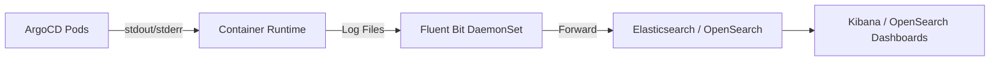

# How to Ship ArgoCD Logs to ELK/OpenSearch

Author: [nawazdhandala](https://github.com/nawazdhandala)

Tags: ArgoCD, GitOps, Kubernetes, Elasticsearch, Logging

Description: A practical guide to shipping ArgoCD logs to Elasticsearch/OpenSearch using Fluent Bit and Fluentd, with index templates and Kibana dashboards.

---

Centralizing ArgoCD logs in Elasticsearch or OpenSearch gives you powerful search, visualization, and alerting capabilities. Instead of running kubectl logs against individual pods, you can query across all ArgoCD components, set up alerts for error patterns, and build dashboards that show deployment activity over time. This guide covers the complete pipeline from ArgoCD containers to Elasticsearch/OpenSearch.

## Architecture Overview

The log shipping pipeline follows a standard Kubernetes logging pattern:



ArgoCD components write logs to stdout, the container runtime captures them as files on the node, and a log collector (Fluent Bit or Fluentd) ships them to Elasticsearch or OpenSearch.

## Prerequisites

First, configure ArgoCD to output JSON-formatted logs. This makes parsing reliable:

```yaml
# Set JSON log format for all ArgoCD components
apiVersion: v1
kind: ConfigMap
metadata:
  name: argocd-cmd-params-cm
  namespace: argocd
data:
  server.log.format: "json"
  controller.log.format: "json"
  reposerver.log.format: "json"
```

Restart ArgoCD components to apply:

```bash
kubectl rollout restart deploy -n argocd -l app.kubernetes.io/part-of=argocd
```

## Configuring Fluent Bit for ArgoCD Logs

Fluent Bit is lightweight and well-suited for shipping container logs. Here is a complete configuration for collecting ArgoCD logs:

```yaml
# Fluent Bit ConfigMap for ArgoCD log collection
apiVersion: v1
kind: ConfigMap
metadata:
  name: fluent-bit-config
  namespace: logging
data:
  fluent-bit.conf: |
    [SERVICE]
        Flush         5
        Log_Level     info
        Daemon        off
        Parsers_File  parsers.conf

    [INPUT]
        Name              tail
        Tag               kube.*
        Path              /var/log/containers/argocd-*.log
        Parser            docker
        DB                /var/log/flb_argocd.db
        Mem_Buf_Limit     10MB
        Skip_Long_Lines   On
        Refresh_Interval  10

    [FILTER]
        Name                kubernetes
        Match               kube.*
        Kube_URL            https://kubernetes.default.svc:443
        Kube_Tag_Prefix     kube.var.log.containers.
        Merge_Log           On
        Merge_Log_Key       log_processed
        K8S-Logging.Parser  On
        K8S-Logging.Exclude Off
        Labels              On
        Annotations         Off

    [FILTER]
        Name    modify
        Match   kube.*
        # Add a field to identify ArgoCD logs
        Add     source argocd
        # Rename fields for consistency
        Rename  kubernetes.container_name component
        Rename  kubernetes.pod_name pod
        Rename  kubernetes.namespace_name namespace

    [OUTPUT]
        Name            es
        Match           kube.*
        Host            elasticsearch.logging.svc.cluster.local
        Port            9200
        Index           argocd-logs
        Type            _doc
        Logstash_Format On
        Logstash_Prefix argocd-logs
        Retry_Limit     5
        # For OpenSearch, use these settings instead:
        # Suppress_Type_Name On

  parsers.conf: |
    [PARSER]
        Name        docker
        Format      json
        Time_Key    time
        Time_Format %Y-%m-%dT%H:%M:%S.%L
        Time_Keep   On

    [PARSER]
        Name        argocd-json
        Format      json
        Time_Key    time
        Time_Format %Y-%m-%dT%H:%M:%SZ
```

Deploy Fluent Bit as a DaemonSet:

```yaml
# Fluent Bit DaemonSet for ArgoCD log collection
apiVersion: apps/v1
kind: DaemonSet
metadata:
  name: fluent-bit
  namespace: logging
spec:
  selector:
    matchLabels:
      app: fluent-bit
  template:
    metadata:
      labels:
        app: fluent-bit
    spec:
      serviceAccountName: fluent-bit
      containers:
        - name: fluent-bit
          image: fluent/fluent-bit:2.2
          resources:
            requests:
              cpu: 50m
              memory: 64Mi
            limits:
              cpu: 200m
              memory: 256Mi
          volumeMounts:
            - name: varlog
              mountPath: /var/log
              readOnly: true
            - name: config
              mountPath: /fluent-bit/etc/
      volumes:
        - name: varlog
          hostPath:
            path: /var/log
        - name: config
          configMap:
            name: fluent-bit-config
```

## Using Fluentd as an Alternative

If you prefer Fluentd for its richer plugin ecosystem:

```yaml
# Fluentd ConfigMap for ArgoCD logs
apiVersion: v1
kind: ConfigMap
metadata:
  name: fluentd-config
  namespace: logging
data:
  fluent.conf: |
    # Collect ArgoCD container logs
    <source>
      @type tail
      path /var/log/containers/argocd-*.log
      pos_file /var/log/fluentd-argocd.log.pos
      tag argocd.*
      read_from_head true
      <parse>
        @type json
        time_key time
        time_format %Y-%m-%dT%H:%M:%S.%NZ
      </parse>
    </source>

    # Parse the nested JSON log message
    <filter argocd.**>
      @type parser
      key_name log
      reserve_data true
      <parse>
        @type json
      </parse>
    </filter>

    # Add metadata fields
    <filter argocd.**>
      @type record_transformer
      <record>
        cluster_name ${ENV['CLUSTER_NAME'] || 'default'}
        component ${record.dig("kubernetes", "container_name") || 'unknown'}
      </record>
    </filter>

    # Output to Elasticsearch
    <match argocd.**>
      @type elasticsearch
      host elasticsearch.logging.svc.cluster.local
      port 9200
      index_name argocd-logs
      logstash_format true
      logstash_prefix argocd-logs
      include_tag_key true
      <buffer>
        @type file
        path /var/log/fluentd-buffers/argocd
        flush_interval 10s
        chunk_limit_size 8MB
        total_limit_size 512MB
        retry_max_interval 30s
        retry_forever true
      </buffer>
    </match>
```

## Creating an Index Template

Define an index template in Elasticsearch/OpenSearch to ensure proper field mapping:

```bash
# Create an index template for ArgoCD logs
curl -X PUT "http://elasticsearch:9200/_index_template/argocd-logs" \
  -H "Content-Type: application/json" \
  -d '{
  "index_patterns": ["argocd-logs-*"],
  "template": {
    "settings": {
      "number_of_shards": 2,
      "number_of_replicas": 1,
      "index.lifecycle.name": "argocd-logs-policy",
      "index.lifecycle.rollover_alias": "argocd-logs"
    },
    "mappings": {
      "properties": {
        "level": { "type": "keyword" },
        "msg": { "type": "text", "fields": { "keyword": { "type": "keyword" } } },
        "component": { "type": "keyword" },
        "app": { "type": "keyword" },
        "time": { "type": "date" },
        "namespace": { "type": "keyword" },
        "pod": { "type": "keyword" },
        "cluster_name": { "type": "keyword" },
        "error": { "type": "text" }
      }
    }
  }
}'
```

## Setting Up Index Lifecycle Management

Configure ILM to manage log retention:

```bash
# Create an ILM policy for ArgoCD logs
curl -X PUT "http://elasticsearch:9200/_ilm/policy/argocd-logs-policy" \
  -H "Content-Type: application/json" \
  -d '{
  "policy": {
    "phases": {
      "hot": {
        "actions": {
          "rollover": {
            "max_size": "10gb",
            "max_age": "1d"
          }
        }
      },
      "warm": {
        "min_age": "7d",
        "actions": {
          "shrink": { "number_of_shards": 1 },
          "forcemerge": { "max_num_segments": 1 }
        }
      },
      "delete": {
        "min_age": "30d",
        "actions": {
          "delete": {}
        }
      }
    }
  }
}'
```

## Building Kibana Dashboards

Create saved searches and visualizations in Kibana for ArgoCD monitoring:

```bash
# Example Kibana saved search - sync errors
curl -X POST "http://kibana:5601/api/saved_objects/search/argocd-sync-errors" \
  -H "kbn-xsrf: true" \
  -H "Content-Type: application/json" \
  -d '{
  "attributes": {
    "title": "ArgoCD Sync Errors",
    "description": "All sync-related error logs from ArgoCD",
    "kibanaSavedObjectMeta": {
      "searchSourceJSON": "{\"query\":{\"bool\":{\"must\":[{\"match\":{\"level\":\"error\"}},{\"match_phrase\":{\"msg\":\"sync\"}}]}},\"index\":\"argocd-logs-*\"}"
    }
  }
}'
```

Key dashboard panels to create:

- **Error rate over time**: Line chart of error-level logs grouped by component
- **Sync activity**: Bar chart of sync-related log entries
- **Top error messages**: Data table of most frequent error messages
- **Component log volume**: Pie chart of log entries by component
- **Application activity**: Heat map of per-application log entries

## Useful Elasticsearch Queries

Here are queries to find common ArgoCD issues:

```json
// Find all sync failures in the last hour
{
  "query": {
    "bool": {
      "must": [
        { "match": { "level": "error" } },
        { "match_phrase": { "msg": "sync" } }
      ],
      "filter": {
        "range": {
          "time": { "gte": "now-1h" }
        }
      }
    }
  }
}
```

```json
// Find Git connectivity issues
{
  "query": {
    "bool": {
      "must": [
        { "match": { "component": "argocd-repo-server" } },
        { "match": { "level": "error" } }
      ],
      "should": [
        { "match_phrase": { "msg": "git" } },
        { "match_phrase": { "msg": "repository" } },
        { "match_phrase": { "msg": "clone" } }
      ],
      "minimum_should_match": 1
    }
  }
}
```

## Summary

Shipping ArgoCD logs to Elasticsearch or OpenSearch provides the visibility you need to operate ArgoCD at scale. Use JSON log format for reliable parsing, deploy Fluent Bit or Fluentd as a DaemonSet, create proper index templates and lifecycle policies, and build dashboards that surface the most important operational metrics. For alternative log destinations, see our guides on [shipping ArgoCD logs to Loki](https://oneuptime.com/blog/post/2026-02-26-argocd-logs-loki/view) and [shipping ArgoCD logs to OneUptime](https://oneuptime.com/blog/post/2026-02-26-argocd-logs-oneuptime/view).
