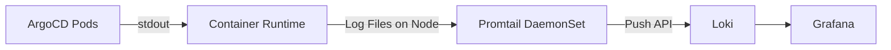

# How to Ship ArgoCD Logs to Loki

Author: [nawazdhandala](https://github.com/nawazdhandala)

Tags: ArgoCD, GitOps, Kubernetes, Loki, Logging

Description: A hands-on guide to collecting and shipping ArgoCD logs to Grafana Loki using Promtail and Grafana for visualization and alerting.

---

Grafana Loki is a popular log aggregation system designed to be cost-effective and easy to operate. Unlike Elasticsearch, Loki does not index the full text of logs - it only indexes metadata labels, making it significantly cheaper to run at scale. For ArgoCD deployments, Loki combined with Promtail provides a lightweight yet powerful logging solution that integrates naturally with Grafana dashboards.

## Architecture Overview

The logging pipeline for ArgoCD with Loki follows this pattern:



Promtail runs as a DaemonSet on each node, reads the container log files, applies labels, and pushes them to Loki. Grafana then queries Loki using LogQL for visualization and alerting.

## Prerequisites

Configure ArgoCD to output JSON-formatted logs for reliable parsing:

```yaml
# Enable JSON logging for all ArgoCD components
apiVersion: v1
kind: ConfigMap
metadata:
  name: argocd-cmd-params-cm
  namespace: argocd
data:
  server.log.format: "json"
  controller.log.format: "json"
  reposerver.log.format: "json"
```

## Installing Loki Stack with Helm

Deploy Loki, Promtail, and Grafana together:

```bash
# Add the Grafana Helm repo
helm repo add grafana https://grafana.github.io/helm-charts
helm repo update

# Install the Loki stack (Loki + Promtail + Grafana)
helm install loki grafana/loki-stack \
  --namespace logging \
  --create-namespace \
  --set grafana.enabled=true \
  --set loki.persistence.enabled=true \
  --set loki.persistence.size=50Gi
```

## Configuring Promtail for ArgoCD

Promtail needs to be configured to properly label and parse ArgoCD logs. Here is a comprehensive Promtail configuration:

```yaml
# Promtail configuration for ArgoCD log collection
apiVersion: v1
kind: ConfigMap
metadata:
  name: promtail-config
  namespace: logging
data:
  promtail.yaml: |
    server:
      http_listen_port: 9080
      grpc_listen_port: 0

    positions:
      filename: /tmp/positions.yaml

    clients:
      - url: http://loki.logging.svc.cluster.local:3100/loki/api/v1/push
        batchwait: 1s
        batchsize: 1048576
        timeout: 10s

    scrape_configs:
      # Scrape ArgoCD component logs specifically
      - job_name: argocd
        kubernetes_sd_configs:
          - role: pod
            namespaces:
              names:
                - argocd
        relabel_configs:
          # Only collect logs from ArgoCD pods
          - source_labels: [__meta_kubernetes_namespace]
            action: keep
            regex: argocd
          # Use the pod name as a label
          - source_labels: [__meta_kubernetes_pod_name]
            target_label: pod
          # Use the container name as the component label
          - source_labels: [__meta_kubernetes_pod_container_name]
            target_label: component
          # Add the node name
          - source_labels: [__meta_kubernetes_pod_node_name]
            target_label: node
          # Use app label for identifying the ArgoCD component
          - source_labels: [__meta_kubernetes_pod_label_app_kubernetes_io_name]
            target_label: app
          # Set the log file path
          - source_labels: [__meta_kubernetes_pod_uid, __meta_kubernetes_pod_container_name]
            target_label: __path__
            separator: /
            replacement: /var/log/pods/*$1/*.log

        pipeline_stages:
          # Parse the container runtime log wrapper
          - cri: {}
          # Parse the JSON log body from ArgoCD
          - json:
              expressions:
                level: level
                message: msg
                argocd_app: app
                time: time
          # Set the log level as a label for efficient filtering
          - labels:
              level:
              argocd_app:
          # Use the timestamp from ArgoCD rather than collection time
          - timestamp:
              source: time
              format: "2006-01-02T15:04:05Z"
          # Set the log line to the message field
          - output:
              source: message
```

## Deploying Promtail

Deploy Promtail using Helm with the custom config:

```bash
# Install Promtail with ArgoCD-specific configuration
helm install promtail grafana/promtail \
  --namespace logging \
  --set config.lokiAddress=http://loki.logging.svc.cluster.local:3100/loki/api/v1/push \
  -f promtail-values.yaml
```

Here is the values file:

```yaml
# promtail-values.yaml
config:
  snippets:
    # Add ArgoCD-specific scrape configuration
    extraScrapeConfigs: |
      - job_name: argocd-components
        kubernetes_sd_configs:
          - role: pod
            namespaces:
              names:
                - argocd
        relabel_configs:
          - source_labels: [__meta_kubernetes_namespace]
            action: keep
            regex: argocd
          - source_labels: [__meta_kubernetes_pod_label_app_kubernetes_io_name]
            target_label: app
          - source_labels: [__meta_kubernetes_pod_container_name]
            target_label: component
        pipeline_stages:
          - cri: {}
          - json:
              expressions:
                level: level
                message: msg
          - labels:
              level:
```

## Querying ArgoCD Logs with LogQL

LogQL is Loki's query language. Here are essential queries for ArgoCD:

### Basic Queries

```logql
# All ArgoCD server logs
{namespace="argocd", app="argocd-server"}

# All error logs from any ArgoCD component
{namespace="argocd"} |= "error" | json | level="error"

# Application controller logs for a specific app
{namespace="argocd", app="argocd-application-controller"} |= "my-app"
```

### Advanced Queries

```logql
# Sync operations with duration
{namespace="argocd", app="argocd-application-controller"}
  | json
  | msg=~".*sync.*"
  | line_format "{{.app}}: {{.msg}}"

# Error rate per component over 5 minutes
sum by (app) (
  rate({namespace="argocd"} | json | level="error" [5m])
)

# Top 10 most frequently failing applications
topk(10,
  sum by (argocd_app) (
    count_over_time({namespace="argocd", level="error"} [1h])
  )
)

# Git operation failures
{namespace="argocd", component="argocd-repo-server"}
  | json
  | level="error"
  | msg=~".*git.*|.*repository.*|.*clone.*"

# Deployment frequency per application
sum by (argocd_app) (
  count_over_time(
    {namespace="argocd", app="argocd-application-controller"}
    | json
    | msg=~".*sync completed.*" [24h]
  )
)
```

## Building Grafana Dashboards

Create a Grafana dashboard for ArgoCD log monitoring. Here is a JSON dashboard definition:

```json
{
  "dashboard": {
    "title": "ArgoCD Logs",
    "panels": [
      {
        "title": "Log Volume by Component",
        "type": "timeseries",
        "targets": [
          {
            "expr": "sum by (app) (rate({namespace=\"argocd\"} [5m]))",
            "legendFormat": "{{app}}"
          }
        ]
      },
      {
        "title": "Error Rate",
        "type": "timeseries",
        "targets": [
          {
            "expr": "sum by (app) (rate({namespace=\"argocd\"} | json | level=\"error\" [5m]))",
            "legendFormat": "{{app}}"
          }
        ]
      },
      {
        "title": "Recent Errors",
        "type": "logs",
        "targets": [
          {
            "expr": "{namespace=\"argocd\"} | json | level=\"error\""
          }
        ]
      }
    ]
  }
}
```

## Setting Up Alerts

Configure Grafana alerting rules for ArgoCD log anomalies:

```yaml
# Loki ruler configuration for ArgoCD alerts
apiVersion: v1
kind: ConfigMap
metadata:
  name: loki-alerting-rules
  namespace: logging
data:
  argocd-rules.yaml: |
    groups:
      - name: argocd-log-alerts
        rules:
          - alert: ArgoCD_HighErrorRate
            expr: |
              sum(rate({namespace="argocd"} | json | level="error" [5m])) > 0.5
            for: 5m
            labels:
              severity: warning
            annotations:
              summary: "ArgoCD error rate is high"
              description: "More than 0.5 errors per second across ArgoCD components"

          - alert: ArgoCD_SyncFailures
            expr: |
              sum(count_over_time(
                {namespace="argocd", app="argocd-application-controller"}
                | json
                | msg=~".*sync.*failed.*" [10m]
              )) > 5
            for: 5m
            labels:
              severity: critical
            annotations:
              summary: "Multiple ArgoCD sync failures detected"

          - alert: ArgoCD_GitConnectivityIssue
            expr: |
              sum(count_over_time(
                {namespace="argocd", component="argocd-repo-server"}
                | json
                | level="error"
                | msg=~".*git.*|.*repository.*" [5m]
              )) > 3
            for: 5m
            labels:
              severity: critical
            annotations:
              summary: "ArgoCD Git connectivity issues detected"
```

## Multi-Tenant Label Configuration

If you run ArgoCD for multiple teams, add team labels to the logs:

```yaml
# Promtail relabeling for multi-tenant ArgoCD
pipeline_stages:
  - cri: {}
  - json:
      expressions:
        level: level
        message: msg
        argocd_app: app
  - labels:
      level:
      argocd_app:
  # Extract team from application name prefix
  - regex:
      expression: "^(?P<team>[^-]+)-.*"
      source: argocd_app
  - labels:
      team:
```

## Retention and Storage Optimization

Configure Loki retention to manage storage costs:

```yaml
# Loki configuration with retention
loki:
  config:
    compactor:
      retention_enabled: true
      retention_delete_delay: 2h
      compaction_interval: 10m
    limits_config:
      retention_period: 30d
      max_query_length: 721h
    schema_config:
      configs:
        - from: 2024-01-01
          store: boltdb-shipper
          object_store: s3
          schema: v12
          index:
            prefix: argocd_index_
            period: 24h
```

## Summary

Shipping ArgoCD logs to Loki provides a cost-effective centralized logging solution. Use JSON log format from ArgoCD, configure Promtail to properly label and parse the logs, and leverage LogQL for powerful queries. Build Grafana dashboards for operational visibility and set up alerting rules to catch issues early. Loki's label-based indexing keeps storage costs low while still providing the query power you need for effective troubleshooting. For related guides, see [configuring ArgoCD component log levels](https://oneuptime.com/blog/post/2026-02-26-argocd-component-log-levels/view) and [correlating ArgoCD logs with application logs](https://oneuptime.com/blog/post/2026-02-26-argocd-correlate-application-logs/view).
