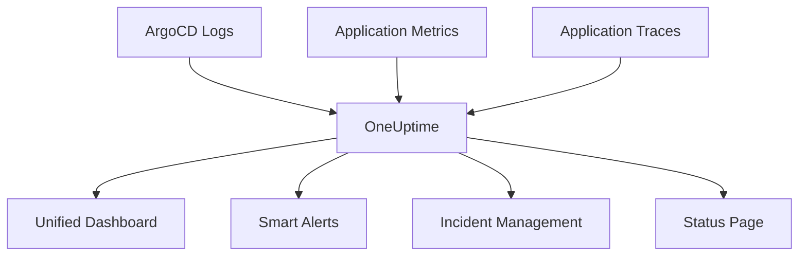

# How to Ship ArgoCD Logs to OneUptime

Author: [nawazdhandala](https://github.com/nawazdhandala)

Tags: ArgoCD, GitOps, Kubernetes, OneUptime, Logging

Description: Learn how to ship ArgoCD logs to OneUptime for centralized log management, alerting, and correlation with your application monitoring data.

---

OneUptime provides a unified observability platform that combines monitoring, incident management, status pages, and log management. Shipping your ArgoCD logs to OneUptime lets you correlate deployment events with application performance, set up smart alerts for deployment failures, and maintain a single pane of glass for your entire operations workflow. This guide covers how to configure the complete log pipeline from ArgoCD to OneUptime.

## Why Ship ArgoCD Logs to OneUptime

The key advantage of using OneUptime for ArgoCD logs is correlation. When a deployment causes a performance regression or an incident, you can see the ArgoCD sync logs alongside your application metrics and traces - all in one place. This dramatically reduces mean time to resolution (MTTR) because you do not have to switch between multiple tools to understand what happened.



## Prerequisites

Before setting up log shipping, you need:

1. A OneUptime account with log ingestion enabled
2. A OneUptime API key or service token
3. ArgoCD configured with JSON log format

Configure ArgoCD for JSON logging:

```yaml
# Enable JSON log format on all ArgoCD components
apiVersion: v1
kind: ConfigMap
metadata:
  name: argocd-cmd-params-cm
  namespace: argocd
data:
  server.log.format: "json"
  controller.log.format: "json"
  reposerver.log.format: "json"
```

## Setting Up the OneUptime Log Ingestion Endpoint

OneUptime accepts logs via its OpenTelemetry-compatible endpoint. Create a Kubernetes secret with your OneUptime credentials:

```yaml
# Create a secret for OneUptime credentials
apiVersion: v1
kind: Secret
metadata:
  name: oneuptime-credentials
  namespace: logging
type: Opaque
stringData:
  api-key: "your-oneuptime-api-key-here"
  endpoint: "https://oneuptime.com/otlp"
```

## Using OpenTelemetry Collector

The recommended approach is to use the OpenTelemetry Collector to ship logs from ArgoCD to OneUptime. This provides a vendor-neutral pipeline with rich processing capabilities.

Deploy the OpenTelemetry Collector:

```yaml
# OpenTelemetry Collector configuration for ArgoCD logs to OneUptime
apiVersion: v1
kind: ConfigMap
metadata:
  name: otel-collector-config
  namespace: logging
data:
  collector.yaml: |
    receivers:
      # Receive logs from Fluent Bit
      otlp:
        protocols:
          grpc:
            endpoint: 0.0.0.0:4317
          http:
            endpoint: 0.0.0.0:4318

      # Alternatively, collect directly from files
      filelog:
        include:
          - /var/log/pods/argocd_argocd-server-*/argocd-server/*.log
          - /var/log/pods/argocd_argocd-application-controller-*/argocd-application-controller/*.log
          - /var/log/pods/argocd_argocd-repo-server-*/argocd-repo-server/*.log
        operators:
          # Parse container runtime format
          - type: regex_parser
            regex: '^(?P<time>[^ ]+) (?P<stream>stdout|stderr) (?P<flags>[^ ]*) (?P<log>.*)$'
            timestamp:
              parse_from: attributes.time
              layout: '%Y-%m-%dT%H:%M:%S.%LZ'
          # Parse the JSON log body
          - type: json_parser
            parse_from: attributes.log
            timestamp:
              parse_from: attributes.time
              layout: '%Y-%m-%dT%H:%M:%SZ'

    processors:
      batch:
        send_batch_size: 1000
        timeout: 10s

      # Add resource attributes for OneUptime
      resource:
        attributes:
          - key: service.name
            value: argocd
            action: upsert
          - key: service.namespace
            value: argocd
            action: upsert

      # Add ArgoCD component identification
      attributes:
        actions:
          - key: argocd.component
            from_attribute: component
            action: upsert

    exporters:
      otlphttp:
        endpoint: "https://oneuptime.com/otlp"
        headers:
          x-oneuptime-token: "${ONEUPTIME_API_KEY}"

    service:
      pipelines:
        logs:
          receivers: [filelog]
          processors: [resource, attributes, batch]
          exporters: [otlphttp]
```

Deploy the collector:

```yaml
# OpenTelemetry Collector DaemonSet
apiVersion: apps/v1
kind: DaemonSet
metadata:
  name: otel-collector
  namespace: logging
spec:
  selector:
    matchLabels:
      app: otel-collector
  template:
    metadata:
      labels:
        app: otel-collector
    spec:
      serviceAccountName: otel-collector
      containers:
        - name: otel-collector
          image: otel/opentelemetry-collector-contrib:0.92.0
          args:
            - --config=/etc/otel/collector.yaml
          env:
            - name: ONEUPTIME_API_KEY
              valueFrom:
                secretKeyRef:
                  name: oneuptime-credentials
                  key: api-key
          volumeMounts:
            - name: config
              mountPath: /etc/otel
            - name: varlog
              mountPath: /var/log
              readOnly: true
          resources:
            requests:
              cpu: 100m
              memory: 128Mi
            limits:
              cpu: 500m
              memory: 512Mi
      volumes:
        - name: config
          configMap:
            name: otel-collector-config
        - name: varlog
          hostPath:
            path: /var/log
```

## Using Fluent Bit with OneUptime

As an alternative, you can use Fluent Bit to ship logs to OneUptime via its OpenTelemetry endpoint:

```yaml
# Fluent Bit configuration for shipping to OneUptime
apiVersion: v1
kind: ConfigMap
metadata:
  name: fluent-bit-config
  namespace: logging
data:
  fluent-bit.conf: |
    [SERVICE]
        Flush         5
        Log_Level     info
        Parsers_File  parsers.conf

    [INPUT]
        Name              tail
        Tag               argocd.*
        Path              /var/log/containers/argocd-*.log
        Parser            cri
        DB                /var/log/flb_argocd.db
        Mem_Buf_Limit     10MB

    [FILTER]
        Name          kubernetes
        Match         argocd.*
        Kube_URL      https://kubernetes.default.svc:443
        Merge_Log     On
        Labels        On

    [FILTER]
        Name          modify
        Match         argocd.*
        Add           service.name argocd

    [OUTPUT]
        Name                 opentelemetry
        Match                argocd.*
        Host                 oneuptime.com
        Port                 443
        Header               x-oneuptime-token ${ONEUPTIME_API_KEY}
        Logs_uri             /otlp/v1/logs
        Tls                  On
        Tls.verify           On
        Log_response_payload On

  parsers.conf: |
    [PARSER]
        Name        cri
        Format      regex
        Regex       ^(?<time>[^ ]+) (?<stream>stdout|stderr) (?<logtag>[^ ]*) (?<log>.*)$
        Time_Key    time
        Time_Format %Y-%m-%dT%H:%M:%S.%L%z
```

## Enriching Logs with Deployment Context

Add deployment-related metadata to make logs more useful in OneUptime:

```yaml
# Add deployment context to ArgoCD logs
processors:
  attributes:
    actions:
      - key: deployment.environment
        value: production
        action: upsert
      - key: deployment.cluster
        value: us-east-1-prod
        action: upsert
      - key: argocd.version
        value: "2.10"
        action: upsert
```

## Setting Up Alerts in OneUptime

Once logs are flowing into OneUptime, configure alerts for critical ArgoCD events:

1. **Sync Failure Alert**: Trigger when error-level logs contain "sync failed" or "ComparisonError"
2. **Git Connectivity Alert**: Trigger when repo-server logs contain repeated Git errors
3. **High Error Rate Alert**: Trigger when error log volume exceeds a threshold over 5 minutes
4. **Health Degradation Alert**: Trigger when controller logs report applications as Degraded

These alerts can automatically create incidents in OneUptime's incident management system, update your status page, and notify on-call engineers.

## Correlating ArgoCD Logs with Application Data

The real power of OneUptime comes from correlation. When you ship both ArgoCD logs and application telemetry to OneUptime:

- **Timeline view**: See deployment events alongside performance metrics
- **Incident correlation**: Automatically link deployments to incidents
- **Root cause analysis**: Quickly determine if a deployment caused a regression

Tag your ArgoCD logs with application identifiers that match your application telemetry:

```yaml
# Ensure application names match between ArgoCD and application telemetry
processors:
  attributes:
    actions:
      - key: service.name
        from_attribute: argocd_app
        action: upsert
```

## Verifying Log Ingestion

After configuring the pipeline, verify logs are arriving in OneUptime:

```bash
# Check the collector is running and sending logs
kubectl logs -n logging daemonset/otel-collector --tail=20

# Verify no errors in the collector
kubectl logs -n logging daemonset/otel-collector | grep -i error

# Generate a test event by syncing an ArgoCD app
argocd app sync my-test-app
```

Then check OneUptime's log explorer to confirm ArgoCD logs are visible and properly structured.

## Summary

Shipping ArgoCD logs to OneUptime provides a unified observability experience where deployment logs, application metrics, and incident management live together. Use the OpenTelemetry Collector or Fluent Bit to ship logs, enrich them with deployment context, and set up alerts that connect to OneUptime's incident management workflow. The correlation between deployment events and application performance is what makes this integration particularly valuable. For more on ArgoCD logging, see our guides on [configuring ArgoCD log levels](https://oneuptime.com/blog/post/2026-02-26-argocd-component-log-levels/view) and [correlating ArgoCD logs with application logs](https://oneuptime.com/blog/post/2026-02-26-argocd-correlate-application-logs/view).
