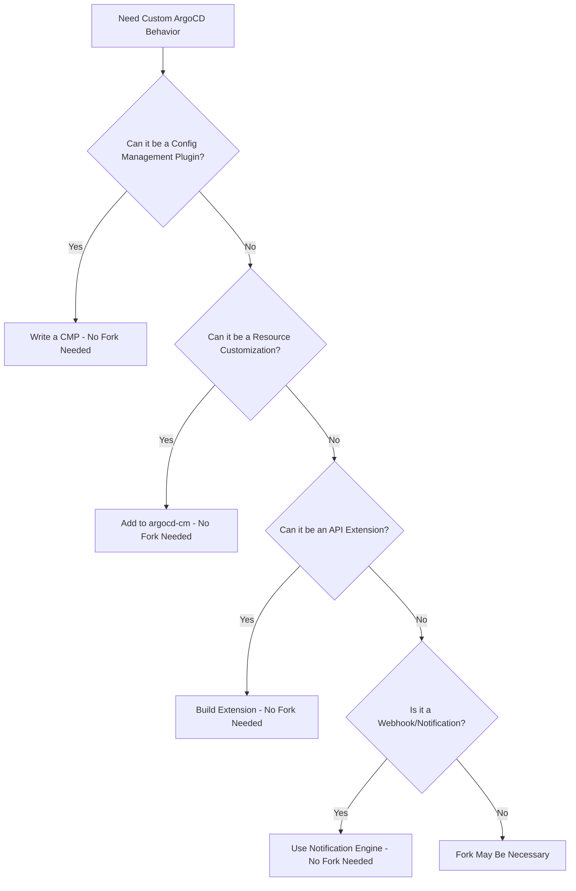

# How to Maintain an Internal ArgoCD Fork

Author: [nawazdhandala](https://github.com/nawazdhandala)

Tags: ArgoCD, GitOps, Kubernetes, Enterprise, Development

Description: Learn how to maintain an internal fork of ArgoCD with custom patches, automated upstream syncing, and proper release management for enterprise environments.

---

Many organizations need to run a modified version of ArgoCD. Whether it is for custom authentication integrations, proprietary features, security patches ahead of upstream releases, or compliance requirements that demand specific changes, maintaining an internal fork is sometimes unavoidable. This guide covers the strategies and processes for keeping an internal ArgoCD fork healthy, maintainable, and as close to upstream as possible.

## When to Fork vs When to Extend

Before committing to a fork, consider whether your needs can be met through ArgoCD's extension points.



A fork should be the last resort. Every custom patch you maintain is technical debt that increases the cost of upgrading. Situations where forking genuinely makes sense include:

- Custom SSO/authentication that cannot be achieved through Dex configuration
- Internal API integrations that require changes to the ArgoCD server
- Security hardening that goes beyond what upstream provides
- Regulatory requirements that mandate specific code changes
- Performance patches that have not yet been merged upstream

## Setting Up the Fork

Start by creating a proper fork structure that makes it easy to track upstream changes.

```bash
# Create your organization's fork on GitHub (or your internal Git hosting)
# Then clone it locally
git clone https://github.com/YOUR_ORG/argo-cd.git
cd argo-cd

# Add upstream as a remote
git remote add upstream https://github.com/argoproj/argo-cd.git

# Fetch all upstream branches and tags
git fetch upstream --tags

# Verify your remotes
git remote -v
# origin    https://github.com/YOUR_ORG/argo-cd.git (fetch)
# origin    https://github.com/YOUR_ORG/argo-cd.git (push)
# upstream  https://github.com/argoproj/argo-cd.git (fetch)
# upstream  https://github.com/argoproj/argo-cd.git (push)
```

## Branch Strategy

A clean branch strategy is critical for long-term fork maintenance. Here is a proven approach.

```bash
# Track the upstream release branches
git checkout -b upstream-v2.10 upstream/release-2.10

# Create your custom branch based on the upstream release
git checkout -b custom-v2.10 upstream/release-2.10

# Apply your custom patches on top
git cherry-pick <commit-hash-1>  # Custom SSO integration
git cherry-pick <commit-hash-2>  # Internal API changes
git cherry-pick <commit-hash-3>  # Security hardening
```

Maintain a clear naming convention.

```text
upstream-v2.10     - Mirror of upstream release-2.10 (never modify)
custom-v2.10       - Your customized version based on v2.10
custom-patches     - Your patches as individual commits (for cherry-picking)
```

## Managing Custom Patches

Keep your custom changes as isolated, well-documented commits. This makes rebasing onto new upstream versions significantly easier.

```bash
# Create a patches directory to track your changes
mkdir -p .internal/patches

# Document each patch
cat > .internal/patches/001-custom-sso.md << 'EOF'
# Patch 001: Custom SSO Integration

## Purpose
Integrates with our internal OAuth2 provider that requires
custom claim mapping not supported by Dex.

## Files Modified
- server/account/account.go
- server/session/session.go
- util/oidc/oidc.go

## Upstream Issue
https://github.com/argoproj/argo-cd/issues/XXXXX
(Submitted PR, pending review)

## Last Updated
2024-01-15 (based on v2.10.2)
EOF
```

Generate patch files for easy reapplication.

```bash
# Generate patches from your custom commits
# Assuming your custom commits are on top of the upstream base
git format-patch upstream/release-2.10..custom-v2.10 -o .internal/patches/

# This creates numbered patch files:
# .internal/patches/0001-custom-sso-integration.patch
# .internal/patches/0002-internal-api-changes.patch
# .internal/patches/0003-security-hardening.patch
```

## Syncing with Upstream

Regularly sync your fork with upstream releases. This is the most important and often most painful part of fork maintenance.

```bash
# Fetch latest upstream changes
git fetch upstream --tags

# When a new upstream release is available (e.g., v2.10.3)
# First, update your upstream tracking branch
git checkout upstream-v2.10
git merge upstream/release-2.10

# Now rebase your custom branch onto the updated upstream
git checkout custom-v2.10
git rebase upstream/release-2.10
```

When conflicts occur during rebase, resolve them carefully.

```bash
# If a conflict occurs during rebase
# 1. Check which files are conflicting
git status

# 2. Resolve conflicts in each file
# 3. Continue the rebase
git add <resolved-files>
git rebase --continue

# If a patch no longer applies cleanly, you may need to
# re-implement it against the new code
```

## Automated Upstream Sync Pipeline

Automate the sync process to catch conflicts early.

```yaml
# .github/workflows/upstream-sync.yaml
name: Upstream Sync Check

on:
  schedule:
    - cron: '0 6 * * 1'  # Every Monday at 6 AM
  workflow_dispatch:

jobs:
  sync-check:
    runs-on: ubuntu-latest
    steps:
      - uses: actions/checkout@v4
        with:
          fetch-depth: 0

      - name: Fetch upstream
        run: |
          git remote add upstream https://github.com/argoproj/argo-cd.git
          git fetch upstream --tags

      - name: Check for new releases
        run: |
          LATEST=$(git tag -l 'v2.10.*' --sort=-version:refname | head -1)
          CURRENT=$(git describe --tags --abbrev=0)
          if [ "$LATEST" != "$CURRENT" ]; then
            echo "New upstream release available: $LATEST (current: $CURRENT)"
            echo "NEW_RELEASE=$LATEST" >> $GITHUB_ENV
          fi

      - name: Test rebase
        if: env.NEW_RELEASE != ''
        run: |
          git checkout custom-v2.10
          # Attempt a dry-run rebase
          git rebase --onto $NEW_RELEASE upstream/release-2.10 custom-v2.10 || {
            echo "CONFLICT: Rebase failed. Manual intervention needed."
            git rebase --abort
            exit 1
          }

      - name: Notify team
        if: failure()
        uses: slackapi/slack-github-action@v1
        with:
          payload: |
            {
              "text": "ArgoCD upstream sync failed. New release ${{ env.NEW_RELEASE }} has conflicts with our patches."
            }
```

## Building and Releasing Your Fork

Set up a CI pipeline to build and test your custom ArgoCD images.

```yaml
# .github/workflows/build-custom.yaml
name: Build Custom ArgoCD

on:
  push:
    branches: [custom-v2.10]
  tags: ['v*-custom*']

jobs:
  build:
    runs-on: ubuntu-latest
    steps:
      - uses: actions/checkout@v4

      - name: Set up Go
        uses: actions/setup-go@v5
        with:
          go-version: '1.21'

      - name: Run tests
        run: make test-local

      - name: Build images
        run: |
          IMAGE_TAG=${GITHUB_REF_NAME}-custom
          make image IMAGE_TAG=$IMAGE_TAG

      - name: Push to registry
        run: |
          docker tag argoproj/argocd:$IMAGE_TAG registry.internal.company.com/argocd:$IMAGE_TAG
          docker push registry.internal.company.com/argocd:$IMAGE_TAG
```

## Version Tagging Strategy

Use a clear tagging scheme that indicates both the upstream version and your custom version.

```bash
# Tag format: v<upstream-version>-custom.<patch-number>
git tag v2.10.2-custom.1
git tag v2.10.2-custom.2  # After applying additional patches
git tag v2.10.3-custom.1  # After syncing to upstream v2.10.3
```

## Minimizing Fork Divergence

The best fork strategy is to minimize the fork itself. Here is how to reduce divergence over time.

**Contribute upstream.** For every custom patch, submit a PR to the upstream project. If accepted, you can remove the patch from your fork.

```bash
# Track which patches have been submitted upstream
cat > .internal/patches/STATUS.md << 'EOF'
| Patch | Description | Upstream PR | Status |
|-------|-------------|-------------|--------|
| 001   | Custom SSO  | #15234      | Review |
| 002   | API changes | N/A         | Internal only |
| 003   | Security    | #15567      | Merged in v2.11 |
EOF
```

**Use runtime configuration when possible.** Many customizations that seem to require code changes can be achieved through ConfigMaps, environment variables, or plugins.

**Isolate changes.** Keep custom code in separate packages where possible. This reduces merge conflicts when syncing with upstream.

```go
// internal/customauth/handler.go
// Keep custom code in its own package
package customauth

import (
    "github.com/argoproj/argo-cd/v2/server/session"
)

// CustomAuthHandler wraps the standard session manager
// with our internal OAuth2 provider integration
type CustomAuthHandler struct {
    delegate session.SessionManager
    // custom fields
}
```

Maintaining an internal fork is significant ongoing work. Weigh the cost carefully against alternatives like Config Management Plugins, extensions, and contributing features upstream. When a fork is truly necessary, disciplined patch management and automated upstream sync processes make the difference between a manageable fork and an unmaintainable mess. For monitoring your custom ArgoCD builds in production, see our guide on [running ArgoCD E2E tests locally](https://oneuptime.com/blog/post/2026-02-26-argocd-e2e-tests-locally/view).
