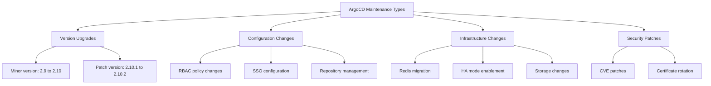

# How to Plan ArgoCD Maintenance Windows

Author: [nawazdhandala](https://github.com/nawazdhandala)

Tags: ArgoCD, GitOps, Kubernetes, Maintenance Windows, Operations

Description: Learn how to plan and implement maintenance windows for ArgoCD, including sync windows, upgrade procedures, and communication strategies for operations teams.

---

Maintenance windows are scheduled periods when you perform upgrades, configuration changes, or infrastructure work on ArgoCD itself. Unlike application sync windows (which control when ArgoCD can deploy to clusters), ArgoCD maintenance windows are about maintaining the GitOps platform itself. This guide covers how to plan, communicate, and execute ArgoCD maintenance safely.

## Understanding Maintenance Window Types

There are several types of maintenance you might need to perform on ArgoCD.



## Planning the Maintenance Window

### Step 1: Determine the Scope and Risk

Not all maintenance is equal. Classify the maintenance type.

| Maintenance Type | Risk Level | Expected Downtime | Sync Window Needed |
|-----------------|------------|-------------------|-------------------|
| Patch upgrade (2.10.1 to 2.10.2) | Low | < 2 minutes | Optional |
| Minor upgrade (2.9 to 2.10) | Medium | 5 to 15 minutes | Yes |
| Major upgrade (2.x to 3.x) | High | 15 to 60 minutes | Yes |
| Config change (RBAC) | Low | None (live reload) | No |
| SSO configuration | Medium | 2 to 5 minutes | Optional |
| HA mode enablement | Medium | 5 to 10 minutes | Yes |
| Redis migration | High | 10 to 30 minutes | Yes |

### Step 2: Schedule the Window

Choose a time that minimizes impact.

```bash
# Check when syncs are most active
# Query Prometheus for sync activity by hour
# This helps identify low-activity periods

# Check for any existing sync windows
kubectl get appprojects -n argocd -o json | \
  jq -r '.items[] | select(.spec.syncWindows != null) | "\(.metadata.name): \(.spec.syncWindows)"'
```

### Step 3: Create a Sync Window to Block Deploys

During ArgoCD maintenance, block all application syncs.

```yaml
# Apply a deny-all sync window during maintenance
apiVersion: argoproj.io/v1alpha1
kind: AppProject
metadata:
  name: default
  namespace: argocd
spec:
  syncWindows:
    # Block syncs during the maintenance window
    # Schedule: Saturday 2 AM for 2 hours
    - kind: deny
      schedule: '0 2 * * 6'
      duration: 2h
      applications:
        - '*'
      clusters:
        - '*'
      namespaces:
        - '*'
      manualSync: true  # Also block manual syncs
```

For an immediate one-time block, apply and remove it manually.

```bash
# Add a deny window that starts now and lasts 2 hours
# Calculate the cron expression for the current time
CURRENT_MIN=$(date +%M)
CURRENT_HOUR=$(date +%H)
CURRENT_DOW=$(date +%u)

kubectl patch appproject default -n argocd --type merge -p "{
  \"spec\": {
    \"syncWindows\": [{
      \"kind\": \"deny\",
      \"schedule\": \"$CURRENT_MIN $CURRENT_HOUR * * *\",
      \"duration\": \"2h\",
      \"applications\": [\"*\"],
      \"manualSync\": true
    }]
  }
}"
```

## Executing ArgoCD Maintenance

### Procedure: Minor Version Upgrade

```bash
#!/bin/bash
# argocd-upgrade.sh

TARGET_VERSION="v2.10.0"
echo "=== ArgoCD Upgrade to $TARGET_VERSION ==="

# Step 1: Pre-flight checks
echo "Step 1: Pre-flight checks"
kubectl get pods -n argocd
argocd version
CURRENT_APP_COUNT=$(argocd app list -o json | jq length)
echo "Current application count: $CURRENT_APP_COUNT"

# Step 2: Create backup
echo "Step 2: Creating backup"
BACKUP_DIR="argocd-backup-$(date +%Y%m%d-%H%M%S)"
mkdir -p "$BACKUP_DIR"
kubectl get configmap argocd-cm -n argocd -o yaml > "$BACKUP_DIR/argocd-cm.yaml"
kubectl get configmap argocd-rbac-cm -n argocd -o yaml > "$BACKUP_DIR/argocd-rbac-cm.yaml"
kubectl get secret argocd-secret -n argocd -o yaml > "$BACKUP_DIR/argocd-secret.yaml"
kubectl get applications -n argocd -o yaml > "$BACKUP_DIR/applications.yaml"
kubectl get appprojects -n argocd -o yaml > "$BACKUP_DIR/appprojects.yaml"
echo "Backup saved to $BACKUP_DIR"

# Step 3: Apply the upgrade
echo "Step 3: Applying upgrade"
kubectl apply -n argocd -f "https://raw.githubusercontent.com/argoproj/argo-cd/$TARGET_VERSION/manifests/install.yaml"

# Step 4: Wait for rollout
echo "Step 4: Waiting for rollout"
kubectl rollout status deployment/argocd-server -n argocd --timeout=300s
kubectl rollout status deployment/argocd-repo-server -n argocd --timeout=300s
kubectl rollout status statefulset/argocd-application-controller -n argocd --timeout=300s

# Step 5: Verify
echo "Step 5: Verifying"
argocd version
NEW_APP_COUNT=$(argocd app list -o json | jq length)
echo "Application count after upgrade: $NEW_APP_COUNT"

if [ "$CURRENT_APP_COUNT" = "$NEW_APP_COUNT" ]; then
  echo "Application count matches. Upgrade successful."
else
  echo "WARNING: Application count changed! Before: $CURRENT_APP_COUNT, After: $NEW_APP_COUNT"
fi

# Step 6: Check for unhealthy apps
UNHEALTHY=$(argocd app list -o json | jq '[.[] | select(.status.health.status != "Healthy")] | length')
echo "Unhealthy applications: $UNHEALTHY"

echo "=== Upgrade Complete ==="
```

### Procedure: Configuration Change

For configuration changes that do not require restarts.

```bash
# RBAC changes - live reload
kubectl patch configmap argocd-rbac-cm -n argocd --type merge -p '{
  "data": {
    "policy.csv": "p, role:new-team, applications, get, */*, allow\ng, new-team-group, role:new-team"
  }
}'
# ArgoCD picks up RBAC changes automatically - no restart needed
```

For changes that require restarts.

```bash
# Changes to argocd-cm that require restart
kubectl patch configmap argocd-cm -n argocd --type merge -p '{
  "data": {
    "url": "https://argocd-new.example.com"
  }
}'

# Rolling restart - minimal downtime with multiple replicas
kubectl rollout restart deployment/argocd-server -n argocd
kubectl rollout status deployment/argocd-server -n argocd
```

## Communication Plan

### Before Maintenance

Send notifications to stakeholders before the maintenance window.

```yaml
# ArgoCD notification for upcoming maintenance
# Use a Kubernetes Job to send notifications
apiVersion: batch/v1
kind: Job
metadata:
  name: maintenance-notification
  namespace: argocd
spec:
  template:
    spec:
      containers:
        - name: notify
          image: curlimages/curl:8.4.0
          command:
            - /bin/sh
            - -c
            - |
              curl -X POST "https://hooks.slack.com/services/xxx/yyy/zzz" \
                -H "Content-Type: application/json" \
                -d '{
                  "text": "ArgoCD Maintenance Window\nDate: Saturday 2 AM to 4 AM UTC\nScope: Version upgrade to v2.10.0\nImpact: Syncs will be blocked during the window\nContact: #platform-team"
                }'
      restartPolicy: Never
```

### During Maintenance

Keep a status page or Slack channel updated.

```bash
# Quick status check to share
echo "ArgoCD Maintenance Status:"
echo "  Pods: $(kubectl get pods -n argocd --no-headers | grep Running | wc -l) running"
echo "  Version: $(argocd version --client --short)"
echo "  Apps: $(argocd app list -o json 2>/dev/null | jq length || echo 'N/A - upgrade in progress')"
```

### After Maintenance

Confirm completion and remove sync windows.

```bash
# Remove the maintenance sync window
kubectl patch appproject default -n argocd --type merge -p '{
  "spec": {
    "syncWindows": null
  }
}'

# Send completion notification
echo "ArgoCD maintenance completed. All systems operational."
echo "  Version: $(argocd version --server --short)"
echo "  Apps: $(argocd app list -o json | jq length) total"
echo "  Healthy: $(argocd app list -o json | jq '[.[] | select(.status.health.status == "Healthy")] | length')"
```

## Rollback Plan

Always have a rollback plan before maintenance.

### Rollback for Version Upgrades

```bash
# Apply the previous version's manifests
PREVIOUS_VERSION="v2.9.5"
kubectl apply -n argocd -f "https://raw.githubusercontent.com/argoproj/argo-cd/$PREVIOUS_VERSION/manifests/install.yaml"

# Wait for rollback
kubectl rollout status deployment/argocd-server -n argocd --timeout=300s

# Restore configuration if needed
kubectl apply -f "$BACKUP_DIR/argocd-cm.yaml"
kubectl apply -f "$BACKUP_DIR/argocd-rbac-cm.yaml"
```

### Rollback for Configuration Changes

```bash
# Apply backed-up configuration
kubectl apply -f "$BACKUP_DIR/argocd-cm.yaml"
kubectl rollout restart deployment/argocd-server -n argocd
```

## Recurring Maintenance Schedule

Establish a regular maintenance cadence.

```yaml
# Example maintenance schedule
# Weekly: Review ArgoCD logs and metrics (no downtime)
# Monthly: Apply security patches (< 5 min downtime)
# Quarterly: Minor version upgrade (15 min window)
# Annually: Major infrastructure changes (60 min window)
```

## Post-Maintenance Validation

Run a comprehensive check after every maintenance window.

```bash
#!/bin/bash
# post-maintenance-check.sh
echo "=== Post-Maintenance Validation ==="

# ArgoCD health
echo "1. ArgoCD Component Health"
kubectl get pods -n argocd -o wide
echo ""

# API connectivity
echo "2. API Connectivity"
argocd version
echo ""

# Cluster connections
echo "3. Cluster Connections"
argocd cluster list
echo ""

# Repository access
echo "4. Repository Access"
argocd repo list 2>/dev/null | head -10
echo ""

# Application health summary
echo "5. Application Health"
argocd app list -o json | jq -r 'group_by(.status.health.status) | map({health: .[0].status.health.status, count: length})'
echo ""

# Sync status summary
echo "6. Sync Status"
argocd app list -o json | jq -r 'group_by(.status.sync.status) | map({sync: .[0].status.sync.status, count: length})'
echo ""

# Check for recent errors
echo "7. Recent Errors"
kubectl logs deployment/argocd-application-controller -n argocd --since=30m | grep -i error | tail -5
echo ""

echo "=== Validation Complete ==="
```

## Summary

Planning ArgoCD maintenance windows involves classifying the risk level, scheduling during low-activity periods, blocking syncs with deny windows, communicating with stakeholders, and having a tested rollback plan. For version upgrades, always back up configuration first, apply the new manifests, wait for rollout completion, and validate that all applications remain healthy. Remove sync windows after maintenance and send completion notifications. Establish a recurring maintenance cadence - monthly for patches, quarterly for minor upgrades - so maintenance becomes routine rather than exceptional.
