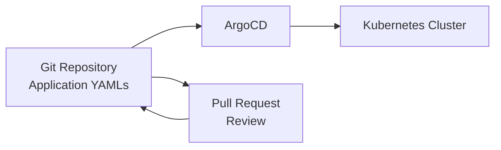

# How to Manage ArgoCD Applications Declaratively

Author: [nawazdhandala](https://github.com/nawazdhandala)

Tags: ArgoCD, GitOps, Kubernetes, Declarative, Infrastructure as Code

Description: Learn how to manage ArgoCD applications declaratively using YAML manifests stored in Git, replacing manual UI and CLI operations with version-controlled configuration.

---

Managing ArgoCD applications through the UI or CLI works for getting started, but it does not scale. Every application you create manually is a piece of configuration that exists only in ArgoCD's internal state - not in Git. That is ironic for a GitOps tool. The solution is to manage your ArgoCD Application resources declaratively, treating them as Kubernetes manifests that live in your Git repository.

## Why Declarative Application Management

When you create an application through the ArgoCD UI or CLI, the configuration is stored as a Kubernetes custom resource in the ArgoCD namespace. If you lose that namespace or need to rebuild your ArgoCD installation, those application definitions are gone.

Declarative management means writing Application YAML files, storing them in Git, and letting ArgoCD (or kubectl) apply them. This gives you:

- **Version control** for all application definitions
- **Code review** before changes to deployment configurations
- **Disaster recovery** since you can recreate everything from Git
- **Consistency** across environments
- **Audit trail** through Git history



## Your First Declarative Application

An ArgoCD Application is a Kubernetes custom resource. You define it in YAML just like any other Kubernetes resource:

```yaml
# applications/my-web-app.yaml
apiVersion: argoproj.io/v1alpha1
kind: Application
metadata:
  name: my-web-app
  namespace: argocd
  # Finalizer ensures resources are cleaned up on deletion
  finalizers:
    - resources-finalizer.argocd.argoproj.io
spec:
  project: default
  source:
    repoURL: https://github.com/myorg/my-web-app.git
    targetRevision: main
    path: k8s/overlays/production
  destination:
    server: https://kubernetes.default.svc
    namespace: web-app
  syncPolicy:
    automated:
      prune: true
      selfHeal: true
    syncOptions:
      - CreateNamespace=true
```

Apply it with kubectl:

```bash
kubectl apply -f applications/my-web-app.yaml
```

ArgoCD immediately picks up the Application resource and begins managing the deployment.

## Organizing Application Manifests

For multiple applications, create a structured directory layout in your Git repository:

```
argocd-config/
  applications/
    production/
      web-app.yaml
      api-server.yaml
      worker.yaml
      database.yaml
    staging/
      web-app.yaml
      api-server.yaml
    monitoring/
      prometheus.yaml
      grafana.yaml
      alertmanager.yaml
  projects/
    team-frontend.yaml
    team-backend.yaml
    team-platform.yaml
```

Each YAML file contains a single Application resource. This makes it easy to review changes in pull requests and track which applications exist in each environment.

## Declarative Application with Helm Source

Many applications use Helm charts. Here is how to declare a Helm-based application:

```yaml
# applications/production/nginx-ingress.yaml
apiVersion: argoproj.io/v1alpha1
kind: Application
metadata:
  name: nginx-ingress
  namespace: argocd
spec:
  project: infrastructure
  source:
    repoURL: https://kubernetes.github.io/ingress-nginx
    chart: ingress-nginx
    targetRevision: 4.8.3
    helm:
      releaseName: nginx-ingress
      values: |
        controller:
          replicaCount: 3
          service:
            type: LoadBalancer
          metrics:
            enabled: true
  destination:
    server: https://kubernetes.default.svc
    namespace: ingress-nginx
  syncPolicy:
    automated:
      prune: true
      selfHeal: true
    syncOptions:
      - CreateNamespace=true
```

## Declarative Application with Kustomize Source

For Kustomize-based deployments:

```yaml
# applications/production/backend-api.yaml
apiVersion: argoproj.io/v1alpha1
kind: Application
metadata:
  name: backend-api-production
  namespace: argocd
spec:
  project: backend
  source:
    repoURL: https://github.com/myorg/backend-api.git
    targetRevision: main
    path: deploy/overlays/production
    kustomize:
      images:
        - myorg/backend-api:v2.3.1
  destination:
    server: https://kubernetes.default.svc
    namespace: backend
  syncPolicy:
    automated:
      prune: true
      selfHeal: true
```

## Declarative Application with Multiple Sources

ArgoCD supports multiple sources per application, which is useful when your Helm values live in a different repository than the chart:

```yaml
# applications/production/app-with-external-values.yaml
apiVersion: argoproj.io/v1alpha1
kind: Application
metadata:
  name: app-with-external-values
  namespace: argocd
spec:
  project: default
  sources:
    # Helm chart from a chart repository
    - repoURL: https://charts.example.com
      chart: my-app
      targetRevision: 1.5.0
      helm:
        valueFiles:
          - $values/environments/production/values.yaml
    # Values from a Git repository
    - repoURL: https://github.com/myorg/helm-values.git
      targetRevision: main
      ref: values
  destination:
    server: https://kubernetes.default.svc
    namespace: my-app
```

## Adding Sync Options Declaratively

Sync options control how ArgoCD applies changes. Common options to include:

```yaml
spec:
  syncPolicy:
    automated:
      prune: true        # Delete resources not in Git
      selfHeal: true     # Revert manual changes
      allowEmpty: false   # Prevent syncing empty sources
    syncOptions:
      - CreateNamespace=true          # Create namespace if missing
      - PrunePropagationPolicy=foreground  # Wait for dependents to delete
      - PruneLast=true                # Prune after all other resources sync
      - ApplyOutOfSyncOnly=true       # Only apply changed resources
    retry:
      limit: 5           # Retry failed syncs up to 5 times
      backoff:
        duration: 5s
        factor: 2
        maxDuration: 3m
```

## Managing Application Labels and Annotations

Labels are useful for organizing and filtering applications:

```yaml
apiVersion: argoproj.io/v1alpha1
kind: Application
metadata:
  name: my-app
  namespace: argocd
  labels:
    team: frontend
    environment: production
    tier: web
  annotations:
    notifications.argoproj.io/subscribe.on-sync-succeeded.slack: deployments
    argocd.argoproj.io/manifest-generate-paths: .
spec:
  # ... rest of spec
```

Labels let you filter in the ArgoCD UI and CLI:

```bash
# List applications by team
argocd app list -l team=frontend

# List production applications
argocd app list -l environment=production
```

## Applying Applications from Git

There are several approaches to apply your declarative applications.

### Direct kubectl Apply

The simplest approach is applying directly:

```bash
# Apply all applications in a directory
kubectl apply -f argocd-config/applications/production/

# Apply a single application
kubectl apply -f argocd-config/applications/production/web-app.yaml
```

### Using ArgoCD to Manage Itself

The more GitOps-native approach is having ArgoCD manage its own Application resources. Create a "root" application that points to your applications directory:

```yaml
# root-application.yaml
apiVersion: argoproj.io/v1alpha1
kind: Application
metadata:
  name: argocd-apps
  namespace: argocd
spec:
  project: default
  source:
    repoURL: https://github.com/myorg/argocd-config.git
    targetRevision: main
    path: applications/production
  destination:
    server: https://kubernetes.default.svc
    namespace: argocd
  syncPolicy:
    automated:
      prune: true
      selfHeal: true
```

This is the foundation of the [App-of-Apps pattern](https://oneuptime.com/blog/post/2026-01-30-argocd-app-of-apps-pattern/view), which we cover in detail separately.

## Handling Secrets in Declarative Applications

Application manifests may contain repository credentials or other sensitive information. Never store secrets in plain text. Instead:

```yaml
# Reference a repository that is already configured in ArgoCD
spec:
  source:
    repoURL: https://github.com/myorg/private-repo.git  # Credentials in ArgoCD repo config
    targetRevision: main
    path: k8s
```

Repository credentials should be managed separately through ArgoCD's repository credential system, not embedded in Application manifests.

## Validating Declarative Applications

Before applying, validate your Application manifests:

```bash
# Dry-run to check for errors
kubectl apply -f applications/production/web-app.yaml --dry-run=server

# Validate the YAML structure
kubectl apply -f applications/production/web-app.yaml --dry-run=client

# Use argocd CLI to preview
argocd app manifests my-web-app
```

## Best Practices

1. **One Application per file** for clear Git diffs and easy code review
2. **Use consistent naming** like `{app-name}-{environment}` for Application names
3. **Always include finalizers** to ensure proper cleanup
4. **Store Application YAMLs in a dedicated repo** separate from application source code
5. **Use labels consistently** for filtering and organization
6. **Review Application changes in PRs** just like any other code change
7. **Start with automated sync disabled** for critical applications, enabling it once you trust the configuration

Declarative application management is the foundation of a mature ArgoCD setup. It ensures that your entire deployment configuration is version controlled, reviewable, and reproducible.
