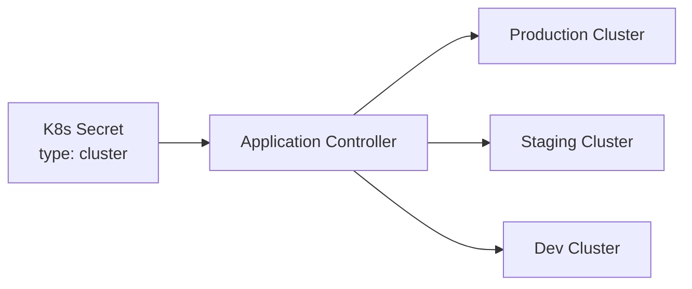

# How to Manage ArgoCD Clusters Declaratively

Author: [nawazdhandala](https://github.com/nawazdhandala)

Tags: ArgoCD, GitOps, Kubernetes, Cluster Management, Multi-Cluster

Description: Learn how to define and manage ArgoCD cluster connections declaratively using Kubernetes secrets for reproducible multi-cluster GitOps configurations.

---

When ArgoCD manages applications across multiple Kubernetes clusters, the cluster connection details need to be stored somewhere. By default, you add clusters using `argocd cluster add`, which creates a Kubernetes secret in the argocd namespace. Managing these cluster secrets declaratively means defining them as YAML manifests, giving you the same Git-driven workflow as your applications and projects.

## How ArgoCD Stores Cluster Configuration

ArgoCD stores cluster connection information as Kubernetes secrets with the label `argocd.argoproj.io/secret-type: cluster`. Each secret contains the cluster API server URL, authentication credentials, and optional metadata like labels and annotations.



The in-cluster (where ArgoCD runs) is always available and does not need a secret. For remote clusters, you need to create these secrets.

## Declaring a Cluster with Bearer Token

The most common authentication method for remote clusters uses a bearer token from a service account:

```yaml
# clusters/production-us.yaml
apiVersion: v1
kind: Secret
metadata:
  name: cluster-production-us
  namespace: argocd
  labels:
    argocd.argoproj.io/secret-type: cluster
    environment: production
    region: us-east-1
type: Opaque
stringData:
  name: production-us
  server: https://kubernetes.prod-us.example.com
  config: |
    {
      "bearerToken": "eyJhbGciOiJSUzI1NiIsImtpZCI6...",
      "tlsClientConfig": {
        "insecure": false,
        "caData": "LS0tLS1CRUdJTi..."
      }
    }
```

The `config` field is a JSON object with the authentication and TLS configuration. The `bearerToken` comes from a service account on the remote cluster that has the necessary RBAC permissions.

## Setting Up the Remote Cluster Service Account

Before creating the cluster secret, set up a service account on the remote cluster that ArgoCD will use:

```yaml
# Apply this on the REMOTE cluster
---
apiVersion: v1
kind: ServiceAccount
metadata:
  name: argocd-manager
  namespace: kube-system
---
apiVersion: rbac.authorization.k8s.io/v1
kind: ClusterRole
metadata:
  name: argocd-manager-role
rules:
  - apiGroups: ['*']
    resources: ['*']
    verbs: ['*']
  - nonResourceURLs: ['*']
    verbs: ['*']
---
apiVersion: rbac.authorization.k8s.io/v1
kind: ClusterRoleBinding
metadata:
  name: argocd-manager-role-binding
roleRef:
  apiGroup: rbac.authorization.k8s.io
  kind: ClusterRole
  name: argocd-manager-role
subjects:
  - kind: ServiceAccount
    name: argocd-manager
    namespace: kube-system
---
# For Kubernetes 1.24+, create a long-lived token
apiVersion: v1
kind: Secret
metadata:
  name: argocd-manager-token
  namespace: kube-system
  annotations:
    kubernetes.io/service-account.name: argocd-manager
type: kubernetes.io/service-account-token
```

Then retrieve the token:

```bash
# Get the bearer token from the remote cluster
kubectl get secret argocd-manager-token -n kube-system \
  -o jsonpath='{.data.token}' | base64 -d

# Get the CA certificate
kubectl config view --raw --minify \
  -o jsonpath='{.clusters[0].cluster.certificate-authority-data}'
```

## Declaring a Cluster with Client Certificate

For clusters that use client certificate authentication:

```yaml
# clusters/production-eu.yaml
apiVersion: v1
kind: Secret
metadata:
  name: cluster-production-eu
  namespace: argocd
  labels:
    argocd.argoproj.io/secret-type: cluster
    environment: production
    region: eu-west-1
type: Opaque
stringData:
  name: production-eu
  server: https://kubernetes.prod-eu.example.com
  config: |
    {
      "tlsClientConfig": {
        "insecure": false,
        "caData": "LS0tLS1CRUdJTi...",
        "certData": "LS0tLS1CRUdJTi...",
        "keyData": "LS0tLS1CRUdJTi..."
      }
    }
```

## Declaring an EKS Cluster with IAM

For AWS EKS clusters using IAM authentication:

```yaml
# clusters/eks-production.yaml
apiVersion: v1
kind: Secret
metadata:
  name: cluster-eks-production
  namespace: argocd
  labels:
    argocd.argoproj.io/secret-type: cluster
    cloud: aws
    environment: production
type: Opaque
stringData:
  name: eks-production
  server: https://ABCDEF1234567890.gr7.us-east-1.eks.amazonaws.com
  config: |
    {
      "awsAuthConfig": {
        "clusterName": "production-cluster",
        "roleARN": "arn:aws:iam::123456789012:role/argocd-manager"
      },
      "tlsClientConfig": {
        "insecure": false,
        "caData": "LS0tLS1CRUdJTi..."
      }
    }
```

For EKS authentication, the ArgoCD controller pods need AWS credentials (via IRSA or environment variables) that can assume the specified role.

## Declaring a GKE Cluster

For Google GKE clusters:

```yaml
# clusters/gke-production.yaml
apiVersion: v1
kind: Secret
metadata:
  name: cluster-gke-production
  namespace: argocd
  labels:
    argocd.argoproj.io/secret-type: cluster
    cloud: gcp
    environment: production
type: Opaque
stringData:
  name: gke-production
  server: https://10.0.0.1
  config: |
    {
      "execProviderConfig": {
        "command": "argocd-k8s-auth",
        "args": ["gcp"],
        "apiVersion": "client.authentication.k8s.io/v1beta1"
      },
      "tlsClientConfig": {
        "insecure": false,
        "caData": "LS0tLS1CRUdJTi..."
      }
    }
```

## Adding Labels and Annotations

Labels on cluster secrets are especially important because ApplicationSet cluster generators use them to match clusters:

```yaml
metadata:
  labels:
    argocd.argoproj.io/secret-type: cluster
    # Custom labels for ApplicationSet matching
    environment: production
    region: us-east-1
    cloud: aws
    tier: critical
  annotations:
    # Custom annotations for documentation
    team: platform
    cost-center: "CC-1234"
```

These labels are then used in ApplicationSet cluster generators:

```yaml
# ApplicationSet that targets all production clusters
apiVersion: argoproj.io/v1alpha1
kind: ApplicationSet
metadata:
  name: monitoring-stack
  namespace: argocd
spec:
  generators:
    - clusters:
        selector:
          matchLabels:
            environment: production
  template:
    spec:
      source:
        repoURL: https://github.com/myorg/monitoring.git
        path: k8s
      destination:
        server: '{{server}}'
        namespace: monitoring
```

## Organizing Cluster Manifests

```
argocd-config/
  clusters/
    production/
      us-east-1.yaml
      eu-west-1.yaml
      ap-southeast-1.yaml
    staging/
      us-east-1.yaml
    development/
      shared-dev.yaml
  projects/
    ...
  applications/
    ...
```

## Securing Cluster Credentials

Cluster secrets contain sensitive credentials. Never commit them in plain text.

### With External Secrets Operator

```yaml
# clusters/external/production-us.yaml
apiVersion: external-secrets.io/v1beta1
kind: ExternalSecret
metadata:
  name: cluster-production-us
  namespace: argocd
spec:
  refreshInterval: 1h
  secretStoreRef:
    name: vault-backend
    kind: ClusterSecretStore
  target:
    name: cluster-production-us
    template:
      metadata:
        labels:
          argocd.argoproj.io/secret-type: cluster
          environment: production
      data:
        name: production-us
        server: https://kubernetes.prod-us.example.com
        config: |
          {
            "bearerToken": "{{ .token }}",
            "tlsClientConfig": {
              "insecure": false,
              "caData": "{{ .ca }}"
            }
          }
  data:
    - secretKey: token
      remoteRef:
        key: argocd/clusters/production-us/token
    - secretKey: ca
      remoteRef:
        key: argocd/clusters/production-us/ca
```

### With Sealed Secrets

```bash
# Create the secret and seal it
kubectl create secret generic cluster-production-us \
  --namespace argocd \
  --from-literal=name=production-us \
  --from-literal=server=https://kubernetes.prod-us.example.com \
  --from-literal=config='{"bearerToken":"...","tlsClientConfig":{"caData":"..."}}' \
  --dry-run=client -o yaml \
  | kubectl label --local -f - argocd.argoproj.io/secret-type=cluster --dry-run=client -o yaml \
  | kubeseal --format yaml > clusters/production-us-sealed.yaml
```

## Managing Clusters with ArgoCD

Have ArgoCD manage its own cluster definitions:

```yaml
# root-clusters.yaml
apiVersion: argoproj.io/v1alpha1
kind: Application
metadata:
  name: argocd-clusters
  namespace: argocd
spec:
  project: default
  source:
    repoURL: https://github.com/myorg/argocd-config.git
    targetRevision: main
    path: clusters
    directory:
      recurse: true
  destination:
    server: https://kubernetes.default.svc
    namespace: argocd
  syncPolicy:
    automated:
      prune: false  # Never auto-delete cluster connections
      selfHeal: true
```

## Verifying Cluster Connections

After applying cluster secrets, verify the connections:

```bash
# List all clusters
argocd cluster list

# Check detailed cluster info
argocd cluster get https://kubernetes.prod-us.example.com

# Test cluster connectivity
kubectl get secrets -n argocd \
  -l argocd.argoproj.io/secret-type=cluster \
  -o custom-columns='NAME:.metadata.name,SERVER:.data.server'
```

Declarative cluster management is the final piece of a fully GitOps-driven ArgoCD setup. Combined with [declarative applications](https://oneuptime.com/blog/post/2026-02-26-argocd-manage-applications-declaratively/view), [projects](https://oneuptime.com/blog/post/2026-02-26-argocd-manage-projects-declaratively/view), and [repositories](https://oneuptime.com/blog/post/2026-02-26-argocd-manage-repositories-declaratively/view), every aspect of your ArgoCD configuration lives in Git.
