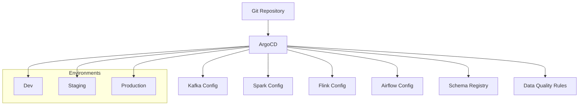

# How to Manage Data Pipeline Configuration with ArgoCD

Author: [nawazdhandala](https://github.com/nawazdhandala)

Tags: ArgoCD, GitOps, Kubernetes, Data Pipeline, Data Engineering

Description: Learn how to use ArgoCD to manage data pipeline configurations across multiple tools and environments with GitOps for consistent, auditable data infrastructure.

---

Data pipelines typically span multiple tools - ingestion with Kafka Connect, processing with Spark or Flink, orchestration with Airflow, and storage in data warehouses. Each tool has its own configuration format and deployment method. ArgoCD can unify the management of all these configurations through GitOps, giving you a single source of truth for your entire data platform.

This guide covers strategies for managing data pipeline configurations with ArgoCD across a modern data stack.

## The Configuration Management Challenge

A typical data pipeline involves configurations spread across:

- Kafka topics and connector configurations
- Spark job parameters and scheduling
- Flink job configs and checkpoint settings
- Airflow DAG parameters and connections
- Database schemas and table definitions
- Data quality rules and alerts
- Access controls and permissions

Without a unified approach, these configurations drift between environments, changes are hard to track, and debugging pipeline failures becomes a nightmare.

## Architecture



## Repository Structure

Organize your data pipeline configurations in a monorepo:

```
data-platform/
  base/
    kafka/
      topics/
      connectors/
    spark/
      jobs/
      configs/
    flink/
      jobs/
    airflow/
      connections/
      variables/
    schemas/
      avro/
      protobuf/
    quality/
      rules/
  environments/
    dev/
      kustomization.yaml
    staging/
      kustomization.yaml
    production/
      kustomization.yaml
  app-of-apps/
    data-platform.yaml
```

## Using ApplicationSets for Multi-Environment Deployment

Deploy your data pipeline across environments using an ApplicationSet:

```yaml
# app-of-apps/data-platform.yaml
apiVersion: argoproj.io/v1alpha1
kind: ApplicationSet
metadata:
  name: data-platform
  namespace: argocd
spec:
  generators:
    - list:
        elements:
          - environment: dev
            cluster: https://dev-cluster.example.com
            namespace: data-pipeline-dev
            values:
              kafka_replicas: "1"
              spark_executors: "2"
              flink_parallelism: "4"
          - environment: staging
            cluster: https://staging-cluster.example.com
            namespace: data-pipeline-staging
            values:
              kafka_replicas: "2"
              spark_executors: "5"
              flink_parallelism: "8"
          - environment: production
            cluster: https://kubernetes.default.svc
            namespace: data-pipeline
            values:
              kafka_replicas: "3"
              spark_executors: "20"
              flink_parallelism: "32"
  template:
    metadata:
      name: 'data-platform-{{environment}}'
      labels:
        environment: '{{environment}}'
        team: data-engineering
    spec:
      project: data-infrastructure
      source:
        repoURL: https://github.com/myorg/data-platform.git
        targetRevision: main
        path: 'environments/{{environment}}'
      destination:
        server: '{{cluster}}'
        namespace: '{{namespace}}'
      syncPolicy:
        automated:
          prune: false
          selfHeal: true
        syncOptions:
          - CreateNamespace=true
```

## Managing Kafka Topic Configuration

Define Kafka topics with environment-specific overrides:

```yaml
# base/kafka/topics/order-events.yaml
apiVersion: kafka.strimzi.io/v1beta2
kind: KafkaTopic
metadata:
  name: order-events
  labels:
    strimzi.io/cluster: data-kafka
    pipeline: order-processing
spec:
  partitions: 24
  replicas: 3
  config:
    retention.ms: "604800000"
    cleanup.policy: delete
    min.insync.replicas: "2"
```

```yaml
# environments/dev/kafka-topic-patches.yaml
apiVersion: kafka.strimzi.io/v1beta2
kind: KafkaTopic
metadata:
  name: order-events
spec:
  partitions: 4
  replicas: 1
  config:
    retention.ms: "86400000"  # 1 day in dev
    min.insync.replicas: "1"
```

## Managing Pipeline Parameters with ConfigMaps

Store pipeline parameters that are shared across tools:

```yaml
# base/configs/pipeline-params.yaml
apiVersion: v1
kind: ConfigMap
metadata:
  name: pipeline-params
  labels:
    app: data-pipeline
data:
  # Shared pipeline parameters
  KAFKA_BOOTSTRAP_SERVERS: "data-kafka-bootstrap:9092"
  SCHEMA_REGISTRY_URL: "http://schema-registry:8081"
  DATA_LAKE_BUCKET: "s3://data-lake"
  WAREHOUSE_JDBC_URL: "jdbc:postgresql://warehouse:5432/analytics"

  # Processing parameters
  BATCH_SIZE: "10000"
  PROCESSING_WINDOW: "5m"
  WATERMARK_DELAY: "30s"

  # Quality thresholds
  NULL_RATE_THRESHOLD: "0.05"
  DUPLICATE_RATE_THRESHOLD: "0.01"
  LATENCY_THRESHOLD_MS: "60000"
```

```yaml
# environments/production/patches/pipeline-params.yaml
apiVersion: v1
kind: ConfigMap
metadata:
  name: pipeline-params
data:
  KAFKA_BOOTSTRAP_SERVERS: "production-kafka-bootstrap:9093"
  DATA_LAKE_BUCKET: "s3://production-data-lake"
  WAREHOUSE_JDBC_URL: "jdbc:postgresql://production-warehouse:5432/analytics"
  BATCH_SIZE: "50000"
  PROCESSING_WINDOW: "1m"
```

## Schema Management

Manage Avro or Protobuf schemas through Git and register them with a schema registry:

```yaml
# base/schemas/register-schemas.yaml
apiVersion: batch/v1
kind: Job
metadata:
  name: register-schemas
  annotations:
    argocd.argoproj.io/hook: PostSync
    argocd.argoproj.io/hook-delete-policy: HookSucceeded
spec:
  template:
    spec:
      restartPolicy: Never
      containers:
        - name: register
          image: myregistry/schema-registrar:v1.0.0
          command:
            - /bin/sh
            - -c
            - |
              # Register each schema with the schema registry
              for schema in /schemas/avro/*.avsc; do
                SUBJECT=$(basename "$schema" .avsc)
                echo "Registering schema: $SUBJECT"
                curl -X POST -H "Content-Type: application/vnd.schemaregistry.v1+json" \
                  --data "{\"schema\": $(cat $schema | jq -Rs .)}" \
                  "$SCHEMA_REGISTRY_URL/subjects/${SUBJECT}-value/versions"
              done
          env:
            - name: SCHEMA_REGISTRY_URL
              valueFrom:
                configMapKeyRef:
                  name: pipeline-params
                  key: SCHEMA_REGISTRY_URL
          volumeMounts:
            - name: schemas
              mountPath: /schemas
      volumes:
        - name: schemas
          configMap:
            name: pipeline-schemas
---
apiVersion: v1
kind: ConfigMap
metadata:
  name: pipeline-schemas
data:
  order-event.avsc: |
    {
      "type": "record",
      "name": "OrderEvent",
      "namespace": "com.myorg.events",
      "fields": [
        {"name": "order_id", "type": "string"},
        {"name": "user_id", "type": "long"},
        {"name": "amount", "type": "double"},
        {"name": "currency", "type": "string"},
        {"name": "items", "type": {"type": "array", "items": "string"}},
        {"name": "timestamp", "type": {"type": "long", "logicalType": "timestamp-millis"}}
      ]
    }
```

## Data Quality Rules

Define data quality checks that run as part of your pipeline:

```yaml
# base/quality/rules/order-quality.yaml
apiVersion: v1
kind: ConfigMap
metadata:
  name: order-quality-rules
  labels:
    pipeline: order-processing
    type: quality-rules
data:
  rules.yaml: |
    checks:
      - name: order_amount_positive
        table: orders
        check: "amount > 0"
        severity: critical

      - name: order_has_items
        table: orders
        check: "array_length(items) > 0"
        severity: warning

      - name: null_rate_user_id
        table: orders
        check: "count_if(user_id IS NULL) / count(*) < 0.001"
        severity: critical

      - name: freshness
        table: orders
        check: "max(timestamp) > now() - interval '1 hour'"
        severity: critical

      - name: volume_anomaly
        table: orders
        check: "count(*) BETWEEN 0.5 * avg_count AND 2.0 * avg_count"
        severity: warning
```

## Pipeline Dependency Management with Sync Waves

Use ArgoCD sync waves to deploy pipeline components in the correct order:

```yaml
# Deploy infrastructure first
apiVersion: v1
kind: Namespace
metadata:
  name: data-pipeline
  annotations:
    argocd.argoproj.io/sync-wave: "0"
---
# Then Kafka topics
apiVersion: kafka.strimzi.io/v1beta2
kind: KafkaTopic
metadata:
  name: order-events
  annotations:
    argocd.argoproj.io/sync-wave: "1"
---
# Then schemas
apiVersion: batch/v1
kind: Job
metadata:
  name: register-schemas
  annotations:
    argocd.argoproj.io/sync-wave: "2"
---
# Then CDC connectors
apiVersion: kafka.strimzi.io/v1beta2
kind: KafkaConnector
metadata:
  name: orders-cdc
  annotations:
    argocd.argoproj.io/sync-wave: "3"
---
# Then stream processors
apiVersion: flink.apache.org/v1beta1
kind: FlinkDeployment
metadata:
  name: order-processor
  annotations:
    argocd.argoproj.io/sync-wave: "4"
---
# Finally, quality checks
apiVersion: batch/v1
kind: CronJob
metadata:
  name: data-quality-checks
  annotations:
    argocd.argoproj.io/sync-wave: "5"
```

Sync waves ensure that Kafka topics exist before connectors try to write to them, and schemas are registered before processors try to deserialize messages.

## Promoting Changes Across Environments

Use a promotion workflow to move pipeline changes from dev to production:

```bash
#!/bin/bash
# promote.sh - Promote pipeline config from one environment to another
SOURCE=$1  # e.g., "staging"
TARGET=$2  # e.g., "production"

# Copy base configs (environment-specific values stay in patches)
echo "Promoting from $SOURCE to $TARGET"

# Create a PR for the promotion
git checkout -b "promote-$SOURCE-to-$TARGET-$(date +%Y%m%d)"

# Update the target environment's image tags to match source
# This is where you'd update any version-specific configs

git add "environments/$TARGET/"
git commit -m "Promote pipeline config from $SOURCE to $TARGET"
git push origin HEAD

# Create PR for review
gh pr create --title "Promote $SOURCE to $TARGET" \
  --body "Pipeline configuration promotion from $SOURCE to $TARGET"
```

## Best Practices

1. **Use a monorepo for related pipeline configs** - Keep all components of a data pipeline in the same repository so they can be versioned together.

2. **Sync waves for dependencies** - Deploy pipeline components in order: infrastructure, topics, schemas, connectors, processors, quality checks.

3. **Environment-specific overrides** - Use Kustomize overlays to manage environment differences without duplicating base configurations.

4. **Schema registry integration** - Register schemas through ArgoCD hooks to ensure schemas exist before producers start writing.

5. **Shared parameter ConfigMaps** - Use a central ConfigMap for parameters shared across tools (bootstrap servers, bucket names, etc.).

6. **Data quality as code** - Define quality rules in Git and deploy them alongside your pipeline components.

Managing data pipeline configuration with ArgoCD brings the same rigor to data infrastructure that software teams expect for application deployments. Every configuration change is reviewed, versioned, and easily reversible.
