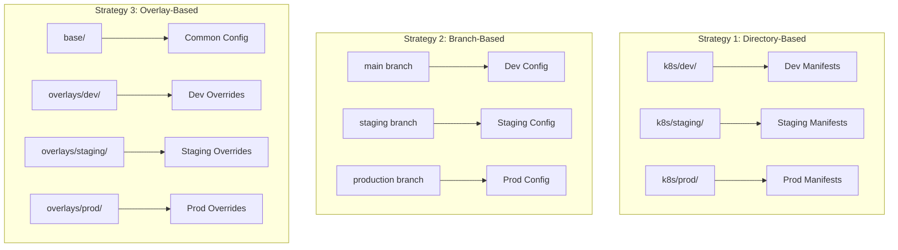

# How to Manage dev/staging/prod Environments with ArgoCD

Author: [nawazdhandala](https://github.com/nawazdhandala)

Tags: ArgoCD, GitOps, Kubernetes, Environment Management, DevOps

Description: Learn how to manage development, staging, and production environments with ArgoCD using separate namespaces, cluster targeting, and environment-specific configurations.

---

Every application needs to run in multiple environments. Developers test in dev, QA validates in staging, and users interact with production. Each environment has different resource limits, different replicas, different database endpoints, and different feature flags.

ArgoCD manages multiple environments by creating separate Application resources that point to different configurations for the same codebase. The key is structuring your Git repository and ArgoCD applications so that environment differences are clear, maintainable, and auditable.

## Environment Strategy Options

There are three main strategies for multi-environment management with ArgoCD, each with different trade-offs.



**Directory-based** is the simplest but leads to duplicated YAML. **Branch-based** uses Git branches for each environment but makes promotion harder. **Overlay-based** with Kustomize or Helm values files is the recommended approach because it minimizes duplication while keeping differences explicit.

## Setting Up Environment-Specific Applications

Create one ArgoCD Application per environment per service. This gives you independent sync status, health checks, and rollback capabilities for each environment.

```yaml
# applications/payment-service-dev.yaml
apiVersion: argoproj.io/v1alpha1
kind: Application
metadata:
  name: payment-service-dev
  namespace: argocd
  labels:
    app: payment-service
    environment: dev
spec:
  project: team-alpha
  source:
    repoURL: https://github.com/myorg/payment-service.git
    path: k8s/overlays/dev
    targetRevision: main
  destination:
    server: https://kubernetes.default.svc
    namespace: team-alpha-dev
  syncPolicy:
    automated:
      prune: true
      selfHeal: true
---
# applications/payment-service-staging.yaml
apiVersion: argoproj.io/v1alpha1
kind: Application
metadata:
  name: payment-service-staging
  namespace: argocd
  labels:
    app: payment-service
    environment: staging
spec:
  project: team-alpha
  source:
    repoURL: https://github.com/myorg/payment-service.git
    path: k8s/overlays/staging
    targetRevision: main
  destination:
    server: https://kubernetes.default.svc
    namespace: team-alpha-staging
  syncPolicy:
    automated:
      prune: true
      selfHeal: true
---
# applications/payment-service-prod.yaml
apiVersion: argoproj.io/v1alpha1
kind: Application
metadata:
  name: payment-service-prod
  namespace: argocd
  labels:
    app: payment-service
    environment: production
spec:
  project: team-alpha
  source:
    repoURL: https://github.com/myorg/payment-service.git
    path: k8s/overlays/prod
    targetRevision: main
  destination:
    server: https://kubernetes.default.svc
    namespace: team-alpha-prod
  syncPolicy:
    # No automated sync for production - requires manual approval
    syncOptions:
      - CreateNamespace=false
```

Notice that dev and staging have `automated` sync, but production requires manual sync. This is a common pattern where lower environments deploy automatically and production requires explicit approval.

## Using ApplicationSets for Environment Management

Instead of creating individual Application resources, use an ApplicationSet to generate environment-specific applications from a single template.

```yaml
apiVersion: argoproj.io/v1alpha1
kind: ApplicationSet
metadata:
  name: payment-service
  namespace: argocd
spec:
  generators:
    - list:
        elements:
          - environment: dev
            namespace: team-alpha-dev
            autoSync: "true"
            targetRevision: main
          - environment: staging
            namespace: team-alpha-staging
            autoSync: "true"
            targetRevision: main
          - environment: prod
            namespace: team-alpha-prod
            autoSync: "false"
            targetRevision: release
  template:
    metadata:
      name: "payment-service-{{environment}}"
      labels:
        app: payment-service
        environment: "{{environment}}"
    spec:
      project: team-alpha
      source:
        repoURL: https://github.com/myorg/payment-service.git
        path: "k8s/overlays/{{environment}}"
        targetRevision: "{{targetRevision}}"
      destination:
        server: https://kubernetes.default.svc
        namespace: "{{namespace}}"
      syncPolicy:
        automated:
          prune: true
          selfHeal: true
```

## Multi-Cluster Environment Separation

For stronger isolation, run each environment on a separate cluster. ArgoCD manages all of them from a single control plane.

```yaml
apiVersion: argoproj.io/v1alpha1
kind: ApplicationSet
metadata:
  name: payment-service-multi-cluster
  namespace: argocd
spec:
  generators:
    - list:
        elements:
          - environment: dev
            cluster: https://dev-cluster.example.com
            namespace: payment-service
          - environment: staging
            cluster: https://staging-cluster.example.com
            namespace: payment-service
          - environment: prod
            cluster: https://prod-cluster.example.com
            namespace: payment-service
  template:
    metadata:
      name: "payment-service-{{environment}}"
    spec:
      project: team-alpha
      source:
        repoURL: https://github.com/myorg/payment-service.git
        path: "k8s/overlays/{{environment}}"
        targetRevision: main
      destination:
        server: "{{cluster}}"
        namespace: "{{namespace}}"
```

## Environment-Specific Sync Policies

Different environments need different sync behaviors:

| Environment | Auto-Sync | Self-Heal | Prune | Sync Window |
|-------------|-----------|-----------|-------|-------------|
| Dev | Yes | Yes | Yes | Always |
| Staging | Yes | Yes | Yes | Business hours |
| Production | No | Yes | No | Maintenance window |

Configure sync windows in the AppProject:

```yaml
apiVersion: argoproj.io/v1alpha1
kind: AppProject
metadata:
  name: team-alpha
spec:
  syncWindows:
    # Production: only during maintenance windows
    - kind: allow
      schedule: "0 2 * * 3"  # Wednesday 2 AM UTC
      duration: 4h
      namespaces:
        - team-alpha-prod
    # Block production deploys on weekends
    - kind: deny
      schedule: "0 0 * * 0,6"  # Saturday and Sunday
      duration: 48h
      namespaces:
        - team-alpha-prod
  destinations:
    - server: https://kubernetes.default.svc
      namespace: "team-alpha-*"
```

## Environment Parity and Drift Detection

ArgoCD's diff view shows you when environments have drifted apart. Use labels and dashboards to track environment parity:

```bash
# Compare application status across environments
for ENV in dev staging prod; do
  echo "=== $ENV ==="
  argocd app get payment-service-$ENV \
    -o json | jq '{sync: .status.sync.status, health: .status.health.status, revision: .status.sync.revision}'
done
```

Output shows whether all environments are on the same revision:

```json
=== dev ===
{"sync": "Synced", "health": "Healthy", "revision": "abc1234"}
=== staging ===
{"sync": "Synced", "health": "Healthy", "revision": "abc1234"}
=== prod ===
{"sync": "OutOfSync", "health": "Healthy", "revision": "def5678"}
```

If production is behind, you know there are changes waiting for deployment.

## Handling Image Tags per Environment

Different environments often run different image versions. Use Kustomize image overrides or Helm values to set environment-specific tags.

```yaml
# k8s/overlays/dev/kustomization.yaml
apiVersion: kustomize.config.k8s.io/v1beta1
kind: Kustomization
resources:
  - ../../base
images:
  - name: myorg/payment-service
    newTag: latest  # Dev runs latest

# k8s/overlays/staging/kustomization.yaml
apiVersion: kustomize.config.k8s.io/v1beta1
kind: Kustomization
resources:
  - ../../base
images:
  - name: myorg/payment-service
    newTag: v2.3.0-rc1  # Staging runs release candidates

# k8s/overlays/prod/kustomization.yaml
apiVersion: kustomize.config.k8s.io/v1beta1
kind: Kustomization
resources:
  - ../../base
images:
  - name: myorg/payment-service
    newTag: v2.2.1  # Production runs stable releases
```

## Environment-Specific RBAC

Control who can deploy to each environment with ArgoCD RBAC:

```csv
# Developers can sync to dev
p, role:developer, applications, sync, team-alpha/payment-service-dev, allow

# QA can sync to staging
p, role:qa, applications, sync, team-alpha/payment-service-staging, allow

# Only SREs can sync to production
p, role:sre, applications, sync, team-alpha/payment-service-prod, allow

# Everyone can view all environments
p, role:developer, applications, get, team-alpha/*, allow
p, role:qa, applications, get, team-alpha/*, allow
```

## Monitoring Across Environments

Set up a unified view of application health across all environments. ArgoCD's application labels make this easy with Prometheus queries:

```promql
# Application sync status by environment
argocd_app_info{name=~"payment-service-.*"} * on(name) group_left(environment) label_replace(argocd_app_info, "environment", "$1", "name", "payment-service-(.*)")

# Sync failures by environment in the last 24h
sum by (dest_namespace) (increase(argocd_app_sync_total{phase="Error", name=~"payment-service-.*"}[24h]))
```

Managing environments with ArgoCD gives you visibility into what is deployed where, the ability to trace every change back to a Git commit, and the confidence that each environment is exactly what its configuration says it should be. Start with the overlay-based approach, add ApplicationSets when you have many services, and layer on environment-specific policies as your organization matures.
