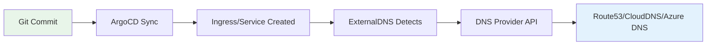

# How to Manage DNS Records with ArgoCD and ExternalDNS

Author: [nawazdhandala](https://github.com/nawazdhandala)

Tags: ArgoCD, GitOps, Kubernetes, ExternalDNS, Networking

Description: Learn how to manage DNS records declaratively using ArgoCD and ExternalDNS for automatic DNS provisioning that stays in sync with your Kubernetes services.

---

Managing DNS records manually is error-prone and does not scale. When you deploy a new service in Kubernetes, you need a DNS record pointing to it. When you tear down a service, the DNS record should go away. ExternalDNS bridges this gap by automatically creating DNS records based on Kubernetes resources like Ingress, Service, and Gateway API objects.

Combining ArgoCD with ExternalDNS gives you a fully GitOps-driven DNS management pipeline where DNS changes are driven by Git commits.

## How ExternalDNS Works

ExternalDNS watches Kubernetes resources and creates corresponding DNS records in your DNS provider:



## Step 1: Deploy ExternalDNS with ArgoCD

### AWS Route53 Configuration

```yaml
apiVersion: argoproj.io/v1alpha1
kind: Application
metadata:
  name: external-dns
  namespace: argocd
spec:
  project: infrastructure
  source:
    repoURL: https://kubernetes-sigs.github.io/external-dns
    chart: external-dns
    targetRevision: 1.14.0
    helm:
      releaseName: external-dns
      valuesObject:
        provider: aws
        aws:
          region: us-east-1
          zoneType: public
        domainFilters:
          - example.com
          - internal.example.com
        policy: sync  # sync deletes records too, upsert-only just creates
        registry: txt
        txtOwnerId: "argocd-cluster-prod"
        txtPrefix: "_externaldns."
        sources:
          - ingress
          - service
          - istio-gateway
          - istio-virtualservice
        interval: 1m
        serviceAccount:
          annotations:
            eks.amazonaws.com/role-arn: arn:aws:iam::123456789012:role/external-dns
  destination:
    server: https://kubernetes.default.svc
    namespace: external-dns
  syncPolicy:
    automated:
      selfHeal: true
    syncOptions:
      - CreateNamespace=true
```

### Google Cloud DNS Configuration

```yaml
apiVersion: argoproj.io/v1alpha1
kind: Application
metadata:
  name: external-dns
  namespace: argocd
spec:
  project: infrastructure
  source:
    repoURL: https://kubernetes-sigs.github.io/external-dns
    chart: external-dns
    targetRevision: 1.14.0
    helm:
      releaseName: external-dns
      valuesObject:
        provider: google
        google:
          project: my-gcp-project
          serviceAccountSecret: external-dns-gcp-sa
          serviceAccountSecretKey: credentials.json
        domainFilters:
          - example.com
        policy: sync
        registry: txt
        txtOwnerId: "argocd-cluster-prod"
  destination:
    server: https://kubernetes.default.svc
    namespace: external-dns
  syncPolicy:
    automated:
      selfHeal: true
    syncOptions:
      - CreateNamespace=true
```

### Azure DNS Configuration

```yaml
source:
  helm:
    valuesObject:
      provider: azure
      azure:
        resourceGroup: my-dns-rg
        tenantId: "your-tenant-id"
        subscriptionId: "your-subscription-id"
        useManagedIdentityExtension: true
      domainFilters:
        - example.com
      policy: sync
```

## Step 2: Annotate Resources for DNS

ExternalDNS reads annotations on Kubernetes resources to determine what DNS records to create.

### Ingress with DNS

```yaml
apiVersion: networking.k8s.io/v1
kind: Ingress
metadata:
  name: product-api
  namespace: production
  annotations:
    # ExternalDNS will create this DNS record
    external-dns.alpha.kubernetes.io/hostname: api.example.com
    # Optional: set TTL
    external-dns.alpha.kubernetes.io/ttl: "300"
spec:
  ingressClassName: nginx
  tls:
    - hosts:
        - api.example.com
      secretName: api-tls
  rules:
    - host: api.example.com
      http:
        paths:
          - path: /
            pathType: Prefix
            backend:
              service:
                name: product-api
                port:
                  number: 8080
```

### LoadBalancer Service with DNS

```yaml
apiVersion: v1
kind: Service
metadata:
  name: public-api
  namespace: production
  annotations:
    external-dns.alpha.kubernetes.io/hostname: public-api.example.com
    external-dns.alpha.kubernetes.io/ttl: "60"
spec:
  type: LoadBalancer
  selector:
    app: public-api
  ports:
    - port: 443
      targetPort: 8443
```

### Multiple Hostnames

```yaml
apiVersion: networking.k8s.io/v1
kind: Ingress
metadata:
  name: multi-domain
  annotations:
    external-dns.alpha.kubernetes.io/hostname: >
      app.example.com,
      www.example.com,
      example.com
spec:
  rules:
    - host: app.example.com
      http:
        paths:
          - path: /
            pathType: Prefix
            backend:
              service:
                name: web-app
                port:
                  number: 80
    - host: www.example.com
      http:
        paths:
          - path: /
            pathType: Prefix
            backend:
              service:
                name: web-app
                port:
                  number: 80
```

## Step 3: Using DNSEndpoint CRD for Explicit Records

ExternalDNS also supports a dedicated CRD for DNS records that are not tied to Ingress or Service:

```yaml
# Install the CRD source in ExternalDNS values
# sources: [ingress, service, crd]

apiVersion: externaldns.k8s.io/v1alpha1
kind: DNSEndpoint
metadata:
  name: static-records
  namespace: production
spec:
  endpoints:
    - dnsName: status.example.com
      recordTTL: 300
      recordType: CNAME
      targets:
        - statuspage.example.com

    - dnsName: mail.example.com
      recordTTL: 3600
      recordType: MX
      targets:
        - "10 mx1.example.com"
        - "20 mx2.example.com"

    - dnsName: _dmarc.example.com
      recordTTL: 3600
      recordType: TXT
      targets:
        - "v=DMARC1; p=reject; rua=mailto:dmarc@example.com"
```

## Repository Structure

```text
dns-config/
  base/
    kustomization.yaml
    external-dns/
      values.yaml
    dns-records/
      static-records.yaml
      internal-records.yaml
  overlays/
    staging/
      kustomization.yaml
      dns-records/
        staging-records.yaml
    production/
      kustomization.yaml
      dns-records/
        production-records.yaml
```

## ArgoCD Application for DNS Records

```yaml
apiVersion: argoproj.io/v1alpha1
kind: Application
metadata:
  name: dns-records
  namespace: argocd
spec:
  project: infrastructure
  source:
    repoURL: https://github.com/your-org/dns-config
    path: overlays/production
    targetRevision: main
  destination:
    server: https://kubernetes.default.svc
    namespace: production
  syncPolicy:
    automated:
      selfHeal: true
      prune: true  # Delete DNS records when removed from Git
```

## Safety Measures

### Domain Filtering

Always restrict ExternalDNS to specific domains to prevent accidental DNS changes:

```yaml
domainFilters:
  - example.com
  - internal.example.com
excludeDomains:
  - corp.example.com  # Managed separately
```

### TXT Record Ownership

ExternalDNS uses TXT records to track ownership. This prevents it from modifying records it did not create:

```yaml
registry: txt
txtOwnerId: "argocd-cluster-prod"
txtPrefix: "_externaldns."
```

### Policy Setting

Choose between `upsert-only` (safer) and `sync` (complete management):

```yaml
# upsert-only: only creates/updates, never deletes
policy: upsert-only

# sync: creates, updates, AND deletes
# Only use when you want full GitOps control
policy: sync
```

For production, start with `upsert-only` and switch to `sync` once you are confident in your setup.

### Preventing Accidental Deletions

Add ArgoCD sync options to prevent accidental DNS record deletion:

```yaml
apiVersion: argoproj.io/v1alpha1
kind: Application
metadata:
  name: dns-records
spec:
  syncPolicy:
    syncOptions:
      # Require manual approval for deletions
      - PrunePropagationPolicy=foreground
      - PruneLast=true
```

## Monitoring ExternalDNS

Track DNS record management with ExternalDNS metrics:

```promql
# DNS records managed
external_dns_registry_endpoints_total

# Source records discovered
external_dns_source_endpoints_total

# DNS provider errors
external_dns_controller_last_sync_timestamp

# Record change rate
rate(external_dns_registry_endpoints_total[1h])
```

## Summary

Combining ArgoCD with ExternalDNS creates a fully GitOps-driven DNS management pipeline. When you deploy a service through ArgoCD with the right annotations, ExternalDNS automatically creates the corresponding DNS records. When you remove the service, the records are cleaned up. Use domain filters and TXT record ownership to prevent accidental changes, and start with upsert-only policy until you are confident in your configuration. This approach eliminates manual DNS management and ensures your DNS records always match your deployed services.
