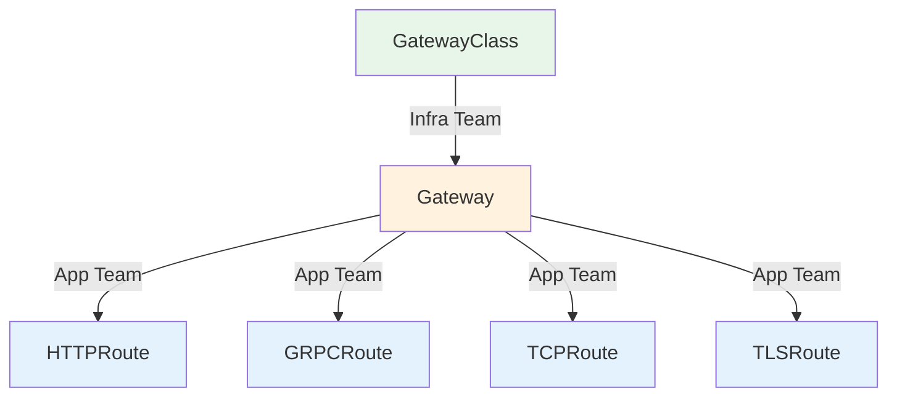

# How to Manage Gateway API Resources with ArgoCD

Author: [nawazdhandala](https://github.com/nawazdhandala)

Tags: ArgoCD, GitOps, Kubernetes, Gateway API, Networking

Description: Learn how to manage Kubernetes Gateway API resources with ArgoCD for GitOps-driven ingress management, traffic routing, and TLS configuration using the new standard.

---

The Kubernetes Gateway API is the successor to the Ingress resource, bringing a more expressive, role-oriented model for managing traffic into and within your cluster. It splits responsibility between infrastructure providers (who manage Gateways) and application developers (who manage HTTPRoutes). ArgoCD is a natural fit for managing these resources because the role separation aligns perfectly with ArgoCD's project-based access control.

This guide covers deploying and managing Gateway API resources through ArgoCD.

## Gateway API Architecture

The Gateway API defines several resources with clear ownership boundaries:



- **GatewayClass** - Defines the controller implementation (managed by platform team)
- **Gateway** - Defines listeners and TLS (managed by infrastructure team)
- **HTTPRoute/GRPCRoute** - Defines routing rules (managed by application teams)

## Step 1: Install Gateway API CRDs

Deploy the Gateway API CRDs through ArgoCD:

```yaml
apiVersion: argoproj.io/v1alpha1
kind: Application
metadata:
  name: gateway-api-crds
  namespace: argocd
  annotations:
    argocd.argoproj.io/sync-wave: "-3"
spec:
  project: infrastructure
  source:
    repoURL: https://github.com/kubernetes-sigs/gateway-api
    path: config/crd/standard
    targetRevision: v1.1.0
  destination:
    server: https://kubernetes.default.svc
  syncPolicy:
    automated:
      selfHeal: true
    syncOptions:
      - ServerSideApply=true
```

## Step 2: Deploy the Gateway Controller

Choose a Gateway API implementation. Here is an example with Envoy Gateway:

```yaml
apiVersion: argoproj.io/v1alpha1
kind: Application
metadata:
  name: envoy-gateway
  namespace: argocd
  annotations:
    argocd.argoproj.io/sync-wave: "-2"
spec:
  project: infrastructure
  source:
    repoURL: oci://docker.io/envoyproxy
    chart: gateway-helm
    targetRevision: v1.0.0
    helm:
      releaseName: envoy-gateway
      valuesObject:
        config:
          envoyGateway:
            logging:
              level:
                default: info
  destination:
    server: https://kubernetes.default.svc
    namespace: envoy-gateway-system
  syncPolicy:
    automated:
      selfHeal: true
    syncOptions:
      - CreateNamespace=true
```

## Step 3: Create GatewayClass and Gateway

These are infrastructure-level resources managed by the platform team:

```yaml
# gateway-class.yaml
apiVersion: gateway.networking.k8s.io/v1
kind: GatewayClass
metadata:
  name: envoy
  annotations:
    argocd.argoproj.io/sync-wave: "-1"
spec:
  controllerName: gateway.envoyproxy.io/gatewayclass-controller

---
# gateway.yaml
apiVersion: gateway.networking.k8s.io/v1
kind: Gateway
metadata:
  name: main-gateway
  namespace: gateway-system
  annotations:
    argocd.argoproj.io/sync-wave: "0"
spec:
  gatewayClassName: envoy
  listeners:
    - name: http
      protocol: HTTP
      port: 80
      allowedRoutes:
        namespaces:
          from: All

    - name: https
      protocol: HTTPS
      port: 443
      tls:
        mode: Terminate
        certificateRefs:
          - name: wildcard-tls
            namespace: cert-manager
      allowedRoutes:
        namespaces:
          from: Selector
          selector:
            matchLabels:
              gateway-access: "true"
```

## Step 4: ArgoCD Project Separation

Separate infrastructure and application routing into different ArgoCD projects:

```yaml
# Infrastructure project - manages GatewayClass and Gateway
apiVersion: argoproj.io/v1alpha1
kind: AppProject
metadata:
  name: gateway-infra
  namespace: argocd
spec:
  sourceRepos:
    - https://github.com/your-org/platform-config
  destinations:
    - namespace: gateway-system
      server: https://kubernetes.default.svc
    - namespace: envoy-gateway-system
      server: https://kubernetes.default.svc
  clusterResourceWhitelist:
    - group: gateway.networking.k8s.io
      kind: GatewayClass
  namespaceResourceWhitelist:
    - group: gateway.networking.k8s.io
      kind: Gateway

---
# Application project - manages HTTPRoutes
apiVersion: argoproj.io/v1alpha1
kind: AppProject
metadata:
  name: app-routing
  namespace: argocd
spec:
  sourceRepos:
    - https://github.com/your-org/app-config
  destinations:
    - namespace: '*'
      server: https://kubernetes.default.svc
  namespaceResourceWhitelist:
    - group: gateway.networking.k8s.io
      kind: HTTPRoute
    - group: gateway.networking.k8s.io
      kind: GRPCRoute
```

## Step 5: Define HTTPRoutes

Application teams create HTTPRoutes in their namespaces:

```yaml
# product-service HTTPRoute
apiVersion: gateway.networking.k8s.io/v1
kind: HTTPRoute
metadata:
  name: product-service
  namespace: production
spec:
  parentRefs:
    - name: main-gateway
      namespace: gateway-system
  hostnames:
    - "api.example.com"
  rules:
    - matches:
        - path:
            type: PathPrefix
            value: /api/products
      backendRefs:
        - name: product-service
          port: 8080
          weight: 100

    - matches:
        - path:
            type: PathPrefix
            value: /api/products
          headers:
            - name: x-canary
              value: "true"
      backendRefs:
        - name: product-service-canary
          port: 8080
          weight: 100
```

## Custom Health Checks for Gateway API

```yaml
apiVersion: v1
kind: ConfigMap
metadata:
  name: argocd-cm
  namespace: argocd
data:
  # Gateway health check
  resource.customizations.health.gateway.networking.k8s.io_Gateway: |
    hs = {}
    if obj.status ~= nil and obj.status.conditions ~= nil then
      for _, condition in ipairs(obj.status.conditions) do
        if condition.type == "Accepted" then
          if condition.status == "True" then
            hs.status = "Healthy"
            hs.message = "Gateway accepted"
          else
            hs.status = "Degraded"
            hs.message = condition.message or "Gateway not accepted"
          end
          return hs
        end
      end
    end
    hs.status = "Progressing"
    hs.message = "Waiting for status"
    return hs

  # HTTPRoute health check
  resource.customizations.health.gateway.networking.k8s.io_HTTPRoute: |
    hs = {}
    if obj.status ~= nil and obj.status.parents ~= nil then
      for _, parent in ipairs(obj.status.parents) do
        for _, condition in ipairs(parent.conditions or {}) do
          if condition.type == "Accepted" then
            if condition.status == "True" then
              hs.status = "Healthy"
              hs.message = "Route accepted by gateway"
            else
              hs.status = "Degraded"
              hs.message = condition.message or "Route not accepted"
            end
            return hs
          end
        end
      end
    end
    hs.status = "Progressing"
    hs.message = "Waiting for route status"
    return hs
```

## Traffic Splitting with HTTPRoute

Implement canary deployments using Gateway API traffic splitting:

```yaml
apiVersion: gateway.networking.k8s.io/v1
kind: HTTPRoute
metadata:
  name: product-service-canary
  namespace: production
spec:
  parentRefs:
    - name: main-gateway
      namespace: gateway-system
  hostnames:
    - "api.example.com"
  rules:
    - matches:
        - path:
            type: PathPrefix
            value: /api/products
      backendRefs:
        - name: product-service-stable
          port: 8080
          weight: 90
        - name: product-service-canary
          port: 8080
          weight: 10
```

Update weights through Git commits, and ArgoCD syncs the change:

```bash
# Promote canary to 50%
git commit -m "Increase product-service canary to 50%"
git push
```

## Request Filtering and Modification

Add request/response headers through HTTPRoute filters:

```yaml
apiVersion: gateway.networking.k8s.io/v1
kind: HTTPRoute
metadata:
  name: api-with-headers
  namespace: production
spec:
  parentRefs:
    - name: main-gateway
      namespace: gateway-system
  rules:
    - matches:
        - path:
            type: PathPrefix
            value: /api
      filters:
        - type: RequestHeaderModifier
          requestHeaderModifier:
            set:
              - name: X-Request-Source
                value: gateway
            add:
              - name: X-Trace-Id
                value: "auto-generated"
        - type: ResponseHeaderModifier
          responseHeaderModifier:
            set:
              - name: X-Frame-Options
                value: DENY
              - name: Strict-Transport-Security
                value: "max-age=31536000"
      backendRefs:
        - name: api-service
          port: 8080
```

## Summary

The Kubernetes Gateway API brings a cleaner, more expressive model for traffic management that maps naturally to ArgoCD's project-based access control. Platform teams manage GatewayClass and Gateway resources through infrastructure ArgoCD projects, while application teams manage HTTPRoutes through their own projects. Custom health checks ensure ArgoCD accurately reports the status of Gateway API resources, and traffic splitting enables canary deployments through simple weight changes in Git.
