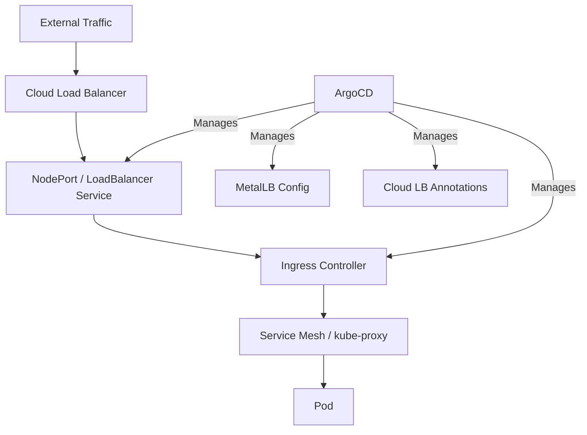

# How to Manage Load Balancer Configurations with ArgoCD

Author: [nawazdhandala](https://github.com/nawazdhandala)

Tags: ArgoCD, GitOps, Kubernetes, Load Balancing, Networking

Description: Learn how to manage cloud and in-cluster load balancer configurations with ArgoCD for consistent, GitOps-driven traffic distribution across your infrastructure.

---

Load balancer configuration in Kubernetes spans multiple layers - cloud provider load balancers provisioned by Service resources, in-cluster load balancers like MetalLB, and application-level load balancing through ingress controllers. Each layer has its own configuration model, and keeping them consistent across environments is challenging without GitOps.

ArgoCD brings all load balancer configurations under version control, ensuring consistent traffic distribution policies across clusters.

## Load Balancer Layers in Kubernetes



## Cloud Provider Load Balancer Configuration

### AWS Network Load Balancer

```yaml
# aws-nlb-service.yaml
apiVersion: v1
kind: Service
metadata:
  name: api-gateway
  namespace: production
  annotations:
    # Use NLB instead of CLB
    service.beta.kubernetes.io/aws-load-balancer-type: "nlb"
    # Internet-facing
    service.beta.kubernetes.io/aws-load-balancer-scheme: "internet-facing"
    # Cross-zone load balancing
    service.beta.kubernetes.io/aws-load-balancer-cross-zone-load-balancing-enabled: "true"
    # Health check configuration
    service.beta.kubernetes.io/aws-load-balancer-healthcheck-protocol: "HTTP"
    service.beta.kubernetes.io/aws-load-balancer-healthcheck-path: "/health"
    service.beta.kubernetes.io/aws-load-balancer-healthcheck-interval: "10"
    service.beta.kubernetes.io/aws-load-balancer-healthcheck-healthy-threshold: "2"
    service.beta.kubernetes.io/aws-load-balancer-healthcheck-unhealthy-threshold: "3"
    # SSL termination
    service.beta.kubernetes.io/aws-load-balancer-ssl-cert: "arn:aws:acm:us-east-1:123456789:certificate/abc-123"
    service.beta.kubernetes.io/aws-load-balancer-ssl-ports: "443"
    # Proxy protocol for real client IPs
    service.beta.kubernetes.io/aws-load-balancer-proxy-protocol: "*"
    # Target group attributes
    service.beta.kubernetes.io/aws-load-balancer-target-group-attributes: >
      deregistration_delay.timeout_seconds=30,
      stickiness.enabled=true,
      stickiness.type=source_ip
spec:
  type: LoadBalancer
  selector:
    app: api-gateway
  ports:
    - name: https
      port: 443
      targetPort: 8443
      protocol: TCP
    - name: http
      port: 80
      targetPort: 8080
      protocol: TCP
```

### AWS Application Load Balancer (with AWS Load Balancer Controller)

```yaml
apiVersion: networking.k8s.io/v1
kind: Ingress
metadata:
  name: api-alb
  namespace: production
  annotations:
    kubernetes.io/ingress.class: alb
    alb.ingress.kubernetes.io/scheme: internet-facing
    alb.ingress.kubernetes.io/target-type: ip
    alb.ingress.kubernetes.io/listen-ports: '[{"HTTPS":443}]'
    alb.ingress.kubernetes.io/certificate-arn: "arn:aws:acm:us-east-1:123456789:certificate/abc-123"
    alb.ingress.kubernetes.io/healthcheck-path: /health
    alb.ingress.kubernetes.io/healthcheck-interval-seconds: "15"
    alb.ingress.kubernetes.io/target-group-attributes: >
      deregistration_delay.timeout_seconds=30
    alb.ingress.kubernetes.io/actions.weighted-routing: >
      {"type":"forward","forwardConfig":{"targetGroups":[
        {"serviceName":"api-stable","servicePort":"8080","weight":90},
        {"serviceName":"api-canary","servicePort":"8080","weight":10}
      ]}}
spec:
  rules:
    - host: api.example.com
      http:
        paths:
          - path: /
            pathType: Prefix
            backend:
              service:
                name: weighted-routing
                port:
                  name: use-annotation
```

### Google Cloud Load Balancer

```yaml
apiVersion: v1
kind: Service
metadata:
  name: api-gateway
  namespace: production
  annotations:
    cloud.google.com/load-balancer-type: "Internal"
    cloud.google.com/neg: '{"ingress": true}'
    cloud.google.com/backend-config: >
      {"default": "api-backend-config"}
spec:
  type: LoadBalancer
  selector:
    app: api-gateway
  ports:
    - port: 443
      targetPort: 8443

---
apiVersion: cloud.google.com/v1
kind: BackendConfig
metadata:
  name: api-backend-config
  namespace: production
spec:
  healthCheck:
    checkIntervalSec: 10
    timeoutSec: 5
    healthyThreshold: 2
    unhealthyThreshold: 3
    type: HTTP
    requestPath: /health
    port: 8080
  connectionDraining:
    drainingTimeoutSec: 30
  cdn:
    enabled: false
  sessionAffinity:
    affinityType: GENERATED_COOKIE
    affinityCookieTtlSec: 3600
```

## In-Cluster Load Balancing with MetalLB

For bare-metal or on-premises clusters, deploy MetalLB through ArgoCD:

```yaml
# MetalLB installation
apiVersion: argoproj.io/v1alpha1
kind: Application
metadata:
  name: metallb
  namespace: argocd
spec:
  project: infrastructure
  source:
    repoURL: https://metallb.github.io/metallb
    chart: metallb
    targetRevision: 0.14.0
    helm:
      releaseName: metallb
  destination:
    server: https://kubernetes.default.svc
    namespace: metallb-system
  syncPolicy:
    automated:
      selfHeal: true
    syncOptions:
      - CreateNamespace=true
```

### MetalLB Configuration

```yaml
# IP address pool
apiVersion: metallb.io/v1beta1
kind: IPAddressPool
metadata:
  name: production-pool
  namespace: metallb-system
spec:
  addresses:
    - 192.168.1.100-192.168.1.150
  autoAssign: true

---
# L2 advertisement
apiVersion: metallb.io/v1beta1
kind: L2Advertisement
metadata:
  name: production-l2
  namespace: metallb-system
spec:
  ipAddressPools:
    - production-pool
  nodeSelectors:
    - matchLabels:
        node-role.kubernetes.io/worker: ""

---
# BGP advertisement for larger deployments
apiVersion: metallb.io/v1beta1
kind: BGPAdvertisement
metadata:
  name: production-bgp
  namespace: metallb-system
spec:
  ipAddressPools:
    - production-pool
  peers:
    - production-router
  aggregationLength: 32

---
apiVersion: metallb.io/v1beta2
kind: BGPPeer
metadata:
  name: production-router
  namespace: metallb-system
spec:
  myASN: 64500
  peerASN: 64501
  peerAddress: 10.0.0.1
  keepaliveTime: 30s
  holdTime: 90s
```

## Repository Structure

```text
load-balancer-config/
  base/
    kustomization.yaml
    metallb/
      ip-pools.yaml
      l2-advertisement.yaml
    services/
      api-gateway.yaml
      web-frontend.yaml
  overlays/
    aws-prod/
      kustomization.yaml
      patches/
        aws-annotations.yaml
    gcp-prod/
      kustomization.yaml
      patches/
        gcp-annotations.yaml
    bare-metal/
      kustomization.yaml
      metallb/
        ip-pools.yaml
```

## Environment-Specific LB Configuration

Use Kustomize patches to apply cloud-specific annotations:

```yaml
# overlays/aws-prod/patches/aws-annotations.yaml
apiVersion: v1
kind: Service
metadata:
  name: api-gateway
  annotations:
    service.beta.kubernetes.io/aws-load-balancer-type: "nlb"
    service.beta.kubernetes.io/aws-load-balancer-scheme: "internet-facing"
    service.beta.kubernetes.io/aws-load-balancer-cross-zone-load-balancing-enabled: "true"
```

```yaml
# overlays/gcp-prod/patches/gcp-annotations.yaml
apiVersion: v1
kind: Service
metadata:
  name: api-gateway
  annotations:
    cloud.google.com/neg: '{"ingress": true}'
    cloud.google.com/load-balancer-type: "External"
```

## Custom Health Checks for LB Resources

```yaml
apiVersion: v1
kind: ConfigMap
metadata:
  name: argocd-cm
  namespace: argocd
data:
  # MetalLB IPAddressPool health
  resource.customizations.health.metallb.io_IPAddressPool: |
    hs = {}
    if obj.spec ~= nil and obj.spec.addresses ~= nil then
      hs.status = "Healthy"
      hs.message = tostring(#obj.spec.addresses) ..
        " address range(s) configured"
    else
      hs.status = "Degraded"
      hs.message = "No addresses configured"
    end
    return hs

  # Service with LoadBalancer type
  resource.customizations.health.v1_Service: |
    hs = {}
    if obj.spec.type == "LoadBalancer" then
      if obj.status ~= nil and
         obj.status.loadBalancer ~= nil and
         obj.status.loadBalancer.ingress ~= nil and
         #obj.status.loadBalancer.ingress > 0 then
        hs.status = "Healthy"
        local ip = obj.status.loadBalancer.ingress[1].ip or
          obj.status.loadBalancer.ingress[1].hostname or "pending"
        hs.message = "LB IP: " .. ip
      else
        hs.status = "Progressing"
        hs.message = "Waiting for load balancer IP"
      end
    else
      hs.status = "Healthy"
    end
    return hs
```

## Monitoring Load Balancer Health

```promql
# Service external IP availability
kube_service_status_load_balancer_ingress

# Cloud LB health check status (via cloud provider metrics)
# AWS CloudWatch
aws_networkelb_healthy_host_count
aws_networkelb_unhealthy_host_count

# Connection metrics through ingress controller
sum(rate(nginx_ingress_controller_requests[5m])) by (service)
```

## Alerting on LB Issues

```yaml
apiVersion: monitoring.coreos.com/v1
kind: PrometheusRule
metadata:
  name: lb-alerts
  namespace: monitoring
spec:
  groups:
    - name: load-balancer
      rules:
        - alert: LoadBalancerPending
          expr: >
            kube_service_spec_type{type="LoadBalancer"}
            unless on(namespace, service)
            kube_service_status_load_balancer_ingress
          for: 10m
          labels:
            severity: warning
          annotations:
            summary: >
              LoadBalancer service {{ $labels.namespace }}/{{ $labels.service }}
              has been pending for more than 10 minutes
```

## Summary

Managing load balancer configurations with ArgoCD ensures consistent traffic distribution policies across all your environments. Whether you are using cloud provider load balancers with annotation-driven configuration, MetalLB for bare-metal clusters, or application-level load balancing through ingress controllers, ArgoCD keeps everything in sync with Git. Use Kustomize overlays to handle cloud-specific differences, add custom health checks for LB resources, and monitor load balancer health through Prometheus metrics.
