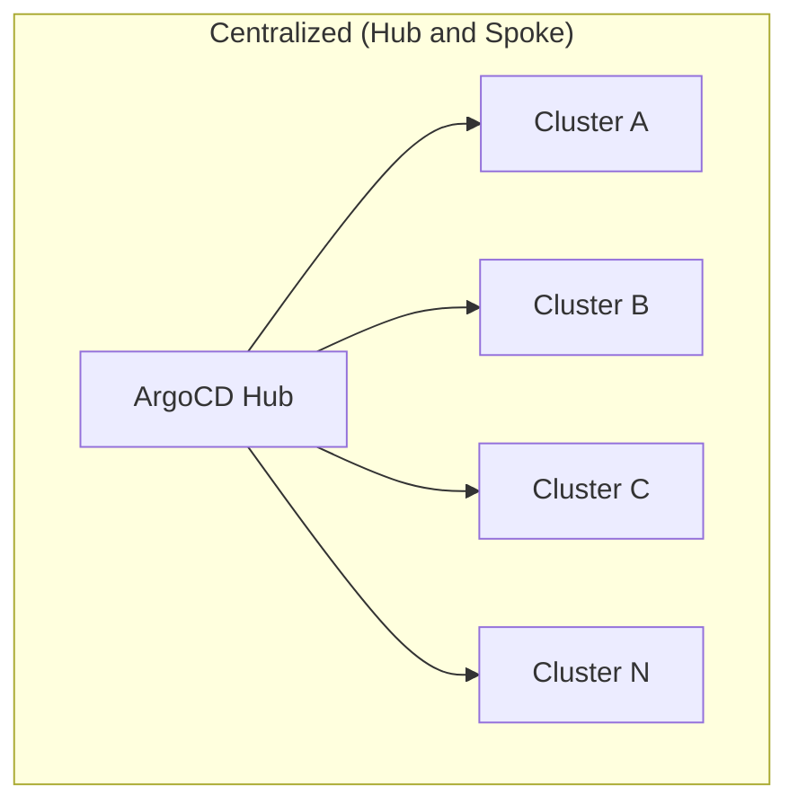
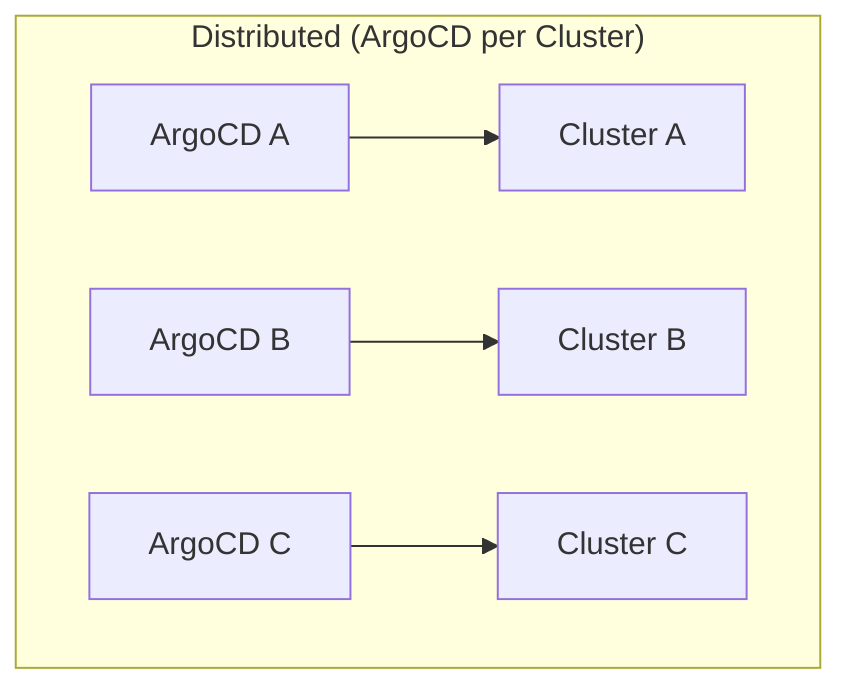

# How to Manage Multiple Clusters from a Single ArgoCD Instance

Author: [nawazdhandala](https://github.com/nawazdhandala)

Tags: ArgoCD, GitOps, Kubernetes, Multi-Cluster, DevOps

Description: Learn how to manage multiple Kubernetes clusters from a single ArgoCD instance using ApplicationSets, cluster generators, project isolation, and scaling strategies for enterprise environments.

---

Running separate ArgoCD instances for each cluster creates operational overhead. A single ArgoCD instance managing multiple clusters is the more common pattern for teams that need centralized visibility and control. But scaling ArgoCD to handle dozens or hundreds of clusters introduces challenges around performance, security isolation, and credential management.

In this guide, I will show you how to set up and scale a single ArgoCD instance for multi-cluster management, from the initial setup to handling production-scale deployments.

## Architecture Options

There are two main architectures for multi-cluster ArgoCD:





The centralized model gives you:
- Single dashboard for all clusters
- Consistent configuration across clusters
- Easier RBAC management
- Reduced operational overhead

The trade-off is a single point of failure and more complex scaling requirements.

## Step 1: Register All Clusters

First, register each cluster with labels for organization:

```yaml
# clusters/staging.yaml
apiVersion: v1
kind: Secret
metadata:
  name: staging-cluster
  namespace: argocd
  labels:
    argocd.argoproj.io/secret-type: cluster
    environment: staging
    region: us-east-1
    tier: non-production
type: Opaque
stringData:
  name: staging
  server: "https://staging.k8s.example.com"
  config: |
    {
      "bearerToken": "<token>",
      "tlsClientConfig": {
        "insecure": false,
        "caData": "<ca>"
      }
    }

---
# clusters/production-east.yaml
apiVersion: v1
kind: Secret
metadata:
  name: production-east-cluster
  namespace: argocd
  labels:
    argocd.argoproj.io/secret-type: cluster
    environment: production
    region: us-east-1
    tier: production
type: Opaque
stringData:
  name: production-east
  server: "https://prod-east.k8s.example.com"
  config: |
    {
      "bearerToken": "<token>",
      "tlsClientConfig": {
        "insecure": false,
        "caData": "<ca>"
      }
    }

---
# clusters/production-west.yaml
apiVersion: v1
kind: Secret
metadata:
  name: production-west-cluster
  namespace: argocd
  labels:
    argocd.argoproj.io/secret-type: cluster
    environment: production
    region: us-west-2
    tier: production
type: Opaque
stringData:
  name: production-west
  server: "https://prod-west.k8s.example.com"
  config: |
    {
      "bearerToken": "<token>",
      "tlsClientConfig": {
        "insecure": false,
        "caData": "<ca>"
      }
    }
```

## Step 2: Use ApplicationSets for Multi-Cluster Deployments

ApplicationSets automate deploying the same application to multiple clusters:

### Cluster Generator

Deploy to all clusters matching a label:

```yaml
apiVersion: argoproj.io/v1alpha1
kind: ApplicationSet
metadata:
  name: platform-monitoring
  namespace: argocd
spec:
  generators:
    - clusters:
        selector:
          matchLabels:
            tier: production
  template:
    metadata:
      name: 'monitoring-{{name}}'
    spec:
      project: infrastructure
      source:
        repoURL: https://github.com/your-org/platform.git
        targetRevision: main
        path: monitoring/overlays/production
      destination:
        server: '{{server}}'
        namespace: monitoring
      syncPolicy:
        automated:
          selfHeal: true
          prune: true
        syncOptions:
          - CreateNamespace=true
```

### Matrix Generator for Multi-Cluster Multi-App

Deploy multiple applications to multiple clusters:

```yaml
apiVersion: argoproj.io/v1alpha1
kind: ApplicationSet
metadata:
  name: microservices
  namespace: argocd
spec:
  generators:
    - matrix:
        generators:
          - clusters:
              selector:
                matchLabels:
                  environment: production
          - git:
              repoURL: https://github.com/your-org/services.git
              revision: main
              directories:
                - path: services/*
  template:
    metadata:
      name: '{{path.basename}}-{{name}}'
    spec:
      project: services
      source:
        repoURL: https://github.com/your-org/services.git
        targetRevision: main
        path: '{{path}}/overlays/production'
      destination:
        server: '{{server}}'
        namespace: '{{path.basename}}'
      syncPolicy:
        automated:
          selfHeal: true
          prune: true
```

## Step 3: Project-Based Isolation

Use ArgoCD Projects to isolate teams and restrict which clusters they can deploy to:

```yaml
# Team A can only deploy to staging
apiVersion: argoproj.io/v1alpha1
kind: AppProject
metadata:
  name: team-a
  namespace: argocd
spec:
  description: "Team A applications"
  sourceRepos:
    - "https://github.com/your-org/team-a-*"
  destinations:
    - server: "https://staging.k8s.example.com"
      namespace: "team-a-*"
  clusterResourceWhitelist:
    - group: ""
      kind: Namespace
  namespaceResourceWhitelist:
    - group: "*"
      kind: "*"

---
# Platform team can deploy to all clusters
apiVersion: argoproj.io/v1alpha1
kind: AppProject
metadata:
  name: platform
  namespace: argocd
spec:
  description: "Platform infrastructure"
  sourceRepos:
    - "https://github.com/your-org/platform-*"
  destinations:
    - server: "*"
      namespace: "*"
  clusterResourceWhitelist:
    - group: "*"
      kind: "*"
```

## Step 4: Scaling ArgoCD for Many Clusters

### Controller Sharding

For more than 10-15 clusters, shard the application controller:

```yaml
# argocd-cmd-params-cm ConfigMap
apiVersion: v1
kind: ConfigMap
metadata:
  name: argocd-cmd-params-cm
  namespace: argocd
data:
  # Enable controller sharding
  controller.sharding.algorithm: "round-robin"
```

Scale the controller replicas:

```bash
kubectl scale statefulset argocd-application-controller \
  -n argocd \
  --replicas=3
```

Each controller replica manages a subset of clusters, distributing the load.

### Repo Server Scaling

```yaml
apiVersion: apps/v1
kind: Deployment
metadata:
  name: argocd-repo-server
  namespace: argocd
spec:
  replicas: 3
  template:
    spec:
      containers:
        - name: argocd-repo-server
          resources:
            requests:
              memory: "512Mi"
              cpu: "500m"
            limits:
              memory: "1Gi"
              cpu: "1000m"
```

### API Server Scaling

```yaml
apiVersion: apps/v1
kind: Deployment
metadata:
  name: argocd-server
  namespace: argocd
spec:
  replicas: 3
```

### Redis HA

For high availability, use Redis Sentinel:

```yaml
apiVersion: argoproj.io/v1alpha1
kind: Application
metadata:
  name: argocd-redis-ha
  namespace: argocd
spec:
  source:
    repoURL: https://github.com/argoproj/argo-cd.git
    targetRevision: v2.10.0
    path: manifests/ha/install
```

## Step 5: Git Repository Structure

Organize your repository for multi-cluster management:

```
gitops-repo/
  clusters/              # Cluster registration secrets
    staging.yaml
    production-east.yaml
    production-west.yaml

  platform/              # Shared platform services
    monitoring/
      base/
      overlays/
        staging/
        production/
    ingress-nginx/
      base/
      overlays/
        staging/
        production/

  services/              # Application services
    service-a/
      base/
      overlays/
        staging/
        production/
    service-b/
      base/
      overlays/
        staging/
        production/

  applicationsets/       # ApplicationSet definitions
    platform.yaml
    services.yaml
```

## Step 6: Centralized Monitoring

Monitor all clusters from the ArgoCD dashboard and metrics:

```yaml
# Grafana dashboard query examples

# Applications per cluster
argocd_app_info{dest_server!=""}

# Sync status across all clusters
count by (sync_status) (argocd_app_info)

# Health status by cluster
count by (dest_server, health_status) (argocd_app_info)
```

Set up alerts for cross-cluster issues:

```yaml
apiVersion: monitoring.coreos.com/v1
kind: PrometheusRule
metadata:
  name: argocd-multi-cluster-alerts
spec:
  groups:
    - name: argocd-clusters
      rules:
        - alert: ClusterDisconnected
          expr: |
            argocd_cluster_info{server!="https://kubernetes.default.svc"} == 0
          for: 5m
          labels:
            severity: critical
          annotations:
            summary: "ArgoCD lost connection to cluster {{ $labels.server }}"

        - alert: ClusterSyncFailures
          expr: |
            sum by (dest_server) (
              argocd_app_info{sync_status="Unknown"}
            ) > 3
          for: 10m
          labels:
            severity: warning
          annotations:
            summary: "Multiple sync failures on cluster {{ $labels.dest_server }}"
```

## Step 7: Disaster Recovery

For a single ArgoCD instance managing all clusters, DR planning is critical:

```bash
# Backup ArgoCD configuration
argocd admin export > argocd-backup.yaml

# This exports:
# - Applications
# - Projects
# - Repositories
# - Clusters
# - Settings

# Restore from backup
argocd admin import < argocd-backup.yaml
```

Automate backups:

```yaml
apiVersion: batch/v1
kind: CronJob
metadata:
  name: argocd-backup
  namespace: argocd
spec:
  schedule: "0 */6 * * *"  # Every 6 hours
  jobTemplate:
    spec:
      template:
        spec:
          containers:
            - name: backup
              image: quay.io/argoproj/argocd:v2.10.0
              command:
                - /bin/sh
                - -c
                - |
                  argocd admin export > /backup/argocd-$(date +%Y%m%d%H%M).yaml
              volumeMounts:
                - name: backup-volume
                  mountPath: /backup
          volumes:
            - name: backup-volume
              persistentVolumeClaim:
                claimName: argocd-backup-pvc
          restartPolicy: OnFailure
```

## Summary

Managing multiple clusters from a single ArgoCD instance is the standard approach for most organizations. The key components are cluster registration with descriptive labels, ApplicationSets for automated multi-cluster deployments, Projects for team isolation, and proper scaling configuration for the ArgoCD components. As you grow beyond 15-20 clusters, controller sharding and Redis HA become essential. For the initial cluster registration steps, see our guides on adding [EKS](https://oneuptime.com/blog/post/2026-02-26-argocd-add-eks-cluster/view), [GKE](https://oneuptime.com/blog/post/2026-02-26-argocd-add-gke-cluster/view), and [AKS](https://oneuptime.com/blog/post/2026-02-26-argocd-add-aks-cluster/view) clusters to ArgoCD.
