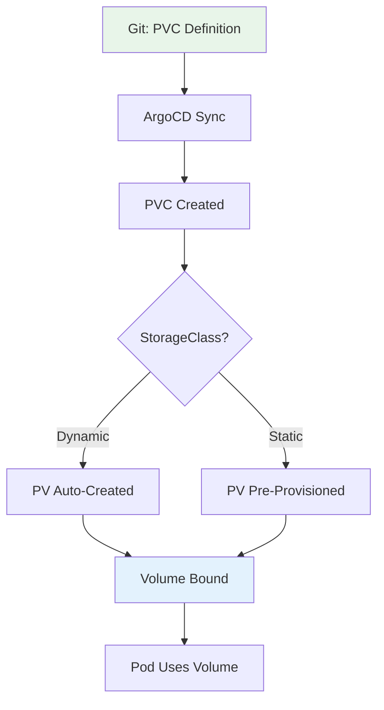

# How to Manage PersistentVolume Configurations with ArgoCD

Author: [nawazdhandala](https://github.com/nawazdhandala)

Tags: ArgoCD, GitOps, Kubernetes, Storage, PersistentVolume

Description: Learn how to manage Kubernetes PersistentVolume and PersistentVolumeClaim configurations with ArgoCD for reliable stateful storage management through GitOps.

---

PersistentVolumes (PVs) and PersistentVolumeClaims (PVCs) are how Kubernetes handles stateful storage. While dynamic provisioning through StorageClasses handles most cases, there are scenarios where you need to pre-provision PVs or carefully manage PVC configurations. ArgoCD can manage these storage resources through Git, but you need to understand the lifecycle implications to avoid data loss.

This guide covers managing PV and PVC configurations with ArgoCD, including the nuances of stateful resource management in a GitOps workflow.

## PV/PVC Lifecycle in GitOps

The relationship between PVs, PVCs, and ArgoCD requires careful consideration:



Key concern: If ArgoCD prunes a PVC, the underlying data may be deleted depending on the reclaim policy. This is one area where you need to be extra careful with GitOps.

## Managing PVCs with ArgoCD

### Basic PVC in an Application

```yaml
apiVersion: v1
kind: PersistentVolumeClaim
metadata:
  name: app-data
  namespace: production
  annotations:
    # Prevent ArgoCD from deleting this PVC
    argocd.argoproj.io/sync-options: Delete=false
spec:
  accessModes:
    - ReadWriteOnce
  storageClassName: fast-ssd
  resources:
    requests:
      storage: 50Gi
```

The `Delete=false` annotation is critical - it prevents ArgoCD from deleting the PVC if you remove it from Git, protecting your data.

### PVC with Specific Selector

For pre-provisioned PVs, use label selectors:

```yaml
apiVersion: v1
kind: PersistentVolumeClaim
metadata:
  name: database-data
  namespace: production
  annotations:
    argocd.argoproj.io/sync-options: Delete=false
spec:
  accessModes:
    - ReadWriteOnce
  storageClassName: ""  # Empty string prevents dynamic provisioning
  resources:
    requests:
      storage: 100Gi
  selector:
    matchLabels:
      app: database
      environment: production
```

## Pre-Provisioning PersistentVolumes

For static provisioning, define PVs in Git:

### NFS PersistentVolume

```yaml
apiVersion: v1
kind: PersistentVolume
metadata:
  name: nfs-shared-data
  labels:
    type: nfs
    environment: production
spec:
  capacity:
    storage: 500Gi
  accessModes:
    - ReadWriteMany
  persistentVolumeReclaimPolicy: Retain
  nfs:
    server: nfs-server.example.com
    path: /exports/shared-data
  mountOptions:
    - hard
    - nfsvers=4.1
    - rsize=1048576
    - wsize=1048576
```

### Local PersistentVolume

```yaml
apiVersion: v1
kind: PersistentVolume
metadata:
  name: local-ssd-node1
  labels:
    type: local-ssd
    node: worker-1
spec:
  capacity:
    storage: 200Gi
  accessModes:
    - ReadWriteOnce
  persistentVolumeReclaimPolicy: Retain
  storageClassName: local-ssd
  local:
    path: /mnt/ssd/data
  nodeAffinity:
    required:
      nodeSelectorTerms:
        - matchExpressions:
            - key: kubernetes.io/hostname
              operator: In
              values:
                - worker-1
```

### AWS EBS Pre-Provisioned Volume

```yaml
apiVersion: v1
kind: PersistentVolume
metadata:
  name: ebs-database-prod
  labels:
    app: database
    environment: production
spec:
  capacity:
    storage: 100Gi
  accessModes:
    - ReadWriteOnce
  persistentVolumeReclaimPolicy: Retain
  storageClassName: fast-ssd
  csi:
    driver: ebs.csi.aws.com
    volumeHandle: vol-0a1b2c3d4e5f6g7h8
    fsType: ext4
  nodeAffinity:
    required:
      nodeSelectorTerms:
        - matchExpressions:
            - key: topology.ebs.csi.aws.com/zone
              operator: In
              values:
                - us-east-1a
```

## Repository Structure

```text
storage-config/
  base/
    kustomization.yaml
    storage-classes/
    persistent-volumes/
      nfs-shared.yaml
      local-volumes.yaml
  apps/
    database/
      kustomization.yaml
      pvc.yaml
      statefulset.yaml
    elasticsearch/
      kustomization.yaml
      pvc.yaml
      statefulset.yaml
  overlays/
    production/
      kustomization.yaml
      patches/
        pvc-sizes.yaml
    staging/
      kustomization.yaml
      patches/
        pvc-sizes.yaml
```

## ArgoCD Application for Storage Resources

```yaml
# Cluster-scoped PVs
apiVersion: argoproj.io/v1alpha1
kind: Application
metadata:
  name: persistent-volumes
  namespace: argocd
spec:
  project: infrastructure
  source:
    repoURL: https://github.com/your-org/storage-config
    path: base/persistent-volumes
    targetRevision: main
  destination:
    server: https://kubernetes.default.svc
  syncPolicy:
    automated:
      selfHeal: true
      # IMPORTANT: Do NOT enable prune for PV management
      prune: false
    syncOptions:
      - ServerSideApply=true

---
# Namespace-scoped PVCs (per application)
apiVersion: argoproj.io/v1alpha1
kind: Application
metadata:
  name: database-storage
  namespace: argocd
spec:
  project: apps
  source:
    repoURL: https://github.com/your-org/storage-config
    path: apps/database
    targetRevision: main
  destination:
    server: https://kubernetes.default.svc
    namespace: production
  syncPolicy:
    automated:
      selfHeal: true
      prune: false  # Never auto-prune PVCs
```

## Protecting PVCs from Deletion

Multiple layers of protection:

### 1. Resource Annotation

```yaml
metadata:
  annotations:
    argocd.argoproj.io/sync-options: Delete=false
```

### 2. Finalizer Protection

```yaml
metadata:
  finalizers:
    - kubernetes.io/pvc-protection
```

### 3. ArgoCD Project Restrictions

```yaml
apiVersion: argoproj.io/v1alpha1
kind: AppProject
metadata:
  name: apps
  namespace: argocd
spec:
  # Deny deletion of PVCs
  orphanedResources:
    warn: true
  # Restrict which resources can be pruned
  syncWindows:
    - kind: deny
      schedule: "* * * * *"
      duration: 8760h
      applications: ["*"]
      manualSync: true
      # Only deny automatic pruning of PVCs
      clusters: ["*"]
      namespaces: ["*"]
```

### 4. Disable Prune on Sync Policy

```yaml
syncPolicy:
  automated:
    prune: false  # Never auto-delete resources
```

## Resizing PVCs Through GitOps

PVC resize is supported when `allowVolumeExpansion: true` on the StorageClass:

```yaml
# Original PVC
apiVersion: v1
kind: PersistentVolumeClaim
metadata:
  name: database-data
spec:
  resources:
    requests:
      storage: 50Gi  # Original size
```

To resize, update in Git:

```yaml
# Updated PVC - increase size
apiVersion: v1
kind: PersistentVolumeClaim
metadata:
  name: database-data
spec:
  resources:
    requests:
      storage: 100Gi  # New size
```

ArgoCD syncs the change, and Kubernetes handles the resize. Note that shrinking PVCs is not supported.

## StatefulSet Volume Templates

StatefulSets create PVCs from templates. Managing these with ArgoCD requires understanding that:

1. The PVC template is part of the StatefulSet spec
2. Once created, PVCs are not updated when the template changes
3. Deleting the StatefulSet does not delete the PVCs

```yaml
apiVersion: apps/v1
kind: StatefulSet
metadata:
  name: elasticsearch
  namespace: production
spec:
  serviceName: elasticsearch
  replicas: 3
  selector:
    matchLabels:
      app: elasticsearch
  template:
    metadata:
      labels:
        app: elasticsearch
    spec:
      containers:
        - name: elasticsearch
          image: elasticsearch:8.12.0
          volumeMounts:
            - name: data
              mountPath: /usr/share/elasticsearch/data
  volumeClaimTemplates:
    - metadata:
        name: data
        annotations:
          argocd.argoproj.io/sync-options: Delete=false
      spec:
        accessModes: ["ReadWriteOnce"]
        storageClassName: fast-ssd
        resources:
          requests:
            storage: 100Gi
```

## Monitoring PV/PVC Health

```promql
# PVCs in pending state
kube_persistentvolumeclaim_status_phase{phase="Pending"}

# PV capacity vs usage
kubelet_volume_stats_used_bytes
  / kubelet_volume_stats_capacity_bytes * 100

# PVs at risk of filling up
(
  kubelet_volume_stats_used_bytes
  / kubelet_volume_stats_capacity_bytes
) > 0.85

# Unbound PVs
kube_persistentvolume_status_phase{phase="Available"}
```

## Alerting on Storage Issues

```yaml
apiVersion: monitoring.coreos.com/v1
kind: PrometheusRule
metadata:
  name: storage-alerts
  namespace: monitoring
spec:
  groups:
    - name: storage
      rules:
        - alert: PVCAlmostFull
          expr: >
            kubelet_volume_stats_used_bytes
            / kubelet_volume_stats_capacity_bytes > 0.85
          for: 15m
          labels:
            severity: warning
          annotations:
            summary: >
              PVC {{ $labels.persistentvolumeclaim }} in
              {{ $labels.namespace }} is {{ $value | humanizePercentage }} full

        - alert: PVCPending
          expr: >
            kube_persistentvolumeclaim_status_phase{phase="Pending"} == 1
          for: 15m
          labels:
            severity: warning
          annotations:
            summary: >
              PVC {{ $labels.persistentvolumeclaim }} has been
              pending for more than 15 minutes
```

## Summary

Managing PersistentVolume configurations with ArgoCD requires extra care around data protection. Always disable pruning for PVC resources, use the `Delete=false` sync option, and set reclaim policies to Retain for critical data. Use dynamic provisioning through StorageClasses when possible, and reserve static PV provisioning for special cases like NFS shares and pre-existing cloud volumes. Monitor PVC health actively and alert before volumes fill up.
