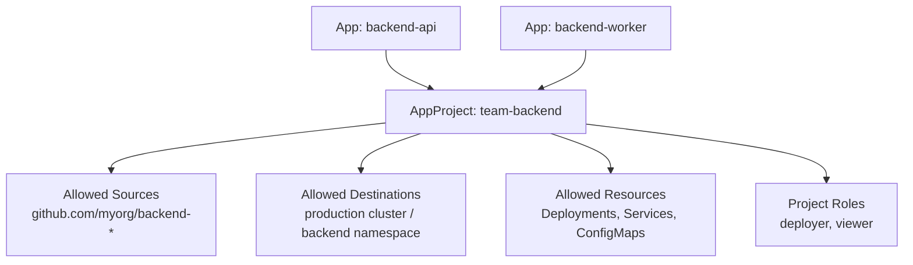

# How to Manage ArgoCD Projects Declaratively

Author: [nawazdhandala](https://github.com/nawazdhandala)

Tags: ArgoCD, GitOps, Kubernetes, RBAC, Multi-Tenancy

Description: Learn how to define ArgoCD AppProjects as declarative YAML manifests stored in Git for reproducible multi-tenant access control and team isolation.

---

ArgoCD Projects (AppProjects) control which repositories applications can pull from, which clusters and namespaces they can deploy to, and which resource types they can create. Managing these through the UI works for small setups, but for production multi-tenant environments, you need declarative project definitions stored in Git. This ensures that access controls are version-controlled, reviewable, and reproducible.

## What Are ArgoCD Projects?

An AppProject is a Kubernetes custom resource that defines a set of restrictions for applications. Every application belongs to a project. If you have not created any projects, your applications use the `default` project, which has no restrictions.



## Your First Declarative Project

Here is a basic AppProject manifest:

```yaml
# projects/team-backend.yaml
apiVersion: argoproj.io/v1alpha1
kind: AppProject
metadata:
  name: team-backend
  namespace: argocd
  # Finalizer prevents accidental deletion
  finalizers:
    - resources-finalizer.argocd.argoproj.io
spec:
  description: "Backend team's applications"

  # Only allow sourcing from these repositories
  sourceRepos:
    - 'https://github.com/myorg/backend-api.git'
    - 'https://github.com/myorg/backend-worker.git'
    - 'https://charts.example.com'

  # Only allow deploying to these destinations
  destinations:
    - server: https://kubernetes.default.svc
      namespace: backend
    - server: https://kubernetes.default.svc
      namespace: backend-staging

  # Allowed Kubernetes resource types
  clusterResourceWhitelist: []  # No cluster-scoped resources

  namespaceResourceWhitelist:
    - group: 'apps'
      kind: Deployment
    - group: 'apps'
      kind: StatefulSet
    - group: ''
      kind: Service
    - group: ''
      kind: ConfigMap
    - group: ''
      kind: Secret
    - group: 'networking.k8s.io'
      kind: Ingress
```

Apply it:

```bash
kubectl apply -f projects/team-backend.yaml
```

## Directory Structure for Declarative Projects

Organize your project manifests alongside your application manifests:

```text
argocd-config/
  projects/
    team-backend.yaml
    team-frontend.yaml
    team-platform.yaml
    team-data.yaml
    infrastructure.yaml
  applications/
    production/
      ...
    staging/
      ...
```

Each team gets its own project file. Changes go through pull requests, giving you a clear audit trail of who changed access controls and when.

## Restricting Source Repositories

The `sourceRepos` field controls which Git repositories or Helm chart repositories applications in this project can use:

```yaml
spec:
  sourceRepos:
    # Specific repositories
    - 'https://github.com/myorg/backend-api.git'
    - 'https://github.com/myorg/backend-worker.git'

    # Wildcard to allow all repos under an org
    - 'https://github.com/myorg/*'

    # Helm chart repository
    - 'https://charts.bitnami.com/bitnami'

    # Allow all repositories (not recommended for production)
    # - '*'
```

Using wildcards with the org prefix is a good balance between security and flexibility.

## Restricting Destinations

The `destinations` field controls where applications can deploy:

```yaml
spec:
  destinations:
    # Specific cluster and namespace
    - server: https://kubernetes.default.svc
      namespace: backend

    # Any namespace on a specific cluster
    - server: https://kubernetes.prod.example.com
      namespace: '*'

    # Specific namespace on any cluster
    - server: '*'
      namespace: backend

    # Named cluster (requires cluster to be registered with this name)
    - name: production
      namespace: backend
```

For multi-cluster setups, using cluster names instead of server URLs makes the configuration more readable:

```yaml
spec:
  destinations:
    - name: production-us
      namespace: backend
    - name: production-eu
      namespace: backend
    - name: staging
      namespace: backend
```

## Controlling Resource Types

You can limit which Kubernetes resource types applications in a project can manage. This is important for preventing teams from creating resources they should not control:

```yaml
spec:
  # Cluster-scoped resources (namespaces, CRDs, ClusterRoles, etc.)
  clusterResourceWhitelist:
    # Allow nothing cluster-scoped
    []

  # Or allow specific cluster resources
  # clusterResourceWhitelist:
  #   - group: ''
  #     kind: Namespace

  # Namespace-scoped resources
  namespaceResourceWhitelist:
    - group: 'apps'
      kind: Deployment
    - group: 'apps'
      kind: StatefulSet
    - group: 'apps'
      kind: ReplicaSet
    - group: ''
      kind: Service
    - group: ''
      kind: ConfigMap
    - group: ''
      kind: Secret
    - group: ''
      kind: ServiceAccount
    - group: 'networking.k8s.io'
      kind: Ingress
    - group: 'autoscaling'
      kind: HorizontalPodAutoscaler

  # Alternatively, deny specific types (blacklist approach)
  namespaceResourceBlacklist:
    - group: ''
      kind: LimitRange
    - group: ''
      kind: ResourceQuota
```

## Adding Project Roles

Project roles let you define fine-grained access control within a project:

```yaml
spec:
  roles:
    # A role for CI/CD service accounts
    - name: deployer
      description: "Can sync applications"
      policies:
        - p, proj:team-backend:deployer, applications, sync, team-backend/*, allow
        - p, proj:team-backend:deployer, applications, get, team-backend/*, allow

    # A role for developers (read-only)
    - name: viewer
      description: "Can view applications"
      policies:
        - p, proj:team-backend:viewer, applications, get, team-backend/*, allow
      groups:
        - backend-developers  # Maps to an OIDC/LDAP group
```

The policy format is:

```text
p, <role>, <resource>, <action>, <project>/<object>, <allow/deny>
```

## Configuring Sync Windows per Project

Sync windows restrict when applications can be synced:

```yaml
spec:
  syncWindows:
    # Allow syncs only during business hours
    - kind: allow
      schedule: '0 9-17 * * 1-5'  # Mon-Fri 9am to 5pm
      duration: 8h
      applications:
        - '*'
      namespaces:
        - 'backend'

    # Deny syncs during maintenance windows
    - kind: deny
      schedule: '0 2 * * 0'  # Sunday 2am
      duration: 4h
      applications:
        - '*'
```

## Configuring Orphaned Resource Monitoring

Detect resources in the project's destination namespaces that are not managed by any ArgoCD application:

```yaml
spec:
  orphanedResources:
    warn: true
    ignore:
      # Ignore specific resource types
      - group: ''
        kind: ConfigMap
        name: 'kube-root-ca.crt'
      - group: ''
        kind: ServiceAccount
        name: 'default'
```

## Full Production Project Example

Here is a comprehensive project definition for a production team:

```yaml
# projects/team-backend.yaml
apiVersion: argoproj.io/v1alpha1
kind: AppProject
metadata:
  name: team-backend
  namespace: argocd
  finalizers:
    - resources-finalizer.argocd.argoproj.io
  labels:
    team: backend
    managed-by: argocd-config
spec:
  description: "Backend team production and staging applications"

  sourceRepos:
    - 'https://github.com/myorg/backend-*'
    - 'https://charts.bitnami.com/bitnami'

  destinations:
    - name: production
      namespace: backend
    - name: staging
      namespace: backend-staging

  clusterResourceWhitelist: []

  namespaceResourceWhitelist:
    - group: 'apps'
      kind: Deployment
    - group: 'apps'
      kind: StatefulSet
    - group: ''
      kind: Service
    - group: ''
      kind: ConfigMap
    - group: ''
      kind: Secret
    - group: ''
      kind: ServiceAccount
    - group: 'networking.k8s.io'
      kind: Ingress
    - group: 'autoscaling'
      kind: HorizontalPodAutoscaler
    - group: 'batch'
      kind: Job
    - group: 'batch'
      kind: CronJob

  roles:
    - name: deployer
      description: "CI/CD sync access"
      policies:
        - p, proj:team-backend:deployer, applications, sync, team-backend/*, allow
        - p, proj:team-backend:deployer, applications, get, team-backend/*, allow
    - name: admin
      description: "Full project access"
      policies:
        - p, proj:team-backend:admin, applications, *, team-backend/*, allow
      groups:
        - backend-leads
    - name: viewer
      description: "Read-only access"
      policies:
        - p, proj:team-backend:viewer, applications, get, team-backend/*, allow
      groups:
        - backend-developers

  syncWindows:
    - kind: deny
      schedule: '0 0 25 12 *'
      duration: 48h
      applications: ['*']

  orphanedResources:
    warn: true
```

## Applying Projects with ArgoCD

Just like applications, you can have ArgoCD manage your project definitions:

```yaml
# root-projects.yaml
apiVersion: argoproj.io/v1alpha1
kind: Application
metadata:
  name: argocd-projects
  namespace: argocd
spec:
  project: default
  source:
    repoURL: https://github.com/myorg/argocd-config.git
    targetRevision: main
    path: projects
  destination:
    server: https://kubernetes.default.svc
    namespace: argocd
  syncPolicy:
    automated:
      prune: false  # Do not auto-delete projects
      selfHeal: true
```

Note that `prune` is set to false for projects. Accidentally deleting a project could break all applications that reference it.

## Validating Projects

Before applying, validate your project manifests:

```bash
# Dry-run the project
kubectl apply -f projects/team-backend.yaml --dry-run=server

# List existing projects
argocd proj list

# Check project details
argocd proj get team-backend
```

Declarative project management is essential for multi-tenant ArgoCD environments. It ensures that access controls are consistent, auditable, and recoverable. Combined with [declarative application management](https://oneuptime.com/blog/post/2026-02-26-argocd-manage-applications-declaratively/view), it gives you a fully GitOps-driven ArgoCD configuration.
