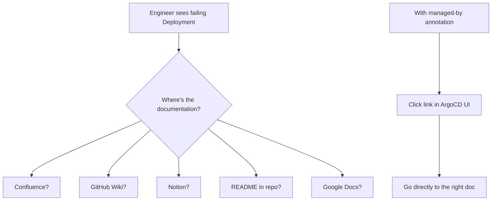

# How to Use Managed By Annotation for Documentation

Author: [nawazdhandala](https://github.com/nawazdhandala)

Tags: ArgoCD, GitOps, Kubernetes, Annotations, Documentation

Description: Learn how to use the ArgoCD managed-by annotation as a documentation bridge, linking resources to runbooks, architecture docs, and team wikis.

---

Documentation is most useful when it is discoverable at the point of need. When an on-call engineer is investigating a failing deployment at 2 AM, they should not have to search through Confluence, Google Docs, and Notion to find the relevant runbook. The ArgoCD managed-by annotation creates a direct link from the resource in question to its documentation, making critical information accessible in a single click from the ArgoCD UI.

## The Documentation Problem

In most organizations, documentation for a Kubernetes service is scattered across multiple locations:



The managed-by annotation solves this by embedding the documentation URL directly on the resource.

## Linking to Runbooks

Runbooks are the most valuable documentation during incidents. Link them directly to the resources they describe:

```yaml
apiVersion: apps/v1
kind: Deployment
metadata:
  name: payment-gateway
  namespace: production
  annotations:
    # Link directly to the runbook for this service
    argocd.argoproj.io/managed-by: "https://runbooks.internal.company/services/payment-gateway"
spec:
  replicas: 3
  selector:
    matchLabels:
      app: payment-gateway
  template:
    metadata:
      labels:
        app: payment-gateway
    spec:
      containers:
        - name: payment-gateway
          image: myorg/payment-gateway:v4.2.0
```

For services with multiple runbooks, link to the index page:

```yaml
annotations:
  argocd.argoproj.io/managed-by: "https://runbooks.internal.company/services/payment-gateway/index"
```

## Linking to Architecture Documentation

Help engineers understand the big picture:

```yaml
# Database StatefulSet - link to data architecture docs
apiVersion: apps/v1
kind: StatefulSet
metadata:
  name: postgres-primary
  annotations:
    argocd.argoproj.io/managed-by: "https://wiki.internal.company/architecture/data-layer/postgres"
---
# Message queue - link to async architecture docs
apiVersion: apps/v1
kind: StatefulSet
metadata:
  name: rabbitmq
  annotations:
    argocd.argoproj.io/managed-by: "https://wiki.internal.company/architecture/messaging/rabbitmq"
---
# API gateway - link to networking architecture
apiVersion: apps/v1
kind: Deployment
metadata:
  name: api-gateway
  annotations:
    argocd.argoproj.io/managed-by: "https://wiki.internal.company/architecture/networking/api-gateway"
```

## Linking to Team Ownership

Make it clear which team owns each resource:

```yaml
apiVersion: apps/v1
kind: Deployment
metadata:
  name: user-service
  labels:
    team: identity
  annotations:
    # Link to the team's service catalog page
    argocd.argoproj.io/managed-by: "https://backstage.internal.company/catalog/default/component/user-service"
```

If you use Backstage, OpsLevel, or Cortex as your service catalog:

```yaml
# Backstage
argocd.argoproj.io/managed-by: "https://backstage.example.com/catalog/default/component/my-service"

# OpsLevel
argocd.argoproj.io/managed-by: "https://app.opslevel.com/services/my-service"

# Cortex
argocd.argoproj.io/managed-by: "https://app.cortex.io/catalog/my-service"
```

## Creating a Documentation Convention

Establish a standard pattern for your organization. Here is an example convention:

### Convention Table

| Resource Type | Link Target | Example |
|--------------|-------------|---------|
| Deployment | Service runbook | runbooks.company/services/{name} |
| StatefulSet | Data service docs | wiki.company/data/{name} |
| CronJob | Job documentation | wiki.company/jobs/{name} |
| ConfigMap | Configuration guide | wiki.company/config/{name} |
| Secret | Secret management guide | wiki.company/security/secrets/{name} |
| Ingress | Networking docs | wiki.company/networking/{name} |
| PVC | Storage docs | wiki.company/storage/{name} |

### Implementation with Kustomize

Enforce the convention through Kustomize patches:

```yaml
# kustomization.yaml
apiVersion: kustomize.config.k8s.io/v1beta1
kind: Kustomization

resources:
  - deployment.yaml
  - statefulset.yaml
  - cronjob.yaml

patches:
  # All Deployments link to their runbook
  - target:
      kind: Deployment
    patch: |
      - op: add
        path: /metadata/annotations/argocd.argoproj.io~1managed-by
        value: "https://runbooks.internal.company/services/REPLACE_WITH_NAME"

  # All StatefulSets link to data docs
  - target:
      kind: StatefulSet
    patch: |
      - op: add
        path: /metadata/annotations/argocd.argoproj.io~1managed-by
        value: "https://wiki.internal.company/data/REPLACE_WITH_NAME"
```

## Using Deep Links for Multiple Documentation Types

When a resource needs links to multiple types of documentation, combine managed-by with ArgoCD deep links:

```yaml
apiVersion: v1
kind: ConfigMap
metadata:
  name: argocd-cm
  namespace: argocd
data:
  resource.links: |
    - url: "https://runbooks.internal.company/services/{{.Name}}"
      title: Service Runbook
      description: Operational runbook for this service
      icon: book
      if: kind == "Deployment"
    - url: "https://wiki.internal.company/architecture/services/{{.Name}}"
      title: Architecture Docs
      description: Architecture documentation
      icon: file-text
      if: kind == "Deployment"
    - url: "https://github.com/myorg/{{.Name}}/blob/main/README.md"
      title: README
      description: Service README
      icon: github
      if: kind == "Deployment"
    - url: "https://wiki.internal.company/slo/{{.Namespace}}/{{.Name}}"
      title: SLO Dashboard
      description: Service Level Objectives
      icon: activity
      if: kind == "Deployment"
```

This gives each Deployment four documentation links in the ArgoCD UI.

## Automating Documentation Links

### Script to Add Links to All Resources

```bash
#!/bin/bash
# add-doc-links.sh - Add documentation links to all deployments in a namespace

NAMESPACE="${1:-production}"
DOC_BASE="https://runbooks.internal.company/services"

echo "Adding documentation links to deployments in $NAMESPACE..."

for DEPLOY in $(kubectl get deployments -n "$NAMESPACE" -o name); do
  NAME=$(basename "$DEPLOY")
  DOC_URL="$DOC_BASE/$NAME"

  # Check if the doc page exists (optional)
  HTTP_STATUS=$(curl -s -o /dev/null -w "%{http_code}" "$DOC_URL" 2>/dev/null)

  if [ "$HTTP_STATUS" = "200" ]; then
    echo "  $NAME -> $DOC_URL (page exists)"
    kubectl annotate "$DEPLOY" -n "$NAMESPACE" \
      "argocd.argoproj.io/managed-by=$DOC_URL" --overwrite
  else
    echo "  $NAME -> $DOC_URL (page not found - $HTTP_STATUS, creating placeholder)"
    kubectl annotate "$DEPLOY" -n "$NAMESPACE" \
      "argocd.argoproj.io/managed-by=$DOC_BASE/create?service=$NAME" --overwrite
  fi
done
```

### Git Pre-Commit Hook

Enforce documentation links at commit time:

```bash
#!/bin/bash
# .git/hooks/pre-commit - Check that all Deployments have managed-by annotations

ERRORS=0

for file in $(git diff --cached --name-only --diff-filter=ACM | grep -E '\.ya?ml$'); do
  # Check if file contains a Deployment
  if grep -q "kind: Deployment" "$file"; then
    # Check for managed-by annotation
    if ! grep -q "argocd.argoproj.io/managed-by" "$file"; then
      echo "ERROR: $file contains a Deployment without argocd.argoproj.io/managed-by annotation"
      ERRORS=$((ERRORS + 1))
    fi
  fi
done

if [ $ERRORS -gt 0 ]; then
  echo ""
  echo "All Deployments must have an argocd.argoproj.io/managed-by annotation"
  echo "linking to their documentation."
  exit 1
fi
```

## Measuring Documentation Coverage

Track how many resources have documentation links:

```bash
#!/bin/bash
# doc-coverage.sh - Measure documentation link coverage

NAMESPACE="${1:-production}"

TOTAL=$(kubectl get deployments -n "$NAMESPACE" --no-headers | wc -l | tr -d ' ')
WITH_DOCS=$(kubectl get deployments -n "$NAMESPACE" -o json | \
  jq '[.items[] | select(.metadata.annotations["argocd.argoproj.io/managed-by"] != null)] | length')

COVERAGE=$((WITH_DOCS * 100 / TOTAL))

echo "Documentation Coverage for $NAMESPACE"
echo "  Total Deployments: $TOTAL"
echo "  With Doc Links: $WITH_DOCS"
echo "  Coverage: ${COVERAGE}%"

if [ $COVERAGE -lt 80 ]; then
  echo ""
  echo "Missing documentation links:"
  kubectl get deployments -n "$NAMESPACE" -o json | \
    jq -r '.items[] | select(.metadata.annotations["argocd.argoproj.io/managed-by"] == null) |
      "  - \(.metadata.name)"'
fi
```

## Keeping Documentation Links Up to Date

Documentation URLs can go stale. Periodically validate them:

```bash
#!/bin/bash
# validate-doc-links.sh - Check that documentation links are still valid

NAMESPACE="${1:-production}"
BROKEN=0

echo "Validating documentation links in $NAMESPACE..."

kubectl get all -n "$NAMESPACE" -o json | \
  jq -r '.items[] |
    select(.metadata.annotations["argocd.argoproj.io/managed-by"] != null) |
    "\(.kind)/\(.metadata.name) \(.metadata.annotations["argocd.argoproj.io/managed-by"])"' | \
  while read -r RESOURCE URL; do
    STATUS=$(curl -s -o /dev/null -w "%{http_code}" --max-time 5 "$URL" 2>/dev/null)
    if [ "$STATUS" != "200" ] && [ "$STATUS" != "301" ] && [ "$STATUS" != "302" ]; then
      echo "  BROKEN: $RESOURCE -> $URL (HTTP $STATUS)"
      BROKEN=$((BROKEN + 1))
    fi
  done

if [ $BROKEN -gt 0 ]; then
  echo ""
  echo "Found $BROKEN broken documentation links!"
fi
```

Using the managed-by annotation as a documentation bridge transforms ArgoCD from a deployment tool into a knowledge hub. Every resource becomes a starting point for understanding not just what is deployed, but why it exists, how it works, and what to do when it breaks. Start with runbook links for your most critical services, then expand coverage across your entire infrastructure.
