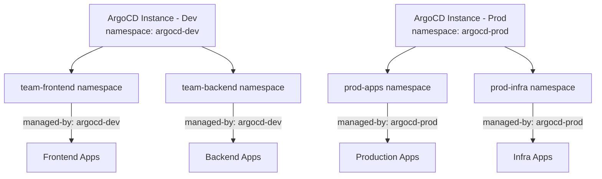

# How to Use argocd.argoproj.io/managed-by Annotation

Author: [nawazdhandala](https://github.com/nawazdhandala)

Tags: ArgoCD, GitOps, Kubernetes, Annotations, Configuration

Description: Learn how to use the argocd.argoproj.io/managed-by annotation in ArgoCD to delegate application management across namespaces and instances.

---

When you run ArgoCD in environments where multiple ArgoCD instances coexist, or where applications live in namespaces outside the default `argocd` namespace, the `argocd.argoproj.io/managed-by` annotation becomes essential. This annotation tells ArgoCD which instance should manage a given Application resource, preventing conflicts and enabling clean multi-instance setups.

## What Is the managed-by Annotation?

The `argocd.argoproj.io/managed-by` annotation is placed on ArgoCD Application resources (or on namespaces) to indicate which ArgoCD instance is responsible for managing them. This is particularly important when you enable the "Applications in Any Namespace" feature, which allows Application resources to exist outside the standard `argocd` namespace.

Without this annotation, an ArgoCD instance only watches its own namespace for Application resources. By adding `managed-by`, you explicitly tell a specific ArgoCD instance to pick up and reconcile applications from other namespaces.

## Why You Need It

There are several real-world scenarios where this annotation is critical:

**Multi-team isolation**: Different teams own different namespaces and want to define their Application resources in their own namespace rather than in the shared `argocd` namespace.

**Multiple ArgoCD instances**: In large organizations, you might have separate ArgoCD instances for different environments or business units. The annotation prevents one instance from accidentally managing another instance's applications.

**Namespace-scoped ArgoCD**: When running ArgoCD in a namespace-scoped mode (rather than cluster-scoped), the annotation controls which namespaces ArgoCD watches.

## Enabling Applications in Any Namespace

Before using the `managed-by` annotation, you need to configure ArgoCD to watch for applications outside its own namespace. This is done through the `argocd-cmd-params-cm` ConfigMap:

```yaml
# argocd-cmd-params-cm ConfigMap
apiVersion: v1
kind: ConfigMap
metadata:
  name: argocd-cmd-params-cm
  namespace: argocd
data:
  # Comma-separated list of namespaces ArgoCD should watch
  application.namespaces: "team-alpha, team-beta, team-gamma"
```

You can also use a wildcard to watch all namespaces:

```yaml
data:
  application.namespaces: "*"
```

After updating this ConfigMap, restart the ArgoCD application controller and API server to pick up the changes.

## Using the managed-by Annotation on Namespaces

The most common pattern is to annotate the namespace itself, so all Application resources created in that namespace are automatically managed by the specified ArgoCD instance:

```yaml
# Namespace with managed-by annotation
apiVersion: v1
kind: Namespace
metadata:
  name: team-alpha
  annotations:
    argocd.argoproj.io/managed-by: argocd
```

The value `argocd` refers to the namespace where the managing ArgoCD instance is installed. If your ArgoCD lives in a different namespace, use that namespace name instead:

```yaml
annotations:
  argocd.argoproj.io/managed-by: argocd-production
```

## Using the Annotation on Application Resources

You can also place the annotation directly on individual Application resources:

```yaml
# Application resource in team-alpha namespace
apiVersion: argoproj.io/v1alpha1
kind: Application
metadata:
  name: my-app
  namespace: team-alpha
  annotations:
    argocd.argoproj.io/managed-by: argocd
spec:
  project: team-alpha-project
  source:
    repoURL: https://github.com/team-alpha/k8s-manifests.git
    targetRevision: HEAD
    path: apps/my-app
  destination:
    server: https://kubernetes.default.svc
    namespace: my-app-ns
  syncPolicy:
    automated:
      selfHeal: true
      prune: true
```

This tells the ArgoCD instance in the `argocd` namespace to manage this application, even though the Application resource lives in `team-alpha`.

## Multi-Instance ArgoCD Setup

In a multi-instance setup, the `managed-by` annotation is what keeps things from getting tangled. Consider this architecture:



Here is how you would configure each namespace:

```yaml
# Dev team namespaces
apiVersion: v1
kind: Namespace
metadata:
  name: team-frontend
  annotations:
    argocd.argoproj.io/managed-by: argocd-dev
---
apiVersion: v1
kind: Namespace
metadata:
  name: team-backend
  annotations:
    argocd.argoproj.io/managed-by: argocd-dev
---
# Production namespaces
apiVersion: v1
kind: Namespace
metadata:
  name: prod-apps
  annotations:
    argocd.argoproj.io/managed-by: argocd-prod
---
apiVersion: v1
kind: Namespace
metadata:
  name: prod-infra
  annotations:
    argocd.argoproj.io/managed-by: argocd-prod
```

## Project Configuration for Cross-Namespace Applications

When using applications in external namespaces, you need to update the AppProject to allow source namespaces:

```yaml
apiVersion: argoproj.io/v1alpha1
kind: AppProject
metadata:
  name: team-alpha-project
  namespace: argocd
spec:
  description: Team Alpha project
  # Allow applications from this namespace
  sourceNamespaces:
    - team-alpha
  sourceRepos:
    - 'https://github.com/team-alpha/*'
  destinations:
    - namespace: 'team-alpha-*'
      server: https://kubernetes.default.svc
  clusterResourceWhitelist:
    - group: ''
      kind: Namespace
```

The `sourceNamespaces` field is the key piece here - it tells the project to accept Application resources from the `team-alpha` namespace.

## RBAC Considerations

When applications live outside the ArgoCD namespace, you need to make sure RBAC policies account for the namespace context. Here is an example policy that grants access based on the application's namespace:

```csv
# argocd-rbac-cm
p, role:team-alpha, applications, get, team-alpha-project/*, allow
p, role:team-alpha, applications, sync, team-alpha-project/*, allow
p, role:team-alpha, applications, create, team-alpha-project/*, allow
p, role:team-alpha, applications, delete, team-alpha-project/*, allow
```

## Troubleshooting Common Issues

**Application not appearing in ArgoCD UI**: Verify the `application.namespaces` setting includes the namespace, and confirm the `managed-by` annotation value matches the ArgoCD instance namespace exactly.

**Permission denied errors**: Check that the ArgoCD service account has RBAC permissions to read Application resources in the target namespace. You may need to create additional ClusterRoleBindings:

```yaml
apiVersion: rbac.authorization.k8s.io/v1
kind: ClusterRoleBinding
metadata:
  name: argocd-application-controller-apps-in-any-ns
subjects:
  - kind: ServiceAccount
    name: argocd-application-controller
    namespace: argocd
roleRef:
  apiGroup: rbac.authorization.k8s.io
  kind: ClusterRole
  name: argocd-application-controller
```

**Wrong ArgoCD instance managing the app**: Double-check the annotation value. A typo in the namespace name means no ArgoCD instance will pick up the application.

## Verifying the Annotation Works

After setting everything up, verify the configuration:

```bash
# Check that ArgoCD sees the application
argocd app list

# Check namespace annotations
kubectl get namespace team-alpha -o jsonpath='{.metadata.annotations}'

# Check the application's managed-by annotation
kubectl get application my-app -n team-alpha -o jsonpath='{.metadata.annotations.argocd\.argoproj\.io/managed-by}'
```

## Summary

The `argocd.argoproj.io/managed-by` annotation is a straightforward but powerful mechanism for controlling which ArgoCD instance manages which applications. It is the foundation for multi-instance ArgoCD deployments, namespace-scoped application management, and team-level isolation. Combined with proper project configuration and RBAC policies, it gives you fine-grained control over your GitOps workflow at scale.
