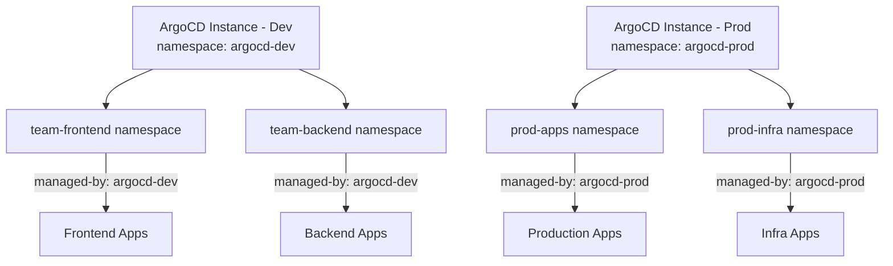

# How to Use argocd.argoproj.io/managed-by Annotation

Author: [nawazdhandala](https://github.com/nawazdhandala)

Tags: ArgoCD, GitOps, Kubernetes, Annotation, Configuration

Description: Learn how to use the argocd.argoproj.io/managed-by annotation in ArgoCD to delegate application management across namespaces and instances.

---

When you run ArgoCD through the Argo CD Operator in environments where multiple ArgoCD instances coexist, or where workloads are deployed into namespaces outside the default `argocd` namespace, the `argocd.argoproj.io/managed-by` label becomes essential. This label tells the operator which ArgoCD instance should be granted access to a given namespace, preventing conflicts and enabling clean multi-instance setups.

## What Is the managed-by Label?

The `argocd.argoproj.io/managed-by` label is placed on Kubernetes namespaces to indicate which ArgoCD instance should be allowed to manage resources in them. This is different from the "Applications in Any Namespace" feature, which allows Application resources to exist outside the standard `argocd` namespace and is configured with `application.namespaces` and AppProject `sourceNamespaces`.

Without this label in an Argo CD Operator installation, the operator does not automatically grant an ArgoCD instance permissions in that target namespace. By adding `managed-by`, you explicitly tell the operator which ArgoCD namespace should receive those namespace-management permissions.

## Why You Need It

There are several real-world scenarios where this label is critical:

**Multi-team isolation**: Different teams own different namespaces and want ArgoCD to deploy workloads into those namespaces without granting every instance access everywhere.

**Multiple ArgoCD instances**: In large organizations, you might have separate ArgoCD instances for different environments or business units. The label helps the operator bind the right instance to the right destination namespaces.

**Operator-managed namespace access**: When the Argo CD Operator manages RBAC for ArgoCD, the label controls which namespaces receive Roles and RoleBindings for a given ArgoCD instance.

## Enabling Applications in Any Namespace

If you want Application resources themselves to live outside the ArgoCD control plane namespace, configure ArgoCD to watch for applications outside its own namespace. This is separate from the `managed-by` namespace label and is done through the `argocd-cmd-params-cm` ConfigMap:

```yaml
# argocd-cmd-params-cm ConfigMap

apiVersion: v1
kind: ConfigMap
metadata:
  name: argocd-cmd-params-cm
  namespace: argocd
data:
  # Comma-separated list of namespaces ArgoCD should watch
  application.namespaces: "team-alpha,team-beta,team-gamma"
```

You can also use a wildcard to watch all namespaces:

```yaml
data:
  application.namespaces: "*"
```

After updating this ConfigMap, restart the ArgoCD application controller and API server to pick up the changes.

## Using the managed-by Label on Namespaces

The supported pattern is to label the namespace itself, so the Argo CD Operator grants the specified ArgoCD instance permission to manage resources in that namespace:

```yaml
# Namespace with managed-by label
apiVersion: v1
kind: Namespace
metadata:
  name: team-alpha
  labels:
    argocd.argoproj.io/managed-by: argocd
```

The value `argocd` refers to the namespace where the managing ArgoCD instance is installed. If your ArgoCD lives in a different namespace, use that namespace name instead:

```yaml
labels:
  argocd.argoproj.io/managed-by: argocd-production
```

## Using the Label with managedNamespaceMetadata

You can also have ArgoCD create the destination namespace with the label by using `managedNamespaceMetadata` and the `CreateNamespace=true` sync option:

```yaml
# Application that creates a labeled destination namespace
apiVersion: argoproj.io/v1alpha1
kind: Application
metadata:
  name: my-app
  namespace: argocd
spec:
  project: team-alpha-project
  source:
    repoURL: https://github.com/team-alpha/k8s-manifests.git
    targetRevision: HEAD
    path: apps/my-app
  destination:
    server: https://kubernetes.default.svc
    namespace: my-app-ns
  syncPolicy:
    managedNamespaceMetadata:
      labels:
        argocd.argoproj.io/managed-by: argocd
    syncOptions:
      - CreateNamespace=true
    automated:
      selfHeal: true
      prune: true
```

This tells ArgoCD to create the `my-app-ns` destination namespace with the `argocd.argoproj.io/managed-by: argocd` label before deploying the application's resources there.

## Multi-Instance ArgoCD Setup

In a multi-instance setup, the `managed-by` label helps keep namespace permissions from getting tangled. Consider this architecture:


```mermaid
graph TD
    A[ArgoCD Instance - Dev<br/>namespace: argocd-dev] --> B[team-frontend namespace]
    A --> C[team-backend namespace]
    D[ArgoCD Instance - Prod<br/>namespace: argocd-prod] --> E[prod-apps namespace]
    D --> F[prod-infra namespace]

    B -->|managed-by: argocd-dev| G[Frontend Apps]
    C -->|managed-by: argocd-dev| H[Backend Apps]
    E -->|managed-by: argocd-prod| I[Production Apps]
    F -->|managed-by: argocd-prod| J[Infra Apps]
```

Here is how you would configure each namespace:

```yaml
# Dev team namespaces
apiVersion: v1
kind: Namespace
metadata:
  name: team-frontend
  labels:
    argocd.argoproj.io/managed-by: argocd-dev
---
apiVersion: v1
kind: Namespace
metadata:
  name: team-backend
  labels:
    argocd.argoproj.io/managed-by: argocd-dev
---
# Production namespaces
apiVersion: v1
kind: Namespace
metadata:
  name: prod-apps
  labels:
    argocd.argoproj.io/managed-by: argocd-prod
---
apiVersion: v1
kind: Namespace
metadata:
  name: prod-infra
  labels:
    argocd.argoproj.io/managed-by: argocd-prod
```

## Project Configuration for Cross-Namespace Applications

When using Application resources in external namespaces, you need to update the AppProject to allow source namespaces:

```yaml
apiVersion: argoproj.io/v1alpha1
kind: AppProject
metadata:
  name: team-alpha-project
  namespace: argocd
spec:
  description: Team Alpha project
  # Allow applications from this namespace
  sourceNamespaces:
    - team-alpha
  sourceRepos:
    - 'https://github.com/team-alpha/*'
  destinations:
    - namespace: 'team-alpha-*'
      server: https://kubernetes.default.svc
  clusterResourceWhitelist:
    - group: ''
      kind: Namespace
```

The `sourceNamespaces` field is the key piece here - it tells the project to accept Application resources from the `team-alpha` namespace. The `managed-by` label does not replace this AppProject setting.

## RBAC Considerations

When applications live outside the ArgoCD namespace, you need to make sure RBAC policies account for the namespace context. Here is an example policy that grants access based on the application's namespace:

```csv
# argocd-rbac-cm
p, role:team-alpha, applications, get, team-alpha-project/team-alpha/*, allow
p, role:team-alpha, applications, sync, team-alpha-project/team-alpha/*, allow
p, role:team-alpha, applications, create, team-alpha-project/team-alpha/*, allow
p, role:team-alpha, applications, delete, team-alpha-project/team-alpha/*, allow
```

## Troubleshooting Common Issues

**Application not appearing in ArgoCD UI**: Verify the `application.namespaces` setting includes the Application resource namespace, and confirm the AppProject `sourceNamespaces` field allows that namespace.

**Permission denied errors**: Check that the ArgoCD service accounts have RBAC permissions for the namespaces involved. For Applications in any namespace, Argo CD documents additional Kubernetes RBAC for the `argocd-server` service account so the API, CLI, and UI can manage Application resources outside the control plane namespace:

```yaml
apiVersion: rbac.authorization.k8s.io/v1
kind: ClusterRole
metadata:
  name: argocd-server-cluster-apps
rules:
  - apiGroups:
      - ""
    resources:
      - events
    verbs:
      - create
  - apiGroups:
      - argoproj.io
    resources:
      - applications
    verbs:
      - create
      - delete
      - update
      - patch
---
apiVersion: rbac.authorization.k8s.io/v1
kind: ClusterRoleBinding
metadata:
  name: argocd-server-cluster-apps
subjects:
  - kind: ServiceAccount
    name: argocd-server
    namespace: argocd
roleRef:
  apiGroup: rbac.authorization.k8s.io
  kind: ClusterRole
  name: argocd-server-cluster-apps
```

**Wrong ArgoCD instance has namespace access**: Double-check the label value. A typo in the namespace name means the operator will not bind the intended ArgoCD instance to that namespace.

## Verifying the Label Works

After setting everything up, verify the configuration:

```bash
# Check that ArgoCD sees the application
argocd app list

# Check namespace labels
kubectl get namespace team-alpha -o jsonpath='{.metadata.labels}'

# Check the namespace's managed-by label
kubectl get namespace team-alpha -o jsonpath='{.metadata.labels.argocd\.argoproj\.io/managed-by}'
```

## Summary

The `argocd.argoproj.io/managed-by` label is a straightforward but powerful mechanism for controlling which ArgoCD instance receives access to which namespaces in Argo CD Operator deployments. It is useful for multi-instance ArgoCD deployments and team-level isolation. Combined with proper project configuration and RBAC policies, it gives you fine-grained control over your GitOps workflow at scale.
