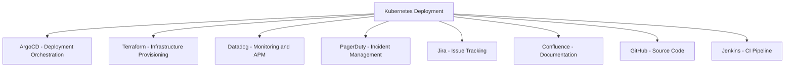

# How to Use Managed By Annotation with Multiple Tools

Author: [nawazdhandala](https://github.com/nawazdhandala)

Tags: ArgoCD, GitOps, Kubernetes, Annotations, Multi-Tool

Description: Learn how to link ArgoCD resources to multiple management tools using annotations, deep links, and custom resource configurations for complex toolchains.

---

Real-world Kubernetes resources rarely have a single management tool. A Deployment might be provisioned by Terraform, deployed by ArgoCD, monitored by Datadog, and documented in Confluence. When multiple tools are involved, a single managed-by annotation is not enough. This guide covers strategies for linking ArgoCD resources to multiple tools simultaneously.

## The Multi-Tool Challenge

Consider a typical production deployment:



A single `argocd.argoproj.io/managed-by` annotation can only hold one URL. Here is how to handle multiple tools.

## Strategy 1: Deep Links for Tool-Specific Links

The most powerful approach is using ArgoCD's deep links feature, which supports multiple links per resource:

```yaml
apiVersion: v1
kind: ConfigMap
metadata:
  name: argocd-cm
  namespace: argocd
data:
  resource.links: |
    # Source Code
    - url: "https://github.com/myorg/{{.Name}}"
      title: "Source Code"
      description: "View source on GitHub"
      icon: "github"
      if: "kind == 'Deployment'"

    # Monitoring
    - url: "https://app.datadoghq.com/apm/services/{{.Name}}?env=production"
      title: "Datadog APM"
      description: "Application performance monitoring"
      icon: "activity"
      if: "kind == 'Deployment'"

    # Logging
    - url: "https://grafana.example.com/explore?query={{.Namespace}}/{{.Name}}"
      title: "Logs"
      description: "View logs in Grafana Loki"
      icon: "file-text"
      if: "kind == 'Deployment' || kind == 'StatefulSet'"

    # Infrastructure
    - url: "https://app.terraform.io/app/myorg/workspaces?search={{.Name}}"
      title: "Terraform"
      description: "Infrastructure workspace"
      icon: "cloud"
      if: "kind == 'Deployment' && namespace == 'production'"

    # Incidents
    - url: "https://myorg.pagerduty.com/service-directory?query={{.Name}}"
      title: "PagerDuty"
      description: "On-call and incidents"
      icon: "bell"
      if: "kind == 'Deployment' && namespace == 'production'"

    # CI/CD
    - url: "https://github.com/myorg/{{.Name}}/actions"
      title: "CI Pipelines"
      description: "GitHub Actions workflows"
      icon: "play"
      if: "kind == 'Deployment'"

    # Documentation
    - url: "https://wiki.internal.company/services/{{.Name}}"
      title: "Documentation"
      description: "Service documentation and runbooks"
      icon: "book"
      if: "kind == 'Deployment'"
```

This gives every Deployment in production seven clickable links in the ArgoCD UI.

## Strategy 2: Combined Annotation Approach

Use the managed-by annotation for the primary tool and custom annotations for supplementary links:

```yaml
apiVersion: apps/v1
kind: Deployment
metadata:
  name: api-server
  namespace: production
  annotations:
    # Primary management link
    argocd.argoproj.io/managed-by: "https://github.com/myorg/api-server"

    # Custom annotations for other tools (used by deep links)
    myorg.com/monitoring-url: "https://app.datadoghq.com/apm/services/api-server"
    myorg.com/terraform-workspace: "https://app.terraform.io/app/myorg/workspaces/api-server-infra"
    myorg.com/runbook-url: "https://runbooks.internal.company/api-server"
    myorg.com/oncall-url: "https://myorg.pagerduty.com/services/api-server"
```

Then reference these custom annotations in deep links:

```yaml
data:
  resource.links: |
    - url: "{{index .Annotations \"myorg.com/monitoring-url\"}}"
      title: "Monitoring"
      icon: "activity"
      if: "annotations['myorg.com/monitoring-url'] != nil"

    - url: "{{index .Annotations \"myorg.com/runbook-url\"}}"
      title: "Runbook"
      icon: "book"
      if: "annotations['myorg.com/runbook-url'] != nil"
```

## Strategy 3: Central Link Registry

For organizations with many tools, maintain a central registry that maps services to tool URLs:

```yaml
# ConfigMap acting as a link registry
apiVersion: v1
kind: ConfigMap
metadata:
  name: service-links-registry
  namespace: argocd
data:
  api-server.json: |
    {
      "github": "https://github.com/myorg/api-server",
      "datadog": "https://app.datadoghq.com/apm/services/api-server",
      "terraform": "https://app.terraform.io/app/myorg/workspaces/api-server",
      "pagerduty": "https://myorg.pagerduty.com/services/P1234567",
      "confluence": "https://myorg.atlassian.net/wiki/spaces/ENG/pages/123456789",
      "jira": "https://myorg.atlassian.net/jira/software/projects/API/boards/10",
      "grafana": "https://grafana.example.com/d/api-server-dashboard"
    }
  payment-service.json: |
    {
      "github": "https://github.com/myorg/payment-service",
      "datadog": "https://app.datadoghq.com/apm/services/payment-service",
      "pagerduty": "https://myorg.pagerduty.com/services/P7654321",
      "grafana": "https://grafana.example.com/d/payment-dashboard"
    }
```

## Strategy 4: Labels for Tool Association

Use labels to drive tool-specific deep links:

```yaml
apiVersion: apps/v1
kind: Deployment
metadata:
  name: api-server
  labels:
    app: api-server
    team: backend
    tier: api
    monitoring: datadog
    infra-managed-by: terraform
    ci-tool: github-actions
```

Then create conditional deep links based on labels:

```yaml
data:
  resource.links: |
    # Show Datadog link only for resources with monitoring=datadog label
    - url: "https://app.datadoghq.com/apm/services/{{.Name}}"
      title: "Datadog"
      icon: "activity"
      if: "labels['monitoring'] == 'datadog'"

    # Show New Relic link for resources with monitoring=newrelic
    - url: "https://one.newrelic.com/launcher?query={{.Name}}"
      title: "New Relic"
      icon: "activity"
      if: "labels['monitoring'] == 'newrelic'"

    # Show Terraform for infra-managed resources
    - url: "https://app.terraform.io/app/myorg/workspaces?search={{.Name}}"
      title: "Terraform"
      icon: "cloud"
      if: "labels['infra-managed-by'] == 'terraform'"

    # Show Pulumi for pulumi-managed resources
    - url: "https://app.pulumi.com/myorg/{{.Name}}"
      title: "Pulumi"
      icon: "cloud"
      if: "labels['infra-managed-by'] == 'pulumi'"
```

## Organizing Links by Category

Group your deep links into logical categories for better UX:

```yaml
data:
  resource.links: |
    # === Development ===
    - url: "https://github.com/myorg/{{.Name}}"
      title: "[Dev] Source Code"
      icon: "github"
      if: "kind == 'Deployment'"

    - url: "https://github.com/myorg/{{.Name}}/actions"
      title: "[Dev] CI/CD"
      icon: "play"
      if: "kind == 'Deployment'"

    # === Operations ===
    - url: "https://grafana.example.com/d/k8s?var-workload={{.Name}}&var-namespace={{.Namespace}}"
      title: "[Ops] Metrics"
      icon: "activity"
      if: "kind == 'Deployment'"

    - url: "https://grafana.example.com/explore?query={{.Name}}"
      title: "[Ops] Logs"
      icon: "file-text"
      if: "kind == 'Deployment'"

    - url: "https://runbooks.internal.company/{{.Name}}"
      title: "[Ops] Runbook"
      icon: "book"
      if: "kind == 'Deployment'"

    # === Infrastructure ===
    - url: "https://app.terraform.io/app/myorg/workspaces?search={{.Name}}"
      title: "[Infra] Terraform"
      icon: "cloud"
      if: "kind == 'Deployment' && namespace == 'production'"

    # === Business ===
    - url: "https://myorg.atlassian.net/wiki/search?text={{.Name}}"
      title: "[Docs] Confluence"
      icon: "book"
      if: "kind == 'Deployment'"
```

## Per-Team Tool Configurations

Different teams may use different tools. Handle this with conditional logic:

```yaml
data:
  resource.links: |
    # Backend team uses Datadog
    - url: "https://app.datadoghq.com/apm/services/{{.Name}}"
      title: "Datadog APM"
      icon: "activity"
      if: "labels['team'] == 'backend'"

    # Frontend team uses Sentry
    - url: "https://sentry.io/organizations/myorg/issues/?query=service:{{.Name}}"
      title: "Sentry Errors"
      icon: "alert-triangle"
      if: "labels['team'] == 'frontend'"

    # Data team uses Datadog + custom dashboards
    - url: "https://grafana.example.com/d/data-pipelines?var-pipeline={{.Name}}"
      title: "Pipeline Dashboard"
      icon: "activity"
      if: "labels['team'] == 'data'"

    # Platform team uses different monitoring
    - url: "https://oneuptime.com/dashboard/monitors?query={{.Name}}"
      title: "OneUptime Monitor"
      icon: "activity"
      if: "labels['team'] == 'platform'"
```

## Auditing Multi-Tool Links

Verify all resources have the expected tool links:

```bash
#!/bin/bash
# audit-tool-links.sh - Audit which tools are linked to which resources

NAMESPACE="${1:-production}"

echo "=== Tool Link Audit for $NAMESPACE ==="
echo ""

# Check managed-by annotations
echo "Resources with managed-by annotation:"
kubectl get all -n "$NAMESPACE" -o json | \
  jq -r '.items[] |
    select(.metadata.annotations["argocd.argoproj.io/managed-by"] != null) |
    "  \(.kind)/\(.metadata.name) -> \(.metadata.annotations["argocd.argoproj.io/managed-by"])"'

echo ""

# Check custom tool annotations
echo "Resources with monitoring-url annotation:"
kubectl get all -n "$NAMESPACE" -o json | \
  jq -r '.items[] |
    select(.metadata.annotations["myorg.com/monitoring-url"] != null) |
    "  \(.kind)/\(.metadata.name) -> \(.metadata.annotations["myorg.com/monitoring-url"])"'

echo ""

# Check resources missing tool links
echo "Resources WITHOUT managed-by annotation:"
kubectl get deployments -n "$NAMESPACE" -o json | \
  jq -r '.items[] |
    select(.metadata.annotations["argocd.argoproj.io/managed-by"] == null) |
    "  \(.metadata.name)"'
```

## Best Practices for Multi-Tool Linking

1. **Prioritize links** - Put the most important links first (monitoring, then runbooks, then source code)
2. **Use consistent naming** - Prefix link titles with categories like [Dev], [Ops], [Infra]
3. **Limit link count** - Having too many links per resource creates clutter. Aim for 5 to 7 maximum
4. **Use conditional logic** - Not every resource needs every link. Use conditions wisely
5. **Validate URLs periodically** - Automated checks catch broken links before engineers do
6. **Document your convention** - Create a team guide explaining which tools are linked and why
7. **Use labels for flexibility** - Labels let you vary tool links without changing the deep links config

Managing resources with multiple tools is the reality of modern infrastructure. By leveraging ArgoCD's deep links, custom annotations, and conditional display logic, you can create a unified navigation experience that connects all your tools through the ArgoCD UI. This reduces context-switching, speeds up incident response, and gives every team member a clear picture of the entire toolchain behind each resource.
