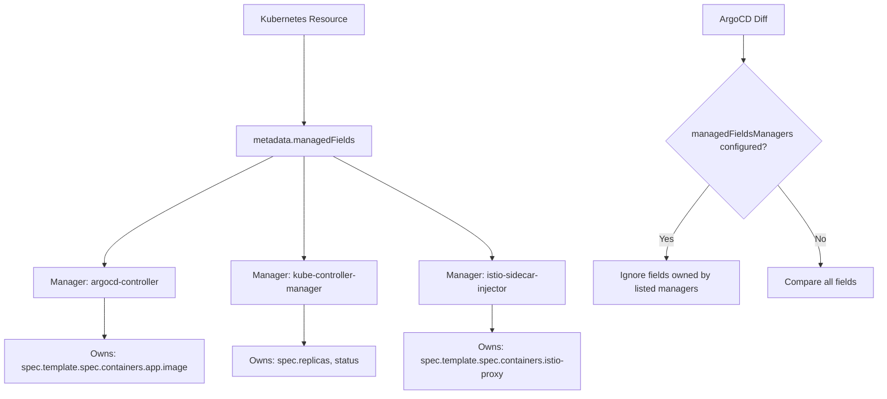

# How to Use ManagedFields Manager for Diff Customization in ArgoCD

Author: [nawazdhandala](https://github.com/nawazdhandala)

Tags: ArgoCD, GitOps, Kubernetes, Server-Side Apply, Diff Customization

Description: Learn how to use Kubernetes managedFieldsManagers in ArgoCD to automatically ignore fields owned by other controllers and operators.

---

Kubernetes 1.18 introduced server-side apply with field ownership tracking. Every field in a resource is owned by a specific "manager" - the controller or tool that last set that field's value. ArgoCD can leverage this metadata to automatically ignore fields owned by other managers, eliminating the need to manually list every field path you want to skip.

This approach is more maintainable than JSON Pointers or JQ expressions because it adapts automatically when an operator starts managing new fields.

## Understanding Managed Fields

Every Kubernetes resource has a `metadata.managedFields` array that tracks which manager owns which fields:

```bash
# View managed fields for a Deployment
kubectl get deployment my-app -o json | jq '.metadata.managedFields'
```

Sample output:

```json
[
  {
    "manager": "argocd-controller",
    "operation": "Apply",
    "apiVersion": "apps/v1",
    "time": "2026-02-20T10:00:00Z",
    "fieldsType": "FieldsV1",
    "fieldsV1": {
      "f:spec": {
        "f:template": {
          "f:spec": {
            "f:containers": {
              "k:{\"name\":\"app\"}": {
                "f:image": {}
              }
            }
          }
        }
      }
    }
  },
  {
    "manager": "kube-controller-manager",
    "operation": "Update",
    "apiVersion": "apps/v1",
    "time": "2026-02-20T10:05:00Z",
    "fieldsType": "FieldsV1",
    "fieldsV1": {
      "f:spec": {
        "f:replicas": {}
      },
      "f:status": {}
    }
  }
]
```



In this example, `kube-controller-manager` owns `spec.replicas` (set by HPA) and `istio-sidecar-injector` owns the injected sidecar container.

## Using managedFieldsManagers in ArgoCD

### Application-Level Configuration

Add `managedFieldsManagers` to your `ignoreDifferences` entries:

```yaml
apiVersion: argoproj.io/v1alpha1
kind: Application
metadata:
  name: my-app
spec:
  source:
    repoURL: https://github.com/myorg/my-app.git
    targetRevision: main
    path: k8s
  destination:
    server: https://kubernetes.default.svc
    namespace: default
  ignoreDifferences:
    - group: apps
      kind: Deployment
      managedFieldsManagers:
        - kube-controller-manager   # HPA
        - vpa-recommender           # VPA
        - istio-sidecar-injector    # Istio
```

This tells ArgoCD: "For Deployments, ignore any fields that these managers own."

### Combining with JSON Pointers and JQ

You can use all three mechanisms together:

```yaml
ignoreDifferences:
  - group: apps
    kind: Deployment
    # Automatically ignore fields owned by these managers
    managedFieldsManagers:
      - kube-controller-manager
    # Also ignore these specific paths
    jsonPointers:
      - /metadata/annotations/kubectl.kubernetes.io~1last-applied-configuration
    # And these pattern-matched fields
    jqPathExpressions:
      - .spec.template.spec.volumes[] | select(.name | startswith("temp-"))
```

## Common Manager Names

Here are the manager names for common Kubernetes components and operators:

### Core Kubernetes Controllers

```yaml
managedFieldsManagers:
  # HPA controller - manages spec.replicas
  - kube-controller-manager
  # kubectl apply - manages last-applied-configuration
  - kubectl-client-side-apply
  # Server-side apply from kubectl
  - kubectl
```

### Service Mesh Injectors

```yaml
managedFieldsManagers:
  # Istio sidecar injector
  - istio-sidecar-injector
  # Linkerd proxy injector
  - linkerd-proxy-injector
```

### Operator Controllers

```yaml
managedFieldsManagers:
  # Cert-manager
  - cert-manager-certificates-issuing
  - cert-manager-certificates-readiness
  # VPA
  - vpa-recommender
  - vpa-updater
  # External DNS
  - external-dns
```

### Finding Manager Names

To discover the exact manager name an operator uses:

```bash
# List all unique managers for a specific resource
kubectl get deployment my-app -o json | \
  jq '[.metadata.managedFields[].manager] | unique'

# List managers across all Deployments in a namespace
kubectl get deployments -n production -o json | \
  jq '[.items[].metadata.managedFields[].manager] | unique'

# Find managers for a specific CRD
kubectl get certificates.cert-manager.io my-cert -o json | \
  jq '[.metadata.managedFields[].manager] | unique'
```

## System-Level Configuration

Configure managed fields managers globally in the `argocd-cm` ConfigMap:

```yaml
apiVersion: v1
kind: ConfigMap
metadata:
  name: argocd-cm
  namespace: argocd
data:
  # Ignore kube-controller-manager fields on all Deployments
  resource.customizations.ignoreDifferences.apps_Deployment: |
    managedFieldsManagers:
      - kube-controller-manager
      - istio-sidecar-injector
  # Ignore cert-manager fields on all Certificates
  resource.customizations.ignoreDifferences.cert-manager.io_Certificate: |
    managedFieldsManagers:
      - cert-manager-certificates-issuing
      - cert-manager-certificates-readiness
  # Ignore specific managers on all resource types
  resource.customizations.ignoreDifferences.all: |
    managedFieldsManagers:
      - kubectl-client-side-apply
```

## How It Works Under the Hood

When ArgoCD encounters a `managedFieldsManagers` entry, it:

1. Fetches the live resource from the cluster
2. Reads the `metadata.managedFields` array
3. Identifies all field paths owned by the listed managers
4. Excludes those field paths from the diff comparison

This means if an operator starts managing a new field in a future version, ArgoCD automatically ignores it without any configuration changes.

## Prerequisites and Requirements

### Server-Side Apply Required

For managed fields tracking to work reliably, the controllers modifying resources should use server-side apply. Older controllers that use client-side apply may not populate `managedFields` correctly.

Check if your resource has managed fields data:

```bash
kubectl get deployment my-app -o jsonpath='{.metadata.managedFields}' | jq 'length'
```

If the result is 0 or the field is missing, managed fields tracking is not active for that resource.

### ArgoCD Version

`managedFieldsManagers` support was added in ArgoCD 2.5. Ensure you are running a compatible version:

```bash
argocd version --short
```

## Real-World Example: HPA and VPA Together

A common scenario is running both HPA (scaling replicas) and VPA (adjusting resource requests) on the same Deployment:

```yaml
apiVersion: argoproj.io/v1alpha1
kind: Application
metadata:
  name: production-api
spec:
  source:
    repoURL: https://github.com/myorg/production-api.git
    targetRevision: main
    path: deploy
  destination:
    server: https://kubernetes.default.svc
    namespace: production
  ignoreDifferences:
    - group: apps
      kind: Deployment
      managedFieldsManagers:
        # HPA manages replicas
        - kube-controller-manager
        # VPA manages container resources
        - vpa-recommender
        - vpa-updater
  syncPolicy:
    automated:
      selfHeal: true
      prune: true
    syncOptions:
      # Ensure ignored diffs are respected during sync
      - RespectIgnoreDifferences=true
```

## Real-World Example: Istio Service Mesh

When Istio's sidecar injector is active:

```yaml
apiVersion: argoproj.io/v1alpha1
kind: Application
metadata:
  name: my-microservice
spec:
  source:
    repoURL: https://github.com/myorg/microservice.git
    targetRevision: main
    path: k8s
  destination:
    server: https://kubernetes.default.svc
    namespace: mesh-apps
  ignoreDifferences:
    - group: apps
      kind: Deployment
      managedFieldsManagers:
        - istio-sidecar-injector
    - group: apps
      kind: StatefulSet
      managedFieldsManagers:
        - istio-sidecar-injector
```

## Debugging managedFieldsManagers

### Verify Manager Names

```bash
# Check what managers exist on your resource
kubectl get deployment my-app -o json | \
  jq '.metadata.managedFields[] | {manager: .manager, operation: .operation}'
```

### Check What Fields a Manager Owns

```bash
# See fields owned by a specific manager
kubectl get deployment my-app -o json | \
  jq '.metadata.managedFields[] | select(.manager == "kube-controller-manager") | .fieldsV1'
```

### Verify ArgoCD Picks Up the Configuration

```bash
# Check application configuration
argocd app get my-app -o yaml | grep -A10 managedFieldsManagers

# Force refresh
argocd app get my-app --hard-refresh

# Check diff
argocd app diff my-app
```

## Advantages Over JSON Pointers and JQ

| Feature | managedFieldsManagers | JSON Pointers | JQ Expressions |
|---------|----------------------|---------------|----------------|
| Auto-adapts to new fields | Yes | No | No |
| Setup complexity | Low | Medium | High |
| Requires SSA | Yes | No | No |
| Precision | Manager-level | Field-level | Field-level |
| Works with all controllers | Only SSA controllers | All | All |

## Best Practices

1. **Use managedFieldsManagers as your first choice** when the operator uses server-side apply
2. **Combine with RespectIgnoreDifferences** when using auto-sync to prevent self-heal from reverting ignored fields
3. **Fall back to JQ/JSON Pointers** for controllers that do not use server-side apply
4. **Audit managers periodically** to ensure you are not ignoring more than intended
5. **Test in staging** before applying to production applications

For related topics, see [How to Ignore Operator-Managed Fields](https://oneuptime.com/blog/post/2026-02-26-argocd-ignore-operator-managed-fields/view) and [How to Configure System-Level Diff Defaults](https://oneuptime.com/blog/post/2026-02-26-argocd-system-level-diff-defaults/view).
