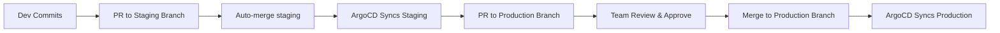

# How to Implement Manual Approval Gates Between Environments in ArgoCD

Author: [nawazdhandala](https://github.com/nawazdhandala)

Tags: ArgoCD, GitOps, Kubernetes, CI/CD, Deployment Safety

Description: Learn how to implement manual approval gates between environments in ArgoCD using sync policies, Git-based workflows, and external approval mechanisms.

---

Production deployments need guardrails. While automated sync works great for dev and staging, promoting changes to production should require explicit human approval. ArgoCD provides several mechanisms to implement approval gates - from disabling auto-sync on production applications to leveraging pull request workflows and external approval systems. This guide covers the practical approaches to building approval gates into your ArgoCD deployment pipeline.

## Why Approval Gates Matter

Automated deployments are fast, but production incidents from unchecked changes are expensive. Approval gates give your team a chance to review what is about to change, verify that testing has passed, and ensure the timing is right for a production deployment. In regulated industries, approval gates are often a compliance requirement.

## Approach 1: Disable Auto-Sync for Production

The simplest approval gate is disabling auto-sync on your production ArgoCD Application. Changes committed to Git will show as "OutOfSync" in ArgoCD, but will not be applied until someone manually triggers a sync:

```yaml
apiVersion: argoproj.io/v1alpha1
kind: Application
metadata:
  name: my-app-production
  namespace: argocd
spec:
  project: default
  source:
    repoURL: https://github.com/myorg/app-config.git
    path: overlays/production
    targetRevision: main
  destination:
    server: https://kubernetes.default.svc
    namespace: production
  # No syncPolicy.automated - manual sync required
  syncPolicy:
    syncOptions:
      - CreateNamespace=true
      - PruneLast=true
```

Compare this with the dev application that auto-syncs:

```yaml
apiVersion: argoproj.io/v1alpha1
kind: Application
metadata:
  name: my-app-dev
  namespace: argocd
spec:
  project: default
  source:
    repoURL: https://github.com/myorg/app-config.git
    path: overlays/dev
    targetRevision: main
  destination:
    server: https://kubernetes.default.svc
    namespace: dev
  syncPolicy:
    automated:        # Auto-sync enabled for dev
      prune: true
      selfHeal: true
```

A team member can then trigger the sync manually:

```bash
# Sync when ready
argocd app sync my-app-production

# Sync with a dry-run first to review changes
argocd app sync my-app-production --dry-run

# Sync specific resources only
argocd app sync my-app-production --resource apps/Deployment/my-app
```

## Approach 2: Pull Request-Based Approval

A more structured approach uses Git branches and pull requests as the approval mechanism. Production configuration lives on a branch that requires PR approval before merge:



Configure branch protection rules on your Git repository:

```yaml
# GitHub branch protection for the production branch
# (configured via GitHub UI or API)
branches:
  production:
    required_reviews: 2
    required_status_checks:
      - staging-tests-passed
      - security-scan-passed
    dismiss_stale_reviews: true
    require_code_owner_review: true
```

Set up ArgoCD to track the production branch:

```yaml
apiVersion: argoproj.io/v1alpha1
kind: Application
metadata:
  name: my-app-production
  namespace: argocd
spec:
  project: default
  source:
    repoURL: https://github.com/myorg/app-config.git
    path: overlays/production
    targetRevision: production  # Tracks the production branch
  destination:
    server: https://kubernetes.default.svc
    namespace: production
  syncPolicy:
    automated:
      prune: true
      selfHeal: true
```

Now production only updates when a PR is approved and merged to the `production` branch.

## Approach 3: Sync Windows

ArgoCD Sync Windows let you restrict when syncs can happen. This is useful for limiting deployments to maintenance windows:

```yaml
apiVersion: argoproj.io/v1alpha1
kind: AppProject
metadata:
  name: production
  namespace: argocd
spec:
  description: Production applications
  sourceRepos:
    - https://github.com/myorg/app-config.git
  destinations:
    - namespace: production
      server: https://kubernetes.default.svc
  syncWindows:
    # Allow syncs only during business hours on weekdays
    - kind: allow
      schedule: '0 9 * * 1-5'    # 9 AM Monday-Friday
      duration: 8h                 # Until 5 PM
      applications:
        - '*'
    # Block all syncs during weekends
    - kind: deny
      schedule: '0 0 * * 0,6'    # Midnight Saturday and Sunday
      duration: 24h
      applications:
        - '*'
    # Allow emergency syncs for critical fixes
    - kind: allow
      schedule: '* * * * *'       # Always
      duration: 24h
      manualSync: true            # Only manual syncs bypass the window
      applications:
        - '*'
```

With sync windows, even if auto-sync is enabled, ArgoCD will wait until the allowed window to apply changes.

## Approach 4: External Approval with Resource Hooks

Use ArgoCD resource hooks to integrate with external approval systems. A pre-sync hook can check for approval status before allowing deployment:

```yaml
apiVersion: batch/v1
kind: Job
metadata:
  name: check-approval
  annotations:
    argocd.argoproj.io/hook: PreSync
    argocd.argoproj.io/hook-delete-policy: HookSucceeded
spec:
  template:
    spec:
      containers:
        - name: approval-check
          image: myregistry/approval-checker:latest
          env:
            - name: APP_NAME
              value: my-app
            - name: ENVIRONMENT
              value: production
            - name: APPROVAL_API
              value: https://approvals.myorg.com/api/v1
          command:
            - /bin/sh
            - -c
            - |
              # Check if this deployment has been approved
              APPROVED=$(curl -s "$APPROVAL_API/check?app=$APP_NAME&env=$ENVIRONMENT")
              if [ "$APPROVED" != "true" ]; then
                echo "Deployment not approved. Request approval at $APPROVAL_API"
                exit 1
              fi
              echo "Deployment approved. Proceeding with sync."
      restartPolicy: Never
  backoffLimit: 0
```

If the pre-sync hook fails, ArgoCD will not proceed with the sync.

## Approach 5: Notification-Based Approval

Use ArgoCD Notifications to send approval requests when a production app goes out of sync:

```yaml
apiVersion: v1
kind: ConfigMap
metadata:
  name: argocd-notifications-cm
  namespace: argocd
data:
  trigger.on-sync-needed: |
    - when: app.status.sync.status == 'OutOfSync'
      send: [production-approval-request]

  template.production-approval-request: |
    message: |
      Application {{.app.metadata.name}} has pending changes.
      Review and approve: {{.context.argocdUrl}}/applications/{{.app.metadata.name}}
    slack:
      attachments: |
        [{
          "title": "Deployment Approval Required",
          "text": "{{.app.metadata.name}} is OutOfSync in production",
          "color": "#f0ad4e",
          "actions": [{
            "type": "button",
            "text": "View Changes",
            "url": "{{.context.argocdUrl}}/applications/{{.app.metadata.name}}?view=diff"
          }]
        }]
```

Subscribe the production application to this trigger:

```yaml
apiVersion: argoproj.io/v1alpha1
kind: Application
metadata:
  name: my-app-production
  namespace: argocd
  annotations:
    notifications.argoproj.io/subscribe.on-sync-needed.slack: production-deployments
```

## Combining Approaches

In practice, you will combine multiple approaches for defense in depth:

1. **Dev** - Auto-sync enabled, no gates
2. **Staging** - Auto-sync enabled, PR required to merge to staging branch
3. **Production** - Manual sync only, PR with required reviewers, sync windows restricting to business hours, Slack notifications for pending changes

```yaml
# ApplicationSet with per-environment sync policies
apiVersion: argoproj.io/v1alpha1
kind: ApplicationSet
metadata:
  name: my-app
  namespace: argocd
spec:
  generators:
    - list:
        elements:
          - env: dev
            branch: main
            autoSync: "true"
          - env: staging
            branch: staging
            autoSync: "true"
          - env: production
            branch: production
            autoSync: "false"
  template:
    metadata:
      name: 'my-app-{{env}}'
    spec:
      project: '{{env}}'
      source:
        repoURL: https://github.com/myorg/app-config.git
        path: 'overlays/{{env}}'
        targetRevision: '{{branch}}'
      destination:
        server: https://kubernetes.default.svc
        namespace: '{{env}}'
```

Note that ApplicationSet templates do not support conditional `syncPolicy`, so you would set the sync policy on the ArgoCD Project level or use separate ApplicationSets for environments that need different sync behaviors.

## RBAC for Sync Permissions

Restrict who can trigger production syncs using ArgoCD RBAC:

```csv
# argocd-rbac-cm ConfigMap
p, role:developer, applications, sync, dev/*, allow
p, role:developer, applications, sync, staging/*, allow
p, role:developer, applications, get, production/*, allow
p, role:release-manager, applications, sync, production/*, allow
p, role:release-manager, applications, override, production/*, allow

g, dev-team, role:developer
g, sre-team, role:release-manager
```

Only users in the `sre-team` group can sync production applications.

Manual approval gates are essential for production safety. The right approach depends on your team's workflow, compliance requirements, and risk tolerance. Start simple with disabled auto-sync and PR-based approvals, then add sync windows and external checks as your needs grow.
