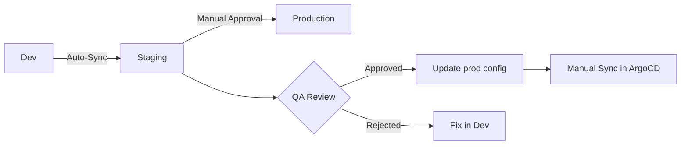

# How to Implement Manual Approval Gates Between Environments in ArgoCD

Author: [nawazdhandala](https://github.com/nawazdhandala)

Tags: ArgoCD, GitOps, Kubernetes, Deployment Approvals, CI/CD

Description: Learn how to implement manual approval gates between environments in ArgoCD to control when deployments promote from dev to staging to production with human verification.

---

Automated deployments are great until they are not. That time when a bug slipped through staging tests and went straight to production because the pipeline auto-promoted without anyone looking at it. Manual approval gates exist to put a human checkpoint between environments - someone who verifies the deployment looks good in staging before it moves to production.

ArgoCD does not have a built-in approval gate feature, but you can build effective gates using a combination of manual sync policies, Git-based workflows, notification triggers, and CI pipeline integrations. This guide covers each approach with practical implementations.

## The Approval Flow

A typical promotion flow with approval gates looks like this:



Changes flow automatically from dev to staging. Moving from staging to production requires a human to verify staging is healthy and explicitly trigger the promotion.

## Approach 1: Disable Auto-Sync for Production

The simplest approval gate is turning off automated sync for production applications. ArgoCD detects changes and shows them as OutOfSync, but waits for someone to click "Sync."

```yaml
# Dev - auto-syncs immediately
apiVersion: argoproj.io/v1alpha1
kind: Application
metadata:
  name: payment-service-dev
spec:
  project: team-alpha
  source:
    repoURL: https://github.com/myorg/payment-service-config.git
    path: overlays/dev
    targetRevision: main
  destination:
    namespace: team-alpha-dev
  syncPolicy:
    automated:
      prune: true
      selfHeal: true

---
# Staging - auto-syncs for faster feedback
apiVersion: argoproj.io/v1alpha1
kind: Application
metadata:
  name: payment-service-staging
spec:
  project: team-alpha
  source:
    repoURL: https://github.com/myorg/payment-service-config.git
    path: overlays/staging
    targetRevision: main
  destination:
    namespace: team-alpha-staging
  syncPolicy:
    automated:
      prune: true
      selfHeal: true

---
# Production - manual sync required (this IS the approval gate)
apiVersion: argoproj.io/v1alpha1
kind: Application
metadata:
  name: payment-service-prod
spec:
  project: team-alpha
  source:
    repoURL: https://github.com/myorg/payment-service-config.git
    path: overlays/prod
    targetRevision: main
  destination:
    namespace: team-alpha-prod
  # No syncPolicy.automated - requires manual trigger
```

When the prod overlay is updated in Git, ArgoCD shows the application as OutOfSync. The approver reviews the diff in the ArgoCD UI, verifies the changes look correct, and clicks Sync.

## Approach 2: Notification-Triggered Approval

Send a notification to Slack or Teams when a promotion is pending. The approver follows a link to the ArgoCD UI to review and sync.

```yaml
# ArgoCD Notifications ConfigMap
apiVersion: v1
kind: ConfigMap
metadata:
  name: argocd-notifications-cm
  namespace: argocd
data:
  trigger.on-prod-pending: |
    - when: app.status.sync.status == 'OutOfSync' and app.spec.destination.namespace == 'team-alpha-prod'
      send: [slack-approval-needed]
  template.slack-approval-needed: |
    message: |
      *Deployment Approval Required*
      Application: {{.app.metadata.name}}
      Target: {{.app.spec.destination.namespace}}
      Current Revision: {{.app.status.sync.revision}}
      Desired Revision: {{.app.status.sync.comparedTo.source.targetRevision}}

      <{{.context.argocdUrl}}/applications/{{.app.metadata.name}}|Review and Approve in ArgoCD>
    slack:
      attachments: |
        [{
          "color": "#f4c030",
          "fields": [
            {"title": "Application", "value": "{{.app.metadata.name}}", "short": true},
            {"title": "Environment", "value": "production", "short": true}
          ]
        }]
  service.slack: |
    token: $slack-token
  subscriptions: |
    - recipients:
        - slack:deploy-approvals
      triggers:
        - on-prod-pending
```

The team sees a Slack message with a link to ArgoCD. They review the diff, verify staging is healthy, and approve by clicking Sync.

## Approach 3: Git Branch Protection as Gate

Use separate Git branches for each environment. Promoting to production means creating a pull request to the production branch, which requires specified reviewers.

```yaml
# Production tracks a protected branch
apiVersion: argoproj.io/v1alpha1
kind: Application
metadata:
  name: payment-service-prod
spec:
  source:
    repoURL: https://github.com/myorg/payment-service-config.git
    path: overlays/prod
    targetRevision: release/production  # Protected branch
  syncPolicy:
    automated:
      prune: true
      selfHeal: true  # Auto-sync IS enabled, but the branch is the gate
```

Configure GitHub branch protection on `release/production`:

```
Required reviewers: 2
Required review from: @sre-team
Require status checks to pass:
  - staging-smoke-tests
  - security-scan
Dismiss stale reviews: true
Require linear history: true
```

The approval workflow becomes:

1. CI creates a PR from `main` to `release/production`
2. The PR shows the exact changes going to production
3. Required reviewers approve
4. Status checks confirm staging is healthy
5. PR merges, ArgoCD auto-syncs production

## Approach 4: CI Pipeline Gate

Use your CI/CD system's environment protection as the approval gate. GitHub Actions environments, GitLab environments, and Azure DevOps environments all support required approvals.

```yaml
# .github/workflows/promote-to-prod.yaml
name: Promote to Production

on:
  workflow_dispatch:
    inputs:
      version:
        description: "Version to promote"
        required: true

jobs:
  verify-staging:
    runs-on: ubuntu-latest
    steps:
      - name: Check staging health
        run: |
          # Verify staging is healthy before allowing promotion
          HEALTH=$(argocd app get payment-service-staging -o json | jq -r '.status.health.status')
          SYNC=$(argocd app get payment-service-staging -o json | jq -r '.status.sync.status')

          if [ "$HEALTH" != "Healthy" ] || [ "$SYNC" != "Synced" ]; then
            echo "Staging is not healthy. Cannot promote."
            exit 1
          fi

  approve-and-promote:
    needs: verify-staging
    runs-on: ubuntu-latest
    environment: production  # This requires manual approval in GitHub
    steps:
      - name: Checkout config repo
        uses: actions/checkout@v4
        with:
          repository: myorg/payment-service-config

      - name: Update production image tag
        run: |
          cd overlays/prod
          kustomize edit set image myorg/payment-service:${{ inputs.version }}

      - name: Commit and push
        run: |
          git config user.name "GitHub Actions"
          git config user.email "actions@github.com"
          git add .
          git commit -m "Promote payment-service ${{ inputs.version }} to production

          Approved by: ${{ github.actor }}
          Staging verification: passed"
          git push

      - name: Wait for ArgoCD sync
        run: |
          argocd app wait payment-service-prod --timeout 300
          echo "Production deployment complete"
```

The GitHub environment `production` requires one or more designated approvers to click "Approve" before the job runs.

## Approach 5: PreSync Hook Validation

Add a PreSync hook that checks an external approval system. If the check fails, the sync stops.

```yaml
apiVersion: batch/v1
kind: Job
metadata:
  name: check-approval
  annotations:
    argocd.argoproj.io/hook: PreSync
    argocd.argoproj.io/hook-delete-policy: HookSucceeded
spec:
  template:
    spec:
      containers:
        - name: approval-check
          image: curlimages/curl:8.5.0
          command:
            - /bin/sh
            - -c
            - |
              # Check if this deployment has been approved
              RESPONSE=$(curl -sf \
                -H "Authorization: Bearer ${APPROVAL_TOKEN}" \
                "https://approvals.internal/api/v1/check" \
                -d "{\"app\": \"payment-service\", \"env\": \"prod\", \"revision\": \"${ARGOCD_APP_REVISION}\"}")

              APPROVED=$(echo "$RESPONSE" | jq -r '.approved')
              if [ "$APPROVED" != "true" ]; then
                echo "Deployment not approved. Create an approval at https://approvals.internal"
                exit 1
              fi

              APPROVER=$(echo "$RESPONSE" | jq -r '.approvedBy')
              echo "Deployment approved by: $APPROVER"
          env:
            - name: APPROVAL_TOKEN
              valueFrom:
                secretKeyRef:
                  name: approval-service-token
                  key: token
      restartPolicy: Never
  backoffLimit: 0
```

## Combining Approaches

The strongest approval gate combines multiple approaches. Here is a recommended production setup:

| Layer | Mechanism | Purpose |
|-------|-----------|---------|
| 1 | Git PR review | Peer review of changes |
| 2 | CI status checks | Automated verification |
| 3 | Environment approval | Formal sign-off |
| 4 | ArgoCD manual sync | Final deployment trigger |
| 5 | Slack notification | Team awareness |

This creates multiple checkpoints without being overly burdensome. The PR review catches obvious issues. CI checks catch regressions. Environment approval provides formal accountability. Manual sync gives a final "are you sure" moment. And notifications keep everyone informed.

## RBAC for Approval Gates

Restrict who can trigger syncs to production using ArgoCD RBAC:

```csv
# Only SREs and team leads can sync to production
p, role:sre, applications, sync, team-alpha/payment-service-prod, allow
p, role:team-lead, applications, sync, team-alpha/payment-service-prod, allow

# Developers can view but not sync production
p, role:developer, applications, get, team-alpha/payment-service-prod, allow
p, role:developer, applications, sync, team-alpha/payment-service-prod, deny
```

This ensures that even if someone tries to click Sync in the UI, ArgoCD rejects the request unless they have the right role.

## Tracking Approvals for Audit

Every approval should be traceable. Record approvals as annotations on the Application:

```bash
# After manual sync, add audit annotations
argocd app set payment-service-prod \
  --annotations "deploy.myorg.io/approved-by=jane.doe@example.com" \
  --annotations "deploy.myorg.io/approved-at=$(date -u +%Y-%m-%dT%H:%M:%SZ)" \
  --annotations "deploy.myorg.io/approval-ticket=DEPLOY-4567"
```

These annotations persist in the Application resource and show up in the ArgoCD UI, providing the audit trail that compliance teams require.

Manual approval gates between environments are about finding the right balance between speed and safety. Too many gates slow teams down. Too few let problems slip through. Start with a simple manual sync gate for production, add notifications so approvers know when action is needed, and layer on more sophisticated checks as your organization's deployment maturity grows.
