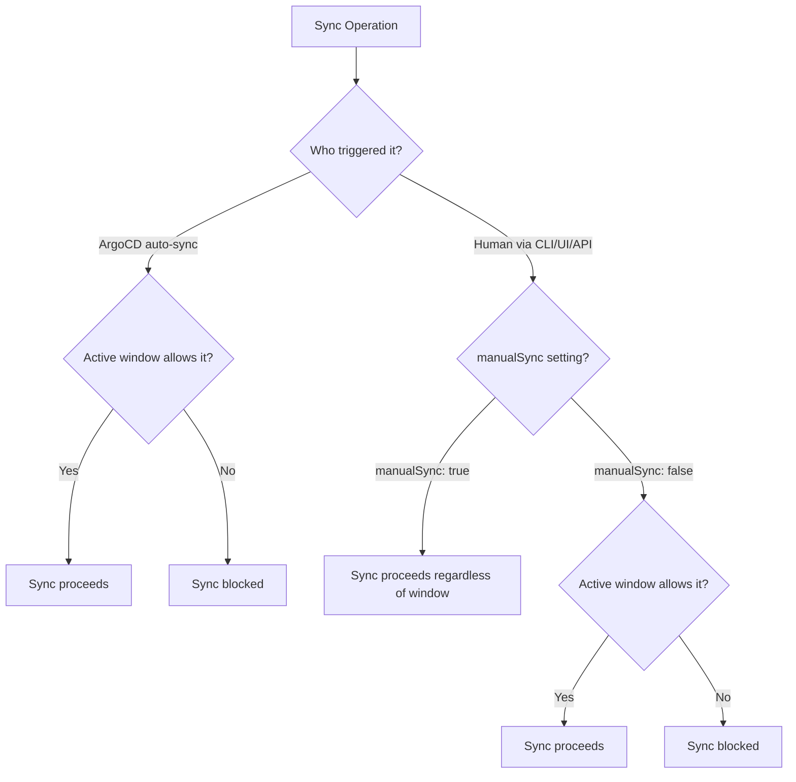

# How to Use Manual Sync Windows in ArgoCD

Author: [nawazdhandala](https://github.com/nawazdhandala)

Tags: ArgoCD, GitOps, Kubernetes, Sync Windows, Manual Sync

Description: Learn how the manualSync setting in ArgoCD sync windows controls whether human-triggered syncs can bypass deployment restrictions, with patterns for balancing automation and control.

---

ArgoCD sync windows have a subtle but powerful setting called `manualSync` that determines whether human-triggered syncs can bypass window restrictions. Understanding this setting is essential for balancing automated GitOps delivery with controlled production deployments. This guide covers how `manualSync` works, when to enable or disable it, and how to build effective workflows around it.

## What manualSync Controls

The `manualSync` field differentiates between two types of sync operations.

**Automated syncs** are triggered by ArgoCD's auto-sync policy. When ArgoCD detects that the live state differs from Git, it automatically reconciles. These are always governed by sync windows.

**Manual syncs** are triggered by a human through the ArgoCD CLI, UI, or API. The `manualSync` setting determines whether these human-triggered syncs respect the sync window.



## manualSync: true - The Recommended Default

Setting `manualSync: true` blocks automated syncs during the window but allows humans to manually trigger syncs at any time.

```yaml
apiVersion: argoproj.io/v1alpha1
kind: AppProject
metadata:
  name: production
  namespace: argocd
spec:
  syncWindows:
    - kind: deny
      schedule: '0 9 * * 1-5'
      duration: 8h
      applications:
        - '*'
      manualSync: true  # Humans can still sync during business hours
      timeZone: 'America/New_York'
```

This is the recommended default for most teams because:

1. It prevents accidental automated deployments during sensitive periods
2. It preserves the ability to push emergency hotfixes
3. It respects human judgment while restricting automation

## manualSync: false - Maximum Restriction

Setting `manualSync: false` blocks both automated and manual syncs during the window.

```yaml
syncWindows:
  - kind: deny
    schedule: '0 0 24 12 *'
    duration: 216h  # Christmas through New Year
    applications:
      - '*'
    manualSync: false  # Nobody syncs during holidays
    timeZone: 'UTC'
```

Use `manualSync: false` when:

- Regulatory requirements mandate a complete deployment freeze
- The on-call team is reduced and cannot safely verify deployments
- There is a known high-traffic period where any change is too risky
- A compliance audit requires proof that no changes were made during a specific window

## Mixing manualSync Settings Across Windows

Different windows within the same project can have different `manualSync` settings.

```yaml
syncWindows:
  # Business hours: block auto-sync but allow manual (for emergencies)
  - kind: deny
    schedule: '0 9 * * 1-5'
    duration: 8h
    applications:
      - '*'
    manualSync: true  # Allows emergency manual syncs
    timeZone: 'America/New_York'

  # Holiday freeze: block everything
  - kind: deny
    schedule: '0 0 24 12 *'
    duration: 216h
    applications:
      - '*'
    manualSync: false  # No exceptions
    timeZone: 'UTC'

  # Weekend: block auto-sync but allow manual
  - kind: deny
    schedule: '0 0 * * 0,6'
    duration: 24h
    applications:
      - '*'
    manualSync: true
    timeZone: 'America/New_York'
```

When multiple windows overlap, the most restrictive `manualSync` setting wins. If any active window has `manualSync: false`, manual syncs are blocked regardless of other active windows with `manualSync: true`.

## How Manual Sync Works with Allow Windows

The `manualSync` field behavior differs slightly between allow and deny windows.

For deny windows, `manualSync: true` means manual syncs bypass the deny.

For allow windows, `manualSync: true` means manual syncs are allowed even outside the allow window.

```yaml
syncWindows:
  # Allow window: only 2-6 AM
  - kind: allow
    schedule: '0 2 * * *'
    duration: 4h
    applications:
      - '*'
    manualSync: true  # Manual syncs work outside the 2-6 AM window too
    timeZone: 'UTC'
```

Without `manualSync: true` on an allow window, manual syncs would also be blocked outside the window. With `manualSync: true`, only automated syncs are restricted to the 2-6 AM window; humans can sync anytime.

## Triggering Manual Syncs

When `manualSync: true` is set, these are the ways to trigger a manual sync during a restricted window.

### CLI

```bash
# Standard manual sync
argocd app sync my-app

# Selective manual sync
argocd app sync my-app --resource apps:Deployment:web-server

# Manual sync with specific revision
argocd app sync my-app --revision abc123
```

### UI

Click the "Sync" button on the application page in the ArgoCD web UI. Manual syncs from the UI are treated the same as CLI syncs.

### API

```bash
# Trigger manual sync via API
curl -X POST "https://argocd.example.com/api/v1/applications/my-app/sync" \
  -H "Authorization: Bearer $TOKEN" \
  -H "Content-Type: application/json" \
  -d '{}'
```

### Automation That Looks Like Manual

Be careful with CI/CD pipelines that call `argocd app sync`. These are technically manual syncs (not auto-sync) and will bypass `manualSync: true` windows. If your pipeline triggers syncs, consider whether this is the desired behavior during restricted windows.

```yaml
# This CI/CD step triggers a "manual" sync that bypasses manualSync: true windows
- name: Deploy
  run: argocd app sync my-app
```

To prevent CI/CD from bypassing windows, either:
1. Add window checking logic to your pipeline
2. Use `manualSync: false` for critical freeze periods
3. Use RBAC to restrict the CI/CD service account

## Checking Whether Manual Sync is Allowed

Before attempting a manual sync, check the current window status.

```bash
# Check application conditions for sync window info
argocd app get my-app --output json | \
  jq '.status.conditions[] | select(.type | contains("SyncWindow"))'

# Check project windows and their manualSync settings
argocd proj windows list production --output json | \
  jq '.[] | {kind, schedule, duration, manualSync}'
```

## RBAC for Manual Sync Control

Layer RBAC on top of `manualSync` for additional control over who can perform manual syncs.

```yaml
# argocd-rbac-cm ConfigMap
apiVersion: v1
kind: ConfigMap
metadata:
  name: argocd-rbac-cm
  namespace: argocd
data:
  policy.csv: |
    # Developers: can view but not sync production
    p, role:developer, applications, get, production/*, allow
    p, role:developer, applications, sync, staging/*, allow

    # SREs: can sync everything
    p, role:sre, applications, get, */*, allow
    p, role:sre, applications, sync, */*, allow

    # CI service account: can sync staging only
    p, role:ci-deployer, applications, sync, staging/*, allow
```

Even with `manualSync: true`, a developer without the `sync` permission on production applications cannot trigger a manual sync.

## Audit Trail for Manual Syncs

ArgoCD logs all sync operations, including manual syncs during restricted windows.

```bash
# View sync history for an application
argocd app history my-app

# Output includes who triggered the sync and when
# REVISION  DATE                  AUTHOR    MESSAGE
# abc123    2026-02-26 14:30:00   admin     Sync operation
```

For compliance, combine this with ArgoCD audit logging.

```yaml
# Enable audit logging in argocd-cmd-params-cm
apiVersion: v1
kind: ConfigMap
metadata:
  name: argocd-cmd-params-cm
  namespace: argocd
data:
  server.audit.enabled: "true"
```

Audit logs capture who performed the manual sync, what was synced, and when. This is essential for post-incident reviews and compliance audits.

## Best Practices

For most production environments, use `manualSync: true` on deny windows. This gives your team the flexibility to respond to incidents while preventing automated drift reconciliation during sensitive periods.

Use `manualSync: false` only for hard freezes where the risk of any change outweighs the risk of not being able to deploy.

Pair `manualSync: true` with RBAC to control who can trigger manual syncs during restricted windows.

Always have an emergency procedure documented for situations where `manualSync: false` needs to be overridden. See the [emergency override guide](https://oneuptime.com/blog/post/2026-02-26-argocd-override-sync-windows-emergency/view) for details.

For sync window fundamentals, see the [sync windows configuration guide](https://oneuptime.com/blog/post/2026-02-26-argocd-configure-sync-windows/view). For debugging sync window issues, check the [debug sync windows guide](https://oneuptime.com/blog/post/2026-02-26-argocd-debug-sync-window-issues/view).
