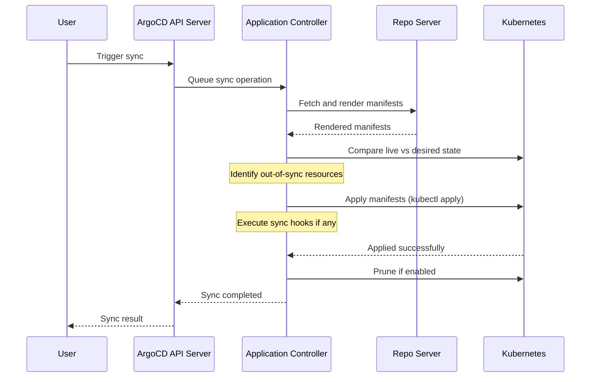

# How to Manually Sync an Application in ArgoCD

Author: [nawazdhandala](https://github.com/nawazdhandala)

Tags: ArgoCD, GitOps, Kubernetes, Sync Operations

Description: Step-by-step guide to manually syncing ArgoCD applications using the UI, CLI, and API with options for selective sync, dry run, prune, and force sync.

---

While ArgoCD can automatically sync applications when Git changes are detected, there are many situations where you want to trigger a sync manually. Maybe you are deploying to production and want to control the exact timing. Maybe you have auto-sync disabled for safety. Or maybe you need to use special sync options like dry-run or selective sync. This guide covers every way to manually sync an application in ArgoCD.

## When to Use Manual Sync

Manual sync is appropriate when:

- **Production deployments** - You want human approval before changes hit production
- **Auto-sync is disabled** - Your policy requires explicit sync triggers
- **Selective sync** - You want to sync only specific resources, not everything
- **Dry run** - You want to preview what will change before applying
- **Force sync** - You need to replace resources rather than patching them
- **Debugging** - You want to watch the sync happen in real time with full control

## Method 1: Sync via the ArgoCD UI

### Basic Sync

1. Navigate to your application in the ArgoCD UI
2. Click the **SYNC** button in the application header
3. A sync options dialog appears
4. Review the options and click **SYNCHRONIZE**

### Sync Dialog Options

The sync dialog offers several configuration options:

**Revision** - By default, ArgoCD syncs to the latest commit on the tracked branch. You can override this to sync a specific commit SHA or tag:

```
Revision: abc1234def5678
```

**Prune** - Check this to delete resources that exist in the cluster but not in Git. Useful for removing deprecated resources.

**Dry Run** - Check this to see what would change without actually applying anything. The diff view updates to show planned changes.

**Apply Only** - Skip the comparison phase and just apply manifests.

**Force** - Replace resources instead of applying patches. This recreates resources, which can cause brief downtime but resolves certain conflict issues.

### Selective Sync in the UI

The sync dialog shows all resources with checkboxes. You can:
- Uncheck "All" and select only specific resources to sync
- Filter by resource kind to find what you need
- Only sync resources that are OutOfSync

## Method 2: Sync via the ArgoCD CLI

### Basic CLI Sync

```bash
# Sync the application to the latest Git revision
argocd app sync my-app
```

This command blocks until the sync completes (or fails) and prints the result:

```
TIMESTAMP   GROUP  KIND        NAMESPACE  NAME  STATUS  HEALTH   HOOK  MESSAGE
2026-02-26  apps   Deployment  my-app     web   Synced  Healthy        deployment.apps/web configured
2026-02-26         Service     my-app     web   Synced  Healthy        service/web unchanged
2026-02-26         ConfigMap   my-app     cfg   Synced             	   configmap/cfg configured

Name:               argocd/my-app
Server:             https://kubernetes.default.svc
Namespace:          my-app
Sync Status:        Synced to main (abc1234)
Health Status:      Healthy
```

### Sync with Options

```bash
# Sync with pruning enabled
argocd app sync my-app --prune

# Sync in dry-run mode (preview changes without applying)
argocd app sync my-app --dry-run

# Force sync (replace instead of apply)
argocd app sync my-app --force

# Sync a specific revision
argocd app sync my-app --revision abc1234def5678

# Sync with a timeout (wait up to 5 minutes)
argocd app sync my-app --timeout 300

# Async sync (do not wait for completion)
argocd app sync my-app --async
```

### Selective Sync via CLI

Sync only specific resources:

```bash
# Sync only a specific Deployment
argocd app sync my-app --resource apps:Deployment:web

# Sync only resources of a specific kind
argocd app sync my-app --resource :Service:

# Sync multiple specific resources
argocd app sync my-app \
  --resource apps:Deployment:web \
  --resource :Service:web \
  --resource :ConfigMap:web-config

# Sync only out-of-sync resources
argocd app sync my-app --apply-out-of-sync-only
```

The resource selector format is `GROUP:KIND:NAME`. Leave any part empty to match all values for that field.

### Sync with Retry

```bash
# Retry sync up to 3 times if it fails
argocd app sync my-app --retry-limit 3 --retry-backoff-duration 10s
```

## Method 3: Sync via the API

For automation and CI/CD integration, use the ArgoCD API directly:

```bash
# Using curl with the ArgoCD API
ARGOCD_TOKEN="your-api-token"
ARGOCD_SERVER="argocd.example.com"

# Trigger a sync
curl -X POST \
  "https://${ARGOCD_SERVER}/api/v1/applications/my-app/sync" \
  -H "Authorization: Bearer ${ARGOCD_TOKEN}" \
  -H "Content-Type: application/json" \
  -d '{
    "revision": "main",
    "prune": true,
    "dryRun": false,
    "strategy": {
      "apply": {
        "force": false
      }
    }
  }'
```

### Sync via GitHub Actions

```yaml
# .github/workflows/deploy.yaml
name: Deploy to Production
on:
  workflow_dispatch:

jobs:
  deploy:
    runs-on: ubuntu-latest
    steps:
      - name: Install ArgoCD CLI
        run: |
          curl -sSL -o argocd https://github.com/argoproj/argo-cd/releases/latest/download/argocd-linux-amd64
          chmod +x argocd
          sudo mv argocd /usr/local/bin/

      - name: Login to ArgoCD
        run: |
          argocd login ${{ secrets.ARGOCD_SERVER }} \
            --username admin \
            --password ${{ secrets.ARGOCD_PASSWORD }} \
            --grpc-web

      - name: Sync Application
        run: |
          argocd app sync my-app --timeout 300
          argocd app wait my-app --timeout 300 --health
```

## Understanding the Sync Process

When you trigger a manual sync, ArgoCD follows this sequence:



## Sync Status After Manual Sync

After syncing, check the result:

```bash
# Quick status check
argocd app get my-app

# Detailed sync result
argocd app get my-app --show-operation

# Example output for a successful sync:
# Operation:      Sync
# Sync Revision:  abc1234def5678 (main)
# Phase:          Succeeded
# Start:          2026-02-26 10:30:00 +0000 UTC
# Finished:       2026-02-26 10:30:15 +0000 UTC
# Duration:       15s
# Message:        successfully synced (all tasks run)
```

### Handling Sync Failures

If a manual sync fails:

```bash
# Check what went wrong
argocd app get my-app --show-operation

# Common failure messages:
# "ComparisonError: failed to generate manifests" - YAML/template error
# "one or more objects failed to apply" - Kubernetes rejected the manifest
# "Sync Retry Limit Reached" - exceeded retry attempts
```

Fix the issue in Git and sync again. Manual syncs do not automatically retry unless you specify the `--retry-limit` flag.

## Dry Run Best Practice

Always run a dry run before syncing to production:

```bash
# Preview what will change
argocd app sync my-app --dry-run

# Review the output carefully
# Then sync for real
argocd app sync my-app
```

The dry-run output shows which resources would be created, updated, or deleted, without making any changes.

## Refreshing Before Syncing

If you just pushed a commit and want to sync immediately, you might need to refresh first:

```bash
# Hard refresh to pull latest from Git
argocd app get my-app --hard-refresh

# Then sync
argocd app sync my-app
```

ArgoCD polls Git every 3 minutes by default. A hard refresh forces an immediate fetch, ensuring you sync the latest commit.

Manual sync gives you fine-grained control over when and how changes are applied to your cluster. Whether you use the UI for visibility, the CLI for scripting, or the API for CI/CD integration, the core workflow is the same - compare desired state against live state and apply the differences. For production environments, combining manual sync with dry-run previews provides the safety net that automated sync alone cannot offer.
