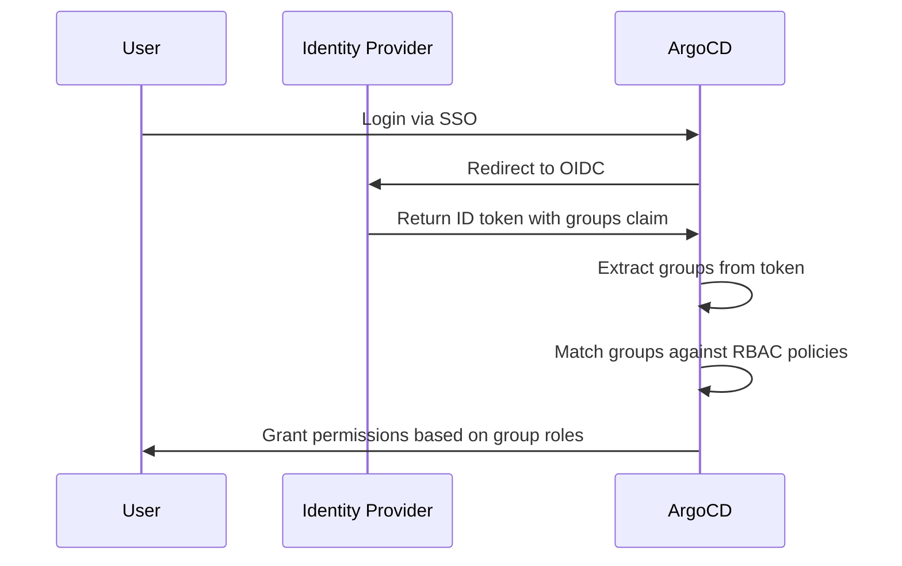

# How to Map SSO Groups to RBAC Roles in ArgoCD

Author: [nawazdhandala](https://github.com/nawazdhandala)

Tags: ArgoCD, GitOps, Kubernetes, RBAC, SSO

Description: Complete guide to mapping Single Sign-On groups from OIDC providers like Okta, Azure AD, and Keycloak to ArgoCD RBAC roles for team-based access control.

---

Mapping SSO groups to RBAC roles is how you connect your identity provider's team structure to ArgoCD permissions. Instead of managing individual user permissions, you assign permissions to groups and let your identity provider handle who belongs to which group. When someone joins the frontend team in Okta, they automatically get frontend deployment access in ArgoCD.

This guide covers the full setup from OIDC configuration through group mapping to troubleshooting.

## How Group Mapping Works

The flow is straightforward:



ArgoCD reads the groups claim from the OIDC token and matches those group names against the `g` (group) lines in your RBAC policy.

## Step 1: Configure Your OIDC Provider

First, ensure your identity provider includes group information in the OIDC token.

### Okta Configuration

In Okta, configure the groups claim in your ArgoCD application:

1. Go to your ArgoCD OIDC application in Okta
2. Under "Sign On" settings, add a Groups claim
3. Set the claim name to `groups`
4. Filter to include the groups you want

Then configure ArgoCD to request the groups scope:

```yaml
apiVersion: v1
kind: ConfigMap
metadata:
  name: argocd-cm
  namespace: argocd
data:
  url: https://argocd.company.com
  oidc.config: |
    name: Okta
    issuer: https://your-org.okta.com
    clientID: 0oa1234567890abcdef
    clientSecret: $oidc.okta.clientSecret
    requestedScopes:
      - openid
      - profile
      - email
      - groups
```

### Azure AD (Entra ID) Configuration

Azure AD uses the `groups` claim by default, but you need to enable it:

```yaml
apiVersion: v1
kind: ConfigMap
metadata:
  name: argocd-cm
  namespace: argocd
data:
  url: https://argocd.company.com
  oidc.config: |
    name: Azure AD
    issuer: https://login.microsoftonline.com/TENANT_ID/v2.0
    clientID: your-client-id
    clientSecret: $oidc.azure.clientSecret
    requestedScopes:
      - openid
      - profile
      - email
    requestedIDTokenClaims:
      groups:
        essential: true
```

Azure AD sends group object IDs by default, not group names. You will need to use the group object IDs in your RBAC policies or configure Azure AD to send group names.

### Keycloak Configuration

In Keycloak, add a group membership mapper to your client:

1. Go to your ArgoCD client in Keycloak
2. Add a mapper of type "Group Membership"
3. Set Token Claim Name to `groups`
4. Enable "Full group path" if you want nested group names

```yaml
apiVersion: v1
kind: ConfigMap
metadata:
  name: argocd-cm
  namespace: argocd
data:
  url: https://argocd.company.com
  oidc.config: |
    name: Keycloak
    issuer: https://keycloak.company.com/realms/your-realm
    clientID: argocd
    clientSecret: $oidc.keycloak.clientSecret
    requestedScopes:
      - openid
      - profile
      - email
      - groups
```

## Step 2: Configure RBAC Group Mappings

Once your OIDC provider sends group claims, map those groups to ArgoCD roles in `argocd-rbac-cm`:

```yaml
apiVersion: v1
kind: ConfigMap
metadata:
  name: argocd-rbac-cm
  namespace: argocd
data:
  policy.csv: |
    # Define custom roles
    p, role:deployer, applications, get, */*, allow
    p, role:deployer, applications, sync, */*, allow
    p, role:deployer, applications, action, */*, allow
    p, role:deployer, logs, get, */*, allow

    p, role:app-manager, applications, *, */*, allow
    p, role:app-manager, logs, get, */*, allow
    p, role:app-manager, exec, create, */*, allow

    # Map SSO groups to roles
    g, platform-admins, role:admin
    g, senior-engineers, role:app-manager
    g, developers, role:deployer
    g, qa-team, role:readonly

  policy.default: ""

  # Specify which OIDC claim contains group info
  scopes: '[groups]'
```

The `scopes` field tells ArgoCD which token claims to look at for group membership.

## Step 3: Configure the Group Claim Name

If your identity provider uses a non-standard claim name for groups, configure it in `argocd-rbac-cm`:

```yaml
data:
  # Default is "groups" - change if your IdP uses a different name
  scopes: '[cognito:groups]'  # For AWS Cognito
  # or
  scopes: '[roles]'  # If your IdP puts groups in "roles" claim
```

## Project-Scoped Group Mappings

For multi-team setups, map groups to project-scoped roles:

```yaml
policy.csv: |
  # Project-scoped deployer roles
  p, role:frontend-deployer, applications, get, frontend/*, allow
  p, role:frontend-deployer, applications, sync, frontend/*, allow
  p, role:frontend-deployer, applications, action, frontend/*, allow
  p, role:frontend-deployer, logs, get, frontend/*, allow

  p, role:backend-deployer, applications, get, backend/*, allow
  p, role:backend-deployer, applications, sync, backend/*, allow
  p, role:backend-deployer, applications, action, backend/*, allow
  p, role:backend-deployer, logs, get, backend/*, allow

  p, role:data-deployer, applications, get, data/*, allow
  p, role:data-deployer, applications, sync, data/*, allow
  p, role:data-deployer, applications, action, data/*, allow
  p, role:data-deployer, logs, get, data/*, allow

  # Map SSO groups to project roles
  g, frontend-team, role:frontend-deployer
  g, backend-team, role:backend-deployer
  g, data-engineering, role:data-deployer

  # Platform team gets admin everywhere
  g, platform-team, role:admin
```

## Using Azure AD Group Object IDs

When Azure AD sends group object IDs instead of names, your mappings look like this:

```yaml
policy.csv: |
  # Azure AD groups are referenced by object ID
  g, d1f2e3a4-b5c6-7890-abcd-ef1234567890, role:admin
  g, a1b2c3d4-e5f6-7890-abcd-ef0987654321, role:deployer
  g, f1e2d3c4-b5a6-7890-dcba-fe1234567890, role:readonly
```

This is harder to read but works the same way. Add comments to document which group each ID represents.

## Multiple Group Memberships

Users who belong to multiple SSO groups get the union of all permissions from all matched roles:

```yaml
policy.csv: |
  g, frontend-team, role:frontend-deployer
  g, on-call-team, role:ops-viewer

  p, role:frontend-deployer, applications, sync, frontend/*, allow
  p, role:ops-viewer, applications, get, */*, allow
  p, role:ops-viewer, logs, get, */*, allow
```

A user in both `frontend-team` and `on-call-team` can view all applications AND sync frontend applications.

## Verifying Group Mappings

### Check Token Groups

First, verify that your OIDC token contains the expected groups. Log in to ArgoCD and check the user info:

```bash
# Check current user info including groups
argocd account get-user-info
```

### Test Policies

Then test if the group mappings produce the expected permissions:

```bash
# Does someone in the frontend-team group get sync access?
argocd admin settings rbac can frontend-team sync applications 'frontend/web-app' \
  --policy-file policy.csv \
  --default-role ''
# Output: Yes

# Does someone in qa-team get sync access?
argocd admin settings rbac can qa-team sync applications 'frontend/web-app' \
  --policy-file policy.csv \
  --default-role ''
# Output: No
```

## Troubleshooting Group Mapping Issues

### Groups Not Appearing

If users do not get the expected permissions after logging in:

1. Check the OIDC token for groups claims - use jwt.io to decode the token
2. Verify the `scopes` field in `argocd-rbac-cm` matches your claim name
3. Ensure `requestedScopes` in `argocd-cm` includes the groups scope
4. Check that your IdP is configured to include groups in the token

### Group Name Mismatches

The group names in your RBAC policy must exactly match what the IdP sends:

```yaml
# If Okta sends "Engineering/Frontend-Team"
# you must use that exact string
g, Engineering/Frontend-Team, role:frontend-deployer

# NOT
g, frontend-team, role:frontend-deployer
```

Check your IdP to see the exact group names or paths it includes in tokens.

### Token Size Limits

If a user belongs to many groups, the OIDC token might exceed size limits. Solutions:

- Filter groups on the IdP side to only include ArgoCD-relevant groups
- Use group filtering in Okta or Azure AD to limit which groups appear in tokens
- Consider using Azure AD app roles instead of groups

## Complete Production Example

```yaml
apiVersion: v1
kind: ConfigMap
metadata:
  name: argocd-rbac-cm
  namespace: argocd
data:
  policy.csv: |
    # Roles
    p, role:deployer, applications, get, */*, allow
    p, role:deployer, applications, sync, */*, allow
    p, role:deployer, applications, action, */*, allow
    p, role:deployer, logs, get, */*, allow

    p, role:viewer, applications, get, */*, allow
    p, role:viewer, logs, get, */*, allow

    # SSO group mappings
    g, ArgoCD-Admins, role:admin
    g, Platform-Engineering, role:admin
    g, All-Developers, role:deployer
    g, QA-Engineers, role:viewer
    g, Product-Managers, role:viewer

  policy.default: ""
  scopes: '[groups]'
```

## Summary

Mapping SSO groups to ArgoCD RBAC roles connects your identity provider's team structure to ArgoCD permissions. Configure your OIDC provider to include groups in tokens, map those groups to roles in `argocd-rbac-cm` using `g` lines, and test with `argocd admin settings rbac can`. The result is automatic permission management - when HR adds someone to a team, they get the right ArgoCD access without any manual ArgoCD configuration.
