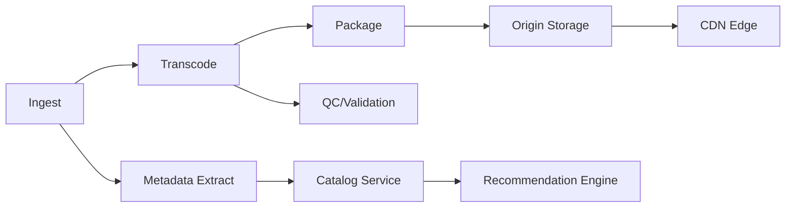

# ArgoCD for Media: Content Pipeline Deployments

Author: [nawazdhandala](https://github.com/nawazdhandala)

Tags: ArgoCD, GitOps, Kubernetes, Media, CI/CD

Description: Learn how to use ArgoCD to manage content delivery and media processing pipeline deployments on Kubernetes, including transcoding workers, CDN origins, and live streaming infrastructure.

---

Media companies run some of the most demanding workloads on Kubernetes. Video transcoding, image processing, content delivery, live streaming, and ad serving all need to scale rapidly, deploy frequently, and handle unpredictable traffic spikes. ArgoCD brings GitOps discipline to these complex pipelines without slowing down the pace of content delivery.

This guide covers patterns for deploying media processing infrastructure with ArgoCD, from transcoding pipelines to CDN origin servers.

## Media Pipeline Architecture

A typical media platform runs dozens of microservices across multiple stages of the content pipeline:



Each of these components has different scaling characteristics, update frequencies, and deployment requirements. ArgoCD manages all of them through a unified GitOps workflow.

## Organizing Media Workloads with ArgoCD Projects

Separate your media services into ArgoCD projects based on their deployment characteristics:

```yaml
# projects/media-ingest.yaml
apiVersion: argoproj.io/v1alpha1
kind: AppProject
metadata:
  name: media-ingest
  namespace: argocd
spec:
  description: Content ingestion and processing pipeline
  sourceRepos:
  - 'https://github.com/media-corp/ingest-services.git'
  - 'https://github.com/media-corp/shared-charts.git'
  destinations:
  - namespace: 'media-ingest-*'
    server: https://kubernetes.default.svc
  clusterResourceWhitelist:
  - group: ''
    kind: Namespace
  namespaceResourceWhitelist:
  - group: 'apps'
    kind: Deployment
  - group: 'batch'
    kind: Job
  - group: 'batch'
    kind: CronJob
  - group: 'keda.sh'
    kind: ScaledObject
---
# projects/media-delivery.yaml
apiVersion: argoproj.io/v1alpha1
kind: AppProject
metadata:
  name: media-delivery
  namespace: argocd
spec:
  description: Content delivery and CDN origin services
  sourceRepos:
  - 'https://github.com/media-corp/delivery-services.git'
  destinations:
  - namespace: 'media-delivery-*'
    server: https://kubernetes.default.svc
```

## Transcoding Worker Deployment

Video transcoding is a burst workload - you might need 5 pods during quiet periods and 500 during a content drop. KEDA (Kubernetes Event-Driven Autoscaling) combined with ArgoCD handles this well:

```yaml
# transcoding/deployment.yaml
apiVersion: apps/v1
kind: Deployment
metadata:
  name: transcoder-worker
  namespace: media-ingest-prod
spec:
  replicas: 5  # Baseline replicas
  selector:
    matchLabels:
      app: transcoder-worker
  template:
    metadata:
      labels:
        app: transcoder-worker
    spec:
      containers:
      - name: transcoder
        image: media-corp/transcoder:v4.12.0
        resources:
          requests:
            cpu: "4"
            memory: 8Gi
            # GPU for hardware-accelerated transcoding
            nvidia.com/gpu: "1"
          limits:
            cpu: "8"
            memory: 16Gi
            nvidia.com/gpu: "1"
        env:
        - name: INPUT_QUEUE
          value: "sqs://media-ingest-queue"
        - name: OUTPUT_BUCKET
          value: "s3://media-transcoded-output"
        - name: TRANSCODE_PROFILES
          value: "/config/profiles.json"
        volumeMounts:
        - name: transcode-profiles
          mountPath: /config
        - name: scratch-space
          mountPath: /tmp/transcode
      volumes:
      - name: transcode-profiles
        configMap:
          name: transcode-profiles
      - name: scratch-space
        emptyDir:
          sizeLimit: 100Gi
      # Schedule on GPU nodes
      nodeSelector:
        node-type: gpu-transcode
      tolerations:
      - key: nvidia.com/gpu
        operator: Exists
        effect: NoSchedule
---
# KEDA autoscaler based on queue depth
apiVersion: keda.sh/v1alpha1
kind: ScaledObject
metadata:
  name: transcoder-scaler
  namespace: media-ingest-prod
spec:
  scaleTargetRef:
    name: transcoder-worker
  minReplicaCount: 5
  maxReplicaCount: 500
  cooldownPeriod: 300
  triggers:
  - type: aws-sqs-queue
    metadata:
      queueURL: https://sqs.us-east-1.amazonaws.com/123456789/media-ingest-queue
      queueLength: "10"
      awsRegion: us-east-1
```

## Transcode Profiles as Configuration

Transcode profiles change frequently as new formats are added or quality settings are tuned. Store them in Git and manage with ArgoCD:

```yaml
# transcoding/configmap-profiles.yaml
apiVersion: v1
kind: ConfigMap
metadata:
  name: transcode-profiles
  namespace: media-ingest-prod
data:
  profiles.json: |
    {
      "profiles": [
        {
          "name": "4k-hevc",
          "codec": "hevc",
          "resolution": "3840x2160",
          "bitrate": "15000k",
          "framerate": 30,
          "audio_codec": "aac",
          "audio_bitrate": "192k"
        },
        {
          "name": "1080p-h264",
          "codec": "h264",
          "resolution": "1920x1080",
          "bitrate": "6000k",
          "framerate": 30,
          "audio_codec": "aac",
          "audio_bitrate": "128k"
        },
        {
          "name": "720p-h264",
          "codec": "h264",
          "resolution": "1280x720",
          "bitrate": "3000k",
          "framerate": 30,
          "audio_codec": "aac",
          "audio_bitrate": "128k"
        },
        {
          "name": "adaptive-hls",
          "type": "multi-bitrate",
          "variants": ["4k-hevc", "1080p-h264", "720p-h264"],
          "segment_duration": 6
        }
      ]
    }
```

When an engineer commits a new profile, ArgoCD syncs the ConfigMap. The workers pick up the new configuration without restarting, or you can add a rolling restart annotation if needed.

## CDN Origin Server Deployment

Origin servers need zero-downtime deployments because they serve live traffic to CDN edge nodes:

```yaml
# delivery/origin-server.yaml
apiVersion: argoproj.io/v1alpha1
kind: Application
metadata:
  name: cdn-origin
  namespace: argocd
spec:
  project: media-delivery
  source:
    repoURL: https://github.com/media-corp/delivery-services.git
    targetRevision: HEAD
    path: origin-server
    helm:
      values: |
        replicaCount: 12
        image:
          repository: media-corp/cdn-origin
          tag: v8.3.1

        strategy:
          type: RollingUpdate
          rollingUpdate:
            maxUnavailable: 0
            maxSurge: 2

        # Health checks tuned for media serving
        readinessProbe:
          httpGet:
            path: /health/ready
            port: 8080
          initialDelaySeconds: 5
          periodSeconds: 5

        livenessProbe:
          httpGet:
            path: /health/live
            port: 8080
          initialDelaySeconds: 15
          periodSeconds: 10

        # Large content cache
        persistence:
          enabled: true
          size: 500Gi
          storageClass: fast-ssd

        # Pod disruption budget for HA
        podDisruptionBudget:
          minAvailable: 10
  destination:
    server: https://kubernetes.default.svc
    namespace: media-delivery-prod
  syncPolicy:
    automated:
      prune: true
      selfHeal: true
    syncOptions:
    - RespectIgnoreDifferences=true
```

## Live Streaming Infrastructure

Live streaming is the most latency-sensitive media workload. Deploy streaming edge nodes across multiple regions using ArgoCD ApplicationSet:

```yaml
# live-streaming/applicationset.yaml
apiVersion: argoproj.io/v1alpha1
kind: ApplicationSet
metadata:
  name: live-stream-edges
  namespace: argocd
spec:
  generators:
  - list:
      elements:
      - region: us-east
        cluster: https://us-east.k8s.media-corp.com
        replicas: "8"
      - region: us-west
        cluster: https://us-west.k8s.media-corp.com
        replicas: "6"
      - region: eu-west
        cluster: https://eu-west.k8s.media-corp.com
        replicas: "8"
      - region: ap-southeast
        cluster: https://ap-southeast.k8s.media-corp.com
        replicas: "4"
  template:
    metadata:
      name: 'live-edge-{{region}}'
    spec:
      project: media-delivery
      source:
        repoURL: https://github.com/media-corp/delivery-services.git
        targetRevision: HEAD
        path: live-edge
        helm:
          parameters:
          - name: region
            value: '{{region}}'
          - name: replicaCount
            value: '{{replicas}}'
      destination:
        server: '{{cluster}}'
        namespace: live-streaming
      syncPolicy:
        automated:
          prune: true
          selfHeal: true
```

## Handling Content Drops and Major Events

When a major show premieres or a live event starts, you need to scale infrastructure ahead of time. Use ArgoCD sync waves to orchestrate this:

```yaml
# events/premiere-scaling.yaml
# Wave 0: Scale up infrastructure first
apiVersion: v1
kind: ConfigMap
metadata:
  name: scaling-config
  annotations:
    argocd.argoproj.io/sync-wave: "0"
data:
  event: "show-premiere-2026-03-01"
---
# Wave 1: Scale transcoder workers
apiVersion: apps/v1
kind: Deployment
metadata:
  name: transcoder-worker
  annotations:
    argocd.argoproj.io/sync-wave: "1"
spec:
  replicas: 200  # Pre-scale for event
---
# Wave 2: Scale origin servers
apiVersion: apps/v1
kind: Deployment
metadata:
  name: cdn-origin
  annotations:
    argocd.argoproj.io/sync-wave: "2"
spec:
  replicas: 30  # Increased for event
---
# Wave 3: Scale streaming edges
apiVersion: apps/v1
kind: Deployment
metadata:
  name: live-stream-edge
  annotations:
    argocd.argoproj.io/sync-wave: "3"
spec:
  replicas: 20  # Increased for event
```

Create a PR before the event with these scaling changes, merge when ready, and ArgoCD deploys the capacity in order. After the event, revert the PR to scale back down.

## Monitoring Media Pipelines

Track processing pipeline health with custom ArgoCD health checks:

```lua
-- custom-health-check for media processing jobs
hs = {}
if obj.status ~= nil then
  if obj.status.conditions ~= nil then
    for _, condition in ipairs(obj.status.conditions) do
      if condition.type == "Complete" and condition.status == "True" then
        hs.status = "Healthy"
        hs.message = "Processing complete"
        return hs
      end
      if condition.type == "Failed" and condition.status == "True" then
        hs.status = "Degraded"
        hs.message = condition.message
        return hs
      end
    end
  end
  hs.status = "Progressing"
  hs.message = "Processing in progress"
  return hs
end
hs.status = "Unknown"
return hs
```

For comprehensive pipeline monitoring, connect ArgoCD metrics to [OneUptime](https://oneuptime.com/blog/post/2026-02-09-argocd-monitoring-prometheus/view) to get alerts when transcoding jobs fail or content delivery latency spikes.

## Conclusion

Media companies benefit enormously from ArgoCD's GitOps approach because content pipelines involve many interconnected services with different scaling and deployment characteristics. The combination of ApplicationSets for multi-region deployment, KEDA for burst scaling, sync waves for orchestrated scaling events, and custom health checks for media-specific workloads creates a deployment platform that can handle everything from routine updates to major content premieres. By keeping all configuration in Git, media teams get full auditability and the ability to quickly roll back when a deployment affects content quality or delivery performance.
