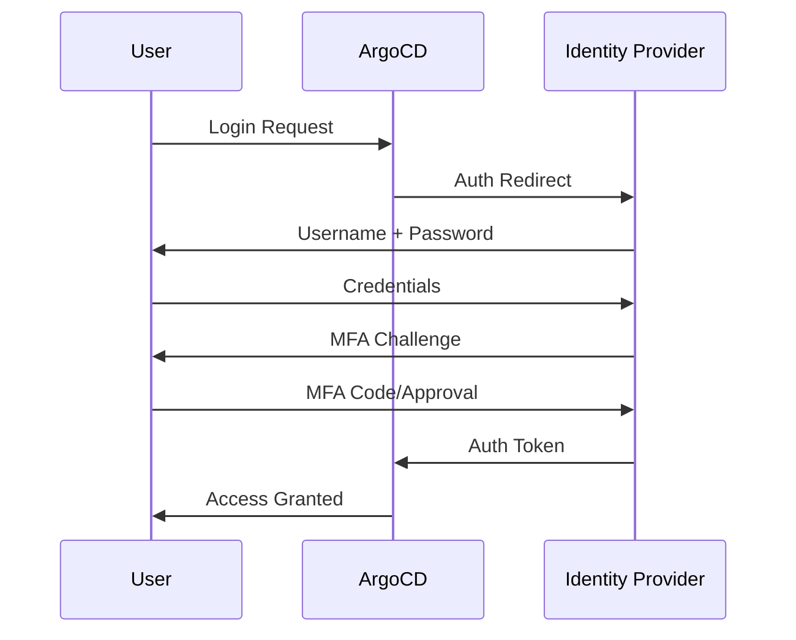
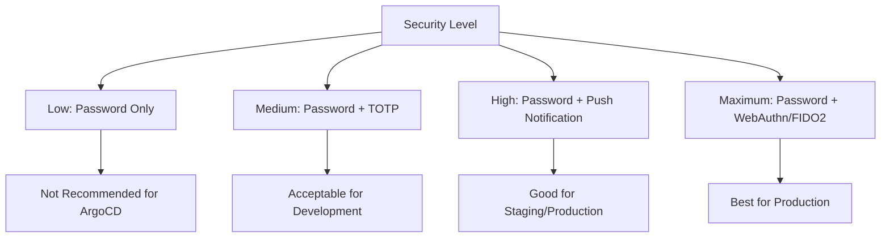

# How to Configure MFA for ArgoCD Access

Author: [nawazdhandala](https://github.com/nawazdhandala)

Tags: ArgoCD, GitOps, Kubernetes, MFA, Security

Description: Learn how to enforce multi-factor authentication for ArgoCD access using various identity providers, including TOTP, WebAuthn, push notifications, and conditional MFA policies.

---

Multi-factor authentication (MFA) adds a critical security layer to ArgoCD. Since ArgoCD controls what runs on your Kubernetes clusters, compromised credentials could lead to malicious deployments. Enforcing MFA means that even if a password is stolen, an attacker cannot access ArgoCD without the second factor. ArgoCD itself does not implement MFA directly - it relies on upstream identity providers to handle it. This guide covers configuring MFA through various providers that integrate with ArgoCD.

## MFA Architecture with ArgoCD

ArgoCD delegates authentication to identity providers through Dex (or direct OIDC). MFA is enforced at the identity provider level:



The key principle: MFA is configured in the identity provider, not in ArgoCD. ArgoCD trusts whatever authentication the IdP completes.

## Option 1: MFA with Keycloak

Keycloak is the most popular self-hosted identity provider for MFA with ArgoCD.

### Configure MFA in Keycloak

1. In the Keycloak admin console, go to Authentication, then Flows
2. Select the "Browser" flow
3. Add the "OTP Form" execution after "Username Password Form"
4. Set it to "Required"

Or use a more granular approach with conditional OTP:

```json
{
  "alias": "ArgoCD Browser Flow",
  "authenticationExecutions": [
    {
      "authenticator": "auth-username-password-form",
      "requirement": "REQUIRED"
    },
    {
      "authenticator": "auth-conditional-otp",
      "requirement": "REQUIRED",
      "authenticatorConfig": {
        "alias": "conditional-otp",
        "config": {
          "forceOtpRole": "argocd-mfa-required",
          "skipOtpRole": "",
          "defaultOtpOutcome": "force"
        }
      }
    }
  ]
}
```

### ArgoCD Dex Configuration for Keycloak

```yaml
apiVersion: v1
kind: ConfigMap
metadata:
  name: argocd-cm
  namespace: argocd
data:
  url: https://argocd.example.com

  dex.config: |
    connectors:
    - type: oidc
      id: keycloak
      name: Keycloak (MFA Required)
      config:
        issuer: https://keycloak.example.com/realms/argocd
        clientID: argocd
        clientSecret: $dex.keycloak.clientSecret
        redirectURI: https://argocd.example.com/api/dex/callback
        scopes:
        - openid
        - profile
        - email
        - groups
        insecureEnableGroups: true
        groupsKey: groups

        # Request specific ACR (Authentication Context Class Reference)
        # to ensure MFA was completed
        # This is optional but adds verification
```

### Verify MFA in Keycloak Token

To verify that MFA was actually performed, check the `acr` (Authentication Context Class Reference) claim in the token. Keycloak sets this based on the authentication flow completed:

```yaml
# In Keycloak, configure the client to include acr in tokens
# Then in ArgoCD, you can log and monitor acr values
```

## Option 2: MFA with Okta

Okta provides built-in MFA policies that are easy to configure.

### Configure MFA Policy in Okta

1. In Okta Admin, go to Security, then Multifactor
2. Enable desired factor types: Okta Verify, Google Authenticator, YubiKey, etc.
3. Go to Security, then Authentication Policies
4. Create or edit a policy for the ArgoCD app:

```text
Policy Name: ArgoCD MFA Policy
Rule: Require MFA
  - Factor types: Any enrolled factor
  - Prompt: Every sign-on
  - Session lifetime: 8 hours
```

5. Assign this policy to your ArgoCD SAML/OIDC application

### ArgoCD Configuration for Okta with MFA

```yaml
dex.config: |
  connectors:
  - type: oidc
    id: okta
    name: Okta (MFA Enforced)
    config:
      issuer: https://your-org.okta.com
      clientID: argocd-client-id
      clientSecret: $dex.okta.clientSecret
      redirectURI: https://argocd.example.com/api/dex/callback
      scopes:
      - openid
      - profile
      - email
      - groups

      # Request MFA through ACR values
      # Okta supports requesting specific assurance levels
      claimMapping:
        preferred_username: email
```

## Option 3: MFA with Azure AD (Entra ID)

Azure AD Conditional Access policies provide sophisticated MFA controls.

### Create Conditional Access Policy

1. In Azure Portal, go to Microsoft Entra ID, then Security, then Conditional Access
2. Create a new policy:

```text
Name: ArgoCD MFA Requirement
Users: All users (or specific groups)
Cloud apps: Select the ArgoCD enterprise application
Conditions:
  - Any device platform
  - Any location (or exclude trusted locations)
Grant: Require multifactor authentication
Session: Sign-in frequency 8 hours
```

### ArgoCD Configuration for Azure AD

```yaml
dex.config: |
  connectors:
  - type: oidc
    id: azure
    name: Azure AD (MFA Required)
    config:
      issuer: https://login.microsoftonline.com/<tenant-id>/v2.0
      clientID: <azure-client-id>
      clientSecret: $dex.azure.clientSecret
      redirectURI: https://argocd.example.com/api/dex/callback
      scopes:
      - openid
      - profile
      - email
      # Azure includes groups when configured in the app registration
      insecureEnableGroups: true
      groupsKey: groups
```

## Option 4: MFA with Google Workspace

### Enable 2-Step Verification

1. In Google Admin Console, go to Security, then 2-Step Verification
2. Turn on enforcement for the organizational unit containing ArgoCD users
3. Set allowed methods: Security keys, Google prompts, TOTP apps
4. Set new user enrollment period: 1 week
5. Set trusted device policy as needed

### ArgoCD Configuration for Google

```yaml
dex.config: |
  connectors:
  - type: google
    id: google
    name: Google Workspace (2FA Required)
    config:
      clientID: your-client-id.apps.googleusercontent.com
      clientSecret: $dex.google.clientSecret
      redirectURI: https://argocd.example.com/api/dex/callback
      hostedDomains:
      - example.com
      serviceAccountFilePath: /tmp/google-sa.json
      adminEmail: admin@example.com
```

## Option 5: MFA with Self-Hosted Providers

### Authelia MFA

Authelia has built-in TOTP and WebAuthn support:

```yaml
# authelia configuration.yml
totp:
  issuer: example.com
  period: 30
  skew: 1

webauthn:
  display_name: ArgoCD Access
  attestation_conveyance_preference: indirect
  user_verification: preferred

# Require 2FA for ArgoCD
access_control:
  rules:
  - domain: argocd.example.com
    policy: two_factor
```

### Authentik MFA

Configure MFA stages in Authentik:

```yaml
# Create an authentication flow with MFA
# In Authentik admin:
# 1. Create a TOTP Authenticator Setup Stage
# 2. Create an Authenticator Validation Stage (TOTP + WebAuthn)
# 3. Add these stages to the authorization flow for ArgoCD
```

## WebAuthn (Hardware Security Keys)

For the highest security, require hardware security keys (FIDO2/WebAuthn):

Most identity providers support WebAuthn configuration. The advantage over TOTP is that WebAuthn is phishing-resistant - the authentication is bound to the origin domain, so a phishing site cannot intercept the authentication.

For environments requiring maximum security (production ArgoCD managing critical infrastructure), enforcing WebAuthn provides the strongest protection:



## Conditional MFA Policies

Most identity providers support conditional MFA - requiring MFA only in certain situations:

### Common Conditions

- **Application-specific**: Require MFA only for ArgoCD, not for all apps
- **Risk-based**: Require MFA when login is from a new device or location
- **Role-based**: Require MFA only for users with admin/sync privileges
- **Network-based**: Skip MFA when on corporate network, require it externally

### Example: Okta Risk-Based MFA

```text
Policy: ArgoCD Adaptive MFA
Conditions:
  - If risk score is HIGH: Require MFA + email verification
  - If risk score is MEDIUM: Require MFA
  - If risk score is LOW and on trusted network: Allow password only
  - If risk score is LOW and off network: Require MFA
```

## Monitoring MFA Compliance

Track MFA adoption and failures to ensure compliance:

```yaml
# PrometheusRule for auth monitoring
apiVersion: monitoring.coreos.com/v1
kind: PrometheusRule
metadata:
  name: argocd-auth-monitoring
spec:
  groups:
  - name: argocd-authentication
    rules:
    - alert: HighAuthFailureRate
      expr: |
        rate(argocd_app_reconcile_count{dest_server!=""}[5m]) == 0
        and
        increase(argocd_app_sync_total{phase="Error"}[5m]) > 5
      for: 10m
      labels:
        severity: warning
      annotations:
        summary: "High authentication failure rate detected"
```

Integrate authentication metrics with OneUptime to get alerts when MFA challenges fail at an unusual rate, which could indicate credential theft attempts.

## ArgoCD CLI with MFA

When MFA is enabled, the ArgoCD CLI SSO flow handles it transparently:

```bash
# CLI opens browser for SSO (including MFA)
argocd login argocd.example.com --sso

# For CI/CD pipelines that cannot do interactive MFA,
# use API tokens instead
argocd account generate-token --account ci-bot
```

Important: CI/CD service accounts should use API tokens, not SSO with MFA. MFA is for human users. Secure API tokens with proper rotation and least-privilege RBAC.

## Conclusion

MFA for ArgoCD is implemented at the identity provider level, not within ArgoCD itself. This means your MFA configuration depends on which identity provider you use - Keycloak, Okta, Azure AD, Google Workspace, Authelia, or Authentik all support MFA with different levels of sophistication. The best approach is to start with TOTP as a baseline, then move to WebAuthn for production environments. Conditional MFA policies let you balance security with usability by requiring stronger authentication for higher-risk scenarios. Remember that CI/CD pipelines should use API tokens with proper RBAC rather than interactive MFA, and that monitoring authentication failures is just as important as configuring MFA in the first place.
