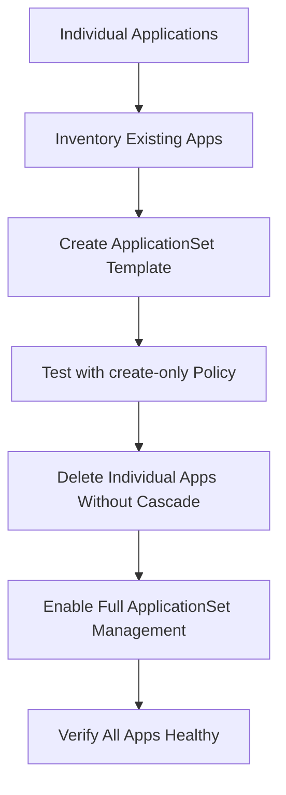

# How to Migrate from Individual Apps to ApplicationSets in ArgoCD

Author: [nawazdhandala](https://github.com/nawazdhandala)

Tags: ArgoCD, GitOps, Kubernetes, ApplicationSet, Migration

Description: Learn how to safely migrate from individually managed ArgoCD Applications to ApplicationSets without downtime or disruption to running workloads.

---

Many organizations start with ArgoCD by creating individual Application manifests. As the number of applications grows, maintaining dozens or hundreds of separate YAML files becomes painful. ApplicationSets offer a templated approach that generates Applications from a single definition. But migrating existing Applications to ApplicationSet management requires care to avoid disrupting running workloads.

This guide provides a step-by-step migration strategy, covering preparation, execution, and verification.

## Migration Challenges

Migrating from individual Applications to ApplicationSets is not just about creating an ApplicationSet that matches your existing apps. There are several complications:

1. **Ownership conflict** - You cannot have both an individual Application and an ApplicationSet-managed Application with the same name
2. **Settings preservation** - Sync policies, annotations, and health status must be preserved
3. **Zero downtime** - Running workloads must not be affected
4. **Rollback capability** - You need a way to undo the migration if something goes wrong



## Step 1: Inventory Your Existing Applications

First, document all existing applications and their configurations.

```bash
# Export all current applications to a file
kubectl get applications -n argocd -o yaml > applications-backup.yaml

# List all applications with their key settings
argocd app list -o json | jq '.[] | {
  name: .metadata.name,
  project: .spec.project,
  repo: .spec.source.repoURL,
  path: .spec.source.path,
  revision: .spec.source.targetRevision,
  destServer: .spec.destination.server,
  destNamespace: .spec.destination.namespace,
  syncPolicy: .spec.syncPolicy,
  labels: .metadata.labels,
  annotations: .metadata.annotations
}'
```

Create a spreadsheet or JSON file with all application configurations:

```json
[
  {
    "name": "frontend",
    "repo": "https://github.com/myorg/frontend.git",
    "path": "deploy",
    "revision": "HEAD",
    "namespace": "frontend",
    "project": "default",
    "auto_sync": true,
    "prune": true,
    "self_heal": true
  },
  {
    "name": "backend-api",
    "repo": "https://github.com/myorg/backend.git",
    "path": "deploy",
    "revision": "main",
    "namespace": "backend",
    "project": "default",
    "auto_sync": true,
    "prune": true,
    "self_heal": true
  },
  {
    "name": "worker",
    "repo": "https://github.com/myorg/worker.git",
    "path": "deploy",
    "revision": "main",
    "namespace": "worker",
    "project": "default",
    "auto_sync": false,
    "prune": false,
    "self_heal": false
  }
]
```

## Step 2: Design Your ApplicationSet

Based on the inventory, design an ApplicationSet template that can generate equivalent Applications.

### Pattern A: List Generator (Simple Migration)

If your applications are diverse (different repos, different settings), use a list generator.

```yaml
apiVersion: argoproj.io/v1alpha1
kind: ApplicationSet
metadata:
  name: migrated-apps
  namespace: argocd
spec:
  goTemplate: true
  goTemplateOptions: ["missingkey=error"]
  generators:
    - list:
        elements:
          - name: frontend
            repo: https://github.com/myorg/frontend.git
            path: deploy
            revision: HEAD
            namespace: frontend
          - name: backend-api
            repo: https://github.com/myorg/backend.git
            path: deploy
            revision: main
            namespace: backend
          - name: worker
            repo: https://github.com/myorg/worker.git
            path: deploy
            revision: main
            namespace: worker
  template:
    metadata:
      name: '{{.name}}'
      labels:
        managed-by: applicationset
    spec:
      project: default
      source:
        repoURL: '{{.repo}}'
        targetRevision: '{{.revision}}'
        path: '{{.path}}'
      destination:
        server: https://kubernetes.default.svc
        namespace: '{{.namespace}}'
      syncPolicy:
        automated:
          prune: true
          selfHeal: true
  # CRITICAL: Start with create-only to prevent conflicts
  syncPolicy:
    applicationsSync: create-only
```

### Pattern B: Git File Generator (Scalable Migration)

If your applications follow a pattern, create config files for the Git file generator.

```bash
# Create config files from existing applications
for app in $(argocd app list -o name); do
  app_name=$(echo "$app" | sed 's|.*/||')
  argocd app get "$app_name" -o json | jq '{
    name: .metadata.name,
    repo: .spec.source.repoURL,
    path: .spec.source.path,
    revision: .spec.source.targetRevision,
    namespace: .spec.destination.namespace,
    project: .spec.project
  }' > "configs/$app_name.json"
done
```

## Step 3: Test the ApplicationSet

Apply the ApplicationSet with `create-only` policy to verify it would generate the correct Applications WITHOUT touching existing ones.

```bash
# Apply with a different naming convention to test
# Temporarily use a prefix to avoid name conflicts
```

Actually, the safest approach is to test in a staging environment first:

```bash
# In staging: apply the ApplicationSet
kubectl apply -f applicationset.yaml -n argocd

# Verify it generates the expected applications
argocd appset get migrated-apps

# Check that generated applications match existing ones
kubectl get applicationset migrated-apps -n argocd -o json | \
  jq '.status.resources[].name'
```

## Step 4: Execute the Migration

The migration must be done application by application to minimize risk.

```bash
#!/bin/bash
# migrate-to-applicationset.sh

APPSET_FILE="applicationset.yaml"
BACKUP_DIR="backup-$(date +%Y%m%d-%H%M%S)"
mkdir -p "$BACKUP_DIR"

echo "=== Phase 1: Backup all existing applications ==="
kubectl get applications -n argocd -o yaml > "$BACKUP_DIR/all-applications.yaml"

echo "=== Phase 2: Remove finalizers from existing applications ==="
for app in frontend backend-api worker; do
  # Backup individual application
  kubectl get application "$app" -n argocd -o yaml > "$BACKUP_DIR/$app.yaml"

  # Remove cascade delete finalizer (if present)
  kubectl patch application "$app" -n argocd \
    --type json \
    -p '[{"op":"remove","path":"/metadata/finalizers"}]' 2>/dev/null || true

  echo "Prepared: $app"
done

echo "=== Phase 3: Delete individual applications (no cascade) ==="
for app in frontend backend-api worker; do
  # Delete the Application resource only
  # Without finalizer, Kubernetes resources are preserved
  kubectl delete application "$app" -n argocd
  echo "Deleted Application resource: $app"

  # Brief pause to let the controller settle
  sleep 2
done

echo "=== Phase 4: Apply the ApplicationSet ==="
kubectl apply -f "$APPSET_FILE" -n argocd

echo "=== Phase 5: Verify ==="
sleep 10
argocd appset get migrated-apps
argocd app list
```

## Step 5: Verify the Migration

After migration, verify that everything is working correctly.

```bash
# Check all applications are healthy
argocd app list -o wide

# Verify each application is synced
for app in frontend backend-api worker; do
  status=$(argocd app get "$app" -o json | jq -r '.status.sync.status')
  health=$(argocd app get "$app" -o json | jq -r '.status.health.status')
  echo "$app: sync=$status health=$health"
done

# Verify the ApplicationSet manages the applications
kubectl get applications -n argocd -o json | \
  jq '.items[] | {name: .metadata.name, owner: .metadata.ownerReferences[0].name}'

# Check that workloads are still running
kubectl get deployments --all-namespaces | grep -E "frontend|backend|worker"
```

## Step 6: Enable Full Management

Once verified, optionally upgrade from `create-only` to full management.

```bash
# Switch from create-only to full sync management
kubectl patch applicationset migrated-apps -n argocd \
  --type merge \
  -p '{"spec":{"syncPolicy":{"applicationsSync":"sync"}}}'
```

## Handling Edge Cases

### Applications with Different Sync Policies

If some applications have auto-sync and others do not, use Go template conditionals.

```yaml
spec:
  goTemplate: true
  goTemplateOptions: ["missingkey=error"]
  generators:
    - list:
        elements:
          - name: frontend
            auto_sync: "true"
          - name: worker
            auto_sync: "false"
  template:
    spec:
      syncPolicy:
        {{- if eq .auto_sync "true"}}
        automated:
          prune: true
          selfHeal: true
        {{- end}}
```

### Applications from Different Repositories

The list generator naturally handles this since each element can specify its own repo URL.

### Applications with Custom Annotations

Preserve existing annotations by including them in the template.

```yaml
template:
  metadata:
    name: '{{.name}}'
    annotations:
      notifications.argoproj.io/subscribe.on-sync-failed.slack: '{{.slack_channel}}'
```

## Rollback Plan

If the migration goes wrong, restore from backup.

```bash
# Delete the ApplicationSet (use safe deletion!)
kubectl patch applicationset migrated-apps -n argocd \
  --type merge \
  -p '{"spec":{"syncPolicy":{"applicationsSync":"create-only"}}}'

# Remove owner references from applications
for app in $(kubectl get applications -n argocd \
  -o jsonpath='{range .items[?(@.metadata.ownerReferences)]}{.metadata.name}{"\n"}{end}'); do
  kubectl patch application "$app" -n argocd \
    --type json \
    -p '[{"op":"remove","path":"/metadata/ownerReferences"}]' 2>/dev/null
done

# Delete the ApplicationSet
kubectl delete applicationset migrated-apps -n argocd

# Restore individual applications from backup
kubectl apply -f backup-*/all-applications.yaml
```

Migrating to ApplicationSets is a significant operational improvement that pays off quickly at scale. The key is preparation, testing, and having a solid rollback plan. For monitoring the migration and ensuring application health throughout the process, [OneUptime](https://oneuptime.com/blog/post/2026-02-26-argocd-applicationset-safe-deletion/view) provides real-time health tracking and instant alerts if any application degrades during migration.
