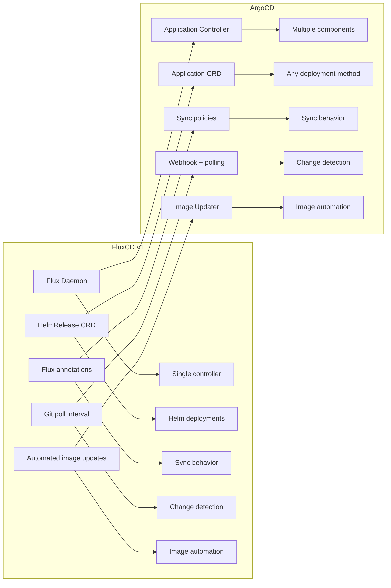

# How to Migrate from FluxCD v1 to ArgoCD

Author: [nawazdhandala](https://github.com/nawazdhandala)

Tags: ArgoCD, GitOps, Kubernetes, FluxCD, Migration

Description: Learn how to migrate from the deprecated FluxCD v1 to ArgoCD with a step-by-step guide covering concept mapping, manifest conversion, and zero-downtime cutover.

---

FluxCD v1 reached end of life in late 2022. If you are still running it, you are on unsupported software with no security patches. While the natural upgrade path is FluxCD v2, ArgoCD is a compelling alternative that offers a visual UI, more granular sync controls, and a different operational model that many teams prefer.

In this guide, I will walk through migrating from FluxCD v1 to ArgoCD, mapping concepts between the two tools, and executing the migration without downtime.

## FluxCD v1 vs ArgoCD: Concept Mapping

Understanding how FluxCD v1 concepts translate to ArgoCD is the first step.



### Detailed Concept Mapping

| FluxCD v1 | ArgoCD | Notes |
|-----------|--------|-------|
| Flux daemon | Application controller + repo server + API server | ArgoCD splits into specialized components |
| `--git-url` flag | Application source.repoURL | Per-application repo configuration |
| `--git-path` flag | Application source.path | Per-application path |
| `--git-branch` flag | Application source.targetRevision | Per-application branch |
| `--git-poll-interval` | timeout.reconciliation | Global or per-app polling |
| HelmRelease CRD | Application with Helm source | Different CRD structure |
| `fluxctl sync` | `argocd app sync` | Manual sync trigger |
| `flux.weave.works/automated: "true"` | syncPolicy.automated | Auto-sync configuration |
| `flux.weave.works/tag.*` filter | ArgoCD Image Updater annotations | Image auto-update |
| `flux.weave.works/locked: "true"` | Remove from auto-sync or use sync window | Deployment lock |

## Step 1: Inventory FluxCD v1 Resources

Document everything Flux v1 manages.

```bash
# List all HelmReleases (if using Flux Helm Operator)
kubectl get helmreleases --all-namespaces -o json | jq '.items[] | {
  name: .metadata.name,
  namespace: .metadata.namespace,
  chart: .spec.chart,
  version: .spec.version,
  values: .spec.values
}'

# Check Flux configuration
kubectl get deployment flux -n flux -o json | jq '.spec.template.spec.containers[0].args'
# This shows: --git-url, --git-path, --git-branch, etc.

# List workloads with Flux annotations
kubectl get deployments --all-namespaces -o json | jq '.items[] |
  select(.metadata.annotations | keys[] | startswith("flux.weave.works")) |
  {
    name: .metadata.name,
    namespace: .metadata.namespace,
    annotations: [.metadata.annotations | to_entries[] | select(.key | startswith("flux.weave.works"))]
  }'
```

## Step 2: Map Flux Git Repository Structure

FluxCD v1 typically watches a single repository with a flat or nested structure. ArgoCD can match this exactly.

```text
# Typical FluxCD v1 repo structure
flux-repo/
  namespaces/
    production.yaml
    staging.yaml
  workloads/
    production/
      api-deployment.yaml
      api-service.yaml
      frontend-deployment.yaml
      frontend-service.yaml
    staging/
      api-deployment.yaml
      frontend-deployment.yaml
  releases/
    production/
      redis.yaml        # HelmRelease CRD
      postgresql.yaml   # HelmRelease CRD
```

You can keep this exact structure and point ArgoCD Applications at the same paths. Or, take this opportunity to reorganize into a more ArgoCD-friendly structure.

```text
# Reorganized for ArgoCD
gitops-repo/
  apps/
    api/
      base/
        deployment.yaml
        service.yaml
      overlays/
        production/
          kustomization.yaml
        staging/
          kustomization.yaml
    frontend/
      base/
        deployment.yaml
        service.yaml
      overlays/
        production/
          kustomization.yaml
        staging/
          kustomization.yaml
  infrastructure/
    redis/
      Chart.yaml
      values-production.yaml
    postgresql/
      Chart.yaml
      values-production.yaml
```

## Step 3: Convert HelmReleases to ArgoCD Applications

FluxCD v1 HelmRelease CRDs need to be converted to ArgoCD Application CRDs.

FluxCD v1 HelmRelease:
```yaml
apiVersion: flux.weave.works/v1beta1
kind: HelmRelease
metadata:
  name: redis
  namespace: cache
  annotations:
    flux.weave.works/automated: "true"
spec:
  releaseName: redis
  chart:
    repository: https://charts.bitnami.com/bitnami
    name: redis
    version: 17.3.14
  values:
    architecture: replication
    replica:
      replicaCount: 3
    auth:
      enabled: true
      existingSecret: redis-password
```

ArgoCD Application equivalent:
```yaml
apiVersion: argoproj.io/v1alpha1
kind: Application
metadata:
  name: redis
  namespace: argocd
spec:
  project: infrastructure
  source:
    repoURL: https://charts.bitnami.com/bitnami
    chart: redis
    targetRevision: 17.3.14
    helm:
      values: |
        architecture: replication
        replica:
          replicaCount: 3
        auth:
          enabled: true
          existingSecret: redis-password
  destination:
    server: https://kubernetes.default.svc
    namespace: cache
  syncPolicy:
    automated:
      selfHeal: true
      prune: true
    syncOptions:
      - CreateNamespace=true
```

## Step 4: Convert Flux Annotations

Map Flux annotations to ArgoCD configuration.

### Automated Sync
```yaml
# FluxCD v1
metadata:
  annotations:
    flux.weave.works/automated: "true"

# ArgoCD
spec:
  syncPolicy:
    automated:
      selfHeal: true
```

### Image Tag Filters
```yaml
# FluxCD v1
metadata:
  annotations:
    flux.weave.works/tag.app: semver:~1.0
    flux.weave.works/tag.sidecar: glob:v*

# ArgoCD Image Updater
metadata:
  annotations:
    argocd-image-updater.argoproj.io/image-list: >
      app=registry.myorg.com/app,
      sidecar=registry.myorg.com/sidecar
    argocd-image-updater.argoproj.io/app.update-strategy: semver
    argocd-image-updater.argoproj.io/app.allow-tags: "regexp:^1\\.0"
    argocd-image-updater.argoproj.io/sidecar.update-strategy: name
    argocd-image-updater.argoproj.io/sidecar.allow-tags: "regexp:^v"
```

### Deployment Lock
```yaml
# FluxCD v1
metadata:
  annotations:
    flux.weave.works/locked: "true"
    flux.weave.works/locked_msg: "Locked for investigation"
    flux.weave.works/locked_user: "jane.doe"

# ArgoCD - use sync window or remove auto-sync
spec:
  syncPolicy: {}  # No automated policy = manual only
```

## Step 5: Install ArgoCD Alongside Flux

Run both tools in parallel during migration. They can coexist.

```bash
# Install ArgoCD
kubectl create namespace argocd
kubectl apply -n argocd -f https://raw.githubusercontent.com/argoproj/argo-cd/stable/manifests/install.yaml

# Install ArgoCD Image Updater (if using Flux image automation)
kubectl apply -n argocd -f https://raw.githubusercontent.com/argoproj-labs/argocd-image-updater/stable/manifests/install.yaml
```

## Step 6: Migrate Applications One at a Time

For each application, follow this process.

```bash
# 1. Remove Flux annotations from the workload
kubectl annotate deployment api -n production \
  flux.weave.works/automated- \
  flux.weave.works/tag.api-

# 2. Create the ArgoCD Application (manual sync first)
kubectl apply -f argocd-apps/api-production.yaml

# 3. Verify ArgoCD shows it as Synced
argocd app get api-production

# 4. If differences exist, resolve them
argocd app diff api-production

# 5. Do a test sync
argocd app sync api-production --dry-run

# 6. If clean, enable auto-sync after a validation period
```

## Step 7: Handle Flux-Specific Resources

Remove Flux-specific resources as you migrate.

```bash
# Remove HelmRelease CRDs after migration
kubectl delete helmrelease redis -n cache

# After all migrations complete, remove Flux
kubectl delete namespace flux
kubectl delete crd helmreleases.flux.weave.works
kubectl delete clusterrole flux
kubectl delete clusterrolebinding flux
```

## Step 8: Migrate Image Automation

If you were using Flux's image automation, set up ArgoCD Image Updater.

```yaml
# argocd-image-updater config
apiVersion: v1
kind: ConfigMap
metadata:
  name: argocd-image-updater-config
  namespace: argocd
data:
  registries.conf: |
    registries:
      - name: Docker Hub
        prefix: docker.io
        api_url: https://registry-1.docker.io
        credentials: pullsecret:argocd/dockerhub-credentials
        defaultns: library
      - name: Private Registry
        prefix: registry.myorg.com
        api_url: https://registry.myorg.com
        credentials: pullsecret:argocd/private-registry-credentials
```

For more details, see our guide on [implementing Image Updater in ArgoCD](https://oneuptime.com/blog/post/2026-01-25-image-updater-argocd/view).

## Step 9: Validate and Decommission Flux

After all applications are migrated, verify and remove Flux.

```bash
# Verify no Flux-managed resources remain
kubectl get helmreleases --all-namespaces 2>/dev/null
kubectl get deployments --all-namespaces -o json | \
  jq '.items[] | select(.metadata.annotations | keys[] | startswith("flux.weave.works"))' 2>/dev/null

# If clean, remove Flux
kubectl delete deployment flux -n flux
kubectl delete deployment helm-operator -n flux  # If using Helm Operator
kubectl delete namespace flux

# Clean up CRDs
kubectl delete crd helmreleases.flux.weave.works 2>/dev/null
kubectl delete crd fluxhelmreleases.helm.integrations.flux.weave.works 2>/dev/null

echo "FluxCD v1 has been decommissioned. All deployments are managed by ArgoCD."
```

## Conclusion

Migrating from FluxCD v1 to ArgoCD is a straightforward process because both tools follow GitOps principles. The same Git repository can serve both tools during the transition. The main work is converting HelmRelease CRDs to ArgoCD Applications and translating Flux annotations to ArgoCD configuration. Take the migration one application at a time, validate thoroughly, and enjoy the improved visibility and control that ArgoCD provides. Most importantly, you will be off an unmaintained tool and onto a platform that continues to receive active development and security updates.
