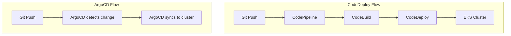

# How to Migrate from AWS CodeDeploy to ArgoCD

Author: [nawazdhandala](https://github.com/nawazdhandala)

Tags: ArgoCD, GitOps, Kubernetes, AWS, Migration

Description: A complete guide to migrating your Kubernetes deployments from AWS CodeDeploy to ArgoCD, including appspec conversion, deployment strategy mapping, and CI/CD integration.

---

AWS CodeDeploy is Amazon's deployment service that works across EC2, Lambda, and ECS. If your team has moved to Kubernetes and is still using CodeDeploy through its ECS or EC2 integration, switching to ArgoCD gives you a Kubernetes-native GitOps workflow that is simpler, more transparent, and not locked to AWS.

This guide walks you through replacing CodeDeploy with ArgoCD for Kubernetes workloads.

## Why Move from CodeDeploy to ArgoCD

CodeDeploy was not designed for Kubernetes. Even with ECS support, it adds complexity when you are running on EKS:

- CodeDeploy requires an agent on EC2 or tight ECS integration - neither is natural for Kubernetes
- AppSpec files are CodeDeploy-specific and do not translate to other platforms
- Deployment visibility is limited to the AWS Console
- No drift detection - CodeDeploy does not know if someone changed your cluster manually
- ArgoCD is Kubernetes-native - it understands Deployments, StatefulSets, CRDs, and everything else natively

## Architecture Comparison



The ArgoCD flow is simpler because it cuts out the pipeline middleman. Your Git repository IS the pipeline.

## Step 1: Understand What CodeDeploy Is Doing

Examine your CodeDeploy setup:

```bash
# List CodeDeploy applications
aws deploy list-applications

# Get deployment group details
aws deploy get-deployment-group \
  --application-name my-app \
  --deployment-group-name my-deployment-group

# Check recent deployments
aws deploy list-deployments \
  --application-name my-app \
  --deployment-group-name my-deployment-group \
  --max-items 10
```

Look at your `appspec.yml`:

```yaml
# Typical CodeDeploy appspec.yml for ECS
version: 0.0
Resources:
  - TargetService:
      Type: AWS::ECS::Service
      Properties:
        TaskDefinition: "arn:aws:ecs:us-east-1:123456789:task-definition/my-app:5"
        LoadBalancerInfo:
          ContainerName: "my-app"
          ContainerPort: 8080
Hooks:
  - BeforeInstall: "scripts/before_install.sh"
  - AfterInstall: "scripts/after_install.sh"
  - AfterAllowTestTraffic: "scripts/test_traffic.sh"
  - BeforeAllowTraffic: "scripts/before_traffic.sh"
  - AfterAllowTraffic: "scripts/after_traffic.sh"
```

## Step 2: Convert Your Manifests to Kubernetes-Native Format

If you are on ECS, you need to convert task definitions to Kubernetes manifests. If you are already on EKS with CodeDeploy just doing the deployment part, your manifests may already exist.

```yaml
# Kubernetes Deployment equivalent
apiVersion: apps/v1
kind: Deployment
metadata:
  name: my-app
  namespace: production
spec:
  replicas: 3
  selector:
    matchLabels:
      app: my-app
  template:
    metadata:
      labels:
        app: my-app
    spec:
      containers:
        - name: my-app
          image: 123456789.dkr.ecr.us-east-1.amazonaws.com/my-app:v1.5.0
          ports:
            - containerPort: 8080
          resources:
            requests:
              memory: "256Mi"
              cpu: "250m"
            limits:
              memory: "512Mi"
              cpu: "500m"
          livenessProbe:
            httpGet:
              path: /health
              port: 8080
            initialDelaySeconds: 30
            periodSeconds: 10
          readinessProbe:
            httpGet:
              path: /ready
              port: 8080
            initialDelaySeconds: 5
            periodSeconds: 5
---
apiVersion: v1
kind: Service
metadata:
  name: my-app
  namespace: production
spec:
  selector:
    app: my-app
  ports:
    - port: 80
      targetPort: 8080
  type: ClusterIP
```

## Step 3: Set Up Your Git Repository Structure

Organize manifests for ArgoCD:

```text
my-app-k8s/
  base/
    deployment.yaml
    service.yaml
    configmap.yaml
    kustomization.yaml
  overlays/
    dev/
      kustomization.yaml
      patches/
        replicas.yaml
    staging/
      kustomization.yaml
    production/
      kustomization.yaml
      patches/
        replicas.yaml
        resources.yaml
```

The base `kustomization.yaml`:

```yaml
apiVersion: kustomize.io/v1beta1
kind: Kustomization
resources:
  - deployment.yaml
  - service.yaml
  - configmap.yaml
```

Production overlay:

```yaml
apiVersion: kustomize.io/v1beta1
kind: Kustomization
resources:
  - ../../base
patches:
  - path: patches/replicas.yaml
  - path: patches/resources.yaml
namespace: production
```

## Step 4: Install ArgoCD on EKS

```bash
# Install ArgoCD
kubectl create namespace argocd
kubectl apply -n argocd -f https://raw.githubusercontent.com/argoproj/argo-cd/stable/manifests/install.yaml

# Expose via LoadBalancer (for initial setup)
kubectl patch svc argocd-server -n argocd -p '{"spec": {"type": "LoadBalancer"}}'

# Get the initial password
argocd admin initial-password -n argocd
```

For production, use an Ingress with TLS instead of a LoadBalancer. See our post on [ArgoCD with AWS EKS best practices](https://oneuptime.com/blog/post/2026-02-26-argocd-aws-eks-best-practices/view) for more details.

## Step 5: Map CodeDeploy Hooks to ArgoCD Hooks

CodeDeploy hooks translate to ArgoCD sync phases:

| CodeDeploy Hook | ArgoCD Equivalent |
|---|---|
| BeforeInstall | PreSync hook |
| AfterInstall | Sync wave (higher number) |
| AfterAllowTestTraffic | PostSync hook |
| BeforeAllowTraffic | Part of Sync phase |
| AfterAllowTraffic | PostSync hook |

Convert your CodeDeploy hook scripts to Kubernetes Jobs:

```yaml
# Before-install script becomes a PreSync Job
apiVersion: batch/v1
kind: Job
metadata:
  name: pre-deploy-check
  annotations:
    argocd.argoproj.io/hook: PreSync
    argocd.argoproj.io/hook-delete-policy: BeforeHookCreation
spec:
  template:
    spec:
      containers:
        - name: check
          image: 123456789.dkr.ecr.us-east-1.amazonaws.com/deploy-tools:latest
          command:
            - /bin/sh
            - -c
            - |
              echo "Running pre-deployment checks..."
              # Your before_install.sh logic here
              ./scripts/check-dependencies.sh
              ./scripts/validate-config.sh
      restartPolicy: Never
  backoffLimit: 1

---
# After-deploy smoke test becomes a PostSync Job
apiVersion: batch/v1
kind: Job
metadata:
  name: smoke-test
  annotations:
    argocd.argoproj.io/hook: PostSync
    argocd.argoproj.io/hook-delete-policy: BeforeHookCreation
spec:
  template:
    spec:
      containers:
        - name: test
          image: 123456789.dkr.ecr.us-east-1.amazonaws.com/smoke-tests:latest
          command:
            - /bin/sh
            - -c
            - |
              echo "Running smoke tests..."
              curl -f http://my-app.production.svc.cluster.local/health
              ./scripts/run-smoke-tests.sh
      restartPolicy: Never
  backoffLimit: 1
```

## Step 6: Map Deployment Strategies

CodeDeploy supports in-place, blue-green, and canary deployments. Here is how each maps:

**Rolling (In-Place)** - Use a standard Kubernetes Deployment:

```yaml
spec:
  strategy:
    type: RollingUpdate
    rollingUpdate:
      maxSurge: 25%
      maxUnavailable: 25%
```

**Blue-Green** - Use Argo Rollouts:

```yaml
apiVersion: argoproj.io/v1alpha1
kind: Rollout
metadata:
  name: my-app
spec:
  replicas: 3
  strategy:
    blueGreen:
      activeService: my-app-active
      previewService: my-app-preview
      autoPromotionEnabled: false
      prePromotionAnalysis:
        templates:
          - templateName: smoke-test
  selector:
    matchLabels:
      app: my-app
  template:
    metadata:
      labels:
        app: my-app
    spec:
      containers:
        - name: my-app
          image: 123456789.dkr.ecr.us-east-1.amazonaws.com/my-app:v1.5.0
```

**Canary** - Also use Argo Rollouts:

```yaml
spec:
  strategy:
    canary:
      steps:
        - setWeight: 10
        - pause: {duration: 5m}
        - setWeight: 30
        - pause: {duration: 5m}
        - setWeight: 60
        - pause: {duration: 5m}
```

## Step 7: Create the ArgoCD Application

```yaml
apiVersion: argoproj.io/v1alpha1
kind: Application
metadata:
  name: my-app
  namespace: argocd
spec:
  project: default
  source:
    repoURL: https://github.com/your-org/my-app-k8s.git
    targetRevision: main
    path: overlays/production
  destination:
    server: https://kubernetes.default.svc
    namespace: production
  syncPolicy:
    automated:
      prune: true
      selfHeal: true
    syncOptions:
      - CreateNamespace=true
```

## Step 8: Update Your CI Pipeline

Your CI pipeline (CodeBuild, GitHub Actions, etc.) no longer needs to call CodeDeploy. Instead, it updates the Git repository:

```yaml
# GitHub Actions example - CI only, no CD
name: Build and Update Manifest
on:
  push:
    branches: [main]
jobs:
  build:
    runs-on: ubuntu-latest
    steps:
      - uses: actions/checkout@v4
      - name: Build and push image
        run: |
          docker build -t $ECR_REPO:${{ github.sha }} .
          docker push $ECR_REPO:${{ github.sha }}
      - name: Update Kubernetes manifest
        run: |
          # Update image tag in the config repo
          cd my-app-k8s
          kustomize edit set image my-app=$ECR_REPO:${{ github.sha }}
          git add .
          git commit -m "Update image to ${{ github.sha }}"
          git push
```

ArgoCD detects the Git change and deploys automatically.

## Step 9: Decommission CodeDeploy

Once all services are migrated:

```bash
# Delete CodeDeploy deployment groups
aws deploy delete-deployment-group \
  --application-name my-app \
  --deployment-group-name my-deployment-group

# Delete the CodeDeploy application
aws deploy delete-application --application-name my-app

# Remove CodeDeploy IAM roles if no longer needed
aws iam delete-role --role-name CodeDeployServiceRole
```

Also clean up any CodePipeline stages that referenced CodeDeploy.

## Conclusion

Moving from AWS CodeDeploy to ArgoCD simplifies your deployment pipeline significantly. Instead of a chain of AWS services (CodePipeline to CodeBuild to CodeDeploy), you get a single GitOps controller that watches your repository and keeps your cluster in sync. The migration is straightforward - convert your manifests, map your hooks, and let ArgoCD take over one service at a time.

For end-to-end monitoring of your Kubernetes deployments after migration, check out [OneUptime](https://oneuptime.com) for unified observability and alerting.
