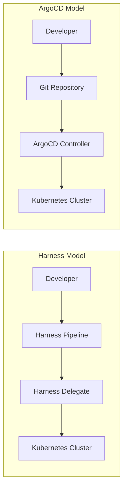

# How to Migrate from Harness to ArgoCD

Author: [nawazdhandala](https://github.com/nawazdhandala)

Tags: ArgoCD, GitOps, Kubernetes, Harness, Migration

Description: Learn how to migrate your Kubernetes deployments from Harness CD to ArgoCD, covering pipeline conversion, secret handling, and rollout strategy mapping.

---

Harness is a powerful commercial CD platform, but some teams decide to move to ArgoCD for its open-source flexibility, pure GitOps model, and elimination of vendor lock-in. If you are in that position, this guide covers the entire migration path from Harness pipelines to ArgoCD Applications.

## Why Teams Move Away from Harness

Common reasons include:

- Cost - Harness licensing can get expensive at scale
- GitOps purity - ArgoCD treats Git as the single source of truth, while Harness is pipeline-centric
- Open source - No vendor lock-in, full control over the tool
- Kubernetes-native - ArgoCD lives inside your cluster as a set of controllers
- Simplicity - For teams that only deploy to Kubernetes, ArgoCD is often simpler

## Understanding the Architectural Difference

Harness and ArgoCD have fundamentally different approaches:



Harness uses an imperative pipeline model - you define steps that execute in order. ArgoCD uses a declarative model - you define the desired state in Git and ArgoCD continuously reconciles.

## Concept Mapping

| Harness Concept | ArgoCD Equivalent |
|---|---|
| Application | Application |
| Service | Part of Application source |
| Environment | destination + AppProject |
| Pipeline | Sync Policy + Sync Waves |
| Workflow | Sync Phases (PreSync, Sync, PostSync) |
| Infrastructure Definition | destination.server + namespace |
| Triggers | Automated sync policy or webhook |
| Approval Steps | Sync Windows + manual sync |
| Verification Steps | PostSync hooks + health checks |
| Secrets (Harness Secret Manager) | External Secrets Operator or Sealed Secrets |
| Delegates | ArgoCD runs in-cluster |

## Step 1: Audit Your Harness Setup

Before migrating, catalog everything:

```bash
# What services exist in Harness?
# Export from Harness UI: Setup > Applications > [App] > Services

# What environments?
# Setup > Applications > [App] > Environments

# What pipelines and workflows?
# Setup > Applications > [App] > Pipelines
# Setup > Applications > [App] > Workflows
```

For each service, note:
- The artifact source (container registry, Helm chart, etc.)
- The manifest source (Git repo, Helm repo, inline)
- The deployment strategy (rolling, canary, blue-green)
- Any verification steps
- Secret references

## Step 2: Reorganize Your Git Repositories

Harness often stores manifests inline or references them loosely. ArgoCD needs a clean Git structure:

```
my-app-config/
  base/
    deployment.yaml
    service.yaml
    kustomization.yaml
  overlays/
    dev/
      kustomization.yaml
    staging/
      kustomization.yaml
    production/
      kustomization.yaml
```

If your manifests are already in Git (which Harness supports), you may just need to clean up the directory structure. If they are inline in Harness, export them to Git first.

## Step 3: Install ArgoCD

```bash
kubectl create namespace argocd
kubectl apply -n argocd -f https://raw.githubusercontent.com/argoproj/argo-cd/stable/manifests/install.yaml

# Get the initial admin password
argocd admin initial-password -n argocd

# Login
argocd login localhost:8080 --username admin --password <password>
```

## Step 4: Convert Harness Services to ArgoCD Applications

A Harness service deploying a simple Kubernetes workload translates directly to an ArgoCD Application:

```yaml
apiVersion: argoproj.io/v1alpha1
kind: Application
metadata:
  name: my-service
  namespace: argocd
spec:
  project: default
  source:
    repoURL: https://github.com/your-org/my-app-config.git
    targetRevision: main
    path: overlays/production
  destination:
    server: https://kubernetes.default.svc
    namespace: production
  syncPolicy:
    automated:
      prune: true
      selfHeal: true
    syncOptions:
      - CreateNamespace=true
```

For Helm-based services:

```yaml
apiVersion: argoproj.io/v1alpha1
kind: Application
metadata:
  name: my-helm-service
  namespace: argocd
spec:
  project: default
  source:
    repoURL: https://charts.example.com
    chart: my-app
    targetRevision: 2.1.0
    helm:
      values: |
        replicaCount: 3
        image:
          repository: my-registry/my-app
          tag: v1.5.0
        resources:
          requests:
            memory: 256Mi
            cpu: 100m
  destination:
    server: https://kubernetes.default.svc
    namespace: production
```

## Step 5: Replace Harness Pipelines with Sync Waves

Harness pipelines let you orchestrate multi-step deployments. In ArgoCD, you use sync waves and hooks:

```yaml
# Database migration job - runs first (wave -1)
apiVersion: batch/v1
kind: Job
metadata:
  name: db-migrate
  annotations:
    argocd.argoproj.io/hook: PreSync
    argocd.argoproj.io/hook-delete-policy: BeforeHookCreation
spec:
  template:
    spec:
      containers:
        - name: migrate
          image: my-registry/db-migrate:v1.5.0
          command: ["./migrate", "up"]
      restartPolicy: Never

---
# Main deployment - wave 0 (default)
apiVersion: apps/v1
kind: Deployment
metadata:
  name: my-app
  annotations:
    argocd.argoproj.io/sync-wave: "0"
spec:
  replicas: 3
  # ... standard deployment spec

---
# Smoke test - runs after sync
apiVersion: batch/v1
kind: Job
metadata:
  name: smoke-test
  annotations:
    argocd.argoproj.io/hook: PostSync
    argocd.argoproj.io/hook-delete-policy: BeforeHookCreation
spec:
  template:
    spec:
      containers:
        - name: test
          image: my-registry/smoke-test:latest
          command: ["./run-tests.sh"]
      restartPolicy: Never
```

## Step 6: Handle Deployment Strategies

Harness has built-in canary and blue-green strategies. ArgoCD delegates this to Argo Rollouts:

```bash
# Install Argo Rollouts
kubectl create namespace argo-rollouts
kubectl apply -n argo-rollouts -f https://github.com/argoproj/argo-rollouts/releases/latest/download/install.yaml
```

Convert a Harness canary deployment to an Argo Rollout:

```yaml
apiVersion: argoproj.io/v1alpha1
kind: Rollout
metadata:
  name: my-app
spec:
  replicas: 5
  strategy:
    canary:
      steps:
        - setWeight: 20
        - pause: {duration: 5m}
        - setWeight: 40
        - pause: {duration: 5m}
        - setWeight: 60
        - pause: {duration: 5m}
        - setWeight: 80
        - pause: {duration: 5m}
  selector:
    matchLabels:
      app: my-app
  template:
    metadata:
      labels:
        app: my-app
    spec:
      containers:
        - name: my-app
          image: my-registry/my-app:v1.5.0
```

## Step 7: Migrate Secrets

Harness has a built-in secret manager. ArgoCD does not manage secrets directly. Use External Secrets Operator:

```yaml
# Install External Secrets Operator
# (assuming you use AWS Secrets Manager as your backend)
apiVersion: external-secrets.io/v1beta1
kind: ExternalSecret
metadata:
  name: my-app-secrets
  namespace: production
spec:
  refreshInterval: 1h
  secretStoreRef:
    name: aws-secrets-store
    kind: ClusterSecretStore
  target:
    name: my-app-secrets
  data:
    - secretKey: DATABASE_URL
      remoteRef:
        key: prod/my-app/database-url
    - secretKey: API_KEY
      remoteRef:
        key: prod/my-app/api-key
```

## Step 8: Replace Harness Approvals

Harness approval steps become ArgoCD sync windows and manual sync:

```yaml
apiVersion: argoproj.io/v1alpha1
kind: AppProject
metadata:
  name: production
  namespace: argocd
spec:
  # Only allow syncing during business hours
  syncWindows:
    - kind: allow
      schedule: "0 9 * * 1-5"  # Mon-Fri 9am
      duration: 8h
      applications:
        - "*"
  sourceRepos:
    - "https://github.com/your-org/*"
  destinations:
    - namespace: production
      server: https://kubernetes.default.svc
```

For critical deployments, disable automated sync and require manual approval:

```yaml
spec:
  syncPolicy: {}  # No automated sync - requires manual trigger
```

## Step 9: Migrate Incrementally

Follow this order:

1. Start with non-production environments
2. Migrate one service at a time
3. Disable the Harness pipeline for that service
4. Monitor for 24 to 48 hours
5. Move to the next service
6. Only migrate production after all lower environments are stable

## Step 10: Decommission Harness

Once all services are migrated:

1. Remove Harness delegates from your clusters
2. Archive pipelines in Harness (do not delete - keep for reference)
3. Cancel or downgrade your Harness subscription
4. Remove any Harness-specific RBAC from your clusters

## Conclusion

Migrating from Harness to ArgoCD is a shift from imperative pipelines to declarative GitOps. The biggest change is not technical - it is the mindset shift from "define what to do" to "define what should exist." Take the migration slowly, validate each service in non-production first, and give your team time to learn ArgoCD's model.

For monitoring application health across environments during and after migration, consider [OneUptime](https://oneuptime.com) for unified observability.
