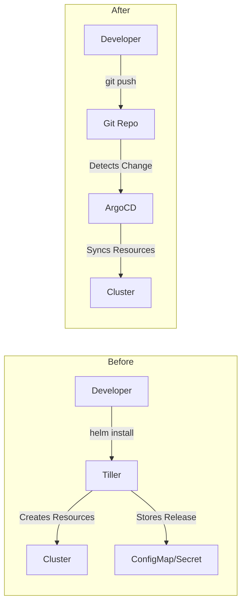

# How to Migrate from Helm Tiller to ArgoCD

Author: [nawazdhandala](https://github.com/nawazdhandala)

Tags: ArgoCD, GitOps, Kubernetes, Helm, Migration

Description: Learn how to migrate your Helm v2 Tiller-based deployments to ArgoCD with a step-by-step approach covering release discovery, conversion, and validation.

---

If you are still running Helm v2 with Tiller, you are operating on borrowed time. Tiller was deprecated in 2019 and removed in Helm v3. It stores release state in ConfigMaps or Secrets in the kube-system namespace, runs with cluster-admin privileges, and represents a significant security risk. Migrating to ArgoCD eliminates Tiller entirely while giving you a modern GitOps deployment pipeline.

In this guide, I will walk through migrating from Helm v2/Tiller to ArgoCD, covering release discovery, manifest extraction, GitOps repository creation, and cutover strategies.

## Why Move from Tiller to ArgoCD

Tiller's architecture was fundamentally flawed. It acted as a server-side component with broad cluster access, making it a security liability. When you migrate to ArgoCD, you get several improvements:

- No server-side component with cluster-admin (ArgoCD uses fine-grained RBAC)
- Release state stored in Git, not in cluster ConfigMaps
- Declarative deployment model instead of imperative `helm install`
- Visibility through the ArgoCD UI instead of `helm list`
- Automated drift detection and self-healing



## Step 1: Inventory Existing Tiller Releases

First, document everything Tiller is currently managing.

```bash
# List all Helm v2 releases
helm2 list --all --output json | jq '.Releases[] | {
  name: .Name,
  namespace: .Namespace,
  chart: .Chart,
  version: .AppVersion,
  status: .Status,
  updated: .Updated
}'

# If Tiller is not accessible, check ConfigMaps directly
kubectl get configmaps -n kube-system -l "OWNER=TILLER" -o json | \
  jq '.items[] | {
    name: .metadata.labels.NAME,
    status: .metadata.labels.STATUS,
    version: .metadata.labels.VERSION
  }'

# Or if using Secrets storage
kubectl get secrets -n kube-system -l "OWNER=TILLER" --no-headers
```

Create a migration tracking document.

```yaml
# migration-tracker.yaml
releases:
  - name: nginx-ingress
    namespace: ingress-nginx
    chart: stable/nginx-ingress
    chartVersion: 1.41.3
    status: DEPLOYED
    priority: high
    migrated: false
  - name: prometheus
    namespace: monitoring
    chart: stable/prometheus
    chartVersion: 11.12.1
    status: DEPLOYED
    priority: medium
    migrated: false
  - name: redis
    namespace: cache
    chart: stable/redis
    chartVersion: 10.7.17
    status: DEPLOYED
    priority: high
    migrated: false
```

## Step 2: Extract Current Values

For each release, extract the values that were used for installation.

```bash
# Get values for each release
helm2 get values nginx-ingress > nginx-ingress-values.yaml
helm2 get values prometheus > prometheus-values.yaml
helm2 get values redis > redis-values.yaml

# Get the full manifest to verify what's running
helm2 get manifest nginx-ingress > nginx-ingress-manifest.yaml
```

## Step 3: Find Modern Chart Equivalents

Many Helm v2 charts from the deprecated `stable/` repository have been moved to new locations.

```bash
# Old: stable/nginx-ingress
# New: https://kubernetes.github.io/ingress-nginx (chart: ingress-nginx)

# Old: stable/prometheus
# New: https://prometheus-community.github.io/helm-charts (chart: prometheus)

# Old: stable/redis
# New: https://charts.bitnami.com/bitnami (chart: redis)
```

Update your values files for any breaking changes between the old and new chart versions.

## Step 4: Create the GitOps Repository

Set up a GitOps repository structure for ArgoCD.

```
gitops-repo/
  apps/
    ingress/
      Chart.yaml
      values.yaml
    monitoring/
      Chart.yaml
      values.yaml
    cache/
      Chart.yaml
      values.yaml
```

For each application, create a Chart.yaml that references the upstream chart.

```yaml
# apps/ingress/Chart.yaml
apiVersion: v2
name: nginx-ingress
version: 1.0.0
dependencies:
  - name: ingress-nginx
    version: 4.9.0
    repository: https://kubernetes.github.io/ingress-nginx
```

```yaml
# apps/ingress/values.yaml
ingress-nginx:
  controller:
    replicaCount: 2
    service:
      type: LoadBalancer
    resources:
      requests:
        cpu: 100m
        memory: 128Mi
      limits:
        cpu: 500m
        memory: 256Mi
    metrics:
      enabled: true
```

## Step 5: Create ArgoCD Applications

Create an ArgoCD Application for each release.

```yaml
# argocd-apps/ingress.yaml
apiVersion: argoproj.io/v1alpha1
kind: Application
metadata:
  name: nginx-ingress
  namespace: argocd
spec:
  project: infrastructure
  source:
    repoURL: https://github.com/myorg/gitops-repo.git
    path: apps/ingress
    targetRevision: main
    helm:
      valueFiles:
        - values.yaml
  destination:
    server: https://kubernetes.default.svc
    namespace: ingress-nginx
  syncPolicy:
    syncOptions:
      - CreateNamespace=true
    # Start WITHOUT auto-sync for migration
    # automated:
    #   selfHeal: true
    #   prune: true
```

## Step 6: Migration Strategy - Per Release

For each release, follow this procedure.

### Option A: In-Place Adoption (Recommended)

ArgoCD can adopt existing resources without recreating them.

```bash
# 1. Create the ArgoCD Application (without auto-sync)
kubectl apply -f argocd-apps/ingress.yaml

# 2. In ArgoCD UI, check the diff
#    ArgoCD will show the difference between Git and cluster state

# 3. If the diff shows only expected differences, sync with replace=false
argocd app sync nginx-ingress --prune=false

# 4. Verify the application is healthy
argocd app get nginx-ingress

# 5. Remove the Tiller release metadata (but keep resources)
# Delete the ConfigMap/Secret that Tiller uses for tracking
kubectl delete configmap -n kube-system -l "NAME=nginx-ingress,OWNER=TILLER"
```

The key here is that ArgoCD adopts ownership of the existing resources. It does not delete and recreate them. The resources continue running without interruption.

### Option B: Blue-Green Migration

For critical services where you want zero risk, deploy a parallel instance through ArgoCD and switch traffic.

```yaml
# Deploy new instance via ArgoCD in a different namespace
spec:
  destination:
    namespace: ingress-nginx-v2  # New namespace
```

After validating the new deployment, switch traffic and decommission the old one.

## Step 7: Handle Resource Annotations

Tiller-managed resources have Helm annotations that ArgoCD may flag as drift. Clean these up.

```bash
# Remove Helm v2 annotations from existing resources
kubectl annotate deployment nginx-ingress-controller \
  -n ingress-nginx \
  meta.helm.sh/release-name- \
  meta.helm.sh/release-namespace-

# Remove Helm labels
kubectl label deployment nginx-ingress-controller \
  -n ingress-nginx \
  app.kubernetes.io/managed-by- \
  helm.sh/chart-
```

Alternatively, configure ArgoCD to ignore these annotations.

```yaml
spec:
  ignoreDifferences:
    - group: apps
      kind: Deployment
      jsonPointers:
        - /metadata/annotations/meta.helm.sh~1release-name
        - /metadata/annotations/meta.helm.sh~1release-namespace
        - /metadata/labels/app.kubernetes.io~1managed-by
```

## Step 8: Remove Tiller

After all releases are migrated, remove Tiller from the cluster.

```bash
# Verify no releases remain
kubectl get configmaps -n kube-system -l "OWNER=TILLER" --no-headers | wc -l
# Should return 0

# Delete Tiller
kubectl delete deployment tiller-deploy -n kube-system
kubectl delete service tiller-deploy -n kube-system
kubectl delete serviceaccount tiller -n kube-system
kubectl delete clusterrolebinding tiller-admin

echo "Tiller has been removed. All deployments are now managed by ArgoCD."
```

## Step 9: Enable Auto-Sync

After each application has been running stably through ArgoCD for a validation period (at least a week), enable auto-sync.

```yaml
spec:
  syncPolicy:
    automated:
      selfHeal: true
      prune: true
```

## Post-Migration Validation

Verify that everything is working correctly.

```bash
# Check all ArgoCD applications are healthy and synced
argocd app list

# Verify no Tiller artifacts remain
kubectl get configmaps -n kube-system -l "OWNER=TILLER" --no-headers
kubectl get secrets -n kube-system -l "OWNER=TILLER" --no-headers

# Check that no helm2 processes are running
kubectl get pods -n kube-system | grep tiller
```

For more details on deploying Helm charts through ArgoCD, see our guide on [deploying Helm charts with ArgoCD](https://oneuptime.com/blog/post/2026-01-25-deploy-helm-charts-argocd/view).

## Conclusion

Migrating from Helm Tiller to ArgoCD is a one-way trip to a better deployment model. The in-place adoption approach lets you migrate without downtime by having ArgoCD take over management of existing resources. The key is methodical execution: inventory all releases, extract values, create the GitOps repository, migrate one release at a time, validate, and only then remove Tiller. Take your time with this migration - there is no rush, and getting it right is more important than getting it done fast.
