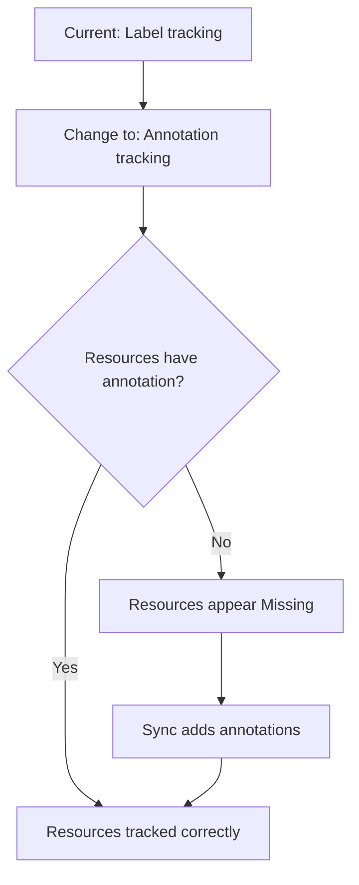

# How to Migrate Between Resource Tracking Methods in ArgoCD

Author: [nawazdhandala](https://github.com/nawazdhandala)

Tags: ArgoCD, GitOps, Kubernetes, Migration

Description: Learn how to safely migrate ArgoCD resource tracking between label, annotation, and annotation+label methods without losing track of existing resources or causing sync disruptions.

---

Migrating between resource tracking methods in ArgoCD is an operation that requires careful planning. If done incorrectly, ArgoCD can temporarily lose track of resources, show false "Missing" statuses, or attempt to prune resources it should not. The actual configuration change is simple - one ConfigMap key - but the migration process needs to handle the transition gracefully.

This guide covers step-by-step migration procedures for every tracking method combination.

## Understanding the Migration Challenge

When you change the tracking method, ArgoCD starts looking for a different piece of metadata to identify managed resources. If you switch from `label` to `annotation`, ArgoCD stops looking for the `app.kubernetes.io/instance` label and starts looking for the `argocd.argoproj.io/tracking-id` annotation. Resources that were tracked by label but do not yet have the annotation will appear as untracked.



The migration steps ensure that resources get the new tracking metadata before ArgoCD starts relying on it.

## Pre-Migration Checklist

Before changing the tracking method:

1. **Disable auto-sync and pruning temporarily**

```bash
# For each application, disable auto-sync
argocd app set my-app --sync-policy none

# Or patch all at once
for app in $(argocd app list -o name); do
  argocd app set "$app" --sync-policy none
done
```

2. **Verify all applications are in Synced state**

```bash
# Check sync status
argocd app list -o json | jq -r '.[] | select(.status.sync.status != "Synced") | .metadata.name'
```

3. **Take note of the current state**

```bash
# Export application list with status
argocd app list -o json > /tmp/argocd-pre-migration.json

# Count tracked resources per application
for app in $(argocd app list -o name); do
  count=$(argocd app resources "$app" | wc -l)
  echo "$app: $count resources"
done > /tmp/resource-counts-before.txt
```

## Migration Path: Label to Annotation+Label

This is the most common migration and the safest. The `annotation+label` method still sets the label, so existing label-based tracking continues to work while the annotation is being added.

### Step 1: Change the Tracking Method

```yaml
apiVersion: v1
kind: ConfigMap
metadata:
  name: argocd-cm
  namespace: argocd
data:
  application.resourceTrackingMethod: annotation+label
```

Apply the change:

```bash
kubectl apply -f argocd-cm.yaml
kubectl rollout restart deployment argocd-application-controller -n argocd
kubectl rollout status deployment argocd-application-controller -n argocd
```

### Step 2: Sync All Applications

After changing the tracking method, sync every application. This adds the tracking annotation to all managed resources:

```bash
# Sync each application sequentially
for app in $(argocd app list -o name); do
  echo "Syncing $app..."
  argocd app sync "$app" --prune=false
  sleep 5
done
```

Using `--prune=false` is important: it prevents ArgoCD from pruning resources that it temporarily cannot track during the transition.

### Step 3: Verify Resources Are Tracked

After syncing, verify that resources have both label and annotation:

```bash
# Check a sample resource
kubectl get deployment api-server -n production -o yaml | grep -A 2 "argocd.argoproj.io/tracking-id"

# Verify resource counts match
for app in $(argocd app list -o name); do
  count=$(argocd app resources "$app" | wc -l)
  echo "$app: $count resources"
done > /tmp/resource-counts-after.txt

# Compare
diff /tmp/resource-counts-before.txt /tmp/resource-counts-after.txt
```

### Step 4: Re-enable Auto-Sync

Once everything is verified:

```bash
# Re-enable auto-sync for each application
for app in $(argocd app list -o name); do
  argocd app set "$app" --sync-policy automated --self-heal --auto-prune
done
```

## Migration Path: Label to Annotation Only

This is riskier because the label will no longer be set. Any tools or scripts that depend on the `app.kubernetes.io/instance` label will stop working.

### Step 1: Migrate to Annotation+Label First

Follow the label to annotation+label migration above. This gets the annotations in place while keeping labels.

### Step 2: Verify Annotation Tracking Is Working

```bash
# Confirm all resources have the tracking annotation
for app in $(argocd app list -o name); do
  MISSING=$(argocd app resources "$app" -o json | jq '[.[] | select(.health.status == "Missing")] | length')
  if [ "$MISSING" -gt 0 ]; then
    echo "WARNING: $app has $MISSING missing resources"
  else
    echo "OK: $app - all resources tracked"
  fi
done
```

### Step 3: Switch to Annotation Only

```yaml
data:
  application.resourceTrackingMethod: annotation
```

Apply and restart:

```bash
kubectl apply -f argocd-cm.yaml
kubectl rollout restart deployment argocd-application-controller -n argocd
```

### Step 4: Sync to Remove Labels

Sync all applications. ArgoCD will stop managing the `app.kubernetes.io/instance` label, so it may show as a diff if the label was originally added by ArgoCD but not in the Git manifest.

## Migration Path: Annotation to Label

This is a downgrade and is generally not recommended, but might be needed for compatibility reasons.

### Step 1: Switch to Annotation+Label First

```yaml
data:
  application.resourceTrackingMethod: annotation+label
```

Sync all applications to add labels to resources that only have annotations.

### Step 2: Switch to Label

```yaml
data:
  application.resourceTrackingMethod: label
```

Sync all applications again. ArgoCD now tracks via labels and stops setting annotations on new syncs.

## Handling Problems During Migration

### Resources Show as "Missing"

If resources appear as Missing after migration:

```bash
# Force a hard refresh
argocd app get my-app --hard-refresh

# Sync the application
argocd app sync my-app --prune=false
```

### Resources Show as "OutOfSync"

The tracking metadata itself might cause OutOfSync status:

```bash
# Check what is different
argocd app diff my-app

# If only the tracking metadata is different, sync to resolve
argocd app sync my-app
```

### Duplicate Resources

If a resource appears to belong to two applications:

```bash
# Check the tracking metadata
kubectl get deployment my-deployment -o yaml | grep -A 3 "annotations"

# The tracking-id annotation shows the actual owner
# If wrong, sync the correct application with --force
argocd app sync correct-app --force
```

### Resources Being Pruned Incorrectly

If ArgoCD tries to prune resources it should keep:

```bash
# Immediately cancel the sync
argocd app terminate-op my-app

# Disable auto-prune
argocd app set my-app --auto-prune=false

# Investigate
argocd app resources my-app
```

## Rollback Plan

If the migration goes wrong, you can always revert the tracking method:

```bash
# Revert to the previous tracking method
kubectl patch configmap argocd-cm -n argocd \
  --type merge \
  -p '{"data":{"application.resourceTrackingMethod":"label"}}'

# Restart the controller
kubectl rollout restart deployment argocd-application-controller -n argocd
```

Then sync all applications to restore the original tracking metadata.

## Migration Script

Here is a complete migration script that handles the label to annotation+label migration:

```bash
#!/bin/bash
# migrate-tracking.sh - Migrate ArgoCD resource tracking to annotation+label
set -e

echo "=== ArgoCD Resource Tracking Migration ==="
echo "From: label"
echo "To: annotation+label"
echo ""

# Step 1: Record current state
echo "Step 1: Recording current state..."
argocd app list -o json > /tmp/argocd-pre-migration.json
APP_COUNT=$(argocd app list -o name | wc -l | tr -d ' ')
echo "  Found $APP_COUNT applications"

# Step 2: Disable auto-sync on all apps
echo "Step 2: Disabling auto-sync..."
for app in $(argocd app list -o name); do
  argocd app set "$app" --sync-policy none 2>/dev/null || true
done
echo "  Done"

# Step 3: Change tracking method
echo "Step 3: Changing tracking method to annotation+label..."
kubectl patch configmap argocd-cm -n argocd \
  --type merge \
  -p '{"data":{"application.resourceTrackingMethod":"annotation+label"}}'

# Step 4: Restart controller
echo "Step 4: Restarting application controller..."
kubectl rollout restart deployment argocd-application-controller -n argocd
kubectl rollout status deployment argocd-application-controller -n argocd --timeout=120s

# Step 5: Wait for controller to stabilize
echo "Step 5: Waiting for controller to stabilize (30s)..."
sleep 30

# Step 6: Sync all applications
echo "Step 6: Syncing all applications..."
for app in $(argocd app list -o name); do
  echo "  Syncing $app..."
  argocd app sync "$app" --prune=false --timeout 120 2>/dev/null || echo "  WARNING: $app sync had issues"
  sleep 2
done

# Step 7: Verify
echo "Step 7: Verifying migration..."
ISSUES=0
for app in $(argocd app list -o name); do
  HEALTH=$(argocd app get "$app" -o json | jq -r '.status.health.status')
  SYNC=$(argocd app get "$app" -o json | jq -r '.status.sync.status')
  if [ "$HEALTH" = "Degraded" ] || [ "$HEALTH" = "Missing" ]; then
    echo "  WARNING: $app health=$HEALTH sync=$SYNC"
    ISSUES=$((ISSUES + 1))
  fi
done

if [ $ISSUES -gt 0 ]; then
  echo ""
  echo "WARNING: $ISSUES applications have issues. Review before re-enabling auto-sync."
else
  echo "  All applications healthy"
  echo ""
  echo "Step 8: Re-enabling auto-sync..."
  for app in $(argocd app list -o name); do
    argocd app set "$app" --sync-policy automated --self-heal --auto-prune 2>/dev/null || true
  done
  echo "  Done"
fi

echo ""
echo "=== Migration Complete ==="
```

For understanding each tracking method in detail, see [how to use label-based resource tracking](https://oneuptime.com/blog/post/2026-02-26-argocd-label-based-resource-tracking/view), [how to use annotation-based resource tracking](https://oneuptime.com/blog/post/2026-02-26-argocd-annotation-based-resource-tracking/view), and [how to configure resource tracking method in ArgoCD](https://oneuptime.com/blog/post/2026-02-26-argocd-resource-tracking-method/view).
