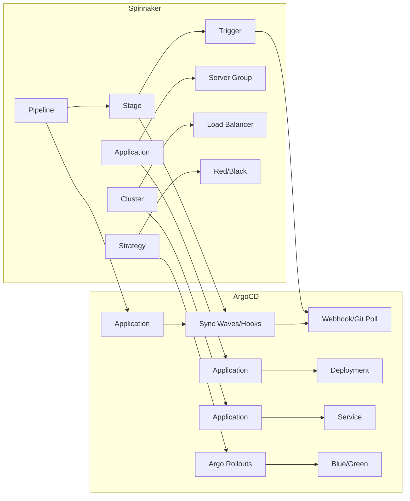

# How to Migrate from Spinnaker to ArgoCD

Author: [nawazdhandala](https://github.com/nawazdhandala)

Tags: ArgoCD, GitOps, Kubernetes, Spinnaker, Migration

Description: Learn how to migrate from Spinnaker to ArgoCD with a practical guide covering pipeline conversion, deployment strategy mapping, and a phased cutover approach.

---

Spinnaker is a powerful multi-cloud deployment platform, but it comes with significant operational overhead. Running Spinnaker means maintaining Clouddriver, Orca, Gate, Deck, and a half-dozen other microservices. For teams that have standardized on Kubernetes, this complexity is often overkill. ArgoCD provides a focused, Kubernetes-native deployment solution with far less operational burden.

In this guide, I will walk through migrating from Spinnaker to ArgoCD, mapping Spinnaker concepts to ArgoCD equivalents, and providing a practical cutover strategy.

## Why Migrate from Spinnaker to ArgoCD

Spinnaker was built for multi-cloud deployments across AWS, GCP, Azure, and Kubernetes. If you are only deploying to Kubernetes, you are running infrastructure you do not need. ArgoCD is purpose-built for Kubernetes GitOps and requires a fraction of the resources.

Comparison of operational requirements.

| Aspect | Spinnaker | ArgoCD |
|--------|-----------|--------|
| Components | 10+ microservices | 4 components |
| Memory footprint | 16-32GB | 2-4GB |
| Setup complexity | Days to weeks | Hours |
| Maintenance burden | High | Low |
| Kubernetes focus | One of many targets | Primary focus |
| GitOps native | No (bolt-on) | Yes (core) |

## Concept Mapping: Spinnaker to ArgoCD

Understanding how Spinnaker concepts map to ArgoCD is essential for migration.



### Detailed Mapping

- **Spinnaker Pipeline** maps to ArgoCD Application with sync waves and hooks
- **Spinnaker Stage** maps to ArgoCD sync waves or resource hooks (PreSync, Sync, PostSync)
- **Spinnaker Trigger** maps to ArgoCD webhook or Git polling
- **Spinnaker Application** maps to ArgoCD Application or ApplicationSet
- **Spinnaker Pipeline Expression** maps to Helm values or Kustomize patches
- **Spinnaker Manual Judgment** maps to ArgoCD manual sync or sync windows
- **Spinnaker Canary (Kayenta)** maps to Argo Rollouts with AnalysisTemplate
- **Spinnaker Red/Black** maps to Argo Rollouts Blue/Green strategy
- **Spinnaker Pipeline Parameters** maps to Helm values or ApplicationSet parameters

## Step 1: Inventory Spinnaker Pipelines

Document all active Spinnaker pipelines.

```bash
# Using Spinnaker's spin CLI
spin pipeline list --application my-app --output json | jq '.[].name'

# Export each pipeline configuration
for PIPELINE in $(spin pipeline list --application my-app -o json | jq -r '.[].name'); do
  spin pipeline get --name "$PIPELINE" --application my-app > "pipelines/${PIPELINE}.json"
done
```

Categorize pipelines by complexity.

```yaml
pipelines:
  simple_deploys:
    # Just deploy a manifest - easy to migrate
    - name: deploy-api-staging
      stages: [bake, deploy]
      strategy: none
    - name: deploy-frontend-staging
      stages: [bake, deploy]
      strategy: none

  standard_deploys:
    # Deploy with approval and strategy
    - name: deploy-api-production
      stages: [bake, manual-judgment, deploy]
      strategy: red-black

  complex_deploys:
    # Multi-stage with canary analysis
    - name: deploy-payment-service
      stages: [bake, canary-deploy, canary-analysis, full-deploy]
      strategy: canary-with-kayenta
```

## Step 2: Create GitOps Repository

For each Spinnaker application, create the equivalent GitOps structure.

```
gitops-repo/
  apps/
    api/
      base/
        deployment.yaml
        service.yaml
        configmap.yaml
      overlays/
        staging/
          kustomization.yaml
        production/
          kustomization.yaml
    frontend/
      base/
        deployment.yaml
        service.yaml
      overlays/
        staging/
          kustomization.yaml
        production/
          kustomization.yaml
```

## Step 3: Convert Simple Pipelines

Simple bake-and-deploy pipelines convert directly to ArgoCD Applications.

Spinnaker pipeline (bake then deploy):
```json
{
  "stages": [
    {
      "type": "bakeManifest",
      "templateRenderer": "HELM3",
      "inputArtifacts": [{"account": "my-chart-repo"}],
      "outputName": "my-app"
    },
    {
      "type": "deployManifest",
      "account": "kubernetes-staging",
      "namespaceOverride": "staging"
    }
  ]
}
```

ArgoCD equivalent:
```yaml
apiVersion: argoproj.io/v1alpha1
kind: Application
metadata:
  name: api-staging
  namespace: argocd
spec:
  project: staging
  source:
    repoURL: https://github.com/myorg/gitops-repo.git
    path: apps/api/overlays/staging
    targetRevision: main
  destination:
    server: https://kubernetes.default.svc
    namespace: staging
  syncPolicy:
    automated:
      selfHeal: true
      prune: true
```

## Step 4: Convert Manual Judgment Stages

Spinnaker's Manual Judgment stage maps to ArgoCD's manual sync mode.

```yaml
# Production application with manual sync (replaces Manual Judgment)
apiVersion: argoproj.io/v1alpha1
kind: Application
metadata:
  name: api-production
  namespace: argocd
spec:
  project: production
  source:
    repoURL: https://github.com/myorg/gitops-repo.git
    path: apps/api/overlays/production
    targetRevision: main
  destination:
    server: https://kubernetes.default.svc
    namespace: production
  # No automated sync - requires manual approval
```

For sync windows (replacing Spinnaker's restricted execution windows):
```yaml
# In the AppProject
spec:
  syncWindows:
    - kind: allow
      schedule: "0 9 * * 1-5"
      duration: 8h
      applications: ["*"]
```

## Step 5: Convert Deployment Strategies

### Red/Black (Blue/Green) Strategy

Spinnaker's Red/Black strategy maps to Argo Rollouts Blue/Green.

```yaml
# Install Argo Rollouts (via ArgoCD)
apiVersion: argoproj.io/v1alpha1
kind: Application
metadata:
  name: argo-rollouts
  namespace: argocd
spec:
  source:
    repoURL: https://argoproj.github.io/argo-helm
    chart: argo-rollouts
    targetRevision: 2.35.0
  destination:
    server: https://kubernetes.default.svc
    namespace: argo-rollouts
```

Convert your Deployment to a Rollout.

```yaml
# Before: Kubernetes Deployment
apiVersion: apps/v1
kind: Deployment
# ...

# After: Argo Rollout with Blue/Green strategy
apiVersion: argoproj.io/v1alpha1
kind: Rollout
metadata:
  name: api
  namespace: production
spec:
  replicas: 3
  selector:
    matchLabels:
      app: api
  template:
    metadata:
      labels:
        app: api
    spec:
      containers:
        - name: api
          image: registry.myorg.com/api:v2.1.0
  strategy:
    blueGreen:
      activeService: api-active
      previewService: api-preview
      autoPromotionEnabled: false  # Manual promotion like Spinnaker
      prePromotionAnalysis:
        templates:
          - templateName: success-rate-check
        args:
          - name: service-name
            value: api-preview
```

### Canary Strategy (Replacing Kayenta)

Spinnaker's Kayenta canary analysis maps to Argo Rollouts AnalysisTemplates.

```yaml
# analysis-template.yaml
apiVersion: argoproj.io/v1alpha1
kind: AnalysisTemplate
metadata:
  name: success-rate-check
spec:
  args:
    - name: service-name
  metrics:
    - name: success-rate
      interval: 5m
      count: 3
      successCondition: result[0] >= 0.95
      failureLimit: 1
      provider:
        prometheus:
          address: http://prometheus.monitoring:9090
          query: |
            sum(rate(http_requests_total{
              service="{{args.service-name}}",
              status=~"2.."
            }[5m])) /
            sum(rate(http_requests_total{
              service="{{args.service-name}}"
            }[5m]))
---
# rollout with canary strategy
apiVersion: argoproj.io/v1alpha1
kind: Rollout
metadata:
  name: api
spec:
  strategy:
    canary:
      steps:
        - setWeight: 10
        - pause: {duration: 5m}
        - analysis:
            templates:
              - templateName: success-rate-check
            args:
              - name: service-name
                value: api-canary
        - setWeight: 30
        - pause: {duration: 5m}
        - setWeight: 60
        - pause: {duration: 5m}
        - setWeight: 100
      canaryService: api-canary
      stableService: api-stable
```

## Step 6: Convert Pipeline Triggers

Replace Spinnaker triggers with ArgoCD mechanisms.

**Docker Registry Trigger**: Use ArgoCD Image Updater.

```yaml
# argocd-image-updater annotation
metadata:
  annotations:
    argocd-image-updater.argoproj.io/image-list: api=registry.myorg.com/api
    argocd-image-updater.argoproj.io/api.update-strategy: semver
```

**Git Trigger**: ArgoCD handles this natively through Git polling or webhooks.

**Webhook Trigger**: Configure ArgoCD webhooks or use the ArgoCD API.

## Step 7: Phased Cutover

Run both systems in parallel during the transition.

```yaml
# Phase 1 (Week 1-2): Staging environments
# - Set up ArgoCD for staging
# - Run Spinnaker and ArgoCD in parallel
# - Validate ArgoCD deploys match Spinnaker behavior

# Phase 2 (Week 3-4): Non-critical production
# - Migrate internal tools and dashboards
# - Validate for one week

# Phase 3 (Week 5-6): Critical production with Argo Rollouts
# - Migrate applications using canary/blue-green
# - Keep Spinnaker as fallback

# Phase 4 (Week 7-8): Decommission Spinnaker
# - Remove Spinnaker pipelines
# - Shut down Spinnaker services
```

## Step 8: Decommission Spinnaker

After all applications are migrated and validated.

```bash
# Verify no active Spinnaker pipelines
spin pipeline list --application my-app -o json | jq '.[].disabled'

# Remove Spinnaker
kubectl delete namespace spinnaker
# Or if using Helm
helm uninstall spinnaker -n spinnaker
```

For more on progressive delivery strategies with ArgoCD, see our guide on [implementing progressive delivery with ArgoCD](https://oneuptime.com/blog/post/2026-01-25-progressive-delivery-argocd/view).

## Conclusion

Migrating from Spinnaker to ArgoCD is a significant simplification of your deployment infrastructure. The key is understanding the concept mapping between the two tools and converting pipelines incrementally. Simple deploy pipelines convert directly to ArgoCD Applications. Manual Judgment stages become manual sync. Deployment strategies like Red/Black and Canary map to Argo Rollouts. The end result is a deployment system that requires far fewer resources, is easier to maintain, and provides better GitOps capabilities. Plan for a 6-8 week migration period and expect to reclaim 16-32GB of memory from Spinnaker's microservices.
