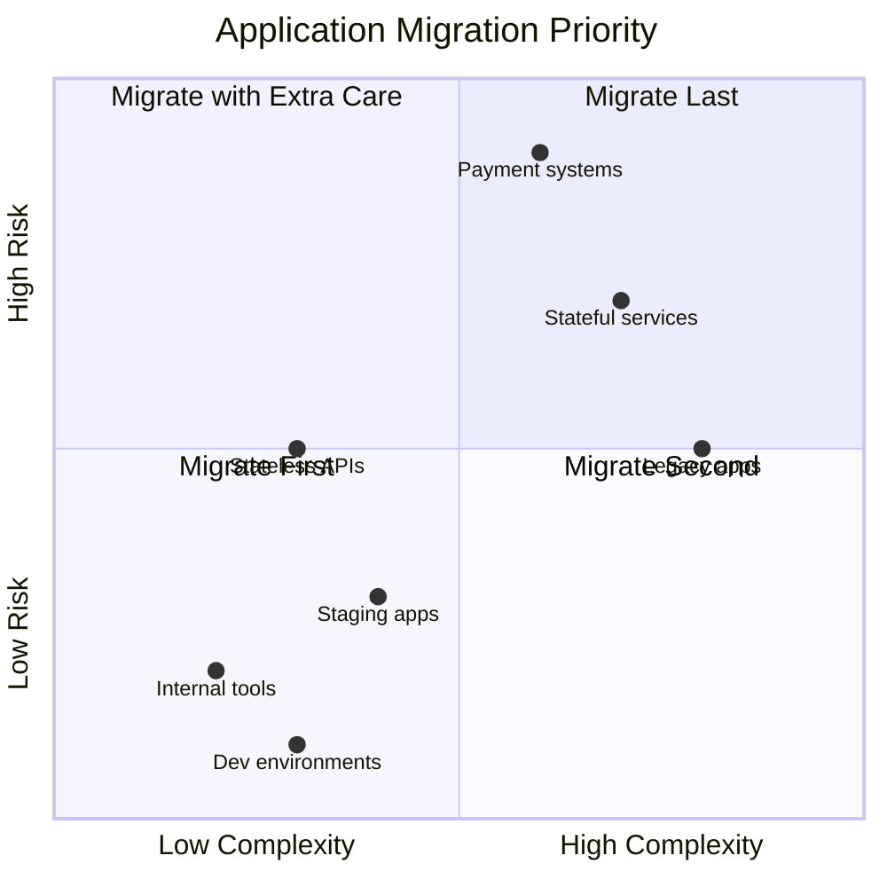

# How to Plan an ArgoCD Migration Strategy

Author: [nawazdhandala](https://github.com/nawazdhandala)

Tags: ArgoCD, GitOps, Kubernetes, DevOps, Migration

Description: A comprehensive framework for planning your migration to ArgoCD, covering assessment, team readiness, phased rollout, risk management, and success metrics.

---

Migrating to ArgoCD is not just a tooling change. It is a shift in how your team thinks about deployments. Without a plan, migrations stall halfway through, leaving some services on the old system and some on ArgoCD. This guide gives you a structured framework to plan and execute a successful ArgoCD migration.

## Phase 0: Assessment

Before writing any YAML, answer these questions:

### Current State Inventory

Document everything about your current deployment process:

- **How many applications** do you deploy to Kubernetes?
- **How are they deployed** today? (kubectl, Helm, CI/CD pipelines, custom scripts)
- **How many clusters** do you manage?
- **How many environments** per application? (dev, staging, production)
- **Who deploys?** (developers, DevOps team, automated pipelines)
- **How are secrets managed?** (Kubernetes Secrets, Vault, cloud provider, hard-coded)
- **What deployment strategies** are in use? (rolling, blue-green, canary)
- **What is the deployment frequency?** (daily, weekly, on-demand)

### Risk Assessment

Categorize your applications:



Start with low-risk, low-complexity applications in non-production environments.

### Team Readiness

Honestly assess your team's knowledge:

- Does the team understand Git branching workflows?
- Is the team comfortable with Kubernetes manifests?
- Does anyone have GitOps experience?
- Are there resistance points? (people who prefer the current way)

If the team is new to GitOps, invest in training before starting the migration. A migration is not the time to learn both a new tool and a new paradigm simultaneously.

## Phase 1: Foundation (Week 1 to 2)

### Install and Configure ArgoCD

Set up ArgoCD in a dedicated management cluster or within your existing cluster:

```yaml
# values.yaml for Helm installation
server:
  replicas: 2
  autoscaling:
    enabled: true
    minReplicas: 2
    maxReplicas: 5
  ingress:
    enabled: true
    hostname: argocd.internal.example.com
    tls: true

controller:
  replicas: 2

repoServer:
  replicas: 2
  autoscaling:
    enabled: true
    minReplicas: 2
    maxReplicas: 5

redis-ha:
  enabled: true

configs:
  params:
    server.insecure: false
    application.namespaces: "*"
```

```bash
helm repo add argo https://argoproj.github.io/argo-helm
helm install argocd argo/argo-cd -n argocd --create-namespace -f values.yaml
```

### Set Up RBAC and SSO

Do not skip this. Configure authentication before anyone uses ArgoCD:

```yaml
apiVersion: v1
kind: ConfigMap
metadata:
  name: argocd-rbac-cm
  namespace: argocd
data:
  policy.default: role:readonly
  policy.csv: |
    # DevOps team can do everything
    p, role:devops, applications, *, */*, allow
    p, role:devops, clusters, *, *, allow
    p, role:devops, repositories, *, *, allow
    p, role:devops, projects, *, *, allow

    # Developers can view and sync their own apps
    p, role:developer, applications, get, */*, allow
    p, role:developer, applications, sync, */*, allow

    # Map groups to roles
    g, devops-team, role:devops
    g, developers, role:developer
```

### Establish Git Repository Standards

Define and document your repository structure before anyone starts creating repos:

```
Standard: one config repo per team or product area

team-a-k8s-config/
  argocd/                    # ArgoCD Application definitions
    dev/
    staging/
    production/
  apps/                      # Application manifests
    service-1/
      base/
      overlays/
        dev/
        staging/
        production/
    service-2/
      base/
      overlays/
  infrastructure/            # Shared infrastructure
    monitoring/
    ingress/
```

Document branch policies:
- `main` branch deploys to production
- `staging` branch (or overlays) deploys to staging
- Pull requests required for all changes
- At least one reviewer required

## Phase 2: Pilot (Week 3 to 4)

### Select Pilot Applications

Choose 2 to 3 applications that are:

- Non-critical (a deployment failure will not page anyone)
- Simple (stateless, few dependencies)
- Owned by the team driving the migration
- Deployed frequently (so you get quick feedback)

### Migrate Pilot Applications

For each pilot application:

1. **Extract manifests** from wherever they live today
2. **Clean and structure** them in the Git repo
3. **Validate** with `kubectl diff`
4. **Create ArgoCD Application** with manual sync first
5. **Test the full workflow**: push a change, see ArgoCD detect it, sync it
6. **Enable automated sync** after 2 to 3 successful manual syncs
7. **Document issues** encountered

```yaml
# Pilot application - start simple
apiVersion: argoproj.io/v1alpha1
kind: Application
metadata:
  name: pilot-app
  namespace: argocd
  labels:
    migration-phase: pilot
spec:
  project: default
  source:
    repoURL: https://github.com/your-org/k8s-config.git
    targetRevision: main
    path: apps/pilot-app/overlays/dev
  destination:
    server: https://kubernetes.default.svc
    namespace: dev
  syncPolicy:
    automated:
      prune: true
      selfHeal: true
    retry:
      limit: 3
      backoff:
        duration: 5s
        factor: 2
        maxDuration: 3m
```

### Collect Feedback

After the pilot, hold a retrospective:

- What went smoothly?
- What was confusing?
- What documentation was missing?
- How long did it take per application?
- Any unexpected issues?

Use this feedback to refine your process before scaling up.

## Phase 3: Expand (Week 5 to 8)

### Batch Migration

Now migrate services in batches. Group by team or by dependency chain:

```
Batch 1 (Week 5): Internal tools, dev environments
Batch 2 (Week 6): Staging environments, non-critical APIs
Batch 3 (Week 7): Production stateless services
Batch 4 (Week 8): Production stateful services, critical paths
```

### Use ApplicationSets for Scale

If you have many similar applications, use ApplicationSets to avoid creating each one manually:

```yaml
apiVersion: argoproj.io/v1alpha1
kind: ApplicationSet
metadata:
  name: team-a-apps
  namespace: argocd
spec:
  generators:
    - git:
        repoURL: https://github.com/your-org/k8s-config.git
        revision: main
        directories:
          - path: apps/*/overlays/production
  template:
    metadata:
      name: "{{path[1]}}"
    spec:
      project: team-a
      source:
        repoURL: https://github.com/your-org/k8s-config.git
        targetRevision: main
        path: "{{path}}"
      destination:
        server: https://kubernetes.default.svc
        namespace: production
      syncPolicy:
        automated:
          prune: true
          selfHeal: true
```

### Handle Special Cases

Some applications need extra attention:

**Stateful services (databases, queues)**:
- Disable `prune` and `selfHeal` initially
- Use manual sync only
- Test failover scenarios before enabling automation

**Services with complex deployment strategies**:
- Install Argo Rollouts for canary and blue-green
- Convert deployment manifests to Rollout resources
- Test thoroughly in staging

**Services with secrets**:
- Set up External Secrets Operator or Sealed Secrets before migrating
- Never commit plain-text secrets to Git
- Validate secret rotation works through the new flow

## Phase 4: Stabilize (Week 9 to 10)

### Decommission Old Systems

Once all services are on ArgoCD:

1. Remove old CI/CD deployment steps
2. Revoke deployment credentials from old pipelines
3. Archive old deployment scripts
4. Update runbooks and documentation

### Set Up Monitoring and Alerting

Monitor ArgoCD itself:

```yaml
# ServiceMonitor for Prometheus
apiVersion: monitoring.coreos.com/v1
kind: ServiceMonitor
metadata:
  name: argocd-metrics
  namespace: argocd
spec:
  selector:
    matchLabels:
      app.kubernetes.io/part-of: argocd
  endpoints:
    - port: metrics
```

Key metrics to alert on:
- `argocd_app_info{sync_status="OutOfSync"}` - applications out of sync
- `argocd_app_info{health_status="Degraded"}` - unhealthy applications
- `argocd_app_sync_total{phase="Error"}` - sync errors
- ArgoCD controller memory and CPU usage

### Set Up Notifications

```yaml
# Notify on sync failures
apiVersion: v1
kind: ConfigMap
metadata:
  name: argocd-notifications-cm
  namespace: argocd
data:
  trigger.on-sync-failed: |
    - when: app.status.operationState.phase in ['Error', 'Failed']
      send: [sync-failed]
  template.sync-failed: |
    message: |
      Application {{.app.metadata.name}} sync failed!
      Error: {{.app.status.operationState.message}}
  service.slack: |
    token: $slack-token
```

## Success Metrics

Track these to measure migration success:

| Metric | Before ArgoCD | Target |
|---|---|---|
| Deployment frequency | X per week | 2x to 5x increase |
| Mean time to deploy | Minutes to hours | Under 5 minutes |
| Failed deployment rate | Y% | 50% reduction |
| Config drift incidents | Z per month | Zero |
| Rollback time | Minutes | Seconds (Git revert) |
| Deployment audit trail | Partial/none | 100% |

## Common Mistakes to Avoid

1. **Big-bang migration** - Trying to migrate everything at once. Always go incrementally.
2. **Skipping the pilot** - Going straight to production without learning from a smaller rollout.
3. **No team training** - People will resist what they do not understand.
4. **Ignoring secrets management** - Setting up secrets handling is not optional.
5. **No monitoring of ArgoCD itself** - ArgoCD is now critical infrastructure. Treat it as such.
6. **Not documenting the new workflow** - Write clear runbooks for the new deployment process.

## Conclusion

A successful ArgoCD migration is a marathon, not a sprint. Budget 8 to 10 weeks for a mid-size organization. The investment pays off in deployment velocity, reliability, and operational confidence. Follow the phased approach, learn from your pilot, and scale up deliberately.

For monitoring both your ArgoCD instance and the applications it manages, [OneUptime](https://oneuptime.com) provides unified observability, alerting, and status pages that integrate well with GitOps workflows.
