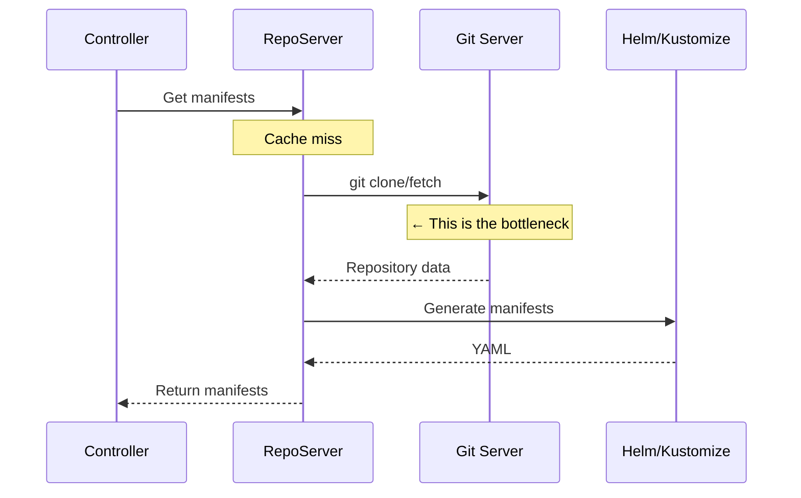

# How to Minimize Git Clone Times in ArgoCD

Author: [nawazdhandala](https://github.com/nawazdhandala)

Tags: ArgoCD, GitOps, Kubernetes, Git, Performance Tuning

Description: Learn practical techniques to minimize Git clone times in ArgoCD, including shallow clones, sparse checkouts, repo splitting, and Git protocol optimization for faster syncs.

---

Every time ArgoCD needs to generate manifests for an application, the repo server clones the Git repository. For small repos, this takes a fraction of a second. But if your repository is hundreds of megabytes or has tens of thousands of commits, the clone step alone can take 30 seconds or more. This directly delays every sync operation. This guide covers every technique available to minimize Git clone times in ArgoCD.

## Understanding Why Clone Times Matter

The Git clone happens in the critical path of every hard refresh and cache miss. Here is where it fits in the pipeline.



If your repo takes 30 seconds to clone and you have 100 applications pointing to it, even with caching, a cold start or cache invalidation means waiting 30 seconds per application.

## Technique 1: Shallow Clones

ArgoCD performs shallow clones by default when the `targetRevision` is a branch or tag. A shallow clone fetches only the latest commit instead of the entire history.

```yaml
# Good: branch reference supports shallow clone
apiVersion: argoproj.io/v1alpha1
kind: Application
metadata:
  name: my-app
spec:
  source:
    repoURL: https://github.com/org/repo.git
    targetRevision: main  # Branch name - shallow clone works
    path: k8s/production

# Also good: tag reference
spec:
  source:
    targetRevision: v1.2.3  # Tag - shallow clone works

# Bad for clone performance: specific commit SHA
spec:
  source:
    targetRevision: abc123def  # SHA - may need deeper fetch
```

When you specify a commit SHA, ArgoCD may need to fetch more history to locate it, especially if the SHA is old. Prefer branch or tag references for faster cloning.

## Technique 2: Sparse Checkout (via Directory Structure)

ArgoCD does not natively support Git sparse checkout, but you can achieve a similar effect by structuring your repository so that each application points to a specific subdirectory.

```text
# Repository structure
repo/
├── app-a/
│   └── k8s/
│       ├── deployment.yaml
│       └── service.yaml
├── app-b/
│   └── k8s/
│       └── ...
└── shared/
    └── base/
        └── ...
```

```yaml
# Each application only reads its own directory
apiVersion: argoproj.io/v1alpha1
kind: Application
metadata:
  name: app-a
spec:
  source:
    repoURL: https://github.com/org/repo.git
    path: app-a/k8s
    targetRevision: main
```

While ArgoCD still clones the entire repository, it only reads files from the specified path. The real optimization here is that the repo server caches the clone and shares it across all applications that use the same repo and revision.

## Technique 3: Split Large Monorepos

The most impactful change for extremely large repos is splitting them. If your monorepo contains application code, infrastructure configs, documentation, and test data, only the infrastructure configs belong in an ArgoCD-managed repo.

```bash
# Before: One massive monorepo
# 2GB total, ArgoCD only needs the k8s/ directory (5MB)

# After: Separate repos
# app-source-code.git (1.9GB) - not managed by ArgoCD
# app-k8s-manifests.git (5MB) - managed by ArgoCD
```

A 5MB repo clones in under a second. A 2GB repo takes 30+ seconds even with shallow clones.

### Using Git Subtree or Submodule

If splitting the repo is not practical, consider using a CI pipeline that extracts the Kubernetes manifests into a separate repo on every commit.

```bash
#!/bin/bash
# CI pipeline: extract manifests to a deployment repo

# Clone the full repo (CI has time for this)
git clone https://github.com/org/monorepo.git
cd monorepo

# Copy manifests to the deployment repo
cp -r k8s/ /tmp/manifests/

cd /tmp/manifests
git init
git remote add origin https://github.com/org/app-manifests.git
git add .
git commit -m "Update manifests from ${COMMIT_SHA}"
git push -f origin main
```

ArgoCD then points to the lightweight `app-manifests` repo instead of the monorepo.

## Technique 4: Git Protocol Optimization

Newer Git protocols are more efficient than the default. Git protocol v2 reduces the amount of negotiation between client and server.

```yaml
# Set on the repo server deployment
apiVersion: apps/v1
kind: Deployment
metadata:
  name: argocd-repo-server
  namespace: argocd
spec:
  template:
    spec:
      containers:
      - name: argocd-repo-server
        env:
        # Use Git protocol v2 for better performance
        - name: GIT_PROTOCOL
          value: "2"
        # Increase the POST buffer for large repos
        - name: GIT_HTTP_POST_BUFFER
          value: "524288000"  # 500MB
```

Git protocol v2 is supported by GitHub, GitLab, and Bitbucket. It reduces clone time by 10-30% for large repositories.

## Technique 5: Use SSH Instead of HTTPS

SSH connections are often faster than HTTPS for Git operations because they avoid the TLS handshake overhead and are better at persistent connections.

```yaml
# Configure the repository to use SSH
apiVersion: argoproj.io/v1alpha1
kind: Application
metadata:
  name: my-app
spec:
  source:
    # Use SSH URL instead of HTTPS
    repoURL: git@github.com:org/repo.git
    path: k8s/production
    targetRevision: main
```

Configure the SSH key in ArgoCD.

```bash
# Add SSH private key for repository access
argocd repo add git@github.com:org/repo.git \
  --ssh-private-key-path ~/.ssh/id_ed25519 \
  --name my-repo
```

## Technique 6: RAM-Backed Tmpfs for Clone Directory

The repo server clones repositories to a temporary directory. Using a RAM-backed filesystem makes the I/O operations instant.

```yaml
apiVersion: apps/v1
kind: Deployment
metadata:
  name: argocd-repo-server
  namespace: argocd
spec:
  template:
    spec:
      containers:
      - name: argocd-repo-server
        volumeMounts:
        - name: tmp
          mountPath: /tmp
      volumes:
      - name: tmp
        emptyDir:
          medium: Memory    # RAM-backed tmpfs
          sizeLimit: 10Gi   # Size depends on your repos
```

This eliminates disk I/O during clone operations. The tradeoff is that it consumes node memory. Size the volume to accommodate all your repositories multiplied by the number of concurrent clone operations.

## Technique 7: Git Mirror or Proxy

If your Git server is geographically distant from your Kubernetes cluster, network latency dominates clone times. Set up a Git mirror closer to your cluster.

```bash
# Set up a local Git mirror
git clone --mirror https://github.com/org/repo.git /git-mirror/repo.git

# Keep it updated with a cron job
# */5 * * * * cd /git-mirror/repo.git && git fetch --all
```

```yaml
# Point ArgoCD at the local mirror
apiVersion: argoproj.io/v1alpha1
kind: Application
metadata:
  name: my-app
spec:
  source:
    repoURL: https://git-mirror.internal/repo.git
    path: k8s/production
```

Alternatively, tools like Gitea or GitLab can act as a pull-through mirror that caches upstream repositories.

## Technique 8: Increase Repo Server Replicas

More repo server replicas mean more concurrent clone operations. If multiple applications need to refresh simultaneously, they do not queue behind each other.

```yaml
apiVersion: apps/v1
kind: Deployment
metadata:
  name: argocd-repo-server
  namespace: argocd
spec:
  replicas: 5
  template:
    spec:
      containers:
      - name: argocd-repo-server
        resources:
          requests:
            cpu: "1"
            memory: "2Gi"
```

Each replica maintains its own clone cache, so after warmup, each replica has the repository available locally and only needs to `git fetch` for updates.

## Measuring Clone Times

Use ArgoCD metrics to measure the actual clone performance.

```promql
# Git request duration (includes clone/fetch)
histogram_quantile(0.95,
  rate(argocd_git_request_duration_seconds_bucket[5m])
)

# Separate clone vs fetch operations
argocd_git_request_duration_seconds_sum{request_type="ls-remote"}
argocd_git_request_duration_seconds_sum{request_type="fetch"}
```

Track these metrics before and after each optimization to measure the impact.

## Summary

The most impactful optimizations ranked by effectiveness are: splitting large monorepos (biggest impact), using RAM-backed tmpfs for clone directories, enabling Git protocol v2, using branch references for shallow clones, and running multiple repo server replicas. For most teams, the combination of shallow clones, RAM-backed tmpfs, and 3+ repo server replicas brings clone times under 5 seconds even for moderately large repositories.
