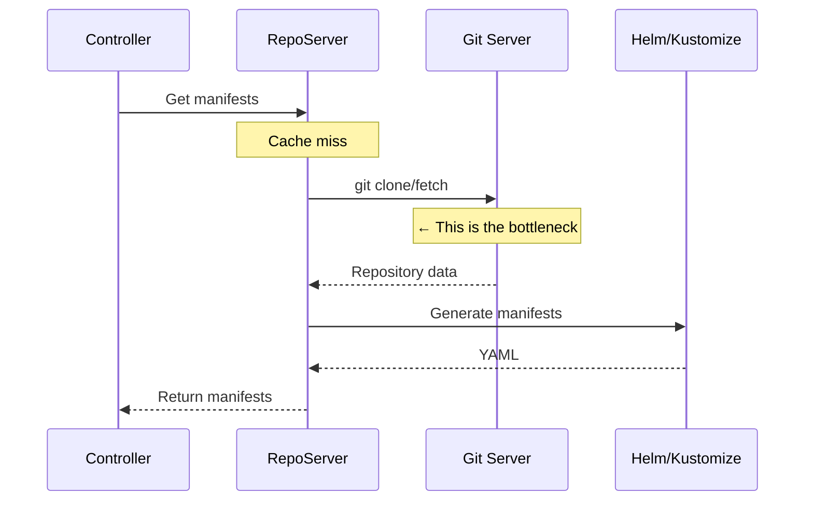

# How to Minimize Git Clone Times in ArgoCD

Author: [nawazdhandala](https://github.com/nawazdhandala)

Tags: ArgoCD, GitOps, Kubernetes, Git, Performance Tuning

Description: Learn practical techniques to minimize Git clone times in ArgoCD, including shallow clones, sparse checkouts, repo splitting, and Git protocol optimization for faster syncs.

---

When ArgoCD needs to generate manifests for an application, the repo server uses a local checkout of the Git repository and keeps it up to date. For small repos, the initial clone or later fetch takes a fraction of a second. But if your repository is hundreds of megabytes or has tens of thousands of commits, that Git step alone can take 30 seconds or more on a cold cache. This directly delays refresh and sync operations that need fresh repository data. This guide covers practical techniques to minimize Git clone and fetch times in ArgoCD.

## Understanding Why Clone Times Matter

The Git clone or fetch happens in the critical path of hard refreshes and cache misses. Here is where it fits in the pipeline.


```mermaid
sequenceDiagram
    participant Controller
    participant RepoServer
    participant Git as Git Server
    participant Generator as Helm/Kustomize

    Controller->>RepoServer: Get manifests
    Note over RepoServer: Cache miss
    RepoServer->>Git: git clone/fetch
    Note over Git: ← This is the bottleneck
    Git-->>RepoServer: Repository data
    RepoServer->>Generator: Generate manifests
    Generator-->>RepoServer: YAML
    RepoServer-->>Controller: Return manifests
```

If your repo takes 30 seconds to clone and you have many applications pointing to it, a cold repo-server cache can delay the first applications that need that repository until the local checkout is available.

## Technique 1: Shallow Clones

ArgoCD performs a full clone by default unless shallow cloning is configured for the repository. A shallow clone with depth 1 fetches only the required commit instead of the entire history.

```bash
# Enable shallow cloning when adding a repository
argocd repo add https://github.com/org/repo.git --depth 1
```

```yaml
# Good: branch reference works well with shallow clone

apiVersion: argoproj.io/v1alpha1
kind: Application
metadata:
  name: my-app
spec:
  source:
    repoURL: https://github.com/org/repo.git
    targetRevision: main  # Branch name - shallow clone works when repository depth is configured
    path: k8s/production

# Also good: recent tag reference
spec:
  source:
    targetRevision: v1.2.3  # Recent tag - shallow clone works if the tag target can be fetched at that depth

# Bad for clone performance: specific commit SHA
spec:
  source:
    targetRevision: abc123def  # SHA - may need deeper fetch
```

When you specify a commit SHA or an old tag, ArgoCD may need to fetch more history to locate it. Prefer branch or recent tag references when using shallow clones.

## Technique 2: Sparse Checkout (via Directory Structure)

ArgoCD does not natively support Git sparse checkout, but you can achieve a similar effect by structuring your repository so that each application points to a specific subdirectory.

```text
# Repository structure
repo/
├── app-a/
│   └── k8s/
│       ├── deployment.yaml
│       └── service.yaml
├── app-b/
│   └── k8s/
│       └── ...
└── shared/
    └── base/
        └── ...
```

```yaml
# Each application only reads its own directory
apiVersion: argoproj.io/v1alpha1
kind: Application
metadata:
  name: app-a
spec:
  source:
    repoURL: https://github.com/org/repo.git
    path: app-a/k8s
    targetRevision: main
```

While ArgoCD still clones the entire repository, it only reads files from the specified path. The real optimization here is that the repo server caches the clone and shares it across all applications that use the same repo and revision.

## Technique 3: Split Large Monorepos

The most impactful change for extremely large repos is splitting them. If your monorepo contains application code, infrastructure configs, documentation, and test data, only the infrastructure configs belong in an ArgoCD-managed repo.

```bash
# Before: One massive monorepo
# 2GB total, ArgoCD only needs the k8s/ directory (5MB)

# After: Separate repos
# app-source-code.git (1.9GB) - not managed by ArgoCD
# app-k8s-manifests.git (5MB) - managed by ArgoCD
```

A 5MB repo clones in under a second. A 2GB repo takes 30+ seconds even with shallow clones.

### Using Git Subtree or Submodule

If splitting the repo is not practical, consider using a CI pipeline that extracts the Kubernetes manifests into a separate repo on every commit.

```bash
#!/bin/bash
# CI pipeline: extract manifests to a deployment repo

# Clone the full repo (CI has time for this)
git clone https://github.com/org/monorepo.git
cd monorepo

# Copy manifests to the deployment repo
cp -r k8s/ /tmp/manifests/

cd /tmp/manifests
git init
git remote add origin https://github.com/org/app-manifests.git
git add .
git commit -m "Update manifests from ${COMMIT_SHA}"
git push -f origin main
```

ArgoCD then points to the lightweight `app-manifests` repo instead of the monorepo.

## Technique 4: Git Protocol Optimization

Git protocol v2 reduces the amount of negotiation between client and server. Modern Git clients default to protocol v2, but you can explicitly set it when you need to ensure that behavior in the repo server environment.

```yaml
# Set on the repo server deployment
apiVersion: apps/v1
kind: Deployment
metadata:
  name: argocd-repo-server
  namespace: argocd
spec:
  template:
    spec:
      containers:
      - name: argocd-repo-server
        env:
        # Use Git protocol v2 for better performance
        - name: GIT_PROTOCOL
          value: "version=2"
```

Git protocol v2 is supported by major Git providers such as GitHub, GitLab, and Bitbucket. The impact varies by repository and server, so benchmark it in your environment.

## Technique 5: Use SSH Instead of HTTPS

SSH connections are not inherently faster than HTTPS, but they can be faster in environments where HTTPS proxies, authentication, or TLS inspection add overhead. Benchmark both transports with your Git provider before switching only for performance.

```yaml
# Configure the repository to use SSH
apiVersion: argoproj.io/v1alpha1
kind: Application
metadata:
  name: my-app
spec:
  source:
    # Use SSH URL instead of HTTPS
    repoURL: git@github.com:org/repo.git
    path: k8s/production
    targetRevision: main
```

Configure the SSH key in ArgoCD.

```bash
# Add SSH private key for repository access
argocd repo add git@github.com:org/repo.git \
  --ssh-private-key-path ~/.ssh/id_ed25519 \
  --name my-repo
```

## Technique 6: RAM-Backed Tmpfs for Clone Directory

The repo server clones repositories to a temporary directory. Using a RAM-backed filesystem can make local checkout I/O much faster.

```yaml
apiVersion: apps/v1
kind: Deployment
metadata:
  name: argocd-repo-server
  namespace: argocd
spec:
  template:
    spec:
      containers:
      - name: argocd-repo-server
        volumeMounts:
        - name: tmp
          mountPath: /tmp
      volumes:
      - name: tmp
        emptyDir:
          medium: Memory    # RAM-backed tmpfs
          sizeLimit: 10Gi   # Size depends on your repos
```

This reduces disk I/O during clone operations. The tradeoff is that it consumes node memory. Size the volume to accommodate all your repositories multiplied by the number of concurrent clone operations.

## Technique 7: Git Mirror or Proxy

If your Git server is geographically distant from your Kubernetes cluster, network latency dominates clone times. Set up a Git mirror closer to your cluster.

```bash
# Set up a local Git mirror
git clone --mirror https://github.com/org/repo.git /git-mirror/repo.git

# Keep it updated with a cron job
# */5 * * * * cd /git-mirror/repo.git && git fetch --all
```

```yaml
# Point ArgoCD at the local mirror
apiVersion: argoproj.io/v1alpha1
kind: Application
metadata:
  name: my-app
spec:
  source:
    repoURL: https://git-mirror.internal/repo.git
    path: k8s/production
```

Alternatively, tools like Gitea or GitLab can act as a pull-through mirror that caches upstream repositories.

## Technique 8: Increase Repo Server Replicas

More repo server replicas mean more concurrent clone operations. If multiple applications need to refresh simultaneously, they do not queue behind each other.

```yaml
apiVersion: apps/v1
kind: Deployment
metadata:
  name: argocd-repo-server
  namespace: argocd
spec:
  replicas: 5
  template:
    spec:
      containers:
      - name: argocd-repo-server
        resources:
          requests:
            cpu: "1"
            memory: "2Gi"
```

Each replica maintains its own clone cache, so after warmup, each replica has the repository available locally and only needs to `git fetch` for updates.

## Measuring Clone Times

Use ArgoCD metrics to measure the actual clone performance.

```promql
# Git request duration (includes clone/fetch)
histogram_quantile(0.95,
  sum(rate(argocd_git_request_duration_seconds_bucket[5m])) by (le)
)

# Average Git request duration by request type
sum by (request_type) (rate(argocd_git_request_duration_seconds_sum[5m]))
/
sum by (request_type) (rate(argocd_git_request_duration_seconds_count[5m]))
```

Track these metrics before and after each optimization to measure the impact.

## Summary

The most impactful optimizations ranked by effectiveness are: splitting large monorepos (biggest impact), configuring shallow clone depth for repositories that can use it, using RAM-backed tmpfs for clone directories, verifying Git protocol v2, and running multiple repo server replicas. For most teams, the combination of shallow clones, fast local storage, and enough repo server capacity brings clone times down significantly for moderately large repositories.
