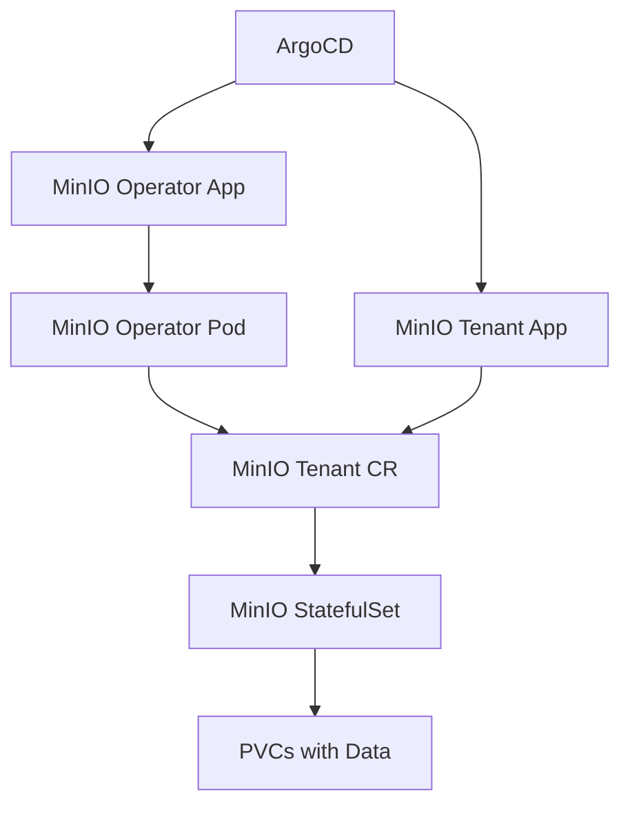

# How to Deploy MinIO Object Storage with ArgoCD

Author: [nawazdhandala](https://github.com/nawazdhandala)

Tags: ArgoCD, GitOps, Kubernetes, MinIO, Storage

Description: Learn how to deploy and manage MinIO object storage on Kubernetes using ArgoCD, covering Helm-based deployment, tenant management, and bucket configuration through GitOps.

---

MinIO is a high-performance, S3-compatible object storage system that runs natively on Kubernetes. Deploying it through ArgoCD gives you a fully declarative, Git-driven approach to managing your object storage infrastructure. This guide covers deploying both the MinIO Operator and individual tenants using ArgoCD.

## Architecture Overview

MinIO on Kubernetes follows an operator pattern. You deploy the MinIO Operator first, which then manages MinIO Tenant resources. Each tenant is an isolated MinIO cluster with its own storage, users, and policies.



## Deploying the MinIO Operator

Start by creating an ArgoCD Application for the MinIO Operator:

```yaml
# applications/minio-operator.yaml
apiVersion: argoproj.io/v1alpha1
kind: Application
metadata:
  name: minio-operator
  namespace: argocd
spec:
  project: infrastructure
  source:
    repoURL: https://operator.min.io
    chart: operator
    targetRevision: 5.0.15
    helm:
      values: |
        operator:
          replicaCount: 2
          resources:
            requests:
              cpu: 200m
              memory: 256Mi
            limits:
              cpu: 500m
              memory: 512Mi
        console:
          replicaCount: 1
          ingress:
            enabled: true
            host: minio-console.example.com
            tls:
              - secretName: minio-console-tls
                hosts:
                  - minio-console.example.com
  destination:
    server: https://kubernetes.default.svc
    namespace: minio-operator
  syncPolicy:
    automated:
      selfHeal: true
      prune: true
    syncOptions:
      - CreateNamespace=true
      - ServerSideApply=true
```

The operator needs ServerSideApply because it creates CRDs that can be large. ArgoCD handles this cleanly with the sync option.

## Creating a MinIO Tenant

Once the operator is running, define a MinIO Tenant resource:

```yaml
# minio/tenant.yaml
apiVersion: minio.min.io/v2
kind: Tenant
metadata:
  name: production-storage
  namespace: minio-tenant
  labels:
    app: minio
    environment: production
spec:
  image: minio/minio:RELEASE.2024-11-07T00-52-20Z
  imagePullPolicy: IfNotPresent
  # 4 servers with 4 drives each = 16 drives total
  pools:
    - name: pool-0
      servers: 4
      volumesPerServer: 4
      volumeClaimTemplate:
        metadata:
          name: data
        spec:
          accessModes:
            - ReadWriteOnce
          resources:
            requests:
              storage: 100Gi
          storageClassName: gp3-csi
      resources:
        requests:
          cpu: 500m
          memory: 1Gi
        limits:
          cpu: 2
          memory: 4Gi
      # Spread pods across nodes
      affinity:
        podAntiAffinity:
          requiredDuringSchedulingIgnoredDuringExecution:
            - labelSelector:
                matchLabels:
                  v1.min.io/tenant: production-storage
              topologyKey: kubernetes.io/hostname
  # TLS configuration
  requestAutoCert: true
  # Expose MinIO API
  exposeServices:
    minio: true
    console: true
  # Configuration for the tenant
  configuration:
    name: minio-tenant-config
  # User credentials
  credsSecret:
    name: minio-tenant-creds
```

## Managing MinIO Secrets

Store MinIO credentials in a Secret that ArgoCD manages. For production, use Sealed Secrets or an external secrets manager:

```yaml
# minio/sealed-secret.yaml
apiVersion: bitnami.com/v1alpha1
kind: SealedSecret
metadata:
  name: minio-tenant-creds
  namespace: minio-tenant
spec:
  encryptedData:
    accesskey: AgBY2k...encrypted...
    secretkey: AgCx9p...encrypted...
  template:
    metadata:
      name: minio-tenant-creds
      namespace: minio-tenant
```

```yaml
# minio/tenant-config.yaml
apiVersion: v1
kind: Secret
metadata:
  name: minio-tenant-config
  namespace: minio-tenant
type: Opaque
stringData:
  config.env: |
    export MINIO_BROWSER="on"
    export MINIO_STORAGE_CLASS_STANDARD="EC:2"
    export MINIO_STORAGE_CLASS_RRS="EC:1"
```

## ArgoCD Application for the Tenant

Create a dedicated ArgoCD Application for the tenant:

```yaml
apiVersion: argoproj.io/v1alpha1
kind: Application
metadata:
  name: minio-tenant-production
  namespace: argocd
spec:
  project: storage
  source:
    repoURL: https://github.com/your-org/k8s-configs.git
    targetRevision: main
    path: minio
  destination:
    server: https://kubernetes.default.svc
    namespace: minio-tenant
  syncPolicy:
    automated:
      selfHeal: true
      prune: false  # Do not auto-delete tenant resources
    syncOptions:
      - CreateNamespace=true
      - RespectIgnoreDifferences=true
  ignoreDifferences:
    - group: minio.min.io
      kind: Tenant
      jsonPointers:
        - /status
        - /spec/pools/0/volumeClaimTemplate/apiVersion
```

Setting `prune: false` is important. You never want ArgoCD to accidentally delete a MinIO tenant and its associated data.

## Bucket Management with Jobs

Manage MinIO bucket creation through Kubernetes Jobs that run as ArgoCD hooks:

```yaml
# minio/bucket-setup.yaml
apiVersion: batch/v1
kind: Job
metadata:
  name: create-buckets
  namespace: minio-tenant
  annotations:
    argocd.argoproj.io/hook: PostSync
    argocd.argoproj.io/hook-delete-policy: HookSucceeded
spec:
  template:
    spec:
      containers:
        - name: mc
          image: minio/mc:latest
          command:
            - /bin/sh
            - -c
            - |
              # Configure mc client
              mc alias set myminio https://minio.minio-tenant.svc.cluster.local \
                $ACCESS_KEY $SECRET_KEY --insecure

              # Create buckets with specific policies
              mc mb --ignore-existing myminio/application-data
              mc mb --ignore-existing myminio/logs
              mc mb --ignore-existing myminio/backups

              # Set lifecycle rules for log bucket - expire after 90 days
              mc ilm rule add --expire-days 90 myminio/logs

              # Set versioning on application-data bucket
              mc version enable myminio/application-data

              # Set quota on backups bucket (500GB)
              mc quota set myminio/backups --size 500GiB

              echo "Bucket setup complete"
          env:
            - name: ACCESS_KEY
              valueFrom:
                secretKeyRef:
                  name: minio-tenant-creds
                  key: accesskey
            - name: SECRET_KEY
              valueFrom:
                secretKeyRef:
                  name: minio-tenant-creds
                  key: secretkey
      restartPolicy: OnFailure
  backoffLimit: 3
```

## Configuring MinIO Ingress

Expose MinIO through an Ingress managed by ArgoCD:

```yaml
# minio/ingress.yaml
apiVersion: networking.k8s.io/v1
kind: Ingress
metadata:
  name: minio-api
  namespace: minio-tenant
  annotations:
    nginx.ingress.kubernetes.io/proxy-body-size: "0"
    nginx.ingress.kubernetes.io/proxy-buffering: "off"
    nginx.ingress.kubernetes.io/proxy-request-buffering: "off"
    cert-manager.io/cluster-issuer: letsencrypt-prod
spec:
  ingressClassName: nginx
  tls:
    - hosts:
        - s3.example.com
      secretName: minio-api-tls
  rules:
    - host: s3.example.com
      http:
        paths:
          - path: /
            pathType: Prefix
            backend:
              service:
                name: minio
                port:
                  number: 443
```

The `proxy-body-size: "0"` annotation disables upload size limits, which is essential for an object storage endpoint.

## Monitoring MinIO with ArgoCD

Add Prometheus monitoring for your MinIO tenant:

```yaml
# minio/servicemonitor.yaml
apiVersion: monitoring.coreos.com/v1
kind: ServiceMonitor
metadata:
  name: minio-metrics
  namespace: minio-tenant
  labels:
    release: prometheus
spec:
  selector:
    matchLabels:
      v1.min.io/tenant: production-storage
  endpoints:
    - port: http-minio
      path: /minio/v2/metrics/cluster
      interval: 30s
      bearerTokenSecret:
        name: minio-tenant-creds
        key: accesskey
```

## Scaling MinIO Through Git

One of the biggest advantages of managing MinIO through ArgoCD is scaling. To add capacity, simply add a new pool in Git:

```yaml
# Add to the tenant spec
pools:
  - name: pool-0
    servers: 4
    volumesPerServer: 4
    volumeClaimTemplate:
      # ... existing pool config
  - name: pool-1  # New expansion pool
    servers: 4
    volumesPerServer: 4
    volumeClaimTemplate:
      metadata:
        name: data
      spec:
        accessModes:
          - ReadWriteOnce
        resources:
          requests:
            storage: 200Gi  # Larger drives for the new pool
        storageClassName: gp3-csi
```

Commit the change, and ArgoCD will sync the updated tenant configuration. The MinIO Operator handles the expansion without downtime.

## Summary

Deploying MinIO with ArgoCD creates a fully GitOps-driven object storage platform. The operator pattern maps well to ArgoCD's declarative model: the operator deployment, tenant definitions, bucket configurations, and monitoring all live in Git. Key considerations include disabling pruning for tenant resources, using PostSync hooks for bucket management, configuring ignore differences for status fields, and leveraging Sealed Secrets for credential management. This approach ensures your object storage infrastructure is as reproducible and auditable as the rest of your Kubernetes stack.
