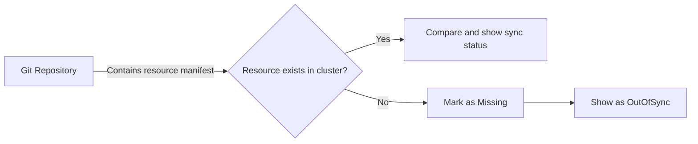

# How to Handle 'Missing' Health Status in ArgoCD

Author: [nawazdhandala](https://github.com/nawazdhandala)

Tags: ArgoCD, GitOps, Kubernetes, Troubleshooting

Description: Learn how to diagnose and resolve Missing health status in ArgoCD applications, including causes like deleted resources, CRD ordering issues, namespace problems, and RBAC restrictions.

---

When ArgoCD shows a resource with "Missing" health status, it means ArgoCD expects the resource to exist in the cluster (because it is defined in your Git repository), but the resource cannot be found. This is different from "Degraded" (the resource exists but is broken) or "OutOfSync" (the resource exists but differs from the desired state). "Missing" specifically means the resource is absent from the cluster entirely.

This guide covers the common causes of "Missing" status and how to resolve each one.

## Understanding What "Missing" Means

ArgoCD compares what is in your Git repository (desired state) with what exists in the cluster (live state). When ArgoCD finds a resource manifest in Git but cannot find the corresponding resource in the cluster, it marks that resource as "Missing".



A "Missing" resource always also shows as "OutOfSync" because the desired state (resource exists) does not match the live state (resource does not exist).

## Common Causes and Fixes

### 1. Resource Was Manually Deleted

The simplest case: someone deleted the resource from the cluster using `kubectl delete`, but it still exists in Git.

```bash
# Verify the resource does not exist
kubectl get <resource-type> <resource-name> -n <namespace>

# If it should exist, sync the application
argocd app sync my-app

# Or sync just the missing resource
argocd app sync my-app --resource <group>:<kind>:<name>
```

This is the normal ArgoCD workflow. If auto-sync is enabled with self-healing, ArgoCD should recreate missing resources automatically.

### 2. CRD Is Not Installed

One of the most common causes of "Missing" status: your manifest references a Custom Resource Definition (CRD) that does not exist in the cluster.

```bash
# Check if the CRD exists
kubectl get crd <crd-name>

# For example, if you have a Certificate resource from cert-manager
kubectl get crd certificates.cert-manager.io
```

If the CRD is missing, the resource cannot be created. Fix this by ensuring CRDs are installed before the resources that depend on them.

Using sync waves to order CRD installation:

```yaml
# CRD should be synced in an earlier wave
apiVersion: apiextensions.k8s.io/v1
kind: CustomResourceDefinition
metadata:
  name: certificates.cert-manager.io
  annotations:
    argocd.argoproj.io/sync-wave: "-1"
# ...

---
# CR in a later wave
apiVersion: cert-manager.io/v1
kind: Certificate
metadata:
  name: my-cert
  annotations:
    argocd.argoproj.io/sync-wave: "1"
```

### 3. Namespace Does Not Exist

The resource references a namespace that has not been created yet.

```bash
# Check if the namespace exists
kubectl get namespace <namespace-name>
```

Fix by using the `CreateNamespace=true` sync option:

```yaml
apiVersion: argoproj.io/v1alpha1
kind: Application
metadata:
  name: my-app
spec:
  syncPolicy:
    syncOptions:
      - CreateNamespace=true
```

Or create the namespace in a sync wave before the resources:

```yaml
apiVersion: v1
kind: Namespace
metadata:
  name: my-namespace
  annotations:
    argocd.argoproj.io/sync-wave: "-2"
```

### 4. RBAC Restrictions

ArgoCD might not have permission to read or create the resource. This happens when ArgoCD's service account does not have the necessary ClusterRole or Role bindings.

```bash
# Check ArgoCD's permissions
kubectl auth can-i get <resource-type> --as=system:serviceaccount:argocd:argocd-application-controller -n <namespace>

# Check if the resource type is allowed in the ArgoCD project
argocd proj get <project-name> -o yaml
```

If the project restricts resource kinds, the resource will show as "Missing" because ArgoCD is not allowed to manage it. Fix by updating the project configuration:

```yaml
apiVersion: argoproj.io/v1alpha1
kind: AppProject
metadata:
  name: my-project
spec:
  clusterResourceWhitelist:
    - group: '*'
      kind: '*'
  namespaceResourceWhitelist:
    - group: '*'
      kind: '*'
```

Or more restrictively, add just the specific resource kind you need:

```yaml
  namespaceResourceWhitelist:
    - group: cert-manager.io
      kind: Certificate
```

### 5. Wrong Destination Configuration

The application is targeting the wrong cluster or namespace, so ArgoCD looks in the wrong place for the resource.

```bash
# Check the application destination
argocd app get my-app -o json | jq '.spec.destination'
```

Verify that the destination cluster and namespace match where you expect the resources to be.

### 6. Resource Was Pruned

If a previous sync with pruning removed the resource, and the resource manifest was later re-added to Git, it may show as "Missing" until the next sync.

```bash
# Check sync history for pruning
argocd app history my-app

# Sync to recreate the resource
argocd app sync my-app
```

### 7. API Server Version Mismatch

If the manifest uses an API version that the cluster does not support (like `extensions/v1beta1` Ingress on a newer cluster), the resource will be "Missing" because the API server does not recognize it.

```bash
# Check available API versions
kubectl api-versions | grep networking

# For example, on newer clusters
# extensions/v1beta1 is gone, use networking.k8s.io/v1
```

Fix by updating your manifest to use the correct API version:

```yaml
# Old (deprecated)
apiVersion: extensions/v1beta1
kind: Ingress

# New (correct)
apiVersion: networking.k8s.io/v1
kind: Ingress
```

### 8. Conditional Resources Not Generated

If you use Helm or Kustomize and a resource is conditionally generated, it might be in Git but not rendered by the template engine.

For Helm:

```bash
# Check what Helm actually renders
helm template my-chart --values values.yaml | kubectl apply --dry-run=client -f -
```

For Kustomize:

```bash
# Check what Kustomize generates
kustomize build overlays/production
```

If the resource is not in the rendered output, it will not be deployed.

## Handling Missing Resources at Scale

When dealing with many "Missing" resources, you need a systematic approach:

```bash
# List all missing resources across all applications
for app in $(argocd app list -o name); do
  MISSING=$(argocd app resources "$app" -o json | jq -r '.[] | select(.health.status == "Missing") | .name')
  if [ -n "$MISSING" ]; then
    echo "=== $app ==="
    echo "$MISSING"
  fi
done
```

### Bulk Sync Missing Resources

```bash
# Sync all out-of-sync applications (which includes missing resources)
argocd app list -o json | jq -r '.[] | select(.status.sync.status == "OutOfSync") | .metadata.name' | xargs -I {} argocd app sync {}
```

## Preventing "Missing" Status

To minimize "Missing" status issues:

1. **Enable auto-sync with self-healing**: This automatically recreates resources that get deleted.

```yaml
spec:
  syncPolicy:
    automated:
      selfHeal: true
      prune: true
```

2. **Use sync waves for dependencies**: Ensure CRDs, namespaces, and other dependencies are created before resources that depend on them.

3. **Use the CreateNamespace sync option**: Avoid missing namespace issues.

4. **Configure proper RBAC**: Ensure ArgoCD has permission to manage all resource types in your manifests.

5. **Keep API versions up to date**: Regularly audit your manifests for deprecated API versions.

## When "Missing" Is Expected

Sometimes "Missing" is expected and not a problem:

- **Sync hooks**: PreSync, PostSync, and SyncFail hook resources are created during sync and deleted after. They will briefly show as "Missing" between syncs.
- **Jobs with TTL**: Jobs with `ttlSecondsAfterFinished` get auto-deleted by Kubernetes.
- **Intentionally deleted resources**: If you removed a resource from Git but have not synced with pruning yet.

In these cases, you can either ignore the "Missing" status or configure ArgoCD to exclude these resources from tracking.

For more on sync ordering, see [how to order resource deployment with sync waves](https://oneuptime.com/blog/post/2026-02-26-argocd-sync-waves-ordering/view). For debugging health issues in general, check out [how to debug health check failures in ArgoCD](https://oneuptime.com/blog/post/2026-02-26-argocd-debug-health-check-failures/view).
