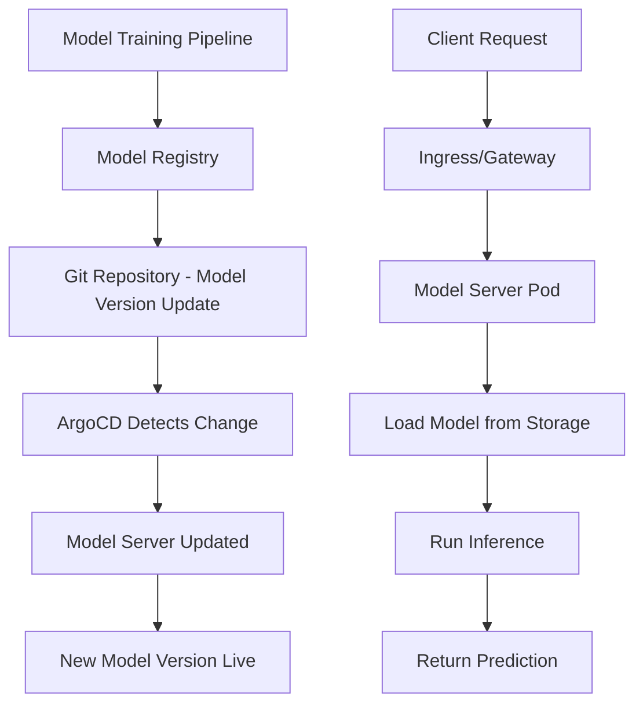

# How to Deploy ML Model Serving with ArgoCD

Author: [nawazdhandala](https://github.com/nawazdhandala)

Tags: ArgoCD, GitOps, Kubernetes, Machine Learning, MLOps

Description: Learn how to deploy and manage ML model serving infrastructure on Kubernetes using ArgoCD, including KServe, Seldon Core, and custom model servers with GitOps-driven model versioning.

---

Deploying machine learning models to production has a unique challenge: models change frequently but independently of the application code that consumes them. A recommendation engine might get a new model every day, while the API serving it stays the same for months. ArgoCD gives you a clean way to manage both model versions and serving infrastructure through GitOps, keeping everything versioned, auditable, and automatically deployed.

This guide covers deploying ML model serving infrastructure with ArgoCD, from simple custom servers to production-grade platforms like KServe and Seldon Core.

## ML Model Serving Architecture

A typical ML model serving setup on Kubernetes looks like this:



The key workflow is: train a model, push it to a model registry or storage, update the model version in Git, and let ArgoCD deploy the new version.

## Simple Custom Model Server

Start with a straightforward Flask-based model server managed by ArgoCD:

```yaml
# apps/model-server/deployment.yaml
apiVersion: apps/v1
kind: Deployment
metadata:
  name: prediction-service
  labels:
    app: prediction-service
    model-version: v2.3.1
spec:
  replicas: 3
  selector:
    matchLabels:
      app: prediction-service
  template:
    metadata:
      labels:
        app: prediction-service
        model-version: v2.3.1
    spec:
      containers:
        - name: model-server
          image: myregistry.io/prediction-service:v2.3.1
          ports:
            - containerPort: 8080
              name: http
            - containerPort: 8081
              name: grpc
          env:
            - name: MODEL_PATH
              value: "s3://ml-models/production/recommendation-model/v2.3.1/"
            - name: MODEL_NAME
              value: "recommendation-model"
            - name: NUM_WORKERS
              value: "4"
          resources:
            requests:
              cpu: "2"
              memory: 4Gi
              # Request GPU if needed
              # nvidia.com/gpu: 1
            limits:
              cpu: "4"
              memory: 8Gi
          readinessProbe:
            httpGet:
              path: /v1/models/recommendation-model
              port: 8080
            initialDelaySeconds: 30
            periodSeconds: 10
          livenessProbe:
            httpGet:
              path: /health
              port: 8080
            initialDelaySeconds: 60
            periodSeconds: 30
          volumeMounts:
            - name: model-cache
              mountPath: /models/cache
      volumes:
        - name: model-cache
          emptyDir:
            sizeLimit: 10Gi
      # Ensure pods land on ML-optimized nodes
      nodeSelector:
        node-type: ml-serving
      tolerations:
        - key: "ml-workload"
          operator: "Equal"
          value: "true"
          effect: "NoSchedule"
---
apiVersion: v1
kind: Service
metadata:
  name: prediction-service
spec:
  selector:
    app: prediction-service
  ports:
    - name: http
      port: 8080
      targetPort: 8080
    - name: grpc
      port: 8081
      targetPort: 8081
---
apiVersion: autoscaling/v2
kind: HorizontalPodAutoscaler
metadata:
  name: prediction-service-hpa
spec:
  scaleTargetRef:
    apiVersion: apps/v1
    kind: Deployment
    name: prediction-service
  minReplicas: 3
  maxReplicas: 20
  metrics:
    - type: Pods
      pods:
        metric:
          name: inference_requests_per_second
        target:
          type: AverageValue
          averageValue: "50"
    - type: Resource
      resource:
        name: cpu
        target:
          type: Utilization
          averageUtilization: 70
```

## Deploying KServe with ArgoCD

KServe (formerly KFServing) is the Kubernetes standard for model serving. Deploy it through ArgoCD:

```yaml
# ArgoCD Application for KServe
apiVersion: argoproj.io/v1alpha1
kind: Application
metadata:
  name: kserve
  namespace: argocd
spec:
  project: ml-platform
  source:
    repoURL: https://github.com/kserve/kserve
    targetRevision: v0.12.0
    path: install/v0.12.0
  destination:
    server: https://kubernetes.default.svc
  syncPolicy:
    automated:
      prune: true
      selfHeal: true
```

Then deploy models as KServe InferenceService resources:

```yaml
# apps/models/recommendation-model.yaml
apiVersion: serving.kserve.io/v1beta1
kind: InferenceService
metadata:
  name: recommendation-model
  labels:
    model: recommendation
    version: v2.3.1
  annotations:
    # Scale to zero when idle
    autoscaling.knative.dev/minScale: "1"
    autoscaling.knative.dev/maxScale: "10"
    autoscaling.knative.dev/target: "50"
spec:
  predictor:
    # Model format: sklearn, tensorflow, pytorch, xgboost, etc.
    model:
      modelFormat:
        name: sklearn
      storageUri: "s3://ml-models/production/recommendation/v2.3.1"
      resources:
        requests:
          cpu: "1"
          memory: 2Gi
        limits:
          cpu: "2"
          memory: 4Gi
      # Runtime image
      runtime: kserve-sklearnserver
    # Canary deployment for model updates
    canaryTrafficPercent: 10
```

## Model Versioning with GitOps

The key to ML model serving with GitOps is separating model versions from application code. Use a dedicated configuration file for model versions:

```yaml
# config/model-versions.yaml
models:
  recommendation:
    version: v2.3.1
    storageUri: s3://ml-models/production/recommendation/v2.3.1
    framework: sklearn
    replicas: 3
  fraud-detection:
    version: v1.8.0
    storageUri: s3://ml-models/production/fraud-detection/v1.8.0
    framework: tensorflow
    replicas: 2
  search-ranking:
    version: v5.1.2
    storageUri: s3://ml-models/production/search-ranking/v5.1.2
    framework: pytorch
    replicas: 5
```

Your CI/CD pipeline updates this file when a new model passes validation:

```bash
# In your model training pipeline
# After model validation passes:
yq eval '.models.recommendation.version = "v2.4.0"' -i config/model-versions.yaml
yq eval '.models.recommendation.storageUri = "s3://ml-models/production/recommendation/v2.4.0"' -i config/model-versions.yaml
git add config/model-versions.yaml
git commit -m "Update recommendation model to v2.4.0"
git push
# ArgoCD picks up the change and deploys the new model
```

## Deploying Seldon Core with ArgoCD

Seldon Core is another popular model serving platform:

```yaml
# Install Seldon Core operator
apiVersion: argoproj.io/v1alpha1
kind: Application
metadata:
  name: seldon-core
  namespace: argocd
spec:
  project: ml-platform
  source:
    repoURL: https://storage.googleapis.com/seldon-charts
    chart: seldon-core-operator
    targetRevision: 1.17.1
    helm:
      values: |
        usageMetrics:
          enabled: true
        istio:
          enabled: true
  destination:
    server: https://kubernetes.default.svc
    namespace: seldon-system
  syncPolicy:
    automated:
      prune: true
      selfHeal: true
    syncOptions:
      - CreateNamespace=true
```

Deploy a model with Seldon:

```yaml
apiVersion: machinelearning.seldon.io/v1
kind: SeldonDeployment
metadata:
  name: recommendation-model
spec:
  name: recommendation
  predictors:
    - name: default
      replicas: 3
      graph:
        name: model
        implementation: SKLEARN_SERVER
        modelUri: s3://ml-models/production/recommendation/v2.3.1
        envSecretRefName: s3-credentials
      componentSpecs:
        - spec:
            containers:
              - name: model
                resources:
                  requests:
                    cpu: "1"
                    memory: 2Gi
    # Canary with new model version
    - name: canary
      replicas: 1
      traffic: 10
      graph:
        name: model
        implementation: SKLEARN_SERVER
        modelUri: s3://ml-models/production/recommendation/v2.4.0-rc1
```

## GPU Workload Management

ML model serving often requires GPU resources. Configure GPU scheduling:

```yaml
apiVersion: apps/v1
kind: Deployment
metadata:
  name: gpu-model-server
spec:
  template:
    spec:
      containers:
        - name: model-server
          image: myregistry.io/gpu-model-server:latest
          resources:
            requests:
              cpu: "2"
              memory: 8Gi
              nvidia.com/gpu: 1
            limits:
              nvidia.com/gpu: 1
          env:
            - name: CUDA_VISIBLE_DEVICES
              value: "0"
      nodeSelector:
        accelerator: nvidia-tesla-t4
      tolerations:
        - key: nvidia.com/gpu
          operator: Exists
          effect: NoSchedule
```

## Monitoring Model Serving

ML model servers need specialized monitoring beyond standard HTTP metrics:

```yaml
apiVersion: v1
kind: ConfigMap
metadata:
  name: model-monitoring-config
data:
  prometheus-rules.yaml: |
    groups:
      - name: ml-model-serving
        rules:
          - alert: ModelLatencyHigh
            expr: histogram_quantile(0.95, rate(inference_latency_seconds_bucket[5m])) > 0.5
            for: 5m
            labels:
              severity: warning
            annotations:
              summary: "Model inference P95 latency is above 500ms"

          - alert: ModelErrorRateHigh
            expr: rate(inference_errors_total[5m]) / rate(inference_requests_total[5m]) > 0.05
            for: 2m
            labels:
              severity: critical
            annotations:
              summary: "Model error rate is above 5%"

          - alert: ModelDataDrift
            expr: model_data_drift_score > 0.3
            for: 15m
            labels:
              severity: warning
            annotations:
              summary: "Input data distribution has drifted from training data"
```

Use OneUptime to monitor model serving endpoints, track inference latency, and alert on model degradation alongside your other application metrics.

## A/B Testing Models with ArgoCD

Deploy multiple model versions simultaneously for A/B testing:

```yaml
# Model A: Current production model
apiVersion: apps/v1
kind: Deployment
metadata:
  name: model-a
  labels:
    model: recommendation
    variant: a
    version: v2.3.1
spec:
  replicas: 3
  # ... standard deployment spec

---
# Model B: Challenger model
apiVersion: apps/v1
kind: Deployment
metadata:
  name: model-b
  labels:
    model: recommendation
    variant: b
    version: v2.4.0
spec:
  replicas: 1
  # ... standard deployment spec

---
# Traffic split with Istio
apiVersion: networking.istio.io/v1alpha3
kind: VirtualService
metadata:
  name: recommendation-routing
spec:
  hosts:
    - recommendation-service
  http:
    - route:
        - destination:
            host: model-a
            port:
              number: 8080
          weight: 90
        - destination:
            host: model-b
            port:
              number: 8080
          weight: 10
```

For more on deploying specific ML frameworks, see our guides on [TensorFlow Serving with ArgoCD](https://oneuptime.com/blog/post/2026-02-26-argocd-tensorflow-serving/view) and [vLLM with ArgoCD](https://oneuptime.com/blog/post/2026-02-26-argocd-vllm-deployment/view).

## Best Practices

1. **Separate model versions from code** - Model updates should be simple version bumps in a config file, not code changes.
2. **Use canary deployments for new models** - Never send 100% traffic to a new model immediately.
3. **Set appropriate resource requests** - ML workloads are resource-intensive. Underprovisioning leads to OOM kills and latency spikes.
4. **Implement model health checks** - Readiness probes should verify the model is loaded and responding, not just that the server process is alive.
5. **Monitor data drift** - Track input distribution changes that degrade model performance.
6. **Cache models locally** - Use emptyDir volumes for local model caching to speed up pod startup.
7. **Use node selectors** - Schedule ML workloads on appropriate hardware (GPU nodes, high-memory nodes).
8. **Automate model promotion** - Connect your model registry to Git through automation that updates version files.

ArgoCD brings the same GitOps discipline to ML model serving that it brings to application deployments. Every model version is tracked in Git, deployments are auditable, and rollbacks are a single commit revert away.
