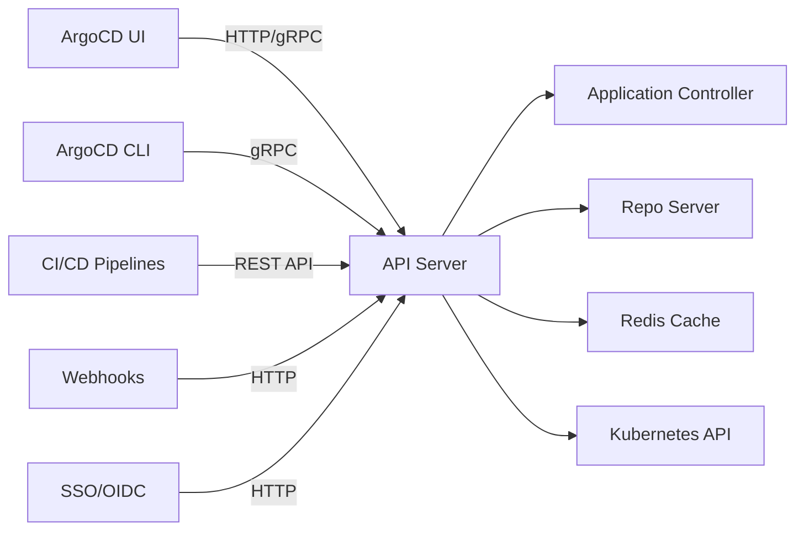

# How to Monitor ArgoCD API Server Latency

Author: [nawazdhandala](https://github.com/nawazdhandala)

Tags: ArgoCD, GitOps, Kubernetes, Prometheus, Performance

Description: Learn how to monitor ArgoCD API server latency using Prometheus metrics, track request performance, identify slow endpoints, and set up alerts for degraded user experience.

---

The ArgoCD API server is the gateway for all user and automated interactions with ArgoCD. Every time someone opens the ArgoCD UI, runs a CLI command, or calls the API from a CI/CD pipeline, the request goes through the API server. When the API server is slow, the UI feels sluggish, CLI commands time out, and automated pipelines stall waiting for responses.

Monitoring API server latency helps you ensure a responsive experience for your teams and reliable automation for your CI/CD integrations.

## Understanding API Server Traffic Patterns

The ArgoCD API server handles several types of traffic:



The API server acts as a proxy, aggregating data from the controller, repo server, Redis, and the Kubernetes API. Latency can originate from any of these backend services.

## Key API Server Metrics

**HTTP Request Duration:**

```promql
# HTTP request duration by method and path
histogram_quantile(0.95,
  rate(http_request_duration_seconds_bucket{
    namespace="argocd",
    job=~".*argocd-server.*"
  }[5m])
) by (method, path)

# Overall P95 latency
histogram_quantile(0.95,
  rate(http_request_duration_seconds_bucket{
    namespace="argocd",
    job=~".*argocd-server.*"
  }[5m])
)
```

**gRPC Request Metrics:**

```promql
# gRPC request count by service and method
rate(grpc_server_handled_total{
  namespace="argocd",
  grpc_service=~".*application.*|.*repository.*|.*session.*"
}[5m]) by (grpc_service, grpc_method, grpc_code)

# gRPC request duration
histogram_quantile(0.95,
  rate(grpc_server_handling_seconds_bucket{
    namespace="argocd"
  }[5m])
) by (grpc_service, grpc_method)
```

**Request Rate:**

```promql
# Total request rate
sum(rate(http_request_duration_seconds_count{
  namespace="argocd",
  job=~".*argocd-server.*"
}[5m]))

# Request rate by status code
sum(rate(http_request_duration_seconds_count{
  namespace="argocd",
  job=~".*argocd-server.*"
}[5m])) by (code)
```

## Tracking Latency by Endpoint

Different API endpoints have different expected latencies. The application list endpoint might serve hundreds of applications and take longer than a single application GET:

```promql
# Top 10 slowest endpoints
topk(10,
  histogram_quantile(0.95,
    rate(http_request_duration_seconds_bucket{
      namespace="argocd",
      job=~".*argocd-server.*"
    }[5m])
  ) by (path)
)
```

Common API paths and their expected latency ranges:

| Endpoint | Expected P95 | Description |
|----------|-------------|-------------|
| /api/v1/applications | 500ms - 2s | List all applications |
| /api/v1/applications/{name} | 100ms - 500ms | Get single application |
| /api/v1/applications/{name}/sync | 200ms - 1s | Trigger sync |
| /api/v1/repositories | 100ms - 500ms | List repositories |
| /api/v1/session | 100ms - 300ms | Authentication |

## Setting Up Latency Alerts

Create alerts for API server latency that match your SLO targets:

```yaml
groups:
- name: argocd-api-server-latency
  rules:
  # Overall P95 latency is high
  - alert: ArgocdApiServerLatencyHigh
    expr: |
      histogram_quantile(0.95,
        rate(http_request_duration_seconds_bucket{
          namespace="argocd",
          job=~".*argocd-server.*"
        }[5m])
      ) > 2
    for: 10m
    labels:
      severity: warning
    annotations:
      summary: "ArgoCD API server P95 latency is above 2 seconds"
      description: "API server 95th percentile latency is {{ $value }}s. Users may experience slow UI and CLI responses."

  # P99 latency is very high
  - alert: ArgocdApiServerLatencyCritical
    expr: |
      histogram_quantile(0.99,
        rate(http_request_duration_seconds_bucket{
          namespace="argocd",
          job=~".*argocd-server.*"
        }[5m])
      ) > 10
    for: 5m
    labels:
      severity: critical
    annotations:
      summary: "ArgoCD API server P99 latency is above 10 seconds"
      description: "API server 99th percentile latency is {{ $value }}s. Users are likely experiencing timeouts."

  # Error rate is elevated
  - alert: ArgocdApiServerErrorRate
    expr: |
      sum(rate(http_request_duration_seconds_count{
        namespace="argocd",
        job=~".*argocd-server.*",
        code=~"5.."
      }[5m]))
      / sum(rate(http_request_duration_seconds_count{
        namespace="argocd",
        job=~".*argocd-server.*"
      }[5m])) > 0.05
    for: 10m
    labels:
      severity: warning
    annotations:
      summary: "ArgoCD API server error rate is above 5%"
      description: "{{ $value | humanizePercentage }} of API requests are returning 5xx errors."

  # gRPC latency alert
  - alert: ArgocdGrpcLatencyHigh
    expr: |
      histogram_quantile(0.95,
        rate(grpc_server_handling_seconds_bucket{
          namespace="argocd"
        }[5m])
      ) > 5
    for: 10m
    labels:
      severity: warning
    annotations:
      summary: "ArgoCD gRPC request latency is high"
      description: "95th percentile gRPC latency is {{ $value }}s."
```

## Building an API Server Dashboard

**Row 1: Overview Stats**

Request rate stat:
```promql
sum(rate(http_request_duration_seconds_count{namespace="argocd", job=~".*argocd-server.*"}[5m]))
```

P95 latency stat:
```promql
histogram_quantile(0.95, rate(http_request_duration_seconds_bucket{namespace="argocd", job=~".*argocd-server.*"}[5m]))
```

Error rate gauge:
```promql
sum(rate(http_request_duration_seconds_count{namespace="argocd", job=~".*argocd-server.*", code=~"5.."}[5m]))
/ sum(rate(http_request_duration_seconds_count{namespace="argocd", job=~".*argocd-server.*"}[5m])) * 100
```

**Row 2: Latency Details**

Time series - Latency percentiles over time:
```promql
histogram_quantile(0.50, rate(http_request_duration_seconds_bucket{namespace="argocd", job=~".*argocd-server.*"}[5m]))
histogram_quantile(0.95, rate(http_request_duration_seconds_bucket{namespace="argocd", job=~".*argocd-server.*"}[5m]))
histogram_quantile(0.99, rate(http_request_duration_seconds_bucket{namespace="argocd", job=~".*argocd-server.*"}[5m]))
```

**Row 3: Request Breakdown**

Time series - Requests by status code:
```promql
sum(rate(http_request_duration_seconds_count{namespace="argocd", job=~".*argocd-server.*"}[5m])) by (code)
```

Table - Slowest endpoints:
```promql
topk(10, histogram_quantile(0.95, rate(http_request_duration_seconds_bucket{namespace="argocd", job=~".*argocd-server.*"}[5m])) by (path))
```

## Diagnosing Latency Issues

When API server latency is high, follow this investigation path:

**Check if it is the API server itself or a backend:**

```promql
# API server CPU - might be compute-bound
rate(container_cpu_usage_seconds_total{namespace="argocd", container="argocd-server"}[5m])

# Check Redis latency
redis_commands_duration_seconds_total
```

**Check backend component latency:**

```bash
# Verify repo server is responding quickly
kubectl exec -n argocd deployment/argocd-server -- \
  curl -s -w "%{time_total}s\n" -o /dev/null http://argocd-repo-server:8081/healthz

# Check Kubernetes API server latency
kubectl get --raw /healthz
```

**Check for connection pooling issues:**

```bash
# Check active connections
kubectl exec -n argocd deployment/argocd-server -- \
  ss -tnp | wc -l
```

## Optimizing API Server Performance

Based on your metrics findings:

**Scale horizontally:**

```yaml
apiVersion: apps/v1
kind: Deployment
metadata:
  name: argocd-server
  namespace: argocd
spec:
  replicas: 3
```

**Increase resource limits:**

```yaml
containers:
- name: argocd-server
  resources:
    requests:
      cpu: 250m
      memory: 256Mi
    limits:
      cpu: 1000m
      memory: 1Gi
```

**Optimize Redis connection:**

```yaml
# argocd-cmd-params-cm
data:
  redis.server: "argocd-redis-ha:6379"
```

**Enable response caching:**

ArgoCD caches application data in Redis. Ensure Redis has enough memory for the cache:

```yaml
apiVersion: apps/v1
kind: Deployment
metadata:
  name: argocd-redis
  namespace: argocd
spec:
  template:
    spec:
      containers:
      - name: redis
        resources:
          requests:
            memory: 256Mi
          limits:
            memory: 512Mi
```

## Recording Rules

Pre-compute API server metrics:

```yaml
groups:
- name: argocd.apiserver.recording
  rules:
  - record: argocd:api_request_latency_p95:5m
    expr: |
      histogram_quantile(0.95,
        rate(http_request_duration_seconds_bucket{
          namespace="argocd",
          job=~".*argocd-server.*"
        }[5m])
      )

  - record: argocd:api_error_rate:5m
    expr: |
      sum(rate(http_request_duration_seconds_count{
        namespace="argocd",
        job=~".*argocd-server.*",
        code=~"5.."
      }[5m]))
      / sum(rate(http_request_duration_seconds_count{
        namespace="argocd",
        job=~".*argocd-server.*"
      }[5m]))

  - record: argocd:api_request_rate:5m
    expr: |
      sum(rate(http_request_duration_seconds_count{
        namespace="argocd",
        job=~".*argocd-server.*"
      }[5m]))
```

API server latency directly impacts user experience and automation reliability. Monitor it alongside your other ArgoCD component metrics to get a complete picture of your GitOps platform performance.
